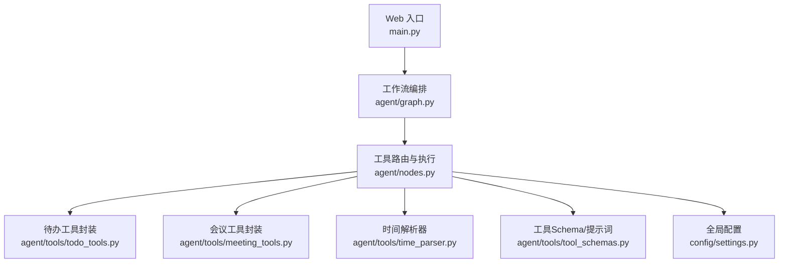
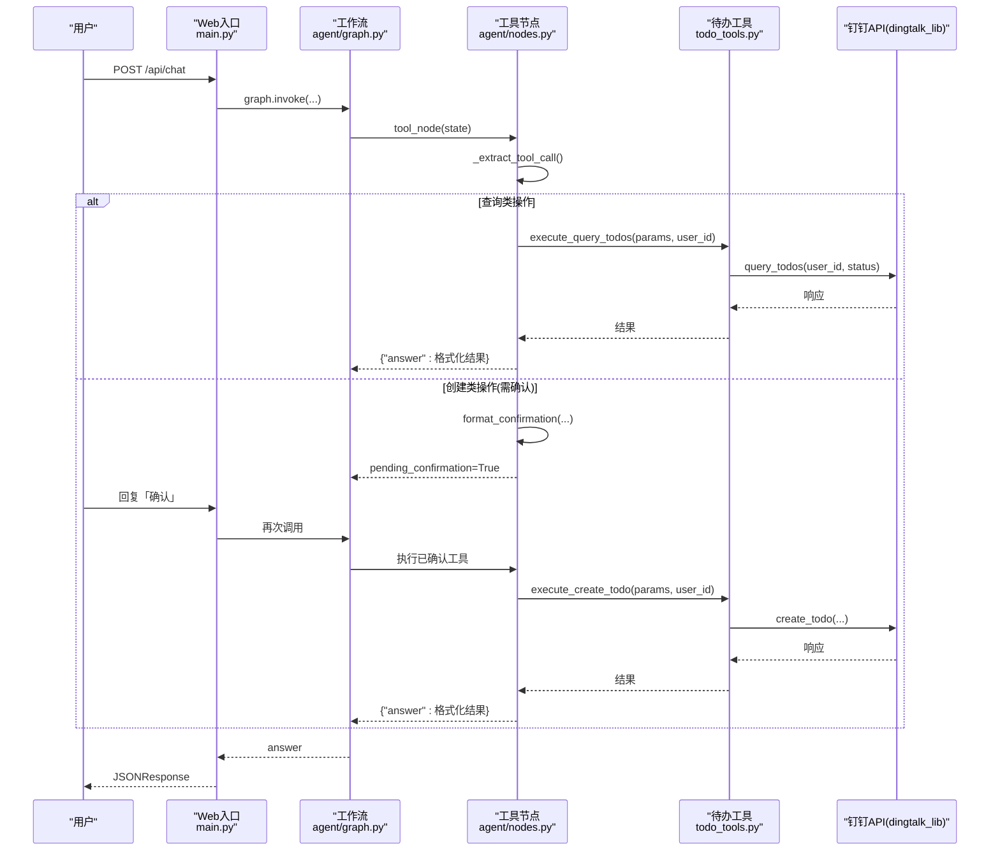
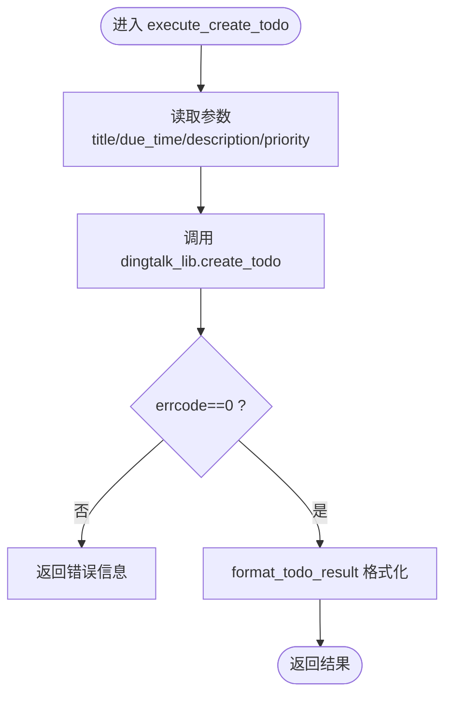
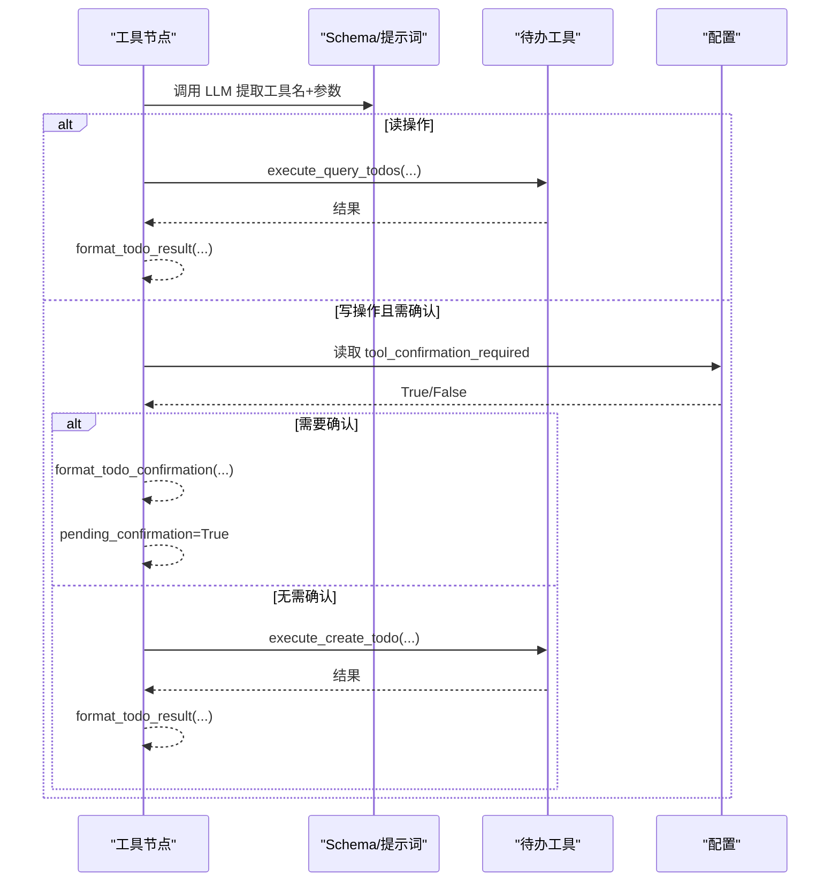
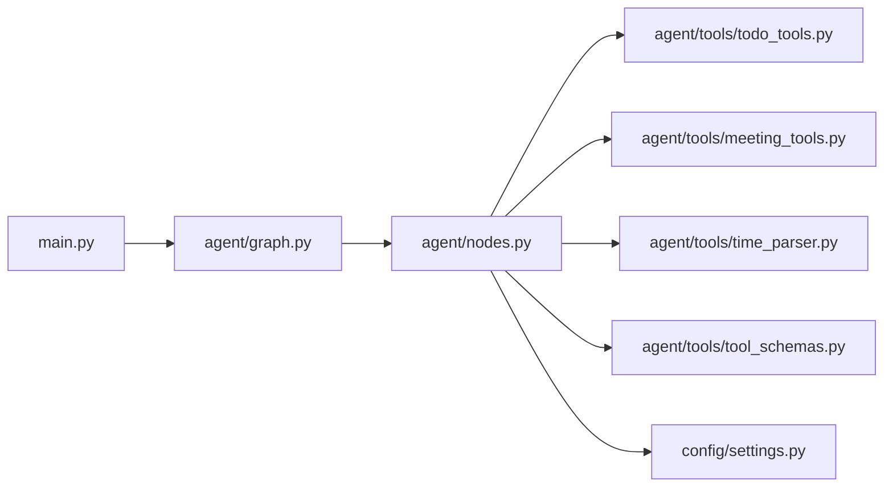

# 待办事项工具

<cite>
**本文引用的文件**
- [agent/tools/todo_tools.py](file://agent/tools/todo_tools.py)
- [agent/tools/tool_schemas.py](file://agent/tools/tool_schemas.py)
- [agent/tools/time_parser.py](file://agent/tools/time_parser.py)
- [agent/nodes.py](file://agent/nodes.py)
- [agent/graph.py](file://agent/graph.py)
- [config/settings.py](file://config/settings.py)
- [main.py](file://main.py)
- [需求分析文档.md](file://需求分析文档.md)
</cite>

## 目录
1. [简介](#简介)
2. [项目结构](#项目结构)
3. [核心组件](#核心组件)
4. [架构总览](#架构总览)
5. [详细组件分析](#详细组件分析)
6. [依赖关系分析](#依赖关系分析)
7. [性能与可靠性](#性能与可靠性)
8. [故障排查指南](#故障排查指南)
9. [结论](#结论)
10. [附录：开发指南与最佳实践](#附录开发指南与最佳实践)

## 简介
本技术文档聚焦“钉钉待办事项”的增删改查能力，围绕创建、查询等核心流程，系统说明任务状态管理、优先级设置、截止日期处理等业务逻辑；同时给出数据结构、参数校验规则、业务约束、用户关联与权限控制机制、以及扩展建议。文档基于仓库中现有实现进行梳理，确保内容与实际代码一致。

## 项目结构
待办事项功能位于 agent/tools 子模块，并通过 agent/nodes.py 的工具调用节点接入 LangGraph 工作流。整体入口由 main.py 暴露 Web API，配置由 config/settings.py 统一管理。

图表来源
- [main.py:154-209](file://main.py#L154-L209)
- [agent/graph.py:44-102](file://agent/graph.py#L44-L102)
- [agent/nodes.py:647-779](file://agent/nodes.py#L647-L779)
- [agent/tools/todo_tools.py:18-44](file://agent/tools/todo_tools.py#L18-L44)
- [agent/tools/tool_schemas.py:30-54](file://agent/tools/tool_schemas.py#L30-L54)
- [config/settings.py:151-155](file://config/settings.py#L151-L155)

章节来源
- [main.py:154-209](file://main.py#L154-L209)
- [agent/graph.py:44-102](file://agent/graph.py#L44-L102)
- [agent/nodes.py:647-779](file://agent/nodes.py#L647-L779)
- [agent/tools/todo_tools.py:18-44](file://agent/tools/todo_tools.py#L18-L44)
- [agent/tools/tool_schemas.py:30-54](file://agent/tools/tool_schemas.py#L30-L54)
- [config/settings.py:151-155](file://config/settings.py#L151-L155)

## 核心组件
- 工具 Schema 与提取提示词：定义 create_todo、query_todos 等工具的参数结构与必填项，供 LLM 做 Function Calling 参数抽取。
- 时间解析器：将自然语言时间（如“明天下午3点”）转换为 ISO 8601 字符串，用于 due_time 等字段。
- 待办工具封装：对接 dingtalk_lib 的 create_todo、query_todos，负责参数转换与结果格式化。
- 工具调用节点：统一从用户输入识别意图、提取参数、执行工具、返回结果；写操作支持确认机制。
- 工作流编排：通过 LangGraph 将预检查、路由、工具调用、生成回答、记忆更新等节点串联。
- 配置中心：集中管理工具开关、确认策略、限流熔断等运行时配置。

章节来源
- [agent/tools/tool_schemas.py:30-54](file://agent/tools/tool_schemas.py#L30-L54)
- [agent/tools/time_parser.py:11-26](file://agent/tools/time_parser.py#L11-L26)
- [agent/tools/todo_tools.py:18-44](file://agent/tools/todo_tools.py#L18-L44)
- [agent/nodes.py:647-779](file://agent/nodes.py#L647-L779)
- [agent/graph.py:44-102](file://agent/graph.py#L44-L102)
- [config/settings.py:151-155](file://config/settings.py#L151-L155)

## 架构总览
待办事项在智能体工作流中的位置如下：
- 用户输入进入 pre_check（问答缓存匹配 + 路由判断）。
- 若识别为工具调用，进入 tool 节点。
- tool 节点通过 LLM 提取工具名与参数，读操作直接执行，写操作可要求用户确认。
- 执行完成后，结果经格式化为可读文本返回。

图表来源
- [main.py:154-209](file://main.py#L154-L209)
- [agent/graph.py:44-102](file://agent/graph.py#L44-L102)
- [agent/nodes.py:647-779](file://agent/nodes.py#L647-L779)
- [agent/tools/todo_tools.py:18-44](file://agent/tools/todo_tools.py#L18-L44)

## 详细组件分析

### 待办工具封装（todo_tools.py）
- 创建待办：接收 title、due_time、description、priority，并调用 dingtalk_lib.create_todo。
- 查询待办：接收 status（all/pending/done），默认 pending，调用 dingtalk_lib.query_todos。
- 结果格式化：根据 errcode 判断成功与否；查询结果以列表形式展示标题、截止时间、优先级（用星号可视化）。
- 确认消息：创建待办时输出待确认信息，包含标题、截止时间、详情、优先级，等待用户确认。

图表来源
- [agent/tools/todo_tools.py:18-36](file://agent/tools/todo_tools.py#L18-L36)
- [agent/tools/todo_tools.py:47-69](file://agent/tools/todo_tools.py#L47-L69)

章节来源
- [agent/tools/todo_tools.py:18-84](file://agent/tools/todo_tools.py#L18-L84)

### 工具 Schema 与参数校验（tool_schemas.py）
- create_todo：必填 title、due_time；可选 description、priority（整数，描述为 1-5）。
- query_todos：可选 status，枚举 all/pending/done。
- WRITE_TOOLS/READ_TOOLS：区分写操作与读操作，用于后续确认策略。

章节来源
- [agent/tools/tool_schemas.py:30-54](file://agent/tools/tool_schemas.py#L30-L54)
- [agent/tools/tool_schemas.py:116-120](file://agent/tools/tool_schemas.py#L116-L120)

### 时间解析器（time_parser.py）
- 支持中文自然语言时间到 ISO 8601 的转换，包括相对日期（今天/明天/后天/本周/下周）、时间段（上午/下午/晚上）、半点和具体时间。
- 提供日期范围解析，便于查询类接口使用（如会议查询默认“本周”）。

章节来源
- [agent/tools/time_parser.py:11-26](file://agent/tools/time_parser.py#L11-L26)
- [agent/tools/time_parser.py:29-63](file://agent/tools/time_parser.py#L29-L63)
- [agent/tools/time_parser.py:66-119](file://agent/tools/time_parser.py#L66-L119)

### 工具调用节点（nodes.py）
- 工具识别与参数提取：通过路由小模型和提示词从用户输入中提取工具名与参数。
- 执行策略：
  - 读操作（query_todos/query_meetings）直接执行。
  - 写操作（create_todo/create_meeting/cancel_meeting/update_meeting）在配置开启时需用户确认。
- 结果格式化：统一调用各工具模块的 format_*_result 函数，失败时返回友好错误。

图表来源
- [agent/nodes.py:647-779](file://agent/nodes.py#L647-L779)
- [agent/tools/tool_schemas.py:30-54](file://agent/tools/tool_schemas.py#L30-L54)
- [config/settings.py:151-155](file://config/settings.py#L151-L155)

章节来源
- [agent/nodes.py:647-779](file://agent/nodes.py#L647-L779)

### 工作流编排（graph.py）
- 构建 StateGraph，注册 pre_check、retrieve、web_search、load_memory、tool、generate、memory_background 节点。
- 条件边：pre_check 命中问答缓存则直接结束；否则按 search_route 分流至 tool/retrieve/web_search/load_memory/generate。
- tool 节点直接到 END，不经过 generate。

章节来源
- [agent/graph.py:44-102](file://agent/graph.py#L44-L102)

### 配置管理（settings.py）
- 工具调用总开关：tool_calling_enabled，关闭时路由自动降级为 chat。
- 写操作确认：tool_confirmation_required，开启后写操作需用户确认。
- 其他相关：限流、熔断、流式超时等运行期配置。

章节来源
- [config/settings.py:151-155](file://config/settings.py#L151-L155)

## 依赖关系分析
- 主入口 main.py 提供 Web 接口，调用 agent/graph.py 的工作流。
- 工作流通过 agent/nodes.py 的工具节点调度具体工具。
- 工具节点依赖 agent/tools/* 下的工具封装与 schema。
- 工具封装依赖外部 dingtalk_lib（Skill 自包含脚本路径动态加入 sys.path）。
- 配置由 config/settings.py 提供，影响路由、确认策略、限流熔断等。

图表来源
- [main.py:154-209](file://main.py#L154-L209)
- [agent/graph.py:44-102](file://agent/graph.py#L44-L102)
- [agent/nodes.py:647-779](file://agent/nodes.py#L647-L779)
- [agent/tools/todo_tools.py:18-44](file://agent/tools/todo_tools.py#L18-L44)
- [agent/tools/tool_schemas.py:30-54](file://agent/tools/tool_schemas.py#L30-L54)
- [config/settings.py:151-155](file://config/settings.py#L151-L155)

章节来源
- [main.py:154-209](file://main.py#L154-L209)
- [agent/graph.py:44-102](file://agent/graph.py#L44-L102)
- [agent/nodes.py:647-779](file://agent/nodes.py#L647-L779)
- [agent/tools/todo_tools.py:18-44](file://agent/tools/todo_tools.py#L18-L44)
- [agent/tools/tool_schemas.py:30-54](file://agent/tools/tool_schemas.py#L30-L54)
- [config/settings.py:151-155](file://config/settings.py#L151-L155)

## 性能与可靠性
- 首请求预热：启动时预热 LLM 连接，降低首次延迟。
- 流式接口：SSE 流式输出，支持整体超时保护，避免长连接卡死。
- 限流与熔断：按用户维度滑动窗口限流；连续失败触发熔断，冷却后试探恢复。
- 工具调用兜底：API 失败返回友好错误，不抛异常；工具路由关闭时降级为普通聊天。
- 路由三层判断：关键词短路 → LLM 意图识别 → 关键词兜底，兼顾速度与准确率。

章节来源
- [main.py:45-77](file://main.py#L45-L77)
- [main.py:228-314](file://main.py#L228-L314)
- [agent/rate_limiter.py:1-47](file://agent/rate_limiter.py#L1-L47)
- [agent/nodes.py:161-211](file://agent/nodes.py#L161-L211)

## 故障排查指南
- 工具未识别：检查 TOOL_KEYWORDS 与 LLM 路由是否启用；确认 tool_calling_enabled 配置。
- 参数缺失或格式错误：核对 Schema 必填项（title、due_time）；时间格式应为 ISO 8601。
- 写操作未执行：确认 tool_confirmation_required 是否为 True，用户是否回复了“确认”。
- API 调用失败：查看工具返回的 errcode 与 errmsg；检查 dingtalk_lib 可用性与凭证配置。
- 流式超时：调整 stream_timeout；关注 SSE 事件类型 token/error/done。

章节来源
- [agent/tools/tool_schemas.py:30-54](file://agent/tools/tool_schemas.py#L30-L54)
- [agent/nodes.py:647-779](file://agent/nodes.py#L647-L779)
- [config/settings.py:151-155](file://config/settings.py#L151-L155)
- [main.py:228-314](file://main.py#L228-L314)

## 结论
本项目的待办事项功能通过 LLM 意图识别与参数抽取，结合工具封装与确认机制，实现了安全的创建与查询能力。当前实现覆盖创建与查询，删除与修改能力在会议模块中已有类似模式，可作为待办扩展参考。系统具备完善的配置开关、限流熔断、流式输出与兜底策略，适合企业级集成与持续演进。

## 附录：开发指南与最佳实践
- 新增待办删除/修改能力
  - 在 tool_schemas.py 中补充 delete_todo/update_todo 的 Schema 与描述。
  - 在 todo_tools.py 中实现 execute_delete_todo/execute_update_todo，调用 dingtalk_lib 对应方法。
  - 在 nodes.py 的 _execute_tool 中添加分支分发。
  - 遵循写操作确认策略，确保安全性。
- 参数校验与业务约束
  - 严格遵循 Schema 必填项；对 priority 做范围校验（1-5）。
  - due_time 使用 ISO 8601；可通过 time_parser 将自然语言转为标准格式。
- 用户关联与权限控制
  - 所有工具调用均传入 user_id，确保操作归属明确。
  - 如需细粒度权限，可在 nodes.py 工具执行前增加权限校验逻辑。
- 批量操作支持
  - 当前实现为单条操作；如需批量，可在工具封装层聚合多次调用，并在结果中汇总成功/失败条目。
- 最佳实践
  - 保持工具模块职责单一，便于测试与维护。
  - 对外部依赖（dingtalk_lib）调用做好异常捕获与降级。
  - 利用配置开关灵活控制功能启用与行为策略。

章节来源
- [agent/tools/tool_schemas.py:30-54](file://agent/tools/tool_schemas.py#L30-L54)
- [agent/tools/todo_tools.py:18-44](file://agent/tools/todo_tools.py#L18-L44)
- [agent/nodes.py:647-779](file://agent/nodes.py#L647-L779)
- [agent/tools/time_parser.py:11-26](file://agent/tools/time_parser.py#L11-L26)
- [config/settings.py:151-155](file://config/settings.py#L151-L155)