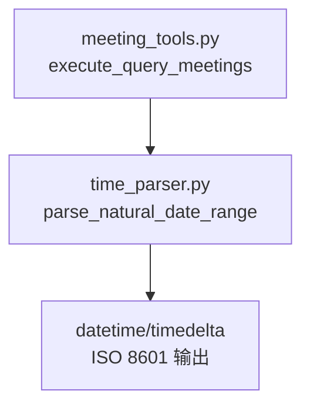
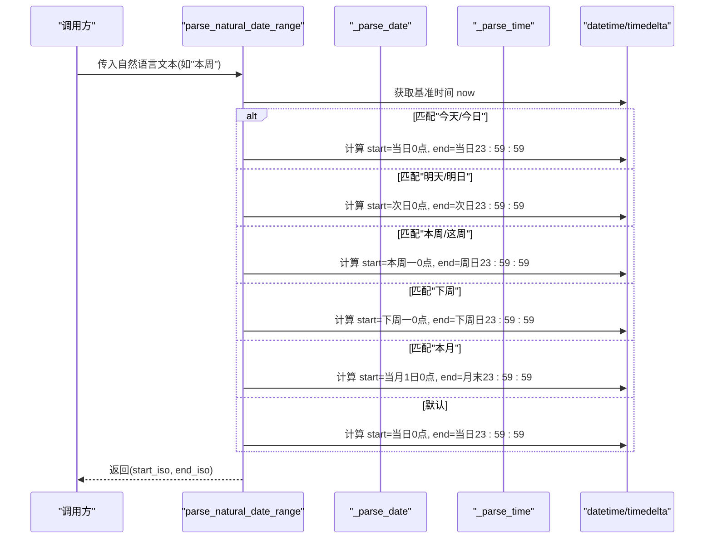
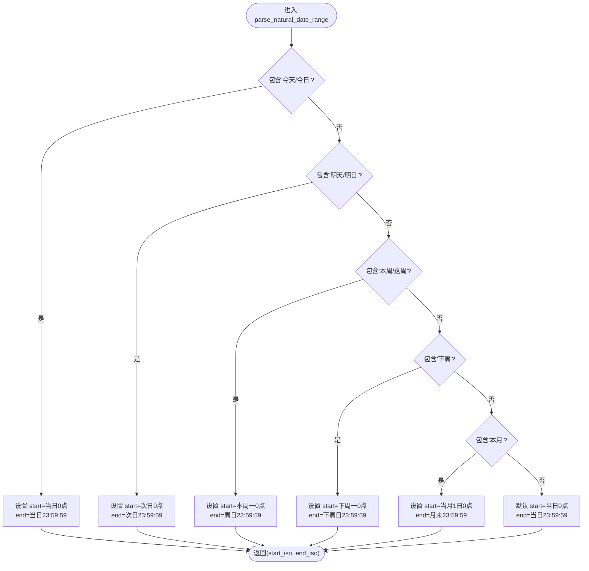
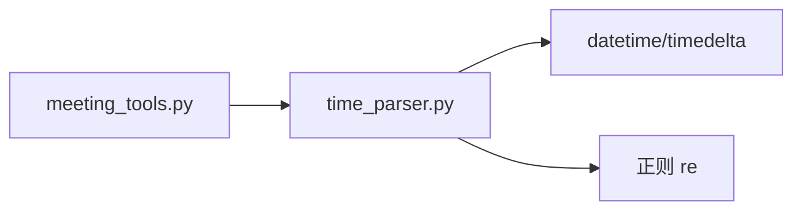

# 时间解析工具

<cite>
**本文引用的文件**
- [agent/tools/time_parser.py](file://agent/tools/time_parser.py)
- [agent/tools/meeting_tools.py](file://agent/tools/meeting_tools.py)
- [config/settings.py](file://config/settings.py)
</cite>

## 目录
1. [简介](#简介)
2. [项目结构](#项目结构)
3. [核心组件](#核心组件)
4. [架构总览](#架构总览)
5. [详细组件分析](#详细组件分析)
6. [依赖关系分析](#依赖关系分析)
7. [性能考量](#性能考量)
8. [故障排查指南](#故障排查指南)
9. [结论](#结论)
10. [附录：示例与使用场景](#附录示例与使用场景)

## 简介
本技术文档聚焦于自然语言时间表达的时间解析实现，重点说明 parse_natural_date_range 函数如何处理“本周”“下周”“今天”“明天”等中文时间表达，并将其转换为标准的 ISO 8601 时间范围。文档涵盖时间范围计算逻辑、边界处理、准确性保证、异常处理机制与性能优化策略，并提供丰富的时间表达式示例和使用场景，帮助开发者快速理解与集成该能力。

## 项目结构
时间解析功能位于 agent/tools/time_parser.py，提供两个对外接口：
- parse_natural_time：将自然语言时间解析为单个 ISO 8601 时间字符串
- parse_natural_date_range：将自然语言日期范围解析为 (start_iso, end_iso) 元组

会议工具模块在查询会议时默认使用“本周”作为时间范围，调用 parse_natural_date_range 完成语义到标准时间的转换。

**图表来源**
- [agent/tools/meeting_tools.py:116-128](file://agent/tools/meeting_tools.py#L116-L128)
- [agent/tools/time_parser.py:29-63](file://agent/tools/time_parser.py#L29-L63)

**章节来源**
- [agent/tools/time_parser.py:1-120](file://agent/tools/time_parser.py#L1-L120)
- [agent/tools/meeting_tools.py:116-128](file://agent/tools/meeting_tools.py#L116-L128)

## 核心组件
- parse_natural_time(text, now=None)：解析自然语言时间为 ISO 8601 字符串
- parse_natural_date_range(text, now=None)：解析自然语言日期范围为 ISO 8601 起止时间元组
- _parse_date(text, now)：解析日期部分（今天/明天/后天/本周/下周/下下周/X天后/X小时后）
- _parse_time(text, target)：解析时间部分（上午/下午/晚上/早上 + 点/半/冒号格式）

这些组件共同构成一个轻量、无外部依赖的中文时间解析器，适用于日程、提醒、检索等场景。

**章节来源**
- [agent/tools/time_parser.py:11-26](file://agent/tools/time_parser.py#L11-L26)
- [agent/tools/time_parser.py:29-63](file://agent/tools/time_parser.py#L29-L63)
- [agent/tools/time_parser.py:66-89](file://agent/tools/time_parser.py#L66-L89)
- [agent/tools/time_parser.py:92-119](file://agent/tools/time_parser.py#L92-L119)

## 架构总览
时间解析采用“分阶段解析”的流水线设计：先确定目标日期，再叠加具体时间；对于范围解析，则根据关键词匹配不同周期并计算起止边界。整体流程如下：

**图表来源**
- [agent/tools/time_parser.py:29-63](file://agent/tools/time_parser.py#L29-L63)

## 详细组件分析

### parse_natural_date_range：日期范围计算逻辑
- 输入：自然语言文本（如“本周”“明天”“本月”），可选基准时间 now
- 输出：(start_iso, end_iso)，均为 ISO 8601 字符串
- 关键规则：
  - “今天/今日”：start=当日00:00:00，end=当日23:59:59
  - “明天/明日”：start=次日00:00:00，end=次日23:59:59
  - “本周/这周”：start=本周一00:00:00，end=周日23:59:59
  - “下周”：start=下周一00:00:00，end=下周日23:59:59
  - “本月”：start=当月1日00:00:00，end=月末23:59:59（跨年边界正确处理）
  - 未匹配：回退到“当天”范围
- 边界处理：
  - 通过 replace(hour=0, minute=0, second=0, microsecond=0) 确保整点起始
  - 通过 timedelta(days=1) - timedelta(seconds=1) 精确得到结束时刻
  - 年末跨月/跨年通过条件分支避免错误

**图表来源**
- [agent/tools/time_parser.py:29-63](file://agent/tools/time_parser.py#L29-L63)

**章节来源**
- [agent/tools/time_parser.py:29-63](file://agent/tools/time_parser.py#L29-L63)

### _parse_date：日期部分解析
- 支持相对日期：后天、明天/明日、昨天、下周、下下周、本周/这周
- 支持数量词：X天后、X小时后
- 未匹配时回退到基准时间 now
- 复杂度：O(1) 字符串匹配与算术运算

**章节来源**
- [agent/tools/time_parser.py:66-89](file://agent/tools/time_parser.py#L66-L89)

### _parse_time：时间部分解析
- 支持时段前缀：上午、下午、晚上、早上
- 支持多种时间格式：
  - “X点”“X时”“X:Y”“X：Y”
  - “X点半”
- 上下午转换：
  - 下午/晚上且小时<12 → +12
  - 上午/早上且小时==12 → 置0
- 未匹配时保持原时间不变

**章节来源**
- [agent/tools/time_parser.py:92-119](file://agent/tools/time_parser.py#L92-L119)

### 与会议工具的集成
- 查询会议时若未指定时间范围，默认使用“本周”，调用 parse_natural_date_range("本周") 生成起止时间
- 该集成体现了从自然语言到标准时间的无缝衔接，便于后续 API 调用

**章节来源**
- [agent/tools/meeting_tools.py:116-128](file://agent/tools/meeting_tools.py#L116-L128)

## 依赖关系分析
- 内部依赖：仅依赖 Python 标准库 datetime、timedelta、re
- 外部依赖：无第三方库依赖，具备高可移植性
- 调用关系：
  - meeting_tools.execute_query_meetings 调用 time_parser.parse_natural_date_range
  - time_parser 内部函数相互协作，形成清晰的职责分离

**图表来源**
- [agent/tools/meeting_tools.py:116-128](file://agent/tools/meeting_tools.py#L116-L128)
- [agent/tools/time_parser.py:1-120](file://agent/tools/time_parser.py#L1-L120)

**章节来源**
- [agent/tools/time_parser.py:1-120](file://agent/tools/time_parser.py#L1-L120)
- [agent/tools/meeting_tools.py:116-128](file://agent/tools/meeting_tools.py#L116-L128)

## 性能考量
- 时间复杂度：
  - 日期匹配为常数级 O(1) 字符串检查
  - 时间解析使用正则匹配，单次 O(n) 扫描，n 为输入长度，通常很短
- 空间复杂度：O(1)，不引入额外数据结构
- 优化建议：
  - 对高频调用场景可缓存 now 或结果（注意 now 变化时的失效策略）
  - 正则表达式可预编译以提升重复调用性能
  - 批量解析时可复用基准时间减少系统时钟读取次数

[本节为通用性能讨论，不直接分析具体代码行]

## 故障排查指南
- 常见问题与定位：
  - 输入不包含任何时间关键词：回退到“当天”范围，需确认业务是否期望此行为
  - 时间格式不规范：_parse_time 无法匹配时将保留原时间，需校验输入
  - 跨年/跨月边界：已内置处理逻辑，若出现异常请检查基准时间 now 是否正确
- 调试建议：
  - 打印 now 与中间结果以验证日期偏移
  - 逐步缩小输入文本，定位触发分支
  - 结合会议工具集成点验证端到端流程

[本节为通用故障排查指导，不直接分析具体代码行]

## 结论
时间解析工具以简洁、稳定、无外部依赖的方式实现了中文自然语言时间到 ISO 8601 的转换，覆盖常见时间表达与边界情况。其模块化设计与清晰的分阶段解析流程，使得扩展新表达与维护现有逻辑变得简单可靠。通过与会议工具的集成，展示了在实际业务中的可用性。建议在高频场景中考虑缓存与正则预编译进一步优化性能。

[本节为总结性内容，不直接分析具体代码行]

## 附录：示例与使用场景
以下为典型输入与预期输出的描述（基于实现逻辑推导）：
- “今天”：start=当日00:00:00，end=当日23:59:59
- “明天”：start=次日00:00:00，end=次日23:59:59
- “本周/这周”：start=本周一00:00:00，end=周日23:59:59
- “下周”：start=下周一00:00:00，end=下周日23:59:59
- “本月”：start=当月1日00:00:00，end=月末23:59:59（含跨年边界）
- “后天”：基准时间+2天
- “昨天”：基准时间-1天
- “2天后”：基准时间+2天
- “3小时后”：基准时间+3小时
- “下午3点”：对应15:00
- “上午10点”：对应10:00
- “晚上8点半”：对应20:30
- “10:30”：保持分钟为30

使用场景：
- 会议查询：未指定时间范围时默认“本周”，自动转换为起止时间
- 任务提醒：将“明天下午3点”转换为 ISO 8601 用于调度
- 数据检索：按“本月”范围过滤记录
- 日志分析：按“今天”“昨天”聚合指标

[本节为概念性示例，不直接分析具体代码行]