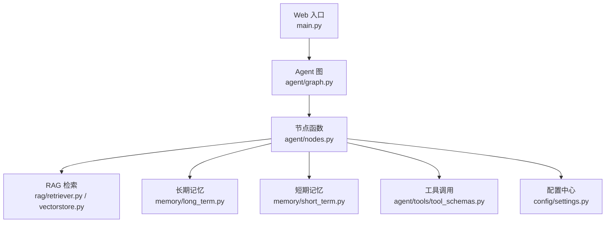
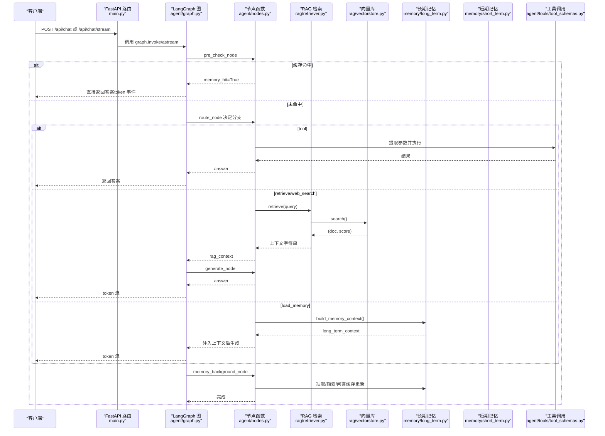
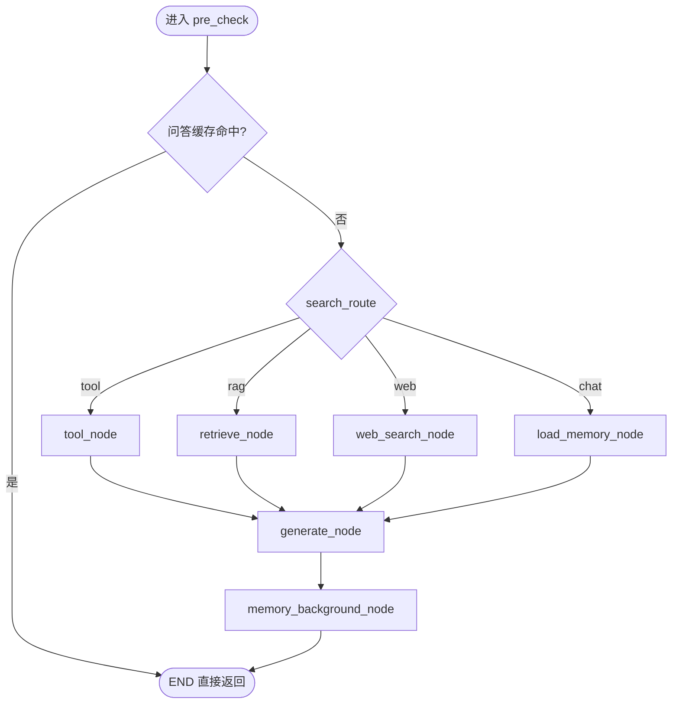
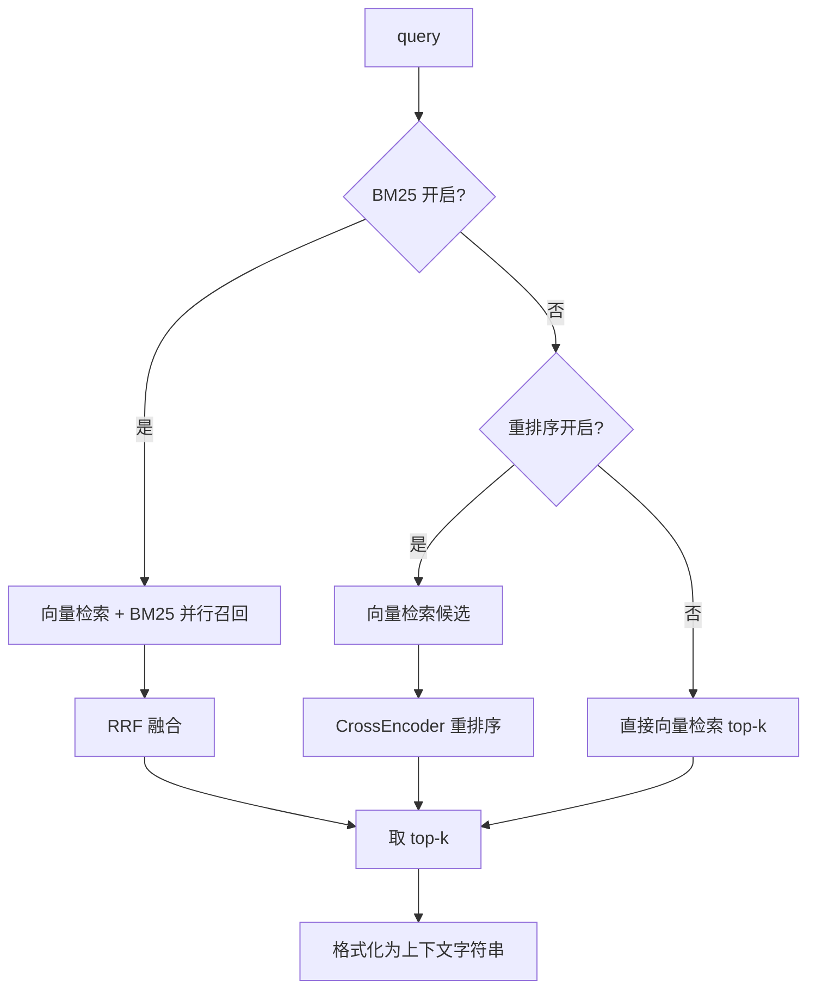
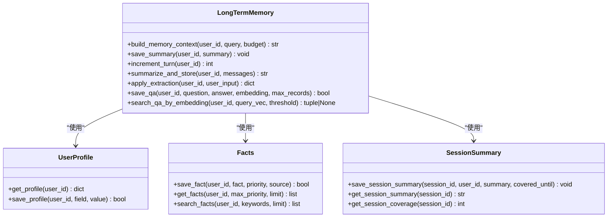
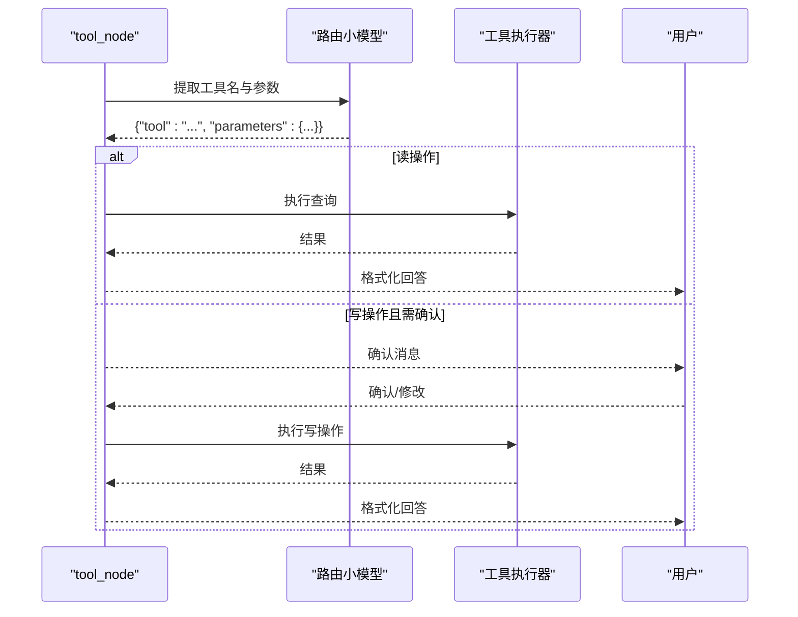
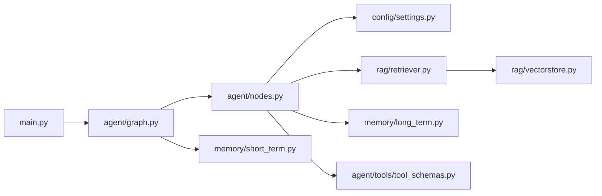

# 核心模块详解

<cite>
**本文引用的文件**
- [main.py](file://main.py)
- [agent/graph.py](file://agent/graph.py)
- [agent/nodes.py](file://agent/nodes.py)
- [memory/short_term.py](file://memory/short_term.py)
- [memory/long_term.py](file://memory/long_term.py)
- [rag/retriever.py](file://rag/retriever.py)
- [rag/vectorstore.py](file://rag/vectorstore.py)
- [config/settings.py](file://config/settings.py)
- [agent/tools/tool_schemas.py](file://agent/tools/tool_schemas.py)
</cite>

## 目录
1. [简介](#简介)
2. [项目结构](#项目结构)
3. [核心组件](#核心组件)
4. [架构总览](#架构总览)
5. [详细组件分析](#详细组件分析)
6. [依赖关系分析](#依赖关系分析)
7. [性能考量](#性能考量)
8. [故障排查指南](#故障排查指南)
9. [结论](#结论)
10. [附录：配置参数速查](#附录：配置参数速查)

## 简介
本仓库实现了一个基于 LangGraph 的钉钉 AI 智能体，提供 Web 聊天与流式接口。系统围绕“Agent 节点编排、RAG 向量检索、短期/长期记忆管理、工具调用”四大核心能力构建，具备启动预热、自动入库、多路召回、重排序、流式输出、限流熔断等工程化特性。本文面向开发者，深入解析关键组件的实现细节、数据流与控制流，并提供配置说明、优化建议与常见问题解决方案。

## 项目结构
- 入口与路由：main.py 提供 FastAPI 服务、健康检查、SSE 流式接口与本地 REPL。
- Agent 工作流：agent/graph.py 定义状态图；agent/nodes.py 实现各节点逻辑（预检查、路由、检索、生成、记忆更新、工具调用）。
- 记忆系统：memory/short_term.py 使用进程内 MemorySaver 维护会话上下文；memory/long_term.py 基于 SQLite 持久化用户画像、事实、摘要、问答缓存等。
- RAG 检索：rag/retriever.py 封装检索流程（多路召回+重排）；rag/vectorstore.py 封装 Milvus Lite 向量库读写与查询。
- 配置中心：config/settings.py 集中管理所有运行时参数。
- 工具系统：agent/tools/tool_schemas.py 定义工具 Schema 与提取提示词，nodes.py 中实现工具抽取、确认与执行。

图表来源
- [main.py:154-314](file://main.py#L154-L314)
- [agent/graph.py:44-102](file://agent/graph.py#L44-L102)
- [agent/nodes.py:93-151](file://agent/nodes.py#L93-L151)
- [rag/retriever.py:18-52](file://rag/retriever.py#L18-L52)
- [rag/vectorstore.py:29-76](file://rag/vectorstore.py#L29-L76)
- [memory/short_term.py:13-20](file://memory/short_term.py#L13-L20)
- [memory/long_term.py:424-497](file://memory/long_term.py#L424-L497)
- [config/settings.py:19-156](file://config/settings.py#L19-L156)

章节来源
- [main.py:1-387](file://main.py#L1-L387)
- [agent/graph.py:1-255](file://agent/graph.py#L1-L255)
- [agent/nodes.py:1-780](file://agent/nodes.py#L1-L780)
- [memory/short_term.py:1-28](file://memory/short_term.py#L1-L28)
- [memory/long_term.py:1-820](file://memory/long_term.py#L1-L820)
- [rag/retriever.py:1-140](file://rag/retriever.py#L1-L140)
- [rag/vectorstore.py:1-282](file://rag/vectorstore.py#L1-L282)
- [config/settings.py:1-216](file://config/settings.py#L1-L216)
- [agent/tools/tool_schemas.py:1-121](file://agent/tools/tool_schemas.py#L1-L121)

## 核心组件
- Agent 工作流：以 LangGraph StateGraph 编排“预检查→四路分流→生成→后台记忆更新”，支持缓存短路、工具直达、流式事件透传。
- RAG 检索：支持纯向量检索、BM25 多路召回+RRF 融合、CrossEncoder 重排序，按相关度阈值过滤并格式化上下文。
- 短期记忆：基于 LangGraph checkpointer（MemorySaver），按 thread_id 维护会话历史，保证多轮对话连贯性。
- 长期记忆：SQLite 分层存储（用户画像、关键事实、摘要历史、会话压缩摘要、问答记忆缓存），支持增量合并与预算控制。
- 工具调用：LLM 从输入提取工具名与参数，读操作直接执行，写操作可配置需用户确认后执行，结果格式化返回。
- 配置中心：集中管理 LLM、Embedding、向量库、RAG、OCR、联网搜索、记忆、安全、限流熔断、工具开关等参数。

章节来源
- [agent/graph.py:44-102](file://agent/graph.py#L44-L102)
- [rag/retriever.py:18-52](file://rag/retriever.py#L18-L52)
- [memory/short_term.py:13-20](file://memory/short_term.py#L13-L20)
- [memory/long_term.py:424-497](file://memory/long_term.py#L424-L497)
- [agent/nodes.py:647-780](file://agent/nodes.py#L647-L780)
- [config/settings.py:19-156](file://config/settings.py#L19-L156)

## 架构总览
下图展示请求从 Web 入口到 Agent 图、再到各子系统（RAG、记忆、工具）的交互路径，以及流式事件的回传机制。

图表来源
- [main.py:154-314](file://main.py#L154-L314)
- [agent/graph.py:44-102](file://agent/graph.py#L44-L102)
- [agent/nodes.py:93-151](file://agent/nodes.py#L93-L151)
- [rag/retriever.py:18-52](file://rag/retriever.py#L18-L52)
- [rag/vectorstore.py:164-184](file://rag/vectorstore.py#L164-L184)
- [memory/long_term.py:424-497](file://memory/long_term.py#L424-L497)
- [agent/tools/tool_schemas.py:8-26](file://agent/tools/tool_schemas.py#L8-L26)

## 详细组件分析

### Agent 节点与工作流
- 预检查节点：合并问答缓存匹配与路由判断；若命中缓存则短路至 END，跳过后续链路。
- 条件边：根据 search_route 分流至 tool、retrieve、web_search、load_memory 或 generate。
- 生成节点：组装 system prompt（含长期记忆与 RAG 上下文）、历史消息（窗口+预算+更早摘要）、当前输入；主模型失败时降级备用模型。
- 后台记忆节点：顺序执行关键信息抽取与长期记忆更新（摘要合并、会话摘要刷新、问答缓存保存），不阻塞响应。
- 工具节点：LLM 提取工具名与参数；读操作直接执行；写操作可配置需用户确认；结果格式化返回。

图表来源
- [agent/graph.py:44-102](file://agent/graph.py#L44-L102)
- [agent/nodes.py:93-151](file://agent/nodes.py#L93-L151)
- [agent/nodes.py:499-532](file://agent/nodes.py#L499-L532)
- [agent/nodes.py:631-643](file://agent/nodes.py#L631-L643)

章节来源
- [agent/graph.py:44-102](file://agent/graph.py#L44-L102)
- [agent/nodes.py:93-151](file://agent/nodes.py#L93-L151)
- [agent/nodes.py:499-532](file://agent/nodes.py#L499-L532)
- [agent/nodes.py:631-643](file://agent/nodes.py#L631-L643)

### RAG 向量检索实现
- 检索器：支持三种模式
  - BM25 开启：向量检索 + BM25 并行召回 → RRF 融合 →（可选）重排序 → top-k
  - BM25 关闭 + 重排序开启：向量检索候选 → CrossEncoder 精排 → top-k
  - 均关闭：直接向量检索 top-k
- 向量库：Milvus Lite 本地文件持久化，支持文本与图像文档混合存储；写入加锁避免并发冲突；检索带分数过滤。
- 上下文格式化：统一归一化分数为 0~1 区间，标注来源与标题，便于生成节点引用。

图表来源
- [rag/retriever.py:18-52](file://rag/retriever.py#L18-L52)
- [rag/retriever.py:55-110](file://rag/retriever.py#L55-L110)
- [rag/vectorstore.py:164-184](file://rag/vectorstore.py#L164-L184)

章节来源
- [rag/retriever.py:18-52](file://rag/retriever.py#L18-L52)
- [rag/vectorstore.py:29-76](file://rag/vectorstore.py#L29-L76)
- [rag/vectorstore.py:164-184](file://rag/vectorstore.py#L164-L184)

### 短期记忆管理机制
- 基于 LangGraph checkpointer（MemorySaver），按 thread_id（= session_id）维护会话上下文与交互历史。
- 进程内存储，无需外部服务；在 graph 编译时挂载，确保多轮对话连贯性。
- 健康检查端点暴露当前 checkpointer 类型标识，便于运维监控。

章节来源
- [memory/short_term.py:1-28](file://memory/short_term.py#L1-L28)
- [agent/graph.py:94-102](file://agent/graph.py#L94-L102)
- [main.py:317-326](file://main.py#L317-L326)

### 长期记忆管理机制
- 分层结构化存储：
  - 用户画像（P0，单值可更新）
  - 关键事实（P0/P1，多条带优先级）
  - 摘要历史（兼容旧表）
  - 会话压缩摘要（短期超窗后的滚动摘要）
  - 问答记忆缓存（问题向量+历史答案，相似问题直接复用）
- 构建策略：build_memory_context 按预算逐层填充（P0 硬保留不受预算约束，P1/P2 按预算丢弃旧条）。
- 摘要合并：summarize_and_store 支持增量合并，关键事实单独落库防丢失。
- 规则快速抽取：零 LLM 成本识别姓名、项目、公司等关键信息，当轮落库。

图表来源
- [memory/long_term.py:424-497](file://memory/long_term.py#L424-L497)
- [memory/long_term.py:613-633](file://memory/long_term.py#L613-L633)
- [memory/long_term.py:682-697](file://memory/long_term.py#L682-L697)
- [memory/long_term.py:729-800](file://memory/long_term.py#L729-L800)

章节来源
- [memory/long_term.py:424-497](file://memory/long_term.py#L424-L497)
- [memory/long_term.py:613-633](file://memory/long_term.py#L613-L633)
- [memory/long_term.py:682-697](file://memory/long_term.py#L682-L697)
- [memory/long_term.py:729-800](file://memory/long_term.py#L729-L800)

### 工具调用系统
- 工具 Schema：定义 6 个钉钉操作工具的名称、描述与参数结构，供 LLM 提取意图与参数。
- 参数提取：通过 TOOL_EXTRACT_PROMPT 让路由小模型输出 JSON，包含 tool 与 parameters。
- 执行流程：
  - 读操作（query_todos/query_meetings）直接执行并返回结果。
  - 写操作（create_todo/create_meeting/cancel_meeting/update_meeting）可配置需用户确认，确认后执行。
  - 结果格式化为用户可读文本。
- 确认状态：pending_confirmation 与 confirmation_context 用于下一轮确认处理。

图表来源
- [agent/tools/tool_schemas.py:8-26](file://agent/tools/tool_schemas.py#L8-L26)
- [agent/nodes.py:647-780](file://agent/nodes.py#L647-L780)

章节来源
- [agent/tools/tool_schemas.py:8-26](file://agent/tools/tool_schemas.py#L8-L26)
- [agent/nodes.py:647-780](file://agent/nodes.py#L647-L780)

## 依赖关系分析
- main.py 依赖 agent/graph.py 获取编译后的图，并通过 nodes.py 中的节点函数执行工作流。
- nodes.py 依赖 config/settings.py 读取运行时配置，依赖 rag/retriever.py 进行检索，依赖 memory/long_term.py 进行长期记忆读写，依赖 agent/tools/tool_schemas.py 进行工具 Schema 与提取。
- retriever.py 依赖 vectorstore.py 进行向量检索，依赖 reranker.py（由 settings.rerank_enabled 控制）进行重排序。
- vectorstore.py 依赖 embeddings（由 settings.embedding_model 指定）进行向量化，依赖 Milvus Lite 进行持久化。
- short_term.py 提供 checkpointer 给 graph 编译时使用，维持会话上下文。

图表来源
- [main.py:154-314](file://main.py#L154-L314)
- [agent/graph.py:44-102](file://agent/graph.py#L44-L102)
- [agent/nodes.py:93-151](file://agent/nodes.py#L93-L151)
- [rag/retriever.py:18-52](file://rag/retriever.py#L18-L52)
- [rag/vectorstore.py:29-76](file://rag/vectorstore.py#L29-L76)
- [memory/short_term.py:13-20](file://memory/short_term.py#L13-L20)
- [memory/long_term.py:424-497](file://memory/long_term.py#L424-L497)
- [agent/tools/tool_schemas.py:8-26](file://agent/tools/tool_schemas.py#L8-L26)

章节来源
- [main.py:154-314](file://main.py#L154-L314)
- [agent/graph.py:44-102](file://agent/graph.py#L44-L102)
- [agent/nodes.py:93-151](file://agent/nodes.py#L93-L151)
- [rag/retriever.py:18-52](file://rag/retriever.py#L18-L52)
- [rag/vectorstore.py:29-76](file://rag/vectorstore.py#L29-L76)
- [memory/short_term.py:13-20](file://memory/short_term.py#L13-L20)
- [memory/long_term.py:424-497](file://memory/long_term.py#L424-L497)
- [agent/tools/tool_schemas.py:8-26](file://agent/tools/tool_schemas.py#L8-L26)

## 性能考量
- 启动预热：
  - LLM 连接预热：在应用启动时发起最小请求，降低首条用户请求延迟（TLS 握手、DNS、HTTP/2 连接建立）。
  - 向量库预热：启动时检查向量库是否为空，若为空且有清单则全量重建；否则增量更新；同时预热 BM25 索引与文件监听。
- 检索优化：
  - 多路召回：BM25 与向量检索并行，RRF 融合提升精确匹配召回率。
  - 重排序：CrossEncoder 对候选精排，提高最终 top-k 质量。
  - 相关度过滤：仅在纯向量路径下生效，避免分数语义不一致导致误判。
- 记忆优化：
  - 短期记忆：进程内 MemorySaver，无外部依赖，低延迟。
  - 长期记忆：分层预算控制，P0 硬保留，P1/P2 按预算丢弃旧条；增量摘要合并防止关键信息丢失。
- 流式输出：
  - SSE 流式接口支持整体超时保护，超时后返回已生成内容，避免连接卡死。
- 并发与一致性：
  - 向量库写入加锁，避免文件监听消费线程与检索路径并发写入冲突。
  - SQLite 开启 WAL 模式，允许并发读，写操作串行但不会阻塞读。

章节来源
- [main.py:45-135](file://main.py#L45-L135)
- [rag/retriever.py:18-52](file://rag/retriever.py#L18-L52)
- [rag/vectorstore.py:79-106](file://rag/vectorstore.py#L79-L106)
- [memory/long_term.py:424-497](file://memory/long_term.py#L424-L497)
- [main.py:228-314](file://main.py#L228-L314)

## 故障排查指南
- 向量库为空：
  - 现象：启动时检测到向量库为空且有清单，触发全量重建。
  - 解决：检查 data/docs 目录与 manifest 文件；确认 ingest 成功；查看日志中“全量重建完成”或“增量入库完成”。
- 检索结果为空：
  - 现象：retrieve 返回空上下文。
  - 解决：检查 rag_top_k、rag_score_filter、rerank_candidate_count 等配置；确认向量库有数据；尝试关闭重排序或启用 BM25。
- 流式接口超时：
  - 现象：SSE 流式接口整体超时，返回已生成内容。
  - 解决：调整 stream_timeout；检查 LLM 请求超时 llm_request_timeout；查看网络与模型服务状态。
- 工具调用失败：
  - 现象：工具执行返回错误码。
  - 解决：检查 tool_calling_enabled 与 tool_confirmation_required；确认参数提取正确；查看 _execute_tool 异常日志。
- 长期记忆写入失败：
  - 现象：摘要合并或问答缓存保存失败。
  - 解决：检查 SQLite 文件权限与磁盘空间；确认 memory_extract_llm_enabled 与 memory_qa_cache_enabled 配置；查看异常日志。

章节来源
- [main.py:80-135](file://main.py#L80-L135)
- [rag/retriever.py:18-52](file://rag/retriever.py#L18-L52)
- [rag/vectorstore.py:164-184](file://rag/vectorstore.py#L164-L184)
- [main.py:228-314](file://main.py#L228-L314)
- [agent/nodes.py:647-780](file://agent/nodes.py#L647-L780)
- [memory/long_term.py:613-633](file://memory/long_term.py#L613-L633)

## 结论
本系统以 LangGraph 为核心编排 Agent 工作流，结合 RAG 多路召回与重排序、短期/长期记忆分层管理、工具调用与安全校验，实现了高可用、可扩展、易维护的智能体服务。通过启动预热、流式输出、限流熔断等工程化手段，保障了用户体验与系统稳定性。开发者可根据业务需求灵活调整配置与扩展功能。

## 附录：配置参数速查
- LLM：llm_model、llm_base_url、llm_api_key、llm_temperature、llm_max_retries、llm_request_timeout、llm_fallback_model、llm_fallback_models、stream_timeout
- Embedding：embedding_model、embedding_device
- 向量库：milvus_db_file、milvus_collection、milvus_index_type、milvus_metric_type、rag_top_k、rag_score_filter、rag_min_relevance、rag_chunk_size、rag_chunk_overlap、rag_docs_dir
- 知识库同步：rag_auto_sync_enabled、rag_auto_sync_debounce
- 多路召回：rag_bm25_enabled、rag_bm25_candidate_count、rag_rrf_k
- 查询改写：rag_query_rewrite_enabled
- 重排序：rerank_enabled、rerank_model、rerank_device、rerank_candidate_count、rerank_top_k
- OCR：ocr_languages、ocr_use_gpu、ocr_min_text_length、supported_file_extensions
- 联网搜索：web_search_enabled、web_search_max_results、web_search_timeout
- 记忆：long_term_db_path、memory_summary_every、memory_context_budget、memory_short_window、memory_history_budget、rag_context_budget、memory_extract_llm_enabled、memory_qa_cache_enabled、memory_qa_threshold、memory_qa_max_records
- 安全：input_filter_enabled、input_blocked_keywords、input_injection_check_enabled
- 限流熔断：rate_limit_per_minute、circuit_breaker_threshold、circuit_breaker_recovery
- 工具调用：tool_calling_enabled、tool_confirmation_required

章节来源
- [config/settings.py:19-156](file://config/settings.py#L19-L156)