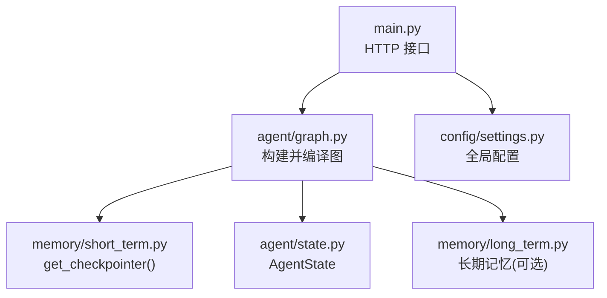
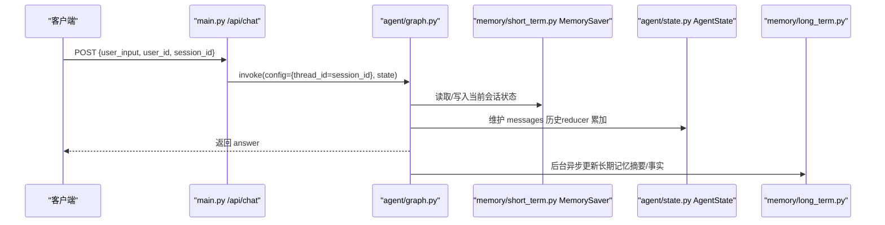
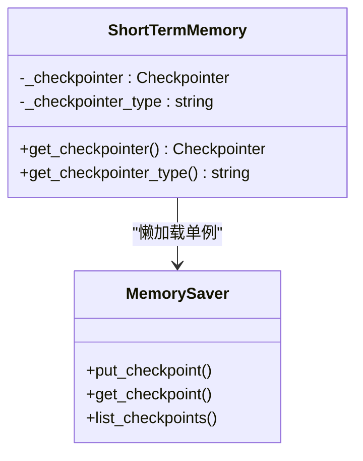
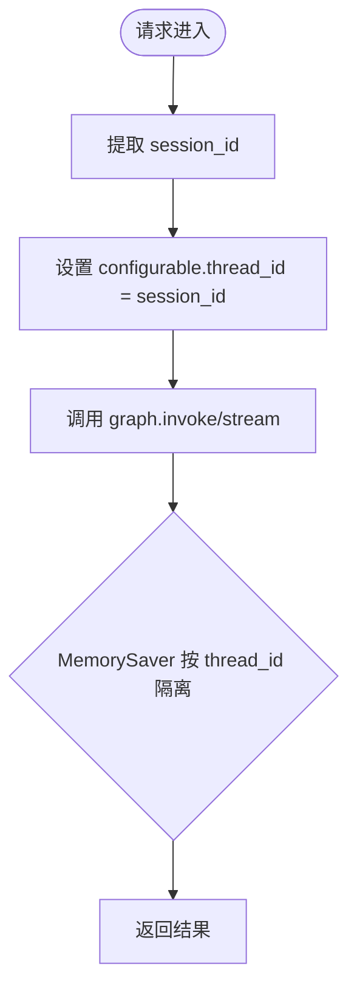
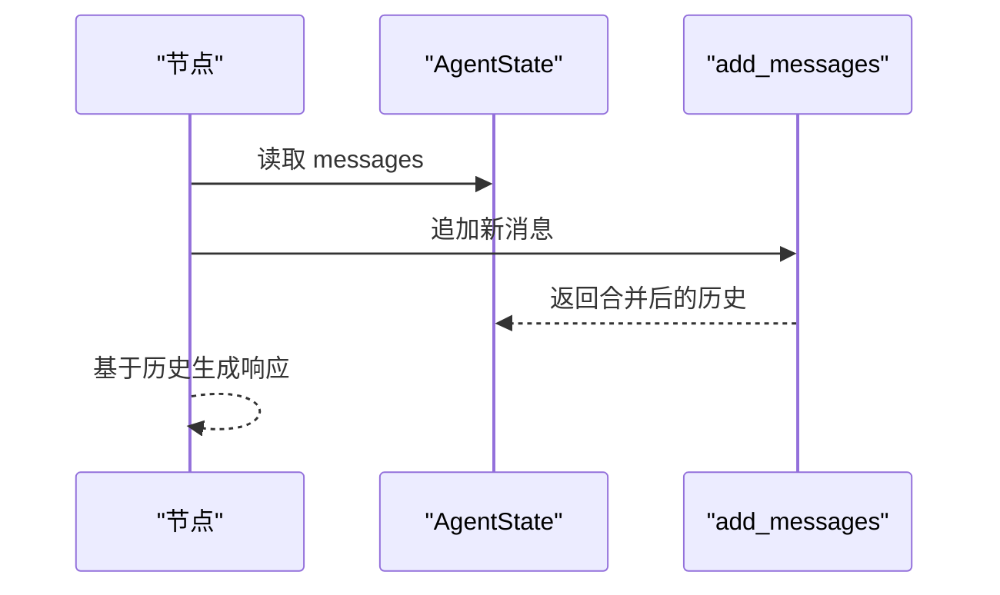
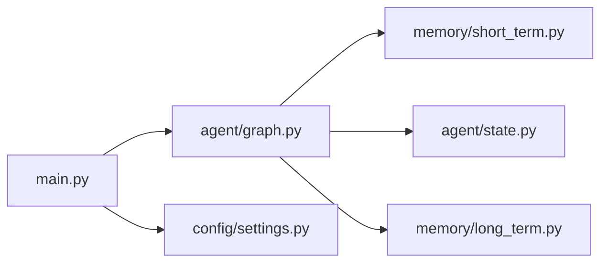

# 短期会话记忆

<cite>
**本文引用的文件**
- [memory/short_term.py](file://memory/short_term.py)
- [agent/graph.py](file://agent/graph.py)
- [main.py](file://main.py)
- [agent/state.py](file://agent/state.py)
- [config/settings.py](file://config/settings.py)
- [memory/long_term.py](file://memory/long_term.py)
</cite>

## 目录
1. [简介](#简介)
2. [项目结构](#项目结构)
3. [核心组件](#核心组件)
4. [架构总览](#架构总览)
5. [详细组件分析](#详细组件分析)
6. [依赖关系分析](#依赖关系分析)
7. [性能与内存特性](#性能与内存特性)
8. [故障排查指南](#故障排查指南)
9. [结论](#结论)
10. [附录：配置与使用示例](#附录配置与使用示例)

## 简介
本技术文档聚焦于“短期会话记忆”子系统，深入解析基于 LangGraph MemorySaver 的进程内会话上下文管理机制。重点说明 thread_id（即 session_id）的会话隔离策略、多轮对话历史维护、内存存储原理与性能特点，并覆盖 checkpointer 单例模式实现、会话状态管理、内存使用优化与扩展性考虑。同时提供配置参数说明、使用示例及与其他组件的集成方式。

## 项目结构
短期会话记忆相关代码主要分布在以下模块：
- memory/short_term.py：checkpointer 单例封装（MemorySaver），暴露获取接口
- agent/graph.py：LangGraph StateGraph 构建与编译，挂载 checkpointer，统一通过 thread_id 隔离会话
- main.py：Web API 入口，将请求中的 session_id 映射为 thread_id 传入图执行
- agent/state.py：AgentState 定义，包含 session_id、user_id、消息历史等字段
- config/settings.py：全局配置，包含短期/长期记忆相关参数
- memory/long_term.py：长期记忆（SQLite）实现，与短期记忆配合形成完整记忆体系

图表来源
- [main.py:154-209](file://main.py#L154-L209)
- [agent/graph.py:44-102](file://agent/graph.py#L44-L102)
- [memory/short_term.py:13-20](file://memory/short_term.py#L13-L20)
- [agent/state.py:12-51](file://agent/state.py#L12-L51)
- [memory/long_term.py:172-197](file://memory/long_term.py#L172-L197)
- [config/settings.py:114-133](file://config/settings.py#L114-L133)

章节来源
- [main.py:154-209](file://main.py#L154-L209)
- [agent/graph.py:44-102](file://agent/graph.py#L44-L102)
- [memory/short_term.py:13-20](file://memory/short_term.py#L13-L20)
- [agent/state.py:12-51](file://agent/state.py#L12-L51)
- [memory/long_term.py:172-197](file://memory/long_term.py#L172-L197)
- [config/settings.py:114-133](file://config/settings.py#L114-L133)

## 核心组件
- Checkpointer 单例：通过 memory/short_term.py 的 get_checkpointer() 返回进程内 MemorySaver 实例，保证同一进程内共享单一检查点存储
- 会话隔离：通过 agent/graph.py 在调用图时设置 configurable.thread_id = session_id，确保每个会话独立的消息历史
- 状态模型：agent/state.py 中 AgentState 定义了 messages（带 reducer 自动累加）、session_id、user_id 等字段，支撑多轮对话上下文
- 配置项：config/settings.py 提供 memory_short_window、memory_history_budget 等短期记忆相关参数，控制窗口大小与预算
- 长期记忆协同：memory/long_term.py 提供会话压缩摘要、用户画像、关键事实等能力，与短期记忆互补

章节来源
- [memory/short_term.py:13-20](file://memory/short_term.py#L13-L20)
- [agent/graph.py:94-102](file://agent/graph.py#L94-L102)
- [agent/state.py:12-51](file://agent/state.py#L12-L51)
- [config/settings.py:114-133](file://config/settings.py#L114-L133)
- [memory/long_term.py:172-197](file://memory/long_term.py#L172-L197)

## 架构总览
短期会话记忆以 LangGraph 的状态机为核心，结合 MemorySaver 作为进程内持久化层，按 thread_id 隔离不同会话的上下文。Web 接口将 session_id 映射到 thread_id，图在执行过程中自动维护消息历史，并在生成回答后触发后台记忆更新。

图表来源
- [main.py:154-209](file://main.py#L154-L209)
- [agent/graph.py:117-138](file://agent/graph.py#L117-L138)
- [memory/short_term.py:13-20](file://memory/short_term.py#L13-L20)
- [agent/state.py:12-51](file://agent/state.py#L12-L51)
- [memory/long_term.py:613-633](file://memory/long_term.py#L613-L633)

## 详细组件分析

### Checkpointer 单例模式（MemorySaver）
- 实现位置：memory/short_term.py
- 设计要点：
  - 模块级全局变量 _checkpointer 保存唯一实例，首次访问时创建 MemorySaver
  - 提供 get_checkpointer() 和 get_checkpointer_type() 两个接口
  - 类型标识为 "memory"，便于健康检查或监控
- 线程安全：MemorySaver 为进程内内存存储，适合单进程；若需跨进程共享应替换为外部后端

图表来源
- [memory/short_term.py:13-20](file://memory/short_term.py#L13-L20)

章节来源
- [memory/short_term.py:13-20](file://memory/short_term.py#L13-L20)

### 会话隔离策略（thread_id = session_id）
- 映射位置：
  - Web 接口：main.py 将请求中的 session_id 放入 config.configurable.thread_id
  - 图调用：agent/graph.py 的 chat/chat_stream/astream_chat 均设置 thread_id 为 session_id
- 效果：
  - 每个 session_id 对应一个独立的会话上下文，互不干扰
  - 支持多并发会话，MemorySaver 按 thread_id 键值隔离状态

图表来源
- [main.py:191-199](file://main.py#L191-L199)
- [agent/graph.py:129-138](file://agent/graph.py#L129-L138)
- [agent/graph.py:199-205](file://agent/graph.py#L199-L205)
- [agent/graph.py:219-225](file://agent/graph.py#L219-L225)

章节来源
- [main.py:191-199](file://main.py#L191-L199)
- [agent/graph.py:129-138](file://agent/graph.py#L129-L138)
- [agent/graph.py:199-205](file://agent/graph.py#L199-L205)
- [agent/graph.py:219-225](file://agent/graph.py#L219-L225)

### 多轮对话历史维护
- 状态字段：AgentState.messages 使用 add_messages reducer，自动累加历史消息
- 作用：
  - 每次节点执行可读取完整历史，保证上下文连贯
  - 结合短期窗口与预算控制，避免无限增长导致内存压力

图表来源
- [agent/state.py:12-20](file://agent/state.py#L12-L20)

章节来源
- [agent/state.py:12-20](file://agent/state.py#L12-L20)

### 内存存储原理与性能特点
- 存储介质：进程内 MemorySaver，无外部依赖，读写延迟极低
- 隔离机制：按 thread_id 键值隔离，天然支持多会话并发
- 性能特点：
  - 优点：零网络开销、低延迟、易于调试
  - 局限：进程重启后数据丢失，不适合持久化需求
- 适用场景：开发调试、短生命周期会话、对持久化要求不高的服务

章节来源
- [memory/short_term.py:1-5](file://memory/short_term.py#L1-L5)
- [memory/short_term.py:13-20](file://memory/short_term.py#L13-L20)

### 会话状态管理与扩展性
- 状态管理：
  - session_id 用于短期会话隔离
  - user_id 用于长期记忆关联
  - 其他字段如 search_route、rag_context、long_term_context 等由图节点填充
- 扩展性：
  - 可通过替换 checkpointer 后端（如 SQL、Redis）实现持久化
  - 通过配置 memory_short_window、memory_history_budget 调整短期记忆行为
  - 与长期记忆（memory/long_term.py）解耦，可按需启用

章节来源
- [agent/state.py:12-51](file://agent/state.py#L12-L51)
- [config/settings.py:114-133](file://config/settings.py#L114-L133)
- [memory/long_term.py:172-197](file://memory/long_term.py#L172-L197)

## 依赖关系分析
短期会话记忆依赖以下组件：
- LangGraph：StateGraph、CompiledStateGraph、checkpointer 接口
- MemorySaver：进程内检查点存储
- FastAPI：Web 接口承载
- 配置模块：全局参数注入

图表来源
- [main.py:154-209](file://main.py#L154-L209)
- [agent/graph.py:44-102](file://agent/graph.py#L44-L102)
- [memory/short_term.py:13-20](file://memory/short_term.py#L13-L20)
- [agent/state.py:12-51](file://agent/state.py#L12-L51)
- [config/settings.py:114-133](file://config/settings.py#L114-L133)
- [memory/long_term.py:172-197](file://memory/long_term.py#L172-L197)

章节来源
- [main.py:154-209](file://main.py#L154-L209)
- [agent/graph.py:44-102](file://agent/graph.py#L44-L102)
- [memory/short_term.py:13-20](file://memory/short_term.py#L13-L20)
- [agent/state.py:12-51](file://agent/state.py#L12-L51)
- [config/settings.py:114-133](file://config/settings.py#L114-L133)
- [memory/long_term.py:172-197](file://memory/long_term.py#L172-L197)

## 性能与内存特性
- 低延迟：MemorySaver 为内存存储，读写无需网络 I/O
- 高并发：按 thread_id 隔离，支持多会话并行处理
- 内存占用：
  - 受限于 messages 历史长度与内容大小
  - 可通过 memory_short_window、memory_history_budget 控制
- 可扩展性：
  - 可替换为外部 checkpointer 实现持久化
  - 与长期记忆解耦，按需启用

[本节为通用性能讨论，不直接分析具体文件]

## 故障排查指南
- 健康检查：
  - 通过 /health 端点查看 checkpointer 类型，确认是否使用 MemorySaver
- 常见问题：
  - 会话状态丢失：进程重启后 MemorySaver 数据清空，需改用持久化后端
  - 内存增长过快：检查 messages 历史是否被正确裁剪，调整 memory_short_window 与 memory_history_budget
  - 多会话冲突：确认 session_id 唯一性，避免重复使用

章节来源
- [main.py:317-326](file://main.py#L317-L326)
- [config/settings.py:114-133](file://config/settings.py#L114-L133)

## 结论
短期会话记忆系统基于 LangGraph MemorySaver 实现了高效、隔离的进程内会话上下文管理。通过 thread_id（session_id）隔离策略，支持多轮对话历史维护与并发会话。其简单、低延迟的特性适合开发与调试场景，同时具备良好的扩展性，可平滑迁移至持久化后端。与长期记忆的协同进一步增强了系统的记忆能力与用户体验。

[本节为总结性内容，不直接分析具体文件]

## 附录：配置与使用示例

### 配置参数说明
- memory_short_window：短期历史窗口大小（最近消息条数）
- memory_history_budget：短期历史字符预算（超预算从最旧消息开始丢弃）
- memory_summary_every：每多少轮对话触发一次长期记忆摘要
- memory_context_budget：长期记忆上下文字符预算
- memory_qa_cache_enabled：问答记忆缓存开关
- memory_qa_threshold：问答记忆命中阈值
- memory_qa_max_records：每用户最多保留的问答记忆条数

章节来源
- [config/settings.py:114-133](file://config/settings.py#L114-L133)

### 使用示例
- Web 接口调用：
  - POST /api/chat，携带 user_input、user_id、session_id
  - 系统将 session_id 映射为 thread_id，实现会话隔离
- 流式接口：
  - POST /api/chat/stream，返回 SSE 事件流
- REPL 调试：
  - python main.py --repl，交互式测试智能体

章节来源
- [main.py:154-209](file://main.py#L154-L209)
- [main.py:228-314](file://main.py#L228-L314)
- [main.py:329-362](file://main.py#L329-L362)