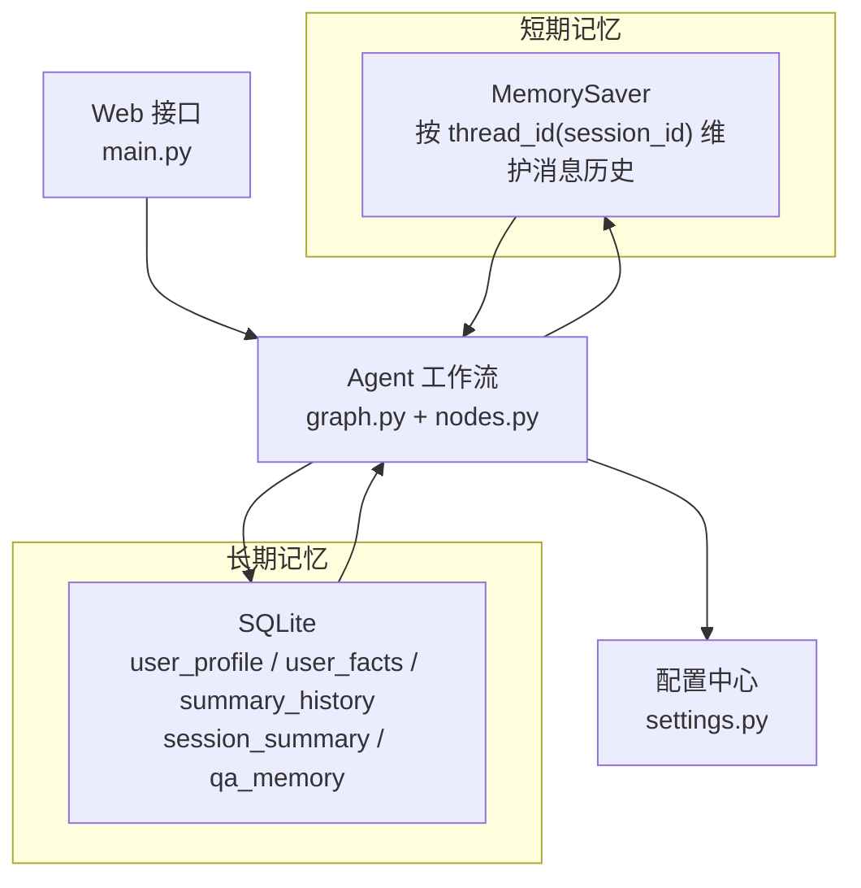
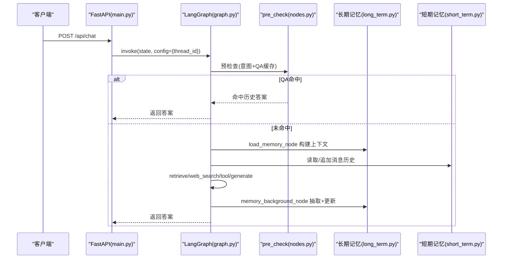
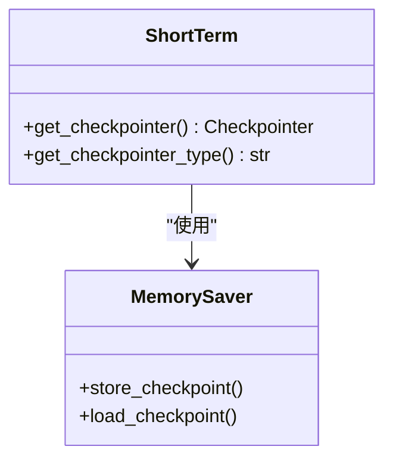
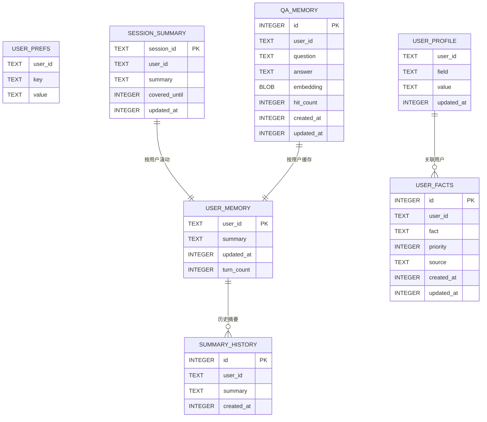
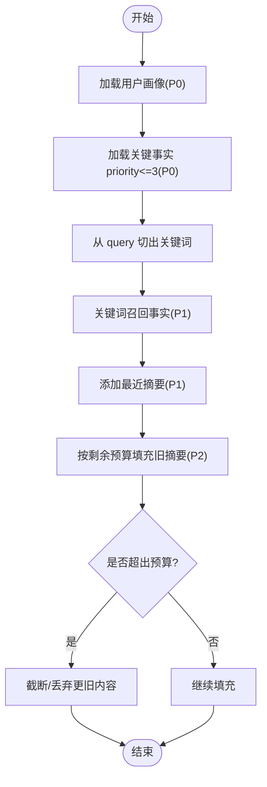
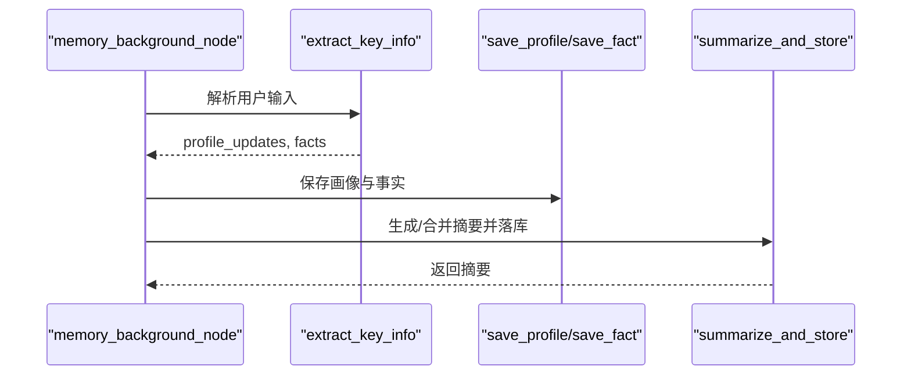
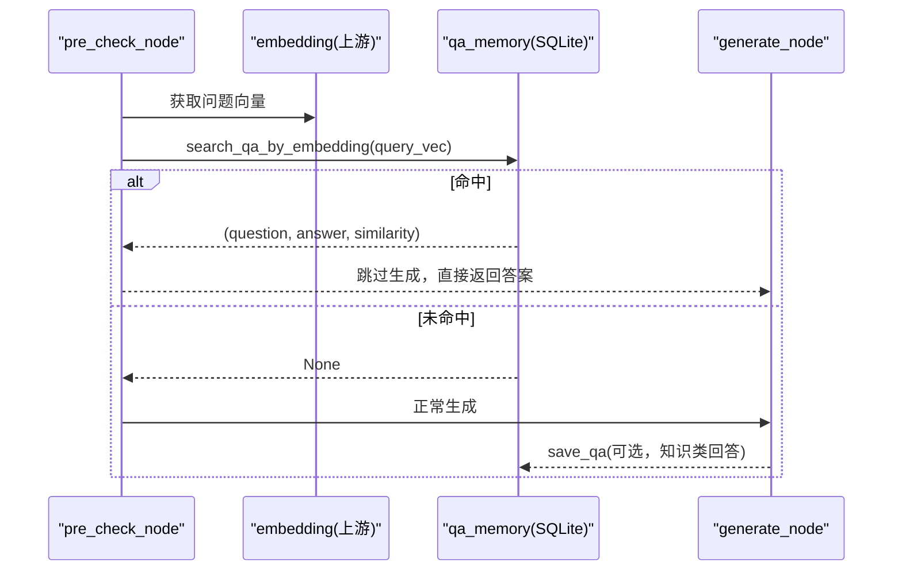
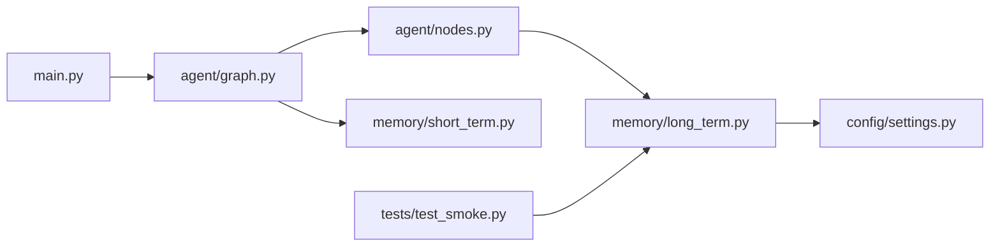

# 记忆管理系统

<cite>
**本文引用的文件**
- [memory/short_term.py](file://memory/short_term.py)
- [memory/long_term.py](file://memory/long_term.py)
- [config/settings.py](file://config/settings.py)
- [main.py](file://main.py)
- [agent/graph.py](file://agent/graph.py)
- [agent/state.py](file://agent/state.py)
- [agent/nodes.py](file://agent/nodes.py)
- [tests/test_smoke.py](file://tests/test_smoke.py)
</cite>

## 目录
1. [简介](#简介)
2. [项目结构](#项目结构)
3. [核心组件](#核心组件)
4. [架构总览](#架构总览)
5. [详细组件分析](#详细组件分析)
6. [依赖关系分析](#依赖关系分析)
7. [性能考量](#性能考量)
8. [故障排查指南](#故障排查指南)
9. [结论](#结论)
10. [附录：配置参数与使用示例](#附录配置参数与使用示例)

## 简介
本系统实现“短期会话记忆 + 长期用户记忆”的混合架构，目标是让智能体在多轮对话中保持上下文连贯，并在跨会话中记住用户画像、关键事实与历史摘要；同时通过问答缓存机制减少重复推理成本。长期记忆基于 SQLite 持久化，支持分层预算控制、增量摘要合并、关键信息抽取与问答对向量相似度匹配等能力。

## 项目结构
记忆相关代码主要分布在 memory 模块，配合 agent 工作流节点与全局配置完成集成：
- 短期记忆：基于 LangGraph checkpointer（进程内 MemorySaver），按 session_id 维护多轮对话上下文。
- 长期记忆：SQLite 表结构承载用户画像、关键事实、摘要历史、会话压缩摘要与问答记忆缓存。
- 配置：集中管理记忆相关参数（如摘要频率、上下文预算、问答阈值等）。
- 工作流：在 agent/graph.py 中编排 pre_check/load_memory/retrieve/web_search/tool/generate/memory_background 等节点，将记忆读写嵌入主流程。

图表来源
- [memory/short_term.py:1-28](file://memory/short_term.py#L1-L28)
- [memory/long_term.py:1-125](file://memory/long_term.py#L1-L125)
- [config/settings.py:114-133](file://config/settings.py#L114-L133)
- [agent/graph.py:1-24](file://agent/graph.py#L1-L24)
- [main.py:154-209](file://main.py#L154-L209)

章节来源
- [memory/short_term.py:1-28](file://memory/short_term.py#L1-L28)
- [memory/long_term.py:1-125](file://memory/long_term.py#L1-L125)
- [config/settings.py:114-133](file://config/settings.py#L114-L133)
- [agent/graph.py:1-24](file://agent/graph.py#L1-L24)
- [main.py:154-209](file://main.py#L154-L209)

## 核心组件
- 短期会话记忆：提供 get_checkpointer() 单例，基于进程内 MemorySaver，按 thread_id 维护消息历史，无需外部服务。
- 长期记忆存储：SQLite 连接单例，WAL 模式提升并发读性能；提供保存/查询用户画像、关键事实、摘要历史、会话压缩摘要与问答缓存等接口。
- 记忆上下文构建：build_memory_context 按 P0/P1/P2 分层预算注入，确保高优先级信息不丢失。
- 摘要与关键信息抽取：summarize_and_store 增量合并旧摘要并提取 key_facts；extract_key_info 规则快速抽取姓名/项目/公司等。
- 问答缓存：save_qa/search_qa_by_embedding 以余弦相似度命中历史答案，避免重复调用 LLM。

章节来源
- [memory/short_term.py:13-27](file://memory/short_term.py#L13-L27)
- [memory/long_term.py:30-47](file://memory/long_term.py#L30-L47)
- [memory/long_term.py:424-497](file://memory/long_term.py#L424-L497)
- [memory/long_term.py:561-633](file://memory/long_term.py#L561-L633)
- [memory/long_term.py:650-697](file://memory/long_term.py#L650-L697)
- [memory/long_term.py:729-818](file://memory/long_term.py#L729-L818)

## 架构总览
记忆系统在 Agent 工作流中的位置如下：
- 入口请求经 main.py 路由到 graph.py 编译后的状态图。
- pre_check 节点进行意图识别与问答缓存匹配；若命中则直接返回历史答案。
- 未命中时分流至 retrieve/web_search/load_memory/tool 分支，最终汇聚到 generate 生成回答。
- generate 完成后进入 memory_background 后台节点，执行关键信息抽取与长期记忆更新（不阻塞响应）。
- 短期记忆由 checkpointer 自动维护消息历史；当短期窗口超限时，nodes.py 会触发会话压缩摘要写入 session_summary。

图表来源
- [main.py:154-209](file://main.py#L154-L209)
- [agent/graph.py:1-24](file://agent/graph.py#L1-L24)
- [agent/graph.py:44-102](file://agent/graph.py#L44-L102)
- [agent/nodes.py:623-643](file://agent/nodes.py#L623-L643)
- [memory/short_term.py:13-27](file://memory/short_term.py#L13-L27)
- [memory/long_term.py:424-497](file://memory/long_term.py#L424-L497)

## 详细组件分析

### 短期会话记忆（Session Context）
- 设计要点：
  - 使用 LangGraph checkpointer 的进程内 MemorySaver，按 thread_id=session_id 维护消息历史。
  - 无外部依赖，启动即用，适合单机或容器化部署。
  - 健康检查端点暴露当前 checkpointer 类型，便于运维观测。
- 关键函数：
  - get_checkpointer(): 返回单例 MemorySaver。
  - get_checkpointer_type(): 返回后端标识。
- 集成方式：
  - graph.py 在编译图时挂载 checkpointer；main.py 在 /health 中暴露类型。

图表来源
- [memory/short_term.py:13-27](file://memory/short_term.py#L13-L27)
- [agent/graph.py:94-102](file://agent/graph.py#L94-L102)
- [main.py:317-326](file://main.py#L317-L326)

章节来源
- [memory/short_term.py:1-28](file://memory/short_term.py#L1-L28)
- [agent/graph.py:94-102](file://agent/graph.py#L94-L102)
- [main.py:317-326](file://main.py#L317-L326)

### 长期记忆存储（SQLite 持久化）
- 设计要点：
  - 连接单例 + WAL 模式，提升并发读性能；写操作通过线程锁串行化。
  - 表结构覆盖用户画像、关键事实、摘要历史、会话压缩摘要、问答缓存与元数据。
  - 迁移逻辑保证旧版 user_prefs 平滑迁移到新表结构。
- 关键表：
  - user_profile: 用户画像字段（name/nickname/role/project/company）。
  - user_facts: 关键事实（priority 1-10，source 标记来源）。
  - summary_history: 摘要历史（保留最近 20 条）。
  - session_summary: 会话压缩摘要（covered_until 记录已覆盖消息数）。
  - qa_memory: 问答记忆缓存（question/answer/embedding/hit_count）。
- 关键函数：
  - save_summary/get_summary/get_history/build_memory_context
  - save_profile/get_profile/save_fact/get_facts/search_facts
  - save_session_summary/get_session_summary/get_session_coverage
  - summarize_messages/summarize_and_store
  - extract_key_info/apply_extraction
  - save_qa/search_qa_by_embedding

图表来源
- [memory/long_term.py:50-125](file://memory/long_term.py#L50-L125)

章节来源
- [memory/long_term.py:30-47](file://memory/long_term.py#L30-L47)
- [memory/long_term.py:50-125](file://memory/long_term.py#L50-L125)
- [memory/long_term.py:138-169](file://memory/long_term.py#L138-L169)
- [memory/long_term.py:172-221](file://memory/long_term.py#L172-L221)
- [memory/long_term.py:224-337](file://memory/long_term.py#L224-L337)
- [memory/long_term.py:340-407](file://memory/long_term.py#L340-L407)
- [memory/long_term.py:424-497](file://memory/long_term.py#L424-L497)
- [memory/long_term.py:500-530](file://memory/long_term.py#L500-L530)
- [memory/long_term.py:561-633](file://memory/long_term.py#L561-L633)
- [memory/long_term.py:650-697](file://memory/long_term.py#L650-L697)
- [memory/long_term.py:729-818](file://memory/long_term.py#L729-L818)

### 记忆上下文构建与预算控制
- 分层策略：
  - P0 硬保留：用户画像 + 关键事实（priority<=3），不受总预算限制。
  - P1 补充层：关键词召回事实 + 最近 2 条摘要，按预算逐条填充。
  - P2 旧摘要：剩余预算继续填充更早摘要，超额丢弃。
- 预算来源：默认从 settings.memory_context_budget 读取，也可传入自定义 budget。
- 输出格式：分节文本（【用户画像】【已知事实】【历史摘要】），供生成节点注入 prompt。

图表来源
- [memory/long_term.py:424-497](file://memory/long_term.py#L424-L497)
- [config/settings.py:114-133](file://config/settings.py#L114-L133)

章节来源
- [memory/long_term.py:424-497](file://memory/long_term.py#L424-L497)
- [config/settings.py:114-133](file://config/settings.py#L114-L133)

### 摘要压缩与关键信息抽取
- 摘要合并：
  - summarize_messages 使用 LLM 生成或增量合并旧摘要，失败时回退为简单截断。
  - summarize_and_store 将新摘要写入 user_memory，并将 key_facts 单独落库（priority=3），防止被覆盖丢失。
- 规则快速抽取：
  - extract_key_info 通过正则匹配姓名/项目/公司等信息，零 LLM 成本即时入库。
  - apply_extraction 将抽取结果保存到 user_profile/user_facts，并返回概要。

图表来源
- [agent/nodes.py:623-643](file://agent/nodes.py#L623-L643)
- [memory/long_term.py:561-633](file://memory/long_term.py#L561-L633)
- [memory/long_term.py:650-697](file://memory/long_term.py#L650-L697)

章节来源
- [agent/nodes.py:623-643](file://agent/nodes.py#L623-L643)
- [memory/long_term.py:561-633](file://memory/long_term.py#L561-L633)
- [memory/long_term.py:650-697](file://memory/long_term.py#L650-L697)

### 问答缓存机制（相似问题复用）
- 存储：save_qa 将 (question, answer, embedding) 存入 qa_memory，相同问题更新答案，超过上限淘汰最旧记录。
- 检索：search_qa_by_embedding 计算余弦相似度，命中阈值后返回历史答案并累加 hit_count。
- 集成：pre_check 节点在路由前尝试匹配，命中则直接返回，跳过后续检索与生成链路。

图表来源
- [memory/long_term.py:729-818](file://memory/long_term.py#L729-L818)
- [agent/graph.py:141-187](file://agent/graph.py#L141-L187)

章节来源
- [memory/long_term.py:729-818](file://memory/long_term.py#L729-L818)
- [agent/graph.py:141-187](file://agent/graph.py#L141-L187)

### 会话压缩摘要（短期超窗处理）
- 触发条件：当短期消息历史超过窗口或字符预算时，nodes.py 会截取更早消息并生成摘要。
- 存储：save_session_summary 将摘要与 covered_until 写入 session_summary。
- 注入：生成阶段可注入 SystemMessage 包含更早对话摘要，保证主线不丢。

章节来源
- [agent/nodes.py:623-628](file://agent/nodes.py#L623-L628)
- [memory/long_term.py:340-379](file://memory/long_term.py#L340-L379)

## 依赖关系分析
- 短期记忆依赖 LangGraph checkpointer（MemorySaver），通过 graph.py 编译时挂载。
- 长期记忆依赖 SQLite 与 pydantic-settings 提供的配置项。
- 工作流节点依赖 long_term.py 的上下文构建与摘要/抽取接口。
- 测试用例验证预算控制与 P0 硬保留策略。

图表来源
- [main.py:154-209](file://main.py#L154-L209)
- [agent/graph.py:1-24](file://agent/graph.py#L1-L24)
- [agent/nodes.py:623-643](file://agent/nodes.py#L623-L643)
- [memory/long_term.py:424-497](file://memory/long_term.py#L424-L497)
- [memory/short_term.py:13-27](file://memory/short_term.py#L13-L27)
- [config/settings.py:114-133](file://config/settings.py#L114-L133)
- [tests/test_smoke.py:71-93](file://tests/test_smoke.py#L71-L93)

章节来源
- [main.py:154-209](file://main.py#L154-L209)
- [agent/graph.py:1-24](file://agent/graph.py#L1-L24)
- [agent/nodes.py:623-643](file://agent/nodes.py#L623-L643)
- [memory/long_term.py:424-497](file://memory/long_term.py#L424-L497)
- [memory/short_term.py:13-27](file://memory/short_term.py#L13-L27)
- [config/settings.py:114-133](file://config/settings.py#L114-L133)
- [tests/test_smoke.py:71-93](file://tests/test_smoke.py#L71-L93)

## 性能考量
- 并发与锁：
  - SQLite 开启 WAL 模式，允许并发读；写操作通过 _db_lock 串行化，避免竞争。
- 预算控制：
  - 长期记忆上下文按 P0/P1/P2 分层预算，避免提示词过长导致延迟与成本上升。
- 缓存命中：
  - 问答缓存命中可直接返回历史答案，显著降低 LLM 调用次数与延迟。
- 后台更新：
  - memory_background_node 异步执行抽取与更新，不阻塞主响应链路。
- 预热优化：
  - main.py 启动时预热 LLM 连接与向量库索引，降低首请求延迟。

[本节为通用性能讨论，不直接分析具体文件]

## 故障排查指南
- 短期记忆后端不可用：
  - 检查 health 端点返回的 checkpointer 类型是否为 memory。
- 长期记忆写入失败：
  - 确认 SQLite 文件路径存在且可写；检查 WAL 模式与 busy_timeout 设置。
- 摘要生成异常：
  - LLM 不可用时会自动降级为简单截断；查看日志定位网络或鉴权问题。
- 问答缓存未命中：
  - 检查 embedding 是否成功存储；调整 memory_qa_threshold 阈值。
- 预算控制失效：
  - 参考测试用例验证 P0 硬保留与总长度约束；检查 memory_context_budget 配置。

章节来源
- [main.py:317-326](file://main.py#L317-L326)
- [memory/long_term.py:30-47](file://memory/long_term.py#L30-L47)
- [memory/long_term.py:561-610](file://memory/long_term.py#L561-L610)
- [memory/long_term.py:784-818](file://memory/long_term.py#L784-L818)
- [tests/test_smoke.py:71-93](file://tests/test_smoke.py#L71-L93)

## 结论
该记忆管理系统通过短期会话记忆与长期用户记忆的混合架构，实现了多轮对话连贯性与跨会话个性化服务能力。SQLite 持久化结合分层预算控制、增量摘要合并、关键信息抽取与问答缓存机制，在保证性能的同时提升了用户体验。系统具备良好的扩展性，可通过配置灵活调整行为，并通过后台异步更新避免阻塞主链路。

[本节为总结性内容，不直接分析具体文件]

## 附录：配置参数与使用示例

### 记忆相关配置参数（来自 settings.py）
- long_term_db_path: 长期记忆 SQLite 数据库路径。
- memory_summary_every: 每 N 轮对话触发一次长期记忆摘要。
- memory_context_budget: 长期记忆上下文字符预算（P0 硬保留除外）。
- memory_short_window: 短期历史窗口（注入生成的最近消息条数）。
- memory_history_budget: 短期历史字符预算（超预算从最旧消息丢弃）。
- rag_context_budget: RAG/联网搜索上下文字符预算。
- memory_extract_llm_enabled: 每轮 LLM 结构化抽取开关（规则快速抽取始终启用）。
- memory_qa_cache_enabled: 问答记忆缓存开关。
- memory_qa_threshold: 问答记忆命中的余弦相似度阈值。
- memory_qa_max_records: 每用户最多保留的问答记忆条数。

章节来源
- [config/settings.py:114-133](file://config/settings.py#L114-L133)

### 使用示例（概念性说明）
- 初始化与启动：
  - 启动 Web 服务后，/health 端点可检查短期记忆后端类型。
- 发送聊天请求：
  - 调用 /api/chat 或 /api/chat/stream，传入 user_input、user_id、session_id。
- 记忆更新：
  - 每次对话结束后，memory_background_node 会执行关键信息抽取与长期记忆更新。
- 问答缓存：
  - 若新问题与历史问题高度相似（达到阈值），将直接复用历史答案。

章节来源
- [main.py:154-209](file://main.py#L154-L209)
- [main.py:317-326](file://main.py#L317-L326)
- [agent/nodes.py:623-643](file://agent/nodes.py#L623-L643)
- [memory/long_term.py:729-818](file://memory/long_term.py#L729-L818)