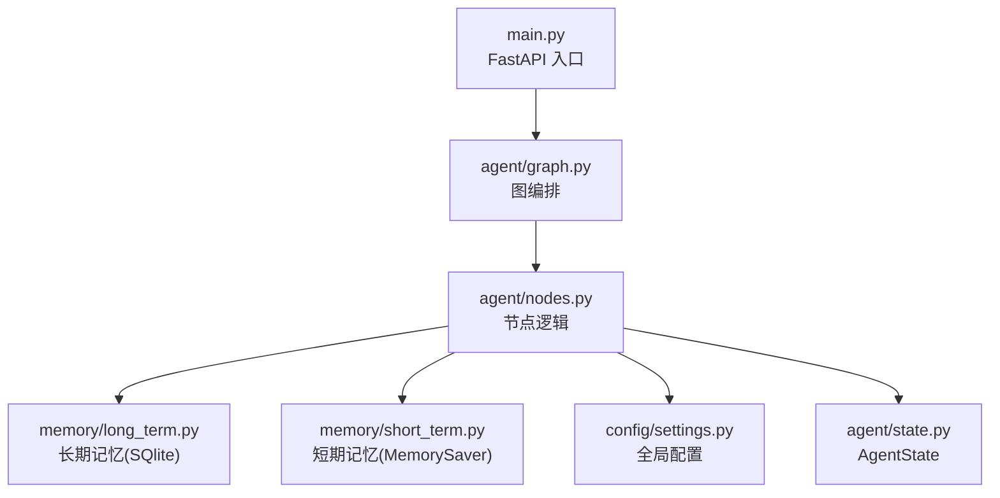
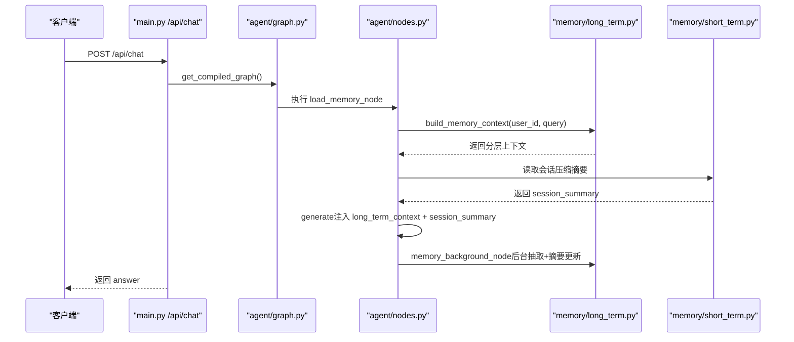
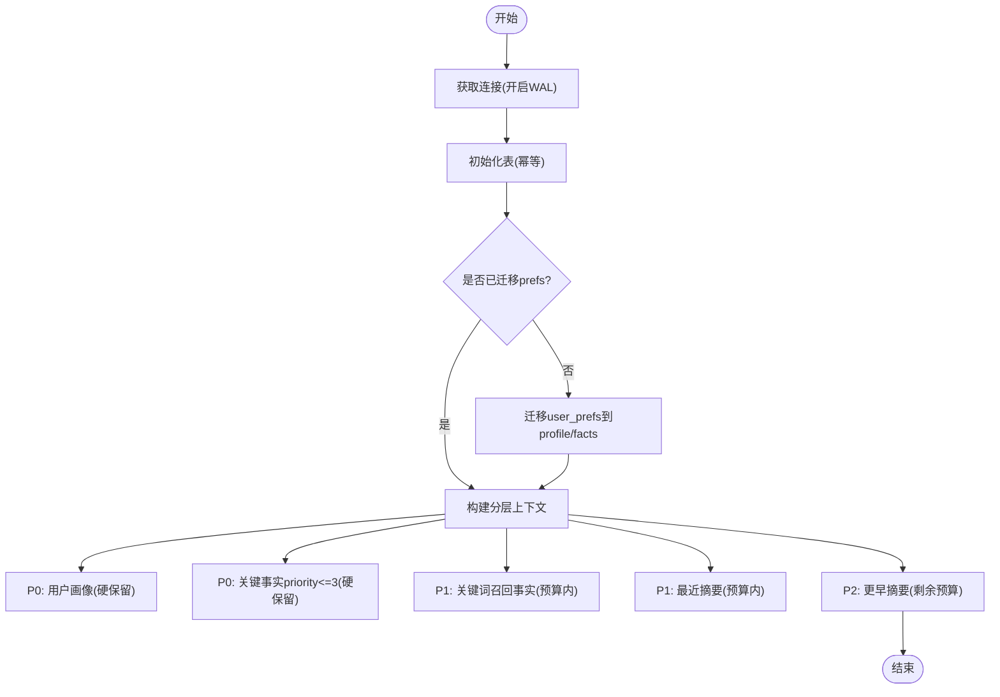
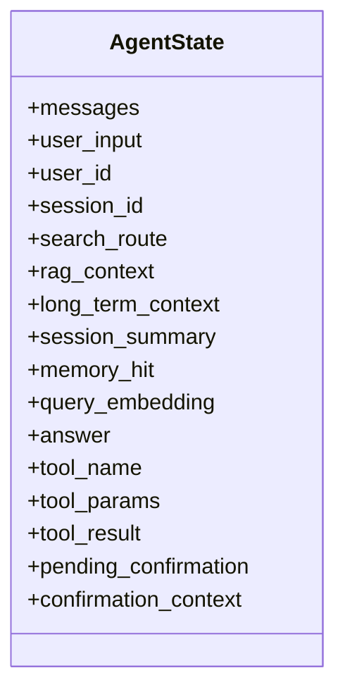
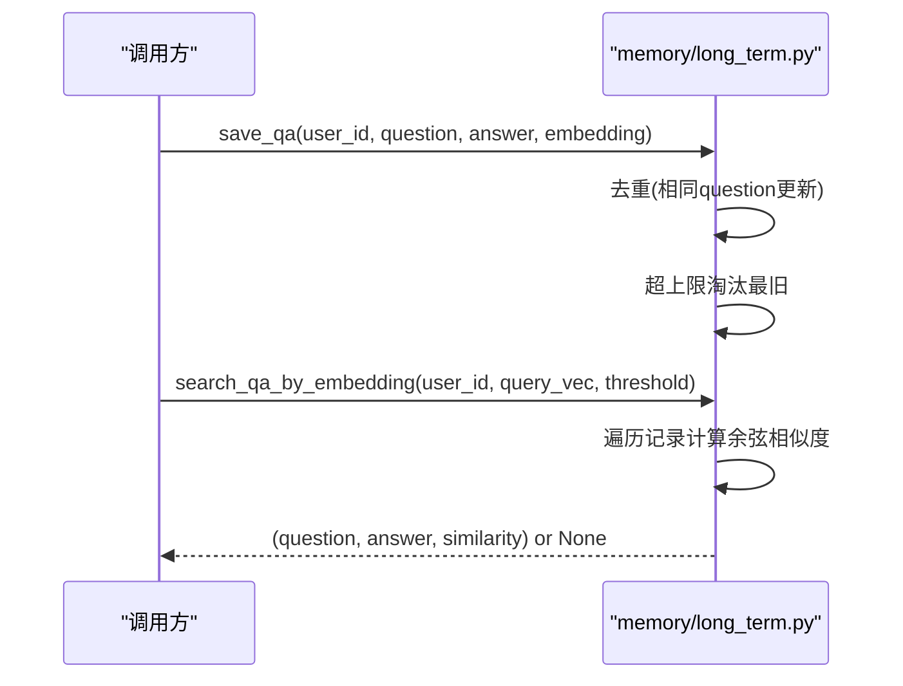
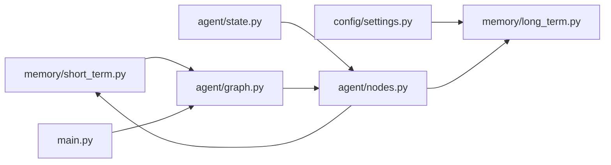

# 长期用户记忆

<cite>
**本文引用的文件**
- [memory/long_term.py](file://memory/long_term.py)
- [memory/short_term.py](file://memory/short_term.py)
- [config/settings.py](file://config/settings.py)
- [agent/state.py](file://agent/state.py)
- [agent/nodes.py](file://agent/nodes.py)
- [agent/graph.py](file://agent/graph.py)
- [main.py](file://main.py)
</cite>

## 目录
1. [简介](#简介)
2. [项目结构](#项目结构)
3. [核心组件](#核心组件)
4. [架构总览](#架构总览)
5. [详细组件分析](#详细组件分析)
6. [依赖关系分析](#依赖关系分析)
7. [性能与并发](#性能与并发)
8. [故障排查指南](#故障排查指南)
9. [结论](#结论)
10. [附录：配置、API 与示例](#附录配置api与示例)

## 简介
本技术文档聚焦“长期用户记忆系统”，围绕 SQLite 持久化存储、用户画像数据模型、问答缓存机制与关键信息抽取算法展开，系统性说明记忆数据的生命周期管理、存储策略选择、查询优化方案与并发访问控制。同时给出数据库表结构设计、索引优化、数据迁移策略与备份恢复建议，并提供记忆配置参数、API 接口说明与实际使用示例，帮助开发者快速集成与调优。

## 项目结构
长期记忆由 memory 模块提供，短期记忆通过 LangGraph checkpointer（进程内 MemorySaver）维护会话上下文；配置集中在 config/settings.py；智能体状态定义在 agent/state.py；节点编排与调用在 agent/nodes.py 与 agent/graph.py；Web 入口与流式接口在 main.py。

图表来源
- [main.py:154-209](file://main.py#L154-L209)
- [agent/graph.py:68-102](file://agent/graph.py#L68-L102)
- [agent/nodes.py:344-360](file://agent/nodes.py#L344-L360)
- [memory/long_term.py:30-47](file://memory/long_term.py#L30-L47)
- [memory/short_term.py:13-20](file://memory/short_term.py#L13-L20)
- [config/settings.py:114-133](file://config/settings.py#L114-L133)
- [agent/state.py:12-40](file://agent/state.py#L12-L40)

章节来源
- [main.py:154-209](file://main.py#L154-L209)
- [agent/graph.py:68-102](file://agent/graph.py#L68-L102)
- [agent/nodes.py:344-360](file://agent/nodes.py#L344-L360)
- [memory/long_term.py:30-47](file://memory/long_term.py#L30-L47)
- [memory/short_term.py:13-20](file://memory/short_term.py#L13-L20)
- [config/settings.py:114-133](file://config/settings.py#L114-L133)
- [agent/state.py:12-40](file://agent/state.py#L12-L40)

## 核心组件
- 长期记忆（SQLite）：负责用户画像、关键事实、摘要历史、会话压缩摘要、问答缓存等结构化存储与分层上下文构建。
- 短期记忆（MemorySaver）：基于 LangGraph 的进程内检查点，按 thread_id（= session_id）维护多轮对话上下文。
- 配置中心：集中管理 LLM、向量库、记忆相关参数（如预算、阈值、窗口大小等）。
- 智能体状态与节点：定义 AgentState 并在 nodes 中实现加载记忆、抽取关键信息、更新摘要、工具调用等流程。

章节来源
- [memory/long_term.py:1-15](file://memory/long_term.py#L1-L15)
- [memory/short_term.py:1-28](file://memory/short_term.py#L1-L28)
- [config/settings.py:114-133](file://config/settings.py#L114-L133)
- [agent/state.py:12-40](file://agent/state.py#L12-L40)
- [agent/nodes.py:344-360](file://agent/nodes.py#L344-L360)

## 架构总览
长期记忆系统在生成回答前加载分层上下文（P0 画像/关键事实硬保留，P1 关键词召回+最近摘要，P2 更早摘要按预算填充），并在后台异步执行关键信息抽取与摘要合并，确保高优先级信息不丢失且不影响主响应链路。

图表来源
- [main.py:154-209](file://main.py#L154-L209)
- [agent/graph.py:68-102](file://agent/graph.py#L68-L102)
- [agent/nodes.py:344-360](file://agent/nodes.py#L344-L360)
- [memory/long_term.py:424-497](file://memory/long_term.py#L424-L497)
- [memory/short_term.py:13-20](file://memory/short_term.py#L13-L20)

## 详细组件分析

### 长期记忆（SQLite 持久化）
- 连接与并发：单例连接 + WAL 模式 + busy_timeout，配合线程锁 _db_lock 串行化写操作，读可并发。
- 表结构与索引：
  - user_memory：用户最新摘要、更新时间、轮次计数。
  - user_prefs：旧版偏好键值对（兼容保留，启动时迁移）。
  - summary_history：摘要历史（按时间倒序索引）。
  - user_profile：用户画像字段（field/value，唯一键 user_id+field）。
  - user_facts：关键事实（带 priority/source/time 戳，索引 user_id+priority+updated_at）。
  - session_summary：会话压缩摘要（session_id 主键）。
  - qa_memory：问答缓存（question/answer/embedding/hit_count，索引 user_id+updated_at）。
  - memory_meta：元数据（迁移标记等）。
- 迁移策略：_migrate_legacy_prefs 一次性将 user_prefs 迁移到 user_profile/user_facts，幂等执行。
- 分层上下文构建：build_memory_context 按 P0/P1/P2 层次与字符预算组装上下文，保证关键信息不丢失。
- 摘要与事实：summarize_messages 支持增量合并（携带旧摘要），save_summary 写入并清理历史；save_fact 去重并提升优先级。
- 规则抽取：extract_key_info 使用正则快速抽取姓名/项目/公司等，apply_extraction 直接落库，零 LLM 成本。
- 问答缓存：save_qa 保存问答对与 embedding；search_qa_by_embedding 计算余弦相似度命中则复用答案并刷新 hit_count。

图表来源
- [memory/long_term.py:30-47](file://memory/long_term.py#L30-L47)
- [memory/long_term.py:50-125](file://memory/long_term.py#L50-L125)
- [memory/long_term.py:138-169](file://memory/long_term.py#L138-L169)
- [memory/long_term.py:424-497](file://memory/long_term.py#L424-L497)

章节来源
- [memory/long_term.py:30-47](file://memory/long_term.py#L30-L47)
- [memory/long_term.py:50-125](file://memory/long_term.py#L50-L125)
- [memory/long_term.py:138-169](file://memory/long_term.py#L138-L169)
- [memory/long_term.py:172-196](file://memory/long_term.py#L172-L196)
- [memory/long_term.py:226-258](file://memory/long_term.py#L226-L258)
- [memory/long_term.py:263-313](file://memory/long_term.py#L263-L313)
- [memory/long_term.py:316-337](file://memory/long_term.py#L316-L337)
- [memory/long_term.py:342-379](file://memory/long_term.py#L342-L379)
- [memory/long_term.py:382-407](file://memory/long_term.py#L382-L407)
- [memory/long_term.py:424-497](file://memory/long_term.py#L424-L497)
- [memory/long_term.py:500-529](file://memory/long_term.py#L500-L529)
- [memory/long_term.py:561-633](file://memory/long_term.py#L561-L633)
- [memory/long_term.py:650-697](file://memory/long_term.py#L650-L697)
- [memory/long_term.py:729-818](file://memory/long_term.py#L729-L818)

### 短期记忆（LangGraph MemorySaver）
- 进程内 MemorySaver 单例，按 thread_id（= session_id）维护会话上下文，无需外部服务。
- 提供 get_checkpointer 与 get_checkpointer_type 用于健康检查与诊断。

章节来源
- [memory/short_term.py:1-28](file://memory/short_term.py#L1-L28)

### 智能体状态与节点编排
- AgentState 定义消息历史、路由结果、RAG/Web 上下文、长期记忆上下文、会话摘要、问答命中标志、问题向量、最终回答等。
- 节点 load_memory_node 从长期记忆构建上下文并加载会话摘要；memory_update_node 周期性更新摘要与压缩摘要；memory_background_node 后台执行抽取与更新，不阻塞主链路。

图表来源
- [agent/state.py:12-40](file://agent/state.py#L12-L40)

章节来源
- [agent/state.py:12-40](file://agent/state.py#L12-L40)
- [agent/nodes.py:344-360](file://agent/nodes.py#L344-L360)
- [agent/nodes.py:535-643](file://agent/nodes.py#L535-L643)

### 关键信息抽取算法
- 规则快速路径：使用正则匹配“我叫/我的项目/我在公司”等模式，提取 name/project/company 并写入 user_profile/user_facts，零 LLM 成本，保证当轮落库。
- LLM 结构化抽取：可选开关，失败静默跳过；抽取 JSON 中的 profile 与 key_facts 并落库。
- 防误抽：包含疑问词黑名单避免提问被误识别为事实。

章节来源
- [memory/long_term.py:638-697](file://memory/long_term.py#L638-L697)
- [agent/nodes.py:363-399](file://agent/nodes.py#L363-L399)

### 问答缓存机制
- 存储：qa_memory 表以 question/answer/embedding 形式保存，embedding 序列化为 BLOB。
- 检索：search_qa_by_embedding 遍历记录计算余弦相似度，超过阈值则命中并累加 hit_count、刷新 updated_at。
- 淘汰：save_qa 支持 max_records 上限，超出按 updated_at ASC 删除最旧记录。

图表来源
- [memory/long_term.py:729-818](file://memory/long_term.py#L729-L818)

章节来源
- [memory/long_term.py:729-818](file://memory/long_term.py#L729-L818)

## 依赖关系分析
- 长期记忆依赖配置中心获取数据库路径与预算参数。
- 节点层依赖长期记忆进行上下文加载与更新，依赖短期记忆维持会话上下文。
- Web 入口通过 FastAPI 暴露聊天接口，内部调用图编排与节点逻辑。

图表来源
- [config/settings.py:114-133](file://config/settings.py#L114-L133)
- [memory/long_term.py:30-47](file://memory/long_term.py#L30-L47)
- [memory/short_term.py:13-20](file://memory/short_term.py#L13-L20)
- [agent/graph.py:68-102](file://agent/graph.py#L68-L102)
- [agent/nodes.py:344-360](file://agent/nodes.py#L344-L360)
- [main.py:154-209](file://main.py#L154-L209)

章节来源
- [config/settings.py:114-133](file://config/settings.py#L114-L133)
- [memory/long_term.py:30-47](file://memory/long_term.py#L30-L47)
- [memory/short_term.py:13-20](file://memory/short_term.py#L13-L20)
- [agent/graph.py:68-102](file://agent/graph.py#L68-L102)
- [agent/nodes.py:344-360](file://agent/nodes.py#L344-L360)
- [main.py:154-209](file://main.py#L154-L209)

## 性能与并发
- SQLite 并发：WAL 模式允许并发读，写操作通过 _db_lock 串行化，busy_timeout 降低锁等待冲突。
- 索引优化：summary_history(user_id, created_at DESC)、user_facts(user_id, priority, updated_at DESC)、qa_memory(user_id, updated_at DESC) 提升查询效率。
- 预算控制：memory_context_budget 限制上下文长度，P0 层硬保留不受影响，P1/P2 层按预算逐条填充，避免提示词过长。
- 摘要频率：memory_summary_every 控制每 N 轮触发一次摘要合并，平衡实时性与开销。
- 问答缓存：memory_qa_cache_enabled 与 memory_qa_threshold 控制相似问题复用，减少 LLM 调用；memory_qa_max_records 控制缓存规模。
- 短期窗口：memory_short_window 与 memory_history_budget 控制注入的历史消息数量与字符预算。

章节来源
- [memory/long_term.py:30-47](file://memory/long_term.py#L30-L47)
- [memory/long_term.py:50-125](file://memory/long_term.py#L50-L125)
- [memory/long_term.py:424-497](file://memory/long_term.py#L424-L497)
- [config/settings.py:114-133](file://config/settings.py#L114-L133)
- [agent/nodes.py:516-532](file://agent/nodes.py#L516-L532)

## 故障排查指南
- 长期记忆加载失败：load_memory_node 捕获异常并返回空上下文，检查 SQLite 连接与表初始化。
- 会话摘要加载失败：get_session_summary 异常时返回空字符串，确认 session_id 与 session_summary 表。
- 规则抽取失败：extract_facts_node 捕获异常并忽略，不影响主链路；检查正则与输入格式。
- LLM 摘要失败：summarize_messages 降级为简单截断，检查 LLM 配置与网络连通性。
- 问答缓存未命中：search_qa_by_embedding 需存在 embedding 且相似度达阈值；检查 memory_qa_threshold 与 embedding 生成。
- 健康检查：/health 返回 checkpointer 类型，确认短期记忆后端可用。

章节来源
- [agent/nodes.py:344-360](file://agent/nodes.py#L344-L360)
- [agent/nodes.py:363-399](file://agent/nodes.py#L363-L399)
- [memory/long_term.py:561-633](file://memory/long_term.py#L561-L633)
- [memory/long_term.py:784-818](file://memory/long_term.py#L784-L818)
- [main.py:317-326](file://main.py#L317-L326)

## 结论
长期用户记忆系统通过 SQLite 结构化存储与分层上下文构建，实现了高优先级信息的可靠保留与高效检索；结合规则快速抽取与可选 LLM 结构化抽取，在保证低延迟的同时提升个性化能力。问答缓存机制进一步降低重复问题的 LLM 调用成本。通过合理的预算控制、索引优化与并发策略，系统在性能与可靠性之间取得良好平衡。

## 附录：配置、API 与示例

### 记忆相关配置参数
- long_term_db_path：长期记忆 SQLite 数据库路径。
- memory_summary_every：每 N 轮触发一次摘要合并。
- memory_context_budget：长期记忆上下文字符预算。
- memory_short_window：短期历史窗口（消息条数）。
- memory_history_budget：短期历史字符预算。
- rag_context_budget：RAG/联网搜索上下文字符预算。
- memory_extract_llm_enabled：是否启用 LLM 结构化抽取。
- memory_qa_cache_enabled：是否启用问答缓存。
- memory_qa_threshold：问答缓存相似度阈值。
- memory_qa_max_records：每用户问答缓存上限。

章节来源
- [config/settings.py:114-133](file://config/settings.py#L114-L133)

### API 接口说明
- POST /api/chat：非流式聊天接口，返回 answer。
- POST /api/chat/stream：SSE 流式聊天接口，事件类型包括 status/token/error/done。
- GET /health：健康检查，返回服务状态与 checkpointer 类型。

章节来源
- [main.py:154-209](file://main.py#L154-L209)
- [main.py:228-314](file://main.py#L228-L314)
- [main.py:317-326](file://main.py#L317-L326)

### 实际使用示例
- 保存用户画像字段：调用 save_profile(user_id, field, value)。
- 保存关键事实：调用 save_fact(user_id, fact, priority, source)。
- 构建长期记忆上下文：调用 build_memory_context(user_id, query, budget)。
- 保存问答对：调用 save_qa(user_id, question, answer, embedding, max_records)。
- 检索问答缓存：调用 search_qa_by_embedding(user_id, query_vec, threshold)。
- 后台更新记忆：在节点 memory_background_node 中自动执行抽取与摘要更新。

章节来源
- [memory/long_term.py:226-258](file://memory/long_term.py#L226-L258)
- [memory/long_term.py:263-313](file://memory/long_term.py#L263-L313)
- [memory/long_term.py:424-497](file://memory/long_term.py#L424-L497)
- [memory/long_term.py:729-818](file://memory/long_term.py#L729-L818)
- [agent/nodes.py:535-643](file://agent/nodes.py#L535-L643)