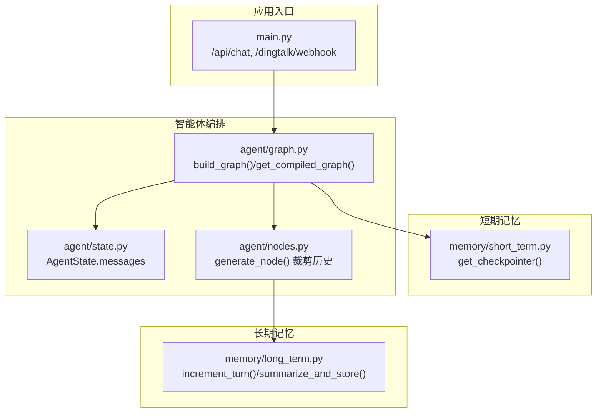
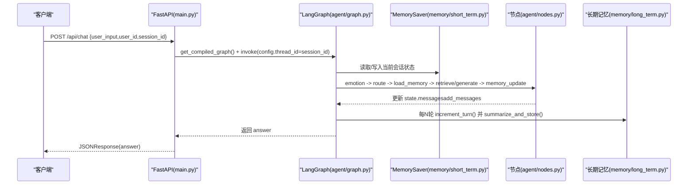
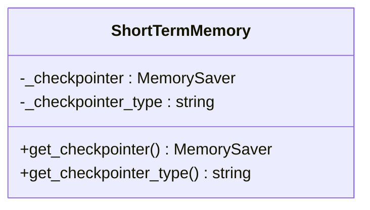
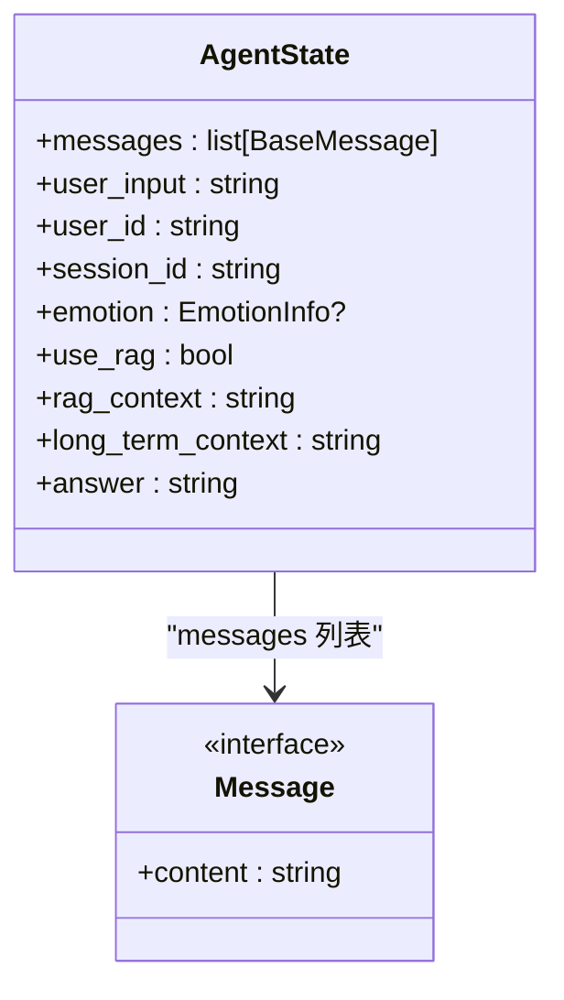
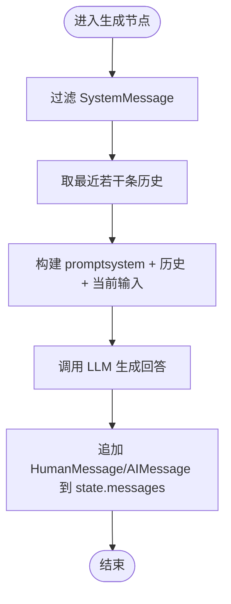
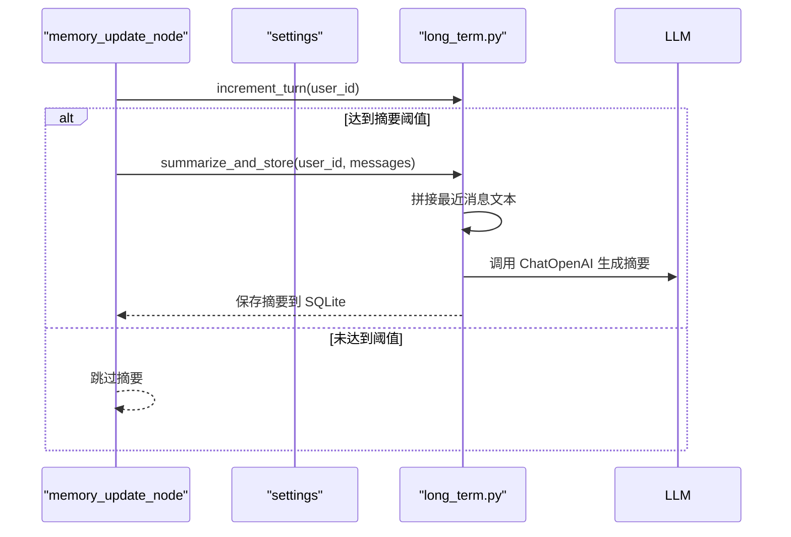
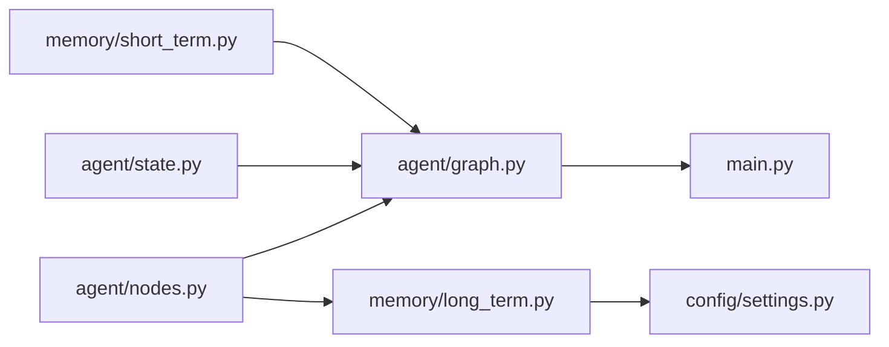

# 短期记忆管理

<cite>
**本文引用的文件**   
- [memory/short_term.py](file://memory/short_term.py)
- [memory/long_term.py](file://memory/long_term.py)
- [agent/graph.py](file://agent/graph.py)
- [agent/state.py](file://agent/state.py)
- [agent/nodes.py](file://agent/nodes.py)
- [config/settings.py](file://config/settings.py)
- [main.py](file://main.py)
- [tests/test_smoke.py](file://tests/test_smoke.py)
</cite>

## 目录
1. [简介](#简介)
2. [项目结构](#项目结构)
3. [核心组件](#核心组件)
4. [架构总览](#架构总览)
5. [详细组件分析](#详细组件分析)
6. [依赖关系分析](#依赖关系分析)
7. [性能与内存优化](#性能与内存优化)
8. [故障排查指南](#故障排查指南)
9. [结论](#结论)
10. [附录：接口与使用示例](#附录接口与使用示例)

## 简介
本技术文档聚焦“短期记忆管理模块”，围绕基于 LangGraph checkpointer（MemorySaver）的会话上下文管理机制展开，涵盖消息队列设计、上下文窗口控制、内存优化策略、消息历史维护、会话状态生命周期、与长期记忆的协作机制（何时将短期记忆转换为长期摘要）、查询接口与使用示例、内存监控与垃圾回收策略，以及与 LangChain 消息格式的兼容性处理。

## 项目结构
短期记忆相关代码主要位于 memory/short_term.py，并通过 agent/graph.py 在编译图时挂载 checkpointer；AgentState 定义消息列表字段，由 add_messages reducer 自动累加历史；生成节点对最近若干条历史进行裁剪以控制上下文窗口；长期记忆通过 SQLite 持久化并在固定轮次触发摘要生成。

图表来源
- [memory/short_term.py:13-20](file://memory/short_term.py#L13-L20)
- [agent/graph.py:62-69](file://agent/graph.py#L62-L69)
- [agent/state.py:20-44](file://agent/state.py#L20-L44)
- [agent/nodes.py:126-141](file://agent/nodes.py#L126-L141)
- [memory/long_term.py:165-183](file://memory/long_term.py#L165-L183)
- [main.py:58-91](file://main.py#L58-L91)

章节来源
- [memory/short_term.py:1-28](file://memory/short_term.py#L1-L28)
- [agent/graph.py:25-69](file://agent/graph.py#L25-L69)
- [agent/state.py:20-44](file://agent/state.py#L20-L44)
- [agent/nodes.py:126-141](file://agent/nodes.py#L126-L141)
- [memory/long_term.py:165-183](file://memory/long_term.py#L165-L183)
- [main.py:58-91](file://main.py#L58-L91)

## 核心组件
- 短期记忆后端：进程内 MemorySaver，按 thread_id（= session_id）维护会话上下文与交互历史，无需外部服务。
- 智能体状态：AgentState 中的 messages 字段使用 add_messages reducer，自动累加历史消息。
- 上下文窗口控制：生成阶段仅取最近若干条非 SystemMessage 的历史，限制输入长度。
- 长期记忆协作：每 N 轮对话触发一次摘要生成并持久化到 SQLite。
- 配置项：memory_summary_every 控制摘要触发频率。

章节来源
- [memory/short_term.py:13-20](file://memory/short_term.py#L13-L20)
- [agent/state.py:20-44](file://agent/state.py#L20-L44)
- [agent/nodes.py:126-141](file://agent/nodes.py#L126-L141)
- [memory/long_term.py:165-183](file://memory/long_term.py#L165-L183)
- [config/settings.py:44-47](file://config/settings.py#L44-L47)

## 架构总览
短期记忆通过 LangGraph 的 checkpointer 实现跨轮次的状态持久化（进程内），每次调用 graph.invoke 时传入 thread_id 指定会话。AgentState.messages 由 reducer 自动追加新消息，生成节点对历史做窗口裁剪，memory_update_node 周期性触发长期记忆摘要。

图表来源
- [main.py:58-91](file://main.py#L58-L91)
- [agent/graph.py:62-69](file://agent/graph.py#L62-L69)
- [memory/short_term.py:13-20](file://memory/short_term.py#L13-L20)
- [agent/nodes.py:144-163](file://agent/nodes.py#L144-L163)
- [memory/long_term.py:165-183](file://memory/long_term.py#L165-L183)

## 详细组件分析

### 短期记忆后端（MemorySaver 单例）
- 提供 get_checkpointer() 返回进程内 MemorySaver 单例，首次调用初始化并记录类型标识。
- get_checkpointer_type() 用于健康检查等场景输出当前后端类型。

图表来源
- [memory/short_term.py:13-20](file://memory/short_term.py#L13-L20)
- [memory/short_term.py:23-27](file://memory/short_term.py#L23-L27)

章节来源
- [memory/short_term.py:1-28](file://memory/short_term.py#L1-L28)

### 智能体状态与消息队列
- AgentState 包含 messages 字段，类型为 BaseMessage 列表，配合 add_messages reducer 实现多轮累加。
- generate_node 中从 state.messages 提取历史，过滤 SystemMessage 后取最近若干条作为上下文。

图表来源
- [agent/state.py:20-44](file://agent/state.py#L20-L44)
- [agent/nodes.py:126-141](file://agent/nodes.py#L126-L141)

章节来源
- [agent/state.py:20-44](file://agent/state.py#L20-L44)
- [agent/nodes.py:126-141](file://agent/nodes.py#L126-L141)

### 上下文窗口控制与消息历史维护
- 添加历史：每次生成回答后，generate_node 返回 HumanMessage/AIMessage 增量，由 add_messages reducer 合并到 state.messages。
- 查询历史：生成节点内部对 messages 进行过滤与切片，仅保留最近若干条非 SystemMessage。
- 清理逻辑：当前实现未显式清理旧消息，依赖进程内 MemorySaver 的生命周期与系统 GC；如需主动清理，可在上层封装线程级重置或扩展 checkpointer。

图表来源
- [agent/nodes.py:126-141](file://agent/nodes.py#L126-L141)

章节来源
- [agent/nodes.py:126-141](file://agent/nodes.py#L126-L141)

### 会话状态生命周期管理
- 创建：首次调用 graph.invoke 时，checkpointer 根据 thread_id 创建会话状态。
- 更新：每个节点可返回增量 dict，由 reducer 合并到 state；messages 字段通过 add_messages 累加。
- 销毁：进程退出后 MemorySaver 数据丢失；如需跨进程持久化，可替换为其他 checkpointer 实现。

章节来源
- [agent/graph.py:62-69](file://agent/graph.py#L62-L69)
- [memory/short_term.py:13-20](file://memory/short_term.py#L13-L20)

### 与长期记忆的协作机制
- 轮次计数：memory_update_node 调用 increment_turn(user_id) 增加轮次。
- 摘要触发：当 turn % settings.memory_summary_every == 0 时，调用 summarize_and_store(user_id, messages)。
- 摘要生成：将最近若干条消息拼接为对话文本，调用 LLM 生成摘要并写入 SQLite；失败时回退为简单截断。

图表来源
- [agent/nodes.py:144-163](file://agent/nodes.py#L144-L163)
- [memory/long_term.py:165-183](file://memory/long_term.py#L165-L183)
- [memory/long_term.py:203-243](file://memory/long_term.py#L203-L243)
- [config/settings.py:44-47](file://config/settings.py#L44-L47)

章节来源
- [agent/nodes.py:144-163](file://agent/nodes.py#L144-L163)
- [memory/long_term.py:165-183](file://memory/long_term.py#L165-L183)
- [memory/long_term.py:203-243](file://memory/long_term.py#L203-L243)
- [config/settings.py:44-47](file://config/settings.py#L44-L47)

### 与 LangChain 消息格式的兼容性
- 使用 langchain_core.messages 的 BaseMessage、HumanMessage、AIMessage、SystemMessage。
- generate_node 构造消息列表时严格遵循 LangChain 格式，确保与 LLM 调用链兼容。
- 测试用例验证了消息格式与 RAG 上下文格式化。

章节来源
- [agent/nodes.py:126-141](file://agent/nodes.py#L126-L141)
- [tests/test_smoke.py:84-93](file://tests/test_smoke.py#L84-L93)

## 依赖关系分析
- 短期记忆后端依赖 langgraph.checkpoint.memory.MemorySaver。
- 智能体图依赖 agent/state.AgentState、agent/nodes.*、memory.short_term.get_checkpointer。
- 长期记忆依赖 sqlite3、langchain_core.messages、config.settings。
- 主入口 main.py 通过 FastAPI 暴露接口，调用 agent.graph.get_compiled_graph() 执行流程。

图表来源
- [memory/short_term.py:13-20](file://memory/short_term.py#L13-L20)
- [agent/graph.py:62-69](file://agent/graph.py#L62-L69)
- [agent/state.py:20-44](file://agent/state.py#L20-L44)
- [agent/nodes.py:144-163](file://agent/nodes.py#L144-L163)
- [memory/long_term.py:165-183](file://memory/long_term.py#L165-L183)
- [config/settings.py:44-47](file://config/settings.py#L44-L47)
- [main.py:58-91](file://main.py#L58-L91)

章节来源
- [memory/short_term.py:13-20](file://memory/short_term.py#L13-L20)
- [agent/graph.py:62-69](file://agent/graph.py#L62-L69)
- [agent/state.py:20-44](file://agent/state.py#L20-L44)
- [agent/nodes.py:144-163](file://agent/nodes.py#L144-L163)
- [memory/long_term.py:165-183](file://memory/long_term.py#L165-L183)
- [config/settings.py:44-47](file://config/settings.py#L44-L47)
- [main.py:58-91](file://main.py#L58-L91)

## 性能与内存优化
- 进程内存储：MemorySaver 无外部依赖，启动快、读写开销低，适合单机部署。
- 并发读：长期记忆 SQLite 开启 WAL 模式，提升并发读性能，写操作串行化避免冲突。
- 上下文窗口：生成节点仅取最近若干条历史，降低 LLM 输入长度与延迟。
- 摘要频率：通过 memory_summary_every 控制摘要生成频率，平衡长期记忆质量与计算开销。
- 内存监控与 GC：当前未内置内存监控；建议结合 Python 标准库 gc 与 psutil 定期采样，必要时在上层封装会话重置或消息裁剪策略。

章节来源
- [memory/long_term.py:24-41](file://memory/long_term.py#L24-L41)
- [agent/nodes.py:126-141](file://agent/nodes.py#L126-L141)
- [config/settings.py:44-47](file://config/settings.py#L44-L47)

## 故障排查指南
- 短期记忆后端不可用：检查 get_checkpointer() 是否被正确调用，确认进程内 MemorySaver 初始化成功。
- 会话上下文不连贯：确认 thread_id（session_id）一致；检查 add_messages reducer 是否正确合并 messages。
- 长期记忆摘要未触发：检查 memory_summary_every 配置与 increment_turn() 返回值；查看 summarize_and_store() 异常日志。
- 消息格式错误：确保使用 langchain_core.messages 的 BaseMessage/HumanMessage/AIMessage/SystemMessage。
- 健康检查：/health 端点返回 checkpointer 类型，便于快速定位后端。

章节来源
- [memory/short_term.py:13-20](file://memory/short_term.py#L13-L20)
- [agent/nodes.py:144-163](file://agent/nodes.py#L144-L163)
- [memory/long_term.py:203-243](file://memory/long_term.py#L203-L243)
- [main.py:94-103](file://main.py#L94-L103)

## 结论
短期记忆管理模块基于 LangGraph checkpointer（MemorySaver）实现了轻量、高效的进程内会话上下文管理。通过 AgentState.messages 与 add_messages reducer 自动维护消息历史，生成节点对上下文窗口进行裁剪，memory_update_node 周期性触发长期记忆摘要，形成短长记忆协同的闭环。整体架构简洁可靠，易于扩展与监控。

## 附录：接口与使用示例

### 获取最近消息
- 在生成节点内部，state.messages 包含完整历史；可通过过滤与切片获取最近若干条非 SystemMessage 消息。
- 参考路径：[agent/nodes.py:126-141](file://agent/nodes.py#L126-L141)

### 清空会话
- 当前实现未提供显式清空接口；可通过更换 session_id（thread_id）实现会话隔离，或在进程重启后 MemorySaver 数据丢失。
- 参考路径：[main.py:58-91](file://main.py#L58-L91)、[agent/graph.py:62-69](file://agent/graph.py#L62-L69)

### 会话创建、更新与销毁
- 创建：首次调用 graph.invoke 时根据 thread_id 创建会话状态。
- 更新：各节点返回增量 dict，reducer 合并到 state；messages 字段自动累加。
- 销毁：进程退出后数据丢失；如需跨进程持久化，可替换 checkpointer。
- 参考路径：[agent/graph.py:62-69](file://agent/graph.py#L62-L69)、[memory/short_term.py:13-20](file://memory/short_term.py#L13-L20)

### 与长期记忆的协作
- 轮次计数与摘要触发：memory_update_node 调用 increment_turn() 与 summarize_and_store()。
- 参考路径：[agent/nodes.py:144-163](file://agent/nodes.py#L144-L163)、[memory/long_term.py:165-183](file://memory/long_term.py#L165-L183)

### 内存使用监控与垃圾回收
- 当前未内置监控；建议结合 gc 与 psutil 定期采样，必要时在上层封装会话重置或消息裁剪策略。
- 参考路径：[memory/short_term.py:13-20](file://memory/short_term.py#L13-L20)

### LangChain 消息格式兼容性
- 使用 langchain_core.messages 的 BaseMessage/HumanMessage/AIMessage/SystemMessage。
- 参考路径：[agent/nodes.py:126-141](file://agent/nodes.py#L126-L141)、[tests/test_smoke.py:84-93](file://tests/test_smoke.py#L84-L93)