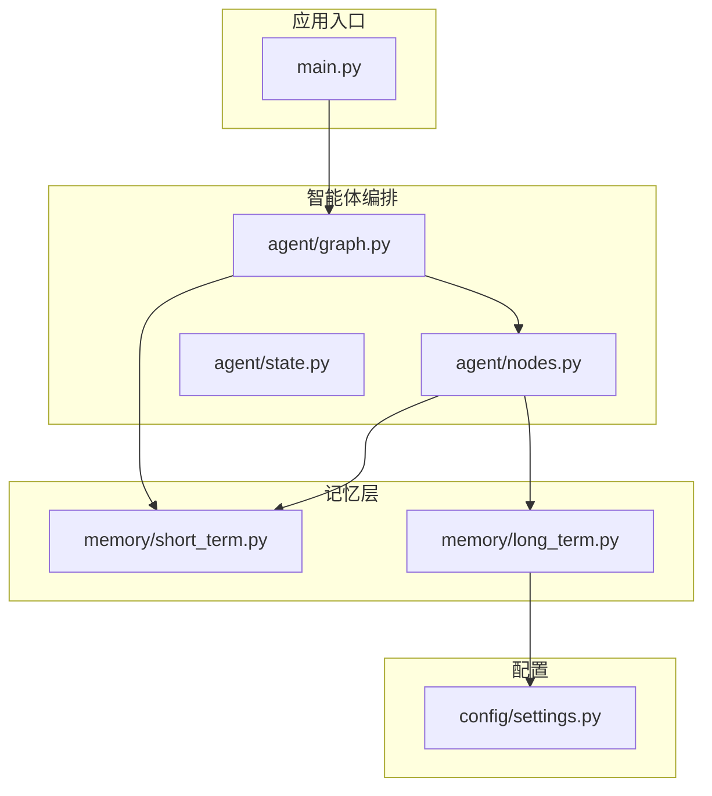
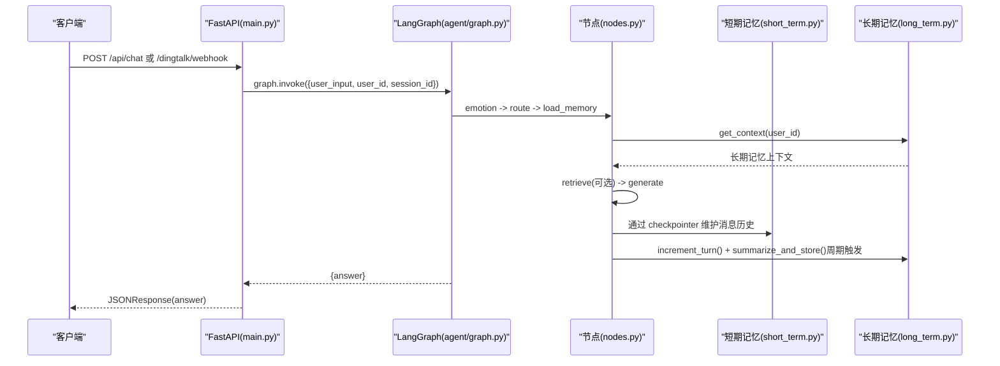
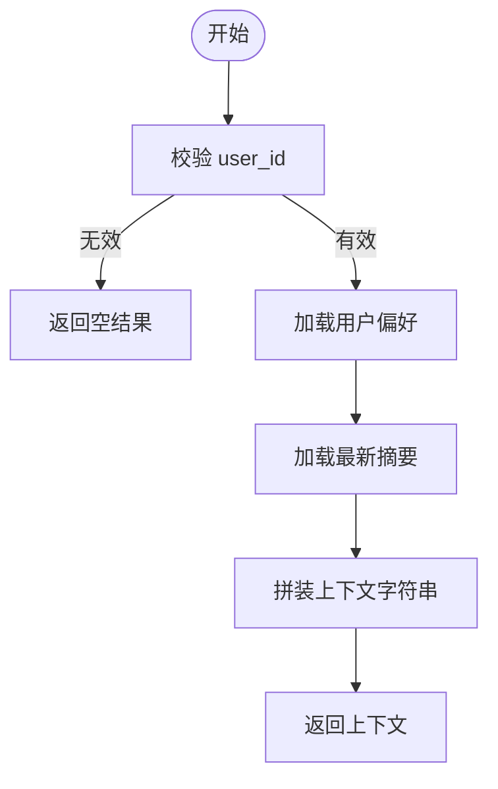
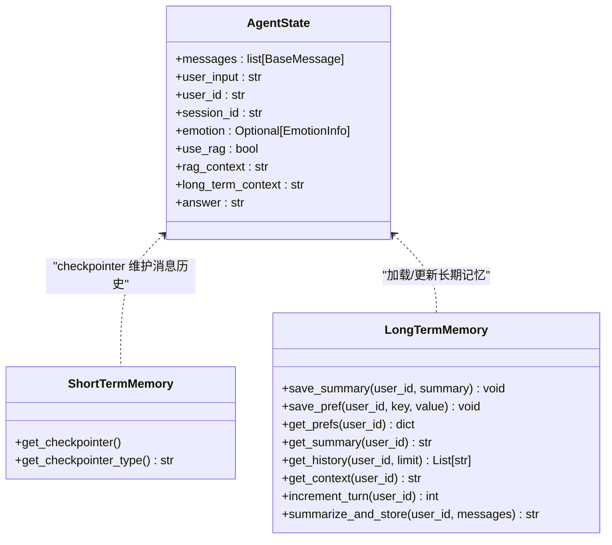
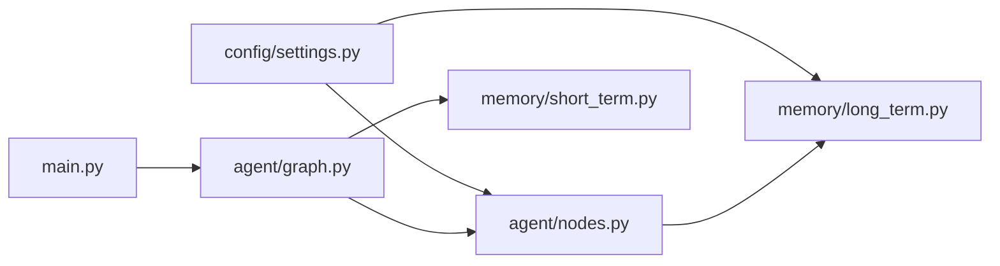

# 记忆管理系统

<cite>
**本文引用的文件**   
- [memory/long_term.py](file://memory/long_term.py)
- [memory/short_term.py](file://memory/short_term.py)
- [agent/nodes.py](file://agent/nodes.py)
- [agent/graph.py](file://agent/graph.py)
- [agent/state.py](file://agent/state.py)
- [config/settings.py](file://config/settings.py)
- [main.py](file://main.py)
</cite>

## 目录
1. [简介](#简介)
2. [项目结构](#项目结构)
3. [核心组件](#核心组件)
4. [架构总览](#架构总览)
5. [详细组件分析](#详细组件分析)
6. [依赖关系分析](#依赖关系分析)
7. [性能考量](#性能考量)
8. [故障排查指南](#故障排查指南)
9. [结论](#结论)
10. [附录：查询接口与使用示例、数据迁移与备份方案](#附录：查询接口与使用示例、数据迁移与备份方案)

## 简介
本技术文档围绕“记忆管理系统”展开，系统通过短期记忆与长期记忆的协同实现跨会话的个性化服务。短期记忆基于进程内 MemorySaver，按会话（thread_id）维护消息历史；长期记忆基于 SQLite，持久化用户偏好、对话摘要及摘要历史索引，支持周期性摘要生成与压缩清理。整体设计兼顾低延迟交互与可回溯的历史能力，并通过 LangGraph 状态图编排工作流，将记忆加载、检索、生成与更新串联为稳定可靠的链路。

## 项目结构
记忆相关代码主要分布在 memory 与 agent 模块中，配置集中在 config/settings.py，入口在 main.py。

图表来源
- [main.py:1-120](file://main.py#L1-L120)
- [agent/graph.py:1-82](file://agent/graph.py#L1-L82)
- [agent/nodes.py:1-164](file://agent/nodes.py#L1-L164)
- [memory/short_term.py:1-28](file://memory/short_term.py#L1-L28)
- [memory/long_term.py:1-120](file://memory/long_term.py#L1-L120)
- [config/settings.py:1-93](file://config/settings.py#L1-L93)

章节来源
- [main.py:1-120](file://main.py#L1-L120)
- [agent/graph.py:1-82](file://agent/graph.py#L1-L82)
- [agent/nodes.py:1-164](file://agent/nodes.py#L1-L164)
- [memory/short_term.py:1-28](file://memory/short_term.py#L1-L28)
- [memory/long_term.py:1-120](file://memory/long_term.py#L1-L120)
- [config/settings.py:1-93](file://config/settings.py#L1-L93)

## 核心组件
- 短期记忆（Short-term Memory）
  - 基于 LangGraph 的 MemorySaver，按 thread_id（= session_id）维护会话上下文与消息历史，提供多轮对话连贯性。
  - 单例模式懒加载，类型标识便于健康检查与监控。
- 长期记忆（Long-term Memory）
  - 基于 SQLite 持久化，包含三张表：user_memory（用户摘要与轮次计数）、user_prefs（用户偏好键值对）、summary_history（摘要历史索引）。
  - 提供保存/获取摘要、偏好、历史、上下文拼装、轮次计数与周期摘要生成等能力。
- 工作流节点（Agent Nodes）
  - load_memory_node：从 SQLite 加载长期记忆上下文。
  - memory_update_node：每 N 轮触发一次摘要生成并写入长期记忆。
- 配置（Settings）
  - long_term_db_path：SQLite 数据库路径。
  - memory_summary_every：触发摘要的轮次间隔。

章节来源
- [memory/short_term.py:1-28](file://memory/short_term.py#L1-L28)
- [memory/long_term.py:1-120](file://memory/long_term.py#L1-L120)
- [agent/nodes.py:89-164](file://agent/nodes.py#L89-L164)
- [config/settings.py:44-48](file://config/settings.py#L44-L48)

## 架构总览
记忆系统在 LangGraph 工作流中被调用，短期记忆由 checkpointer 管理，长期记忆由 SQLite 提供。每次请求进入后，流程依次执行情感分析、路由判断、加载长期记忆、可选 RAG 检索、生成回答，最后进行记忆更新。

图表来源
- [main.py:58-176](file://main.py#L58-L176)
- [agent/graph.py:25-82](file://agent/graph.py#L25-L82)
- [agent/nodes.py:89-164](file://agent/nodes.py#L89-L164)
- [memory/short_term.py:13-28](file://memory/short_term.py#L13-L28)
- [memory/long_term.py:75-120](file://memory/long_term.py#L75-L120)

## 详细组件分析

### 短期记忆（Short-term Memory）
- 设计目标
  - 以 thread_id 为单位维护会话上下文，保证多轮对话连贯性。
  - 进程内 MemorySaver，无需外部服务，启动即生效。
- 关键实现
  - get_checkpointer：返回单例 MemorySaver，首次创建时打印后端类型。
  - get_checkpointer_type：返回当前 checkpointer 类型标识，用于健康检查。
- 内存优化策略
  - 仅保留当前会话的消息历史，避免跨会话污染。
  - 结合工作流中的消息窗口控制（见 generate_node），限制历史长度。

章节来源
- [memory/short_term.py:1-28](file://memory/short_term.py#L1-L28)
- [agent/graph.py:62-69](file://agent/graph.py#L62-L69)
- [agent/nodes.py:126-141](file://agent/nodes.py#L126-L141)

### 长期记忆（Long-term Memory）
- 设计目标
  - 跨会话持久化用户偏好、对话摘要与摘要历史索引，支撑个性化与回溯。
  - 使用 SQLite 内置存储，降低运维复杂度。
- 表结构设计
  - user_memory：user_id(PK), summary, updated_at, turn_count
  - user_prefs：user_id+key(PK), value
  - summary_history：id(auto PK), user_id, summary, created_at（含索引 idx_history_user）
- 数据写入与更新
  - save_summary：插入或更新摘要，同时追加到 summary_history，并清理超出最近 20 条的旧摘要。
  - save_pref：键值对覆盖式写入。
  - increment_turn：原子递增轮次计数，若不存在则初始化。
- 数据读取与上下文拼装
  - get_prefs：按 user_id 拉取偏好字典。
  - get_summary：获取最新摘要。
  - get_history：按时间倒序获取最近若干条摘要。
  - get_context：拼接偏好与摘要为字符串，供生成节点作为系统提示的一部分。
- 周期摘要生成
  - summarize_and_store：截取最近 10 条消息，调用 LLM 生成摘要，失败时回退为简单截断；最终调用 save_summary 持久化。
- 并发与一致性
  - 连接单例 + threading.Lock 串行化写操作，WAL 模式提升读并发。
  - busy_timeout 防止短时锁竞争导致失败。

图表来源
- [memory/long_term.py:150-163](file://memory/long_term.py#L150-L163)

章节来源
- [memory/long_term.py:1-244](file://memory/long_term.py#L1-L244)
- [config/settings.py:73-79](file://config/settings.py#L73-L79)

### 工作流节点与记忆集成
- load_memory_node：调用 memory.long_term.get_context 组装长期记忆上下文。
- memory_update_node：每 N 轮（settings.memory_summary_every）触发 summarize_and_store，并记录轮次。
- generate_node：构造消息列表，限制历史窗口（最近 8 条非 SystemMessage），确保上下文窗口可控。

图表来源
- [agent/state.py:1-47](file://agent/state.py#L1-L47)
- [memory/short_term.py:1-28](file://memory/short_term.py#L1-L28)
- [memory/long_term.py:75-244](file://memory/long_term.py#L75-L244)

章节来源
- [agent/nodes.py:89-164](file://agent/nodes.py#L89-L164)
- [agent/state.py:1-47](file://agent/state.py#L1-L47)

## 依赖关系分析
- 短期记忆依赖 LangGraph 的 MemorySaver，通过 graph.build_graph 注入。
- 长期记忆依赖 sqlite3 与 pydantic-settings 提供的配置路径。
- 工作流节点依赖配置 settings 决定摘要触发频率与数据库路径。

图表来源
- [config/settings.py:1-93](file://config/settings.py#L1-L93)
- [memory/long_term.py:1-120](file://memory/long_term.py#L1-L120)
- [agent/graph.py:1-82](file://agent/graph.py#L1-L82)
- [agent/nodes.py:1-164](file://agent/nodes.py#L1-L164)
- [main.py:1-120](file://main.py#L1-L120)

章节来源
- [config/settings.py:1-93](file://config/settings.py#L1-L93)
- [memory/long_term.py:1-120](file://memory/long_term.py#L1-L120)
- [agent/graph.py:1-82](file://agent/graph.py#L1-L82)
- [agent/nodes.py:1-164](file://agent/nodes.py#L1-L164)
- [main.py:1-120](file://main.py#L1-L120)

## 性能考量
- 短期记忆
  - 进程内内存存储，无网络开销；消息历史窗口限制（最近 8 条）控制上下文大小。
- 长期记忆
  - SQLite WAL 模式提升读并发；写操作通过线程锁串行化，避免竞态。
  - 摘要历史仅保留最近 20 条，减少表膨胀。
  - 摘要生成时仅截取最近 10 条消息，降低 LLM 输入长度与成本。
- 配置调优
  - memory_summary_every 控制摘要频率，平衡记忆更新成本与个性化效果。
  - rag_top_k 与 rag_score_filter 影响检索质量与上下文长度（与记忆无关但影响整体性能）。

章节来源
- [memory/long_term.py:37-40](file://memory/long_term.py#L37-L40)
- [memory/long_term.py:93-99](file://memory/long_term.py#L93-L99)
- [memory/long_term.py:218-221](file://memory/long_term.py#L218-L221)
- [config/settings.py:44-48](file://config/settings.py#L44-L48)
- [agent/nodes.py:131-133](file://agent/nodes.py#L131-L133)

## 故障排查指南
- 短期记忆
  - 健康检查端点 /health 返回 checkpointer 类型，确认 MemorySaver 已初始化。
- 长期记忆
  - 若 LLM 不可用，summarize_and_store 会降级为简单截断，日志输出失败原因。
  - SQLite 写冲突或超时可通过 busy_timeout 调整；WAL 模式需确保文件权限正确。
- 工作流
  - 生成失败时，generate_node 捕获异常并返回友好错误信息；检查 LLM 配置与网络连通性。
  - 路由判断失败时，nodes._decide_rag 回退关键词匹配，确保基本可用性。

章节来源
- [main.py:94-103](file://main.py#L94-L103)
- [memory/long_term.py:237-241](file://memory/long_term.py#L237-L241)
- [agent/nodes.py:60-68](file://agent/nodes.py#L60-L68)
- [agent/nodes.py:137-141](file://agent/nodes.py#L137-L141)

## 结论
本记忆管理系统通过短期与长期记忆的分工协作，实现了高效、可扩展的个性化对话能力。短期记忆保障会话内连贯性，长期记忆提供跨会话的偏好与摘要支持。SQLite 的轻量持久化与 WAL 并发模型满足读写需求，配合周期摘要与历史清理策略，有效控制存储增长。整体架构清晰、容错完善，适合在生产环境中部署与扩展。

## 附录：查询接口与使用示例、数据迁移与备份方案

### 查询接口与使用示例
- 长期记忆查询接口
  - 获取用户偏好：get_prefs(user_id)
  - 获取最新摘要：get_summary(user_id)
  - 获取摘要历史：get_history(user_id, limit)
  - 拼装上下文：get_context(user_id)
  - 轮次计数：increment_turn(user_id)、get_turn_count(user_id)
- 使用示例（概念说明）
  - 在 load_memory_node 中调用 get_context 将偏好与摘要注入系统提示。
  - 在 memory_update_node 中根据轮次触发 summarize_and_store，自动持久化摘要。
  - 在 generate_node 中限制历史窗口，确保上下文长度可控。

章节来源
- [memory/long_term.py:116-163](file://memory/long_term.py#L116-L163)
- [memory/long_term.py:165-195](file://memory/long_term.py#L165-L195)
- [agent/nodes.py:89-101](file://agent/nodes.py#L89-L101)
- [agent/nodes.py:145-164](file://agent/nodes.py#L145-L164)
- [agent/nodes.py:126-141](file://agent/nodes.py#L126-L141)

### 数据迁移与备份方案
- 迁移策略
  - 表结构幂等初始化：_init_tables 使用 CREATE TABLE IF NOT EXISTS，兼容旧版本。
  - 增量字段：如新增列可在后续版本通过 PRAGMA 或脚本添加，保持向后兼容。
- 备份建议
  - 直接复制 data/memory.db 文件（WAL 模式下建议先关闭写或等待事务完成）。
  - 定期导出 summary_history 与 user_prefs 为 SQL 脚本，便于版本管理与审计。
- 恢复步骤
  - 停止服务，替换数据库文件，重启服务后验证 /health 与 /api/chat 正常。
  - 校验摘要历史与偏好是否完整，必要时回滚至上次备份。

章节来源
- [memory/long_term.py:44-73](file://memory/long_term.py#L44-L73)
- [config/settings.py:73-79](file://config/settings.py#L73-L79)
- [main.py:94-103](file://main.py#L94-L103)