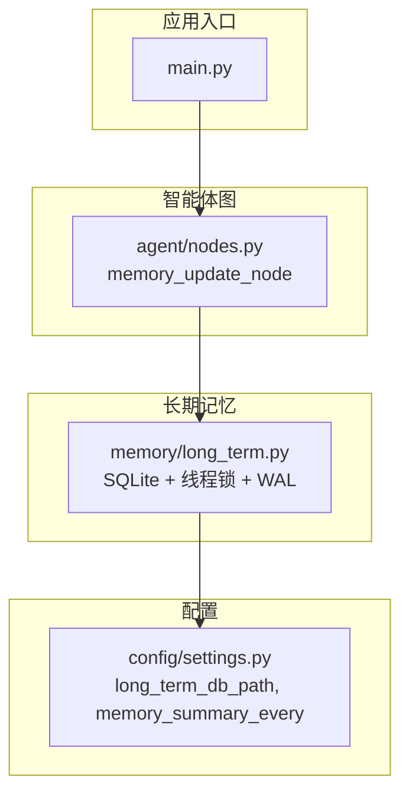
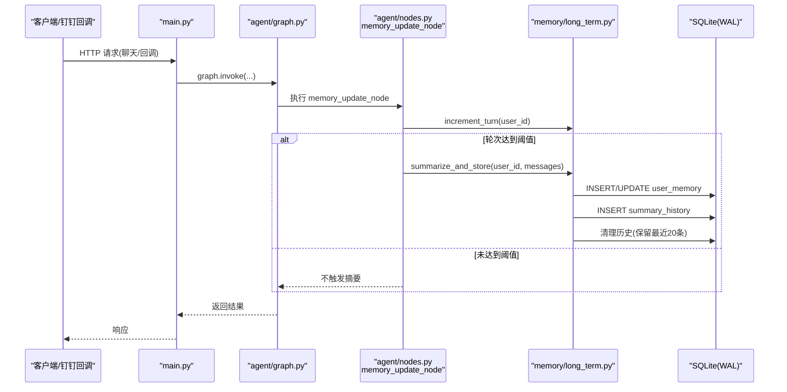
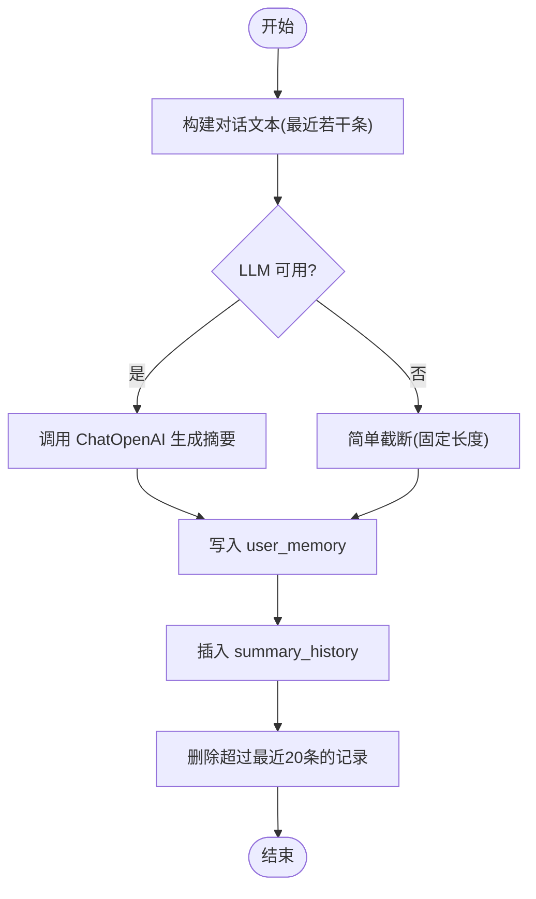
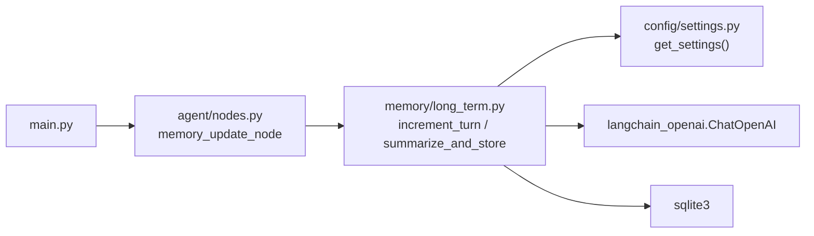

# 长期记忆管理

<cite>
**本文引用的文件**   
- [memory/long_term.py](file://memory/long_term.py)
- [agent/nodes.py](file://agent/nodes.py)
- [config/settings.py](file://config/settings.py)
- [main.py](file://main.py)
- [requirements.txt](file://requirements.txt)
</cite>

## 目录
1. [简介](#简介)
2. [项目结构](#项目结构)
3. [核心组件](#核心组件)
4. [架构总览](#架构总览)
5. [详细组件分析](#详细组件分析)
6. [依赖关系分析](#依赖关系分析)
7. [性能与并发](#性能与并发)
8. [故障排查指南](#故障排查指南)
9. [结论](#结论)
10. [附录：API 参考](#附录api-参考)

## 简介
本模块实现基于 SQLite 的长期记忆管理，用于跨会话持久化用户偏好、对话摘要及摘要历史。通过线程锁与 WAL 模式保证并发安全与读写性能；通过 LLM 驱动的摘要生成与简单截断降级策略保障可用性；通过轮次计数与阈值触发机制控制摘要频率。短期记忆由进程内 MemorySaver 提供，配合长期记忆形成完整的记忆体系。

## 项目结构
长期记忆相关代码集中在 memory 模块，并在 agent 节点中按轮次触发更新。配置项集中于 config.settings，数据库路径与摘要触发间隔等参数均可配置。

图表来源
- [main.py:106-176](file://main.py#L106-L176)
- [agent/nodes.py:145-163](file://agent/nodes.py#L145-L163)
- [memory/long_term.py:1-244](file://memory/long_term.py#L1-L244)
- [config/settings.py:44-48](file://config/settings.py#L44-L48)

章节来源
- [memory/long_term.py:1-244](file://memory/long_term.py#L1-L244)
- [agent/nodes.py:145-163](file://agent/nodes.py#L145-L163)
- [config/settings.py:44-48](file://config/settings.py#L44-L48)
- [main.py:106-176](file://main.py#L106-L176)

## 核心组件
- 持久化存储层：SQLite 数据库，包含 user_memory、user_prefs、summary_history 三张表。
- 并发控制：进程内 threading.Lock 串行化写操作，WAL 模式提升读并发。
- 摘要生成：优先使用 LLM（ChatOpenAI）生成摘要，失败时回退到简单截断。
- 轮次计数与触发：每 N 轮调用一次摘要生成，N 由配置项 memory_summary_every 决定。
- 偏好存储：键值对形式保存用户偏好，支持幂等写入与读取聚合。

章节来源
- [memory/long_term.py:44-72](file://memory/long_term.py#L44-L72)
- [memory/long_term.py:75-100](file://memory/long_term.py#L75-L100)
- [memory/long_term.py:102-125](file://memory/long_term.py#L102-L125)
- [memory/long_term.py:165-194](file://memory/long_term.py#L165-L194)
- [memory/long_term.py:203-244](file://memory/long_term.py#L203-L244)
- [agent/nodes.py:145-163](file://agent/nodes.py#L145-L163)
- [config/settings.py:44-48](file://config/settings.py#L44-L48)

## 架构总览
长期记忆在智能体图的“memory_update”节点中被周期性调用，结合轮次计数与阈值触发进行摘要生成与持久化。

图表来源
- [main.py:106-176](file://main.py#L106-L176)
- [agent/nodes.py:145-163](file://agent/nodes.py#L145-L163)
- [memory/long_term.py:75-100](file://memory/long_term.py#L75-L100)
- [memory/long_term.py:165-194](file://memory/long_term.py#L165-L194)
- [memory/long_term.py:203-244](file://memory/long_term.py#L203-L244)

## 详细组件分析

### 数据库表结构与用途
- user_memory
  - 字段：user_id(PK)、summary、updated_at、turn_count
  - 用途：维护每个用户的最新摘要、更新时间与对话轮次计数
- user_prefs
  - 字段：user_id+key(PK)、value
  - 用途：以键值对形式存储用户偏好（如姓名、角色、关注点等），支持幂等写入
- summary_history
  - 字段：id(auto PK)、user_id、summary、created_at
  - 索引：idx_history_user(user_id, created_at DESC)
  - 用途：记录摘要历史，按时间倒序查询，仅保留最近 20 条

章节来源
- [memory/long_term.py:44-72](file://memory/long_term.py#L44-L72)

### 用户偏好存储机制（CRUD 与一致性）
- 写入：save_pref 使用 ON CONFLICT 实现幂等更新，确保同一 user_id+key 只有一条记录
- 读取：get_prefs 将结果转为字典，便于上层快速访问
- 一致性：所有写操作在 _db_lock 保护下串行执行，避免并发写冲突；每次写后显式 commit

章节来源
- [memory/long_term.py:102-114](file://memory/long_term.py#L102-L114)
- [memory/long_term.py:116-125](file://memory/long_term.py#L116-L125)

### 对话摘要生成与存储策略
- 生成流程：
  - 拼接最近若干条消息为对话文本
  - 尝试调用 ChatOpenAI 生成摘要
  - 若失败则回退到简单截断（取前若干字符）
- 存储流程：
  - 写入 user_memory（覆盖更新）
  - 追加一条摘要到 summary_history
  - 删除超出最近 20 条的历史记录
- 降级策略：LLM 不可用时自动降级为截断，保证系统可用

图表来源
- [memory/long_term.py:203-244](file://memory/long_term.py#L203-L244)
- [memory/long_term.py:75-100](file://memory/long_term.py#L75-L100)

章节来源
- [memory/long_term.py:203-244](file://memory/long_term.py#L203-L244)
- [memory/long_term.py:75-100](file://memory/long_term.py#L75-L100)

### 会话轮次计数机制与触发条件
- 计数：increment_turn 每次调用自增 turn_count，并更新 updated_at
- 触发：当 turn_count % memory_summary_every == 0 时触发 summarize_and_store
- 配置：memory_summary_every 默认值为 6（可通过环境变量或 .env 覆盖）

章节来源
- [memory/long_term.py:165-194](file://memory/long_term.py#L165-L194)
- [agent/nodes.py:145-163](file://agent/nodes.py#L145-L163)
- [config/settings.py:44-48](file://config/settings.py#L44-L48)

### 并发访问控制（线程锁与 WAL）
- 线程锁：_db_lock 确保同一进程内的写操作串行化，避免 SQLite 并发写冲突
- WAL 模式：PRAGMA journal_mode=WAL 允许并发读，写操作仍串行但不阻塞读
- busy_timeout：设置等待超时，降低忙等待导致的竞争问题

章节来源
- [memory/long_term.py:19-41](file://memory/long_term.py#L19-L41)

## 依赖关系分析
- 模块依赖
  - agent/nodes.memory_update_node 依赖 memory.long_term.increment_turn 与 summarize_and_store
  - memory.long_term 依赖 config.settings.get_settings 获取数据库路径与 LLM 配置
  - main.py 通过 FastAPI 路由调用智能体图，间接触发长期记忆更新
- 外部依赖
  - langchain_openai.ChatOpenAI 用于 LLM 摘要生成
  - sqlite3 内置库用于持久化

图表来源
- [agent/nodes.py:145-163](file://agent/nodes.py#L145-L163)
- [memory/long_term.py:203-244](file://memory/long_term.py#L203-L244)
- [config/settings.py:89-92](file://config/settings.py#L89-L92)
- [main.py:106-176](file://main.py#L106-L176)

章节来源
- [agent/nodes.py:145-163](file://agent/nodes.py#L145-L163)
- [memory/long_term.py:203-244](file://memory/long_term.py#L203-L244)
- [config/settings.py:89-92](file://config/settings.py#L89-L92)
- [main.py:106-176](file://main.py#L106-L176)

## 性能与并发
- 读性能：WAL 模式提升并发读能力，适合高频读取用户偏好与摘要
- 写性能：单连接 + 线程锁串行化写，避免锁竞争与死锁
- 历史裁剪：每次写入后清理超出 20 条的历史，控制表规模
- 建议优化
  - 批量写入：若存在多键偏好更新，可合并为单次事务
  - 索引优化：当前已对 summary_history(user_id, created_at) 建立索引，利于排序查询
  - 连接池：在高并发场景考虑连接池或多进程隔离

[本节为通用指导，不直接分析具体文件]

## 故障排查指南
- LLM 不可用导致摘要失败
  - 现象：日志打印“LLM 摘要失败，使用简单截断”
  - 处理：检查 API Key、Base URL、网络连通性；确认模型可用
- 数据库锁定或写入失败
  - 现象：SQLite Busy 或锁错误
  - 处理：确认 _db_lock 生效；检查是否有外部工具占用数据库；增大 busy_timeout
- 摘要未触发
  - 现象：summary_history 无新增记录
  - 处理：检查 memory_summary_every 配置；确认 increment_turn 被调用；查看轮次计数是否达到阈值
- 偏好数据不一致
  - 现象：重复键值或覆盖异常
  - 处理：确认 save_pref 的 ON CONFLICT 逻辑；检查并发写入是否受锁保护

章节来源
- [memory/long_term.py:237-241](file://memory/long_term.py#L237-L241)
- [memory/long_term.py:19-41](file://memory/long_term.py#L19-L41)
- [agent/nodes.py:145-163](file://agent/nodes.py#L145-L163)

## 结论
长期记忆模块通过 SQLite 持久化、线程锁与 WAL 模式实现了高可用的跨会话记忆管理。LLM 驱动的摘要生成与简单截断降级保障了鲁棒性，轮次计数与阈值触发控制了摘要频率。整体设计简洁可靠，易于扩展与维护。

[本节为总结，不直接分析具体文件]

## 附录：API 参考

- save_summary(user_id: str, summary: str) -> None
  - 功能：保存/更新用户对话摘要到长期记忆，并追加到历史表，清理超出最近 20 条的历史
  - 参数：
    - user_id: 用户标识
    - summary: 摘要文本
  - 示例：见 [memory/long_term.py:75-100](file://memory/long_term.py#L75-L100)

- get_prefs(user_id: str) -> dict
  - 功能：获取用户所有偏好，返回键值对字典
  - 参数：
    - user_id: 用户标识
  - 示例：见 [memory/long_term.py:116-125](file://memory/long_term.py#L116-L125)

- summarize_and_store(user_id: str, messages: List[BaseMessage]) -> str
  - 功能：用 LLM 生成对话摘要并写入长期记忆；失败时回退到简单截断
  - 参数：
    - user_id: 用户标识
    - messages: 本轮对话的消息列表
  - 返回：生成的摘要文本
  - 示例：见 [memory/long_term.py:203-244](file://memory/long_term.py#L203-L244)

- increment_turn(user_id: str) -> int
  - 功能：增加对话轮次计数，返回当前轮次
  - 参数：
    - user_id: 用户标识
  - 返回：当前轮次数
  - 示例：见 [memory/long_term.py:165-194](file://memory/long_term.py#L165-L194)

- get_turn_count(user_id: str) -> int
  - 功能：获取当前对话轮次
  - 参数：
    - user_id: 用户标识
  - 返回：当前轮次数
  - 示例：见 [memory/long_term.py:186-194](file://memory/long_term.py#L186-L194)

- get_summary(user_id: str) -> str
  - 功能：获取用户的最新摘要
  - 参数：
    - user_id: 用户标识
  - 返回：摘要文本
  - 示例：见 [memory/long_term.py:127-136](file://memory/long_term.py#L127-L136)

- get_history(user_id: str, limit: int = 5) -> List[str]
  - 功能：获取最近的若干条摘要历史（按时间倒序）
  - 参数：
    - user_id: 用户标识
    - limit: 返回数量上限
  - 返回：摘要文本列表
  - 示例：见 [memory/long_term.py:138-148](file://memory/long_term.py#L138-L148)

- get_context(user_id: str) -> str
  - 功能：拼装长期记忆上下文字符串，供生成节点使用（偏好 + 摘要）
  - 参数：
    - user_id: 用户标识
  - 返回：上下文字符串
  - 示例：见 [memory/long_term.py:150-163](file://memory/long_term.py#L150-L163)

章节来源
- [memory/long_term.py:75-100](file://memory/long_term.py#L75-L100)
- [memory/long_term.py:116-125](file://memory/long_term.py#L116-L125)
- [memory/long_term.py:127-148](file://memory/long_term.py#L127-L148)
- [memory/long_term.py:150-163](file://memory/long_term.py#L150-L163)
- [memory/long_term.py:165-194](file://memory/long_term.py#L165-L194)
- [memory/long_term.py:203-244](file://memory/long_term.py#L203-L244)

## 数据迁移、备份与性能优化建议

- 数据迁移
  - 表结构变更：使用 CREATE TABLE IF NOT EXISTS 与 executescript 保证幂等初始化
  - 版本兼容：可在 _init_tables 中引入版本字段或迁移脚本，逐步升级
  - 校验：迁移后运行完整性检查（如 PRAGMA integrity_check）

- 备份策略
  - 冷备：停止服务后复制 data/memory.db 文件
  - 热备：启用 WAL 模式后，可在线拷贝主数据库与 -wal/-shm 文件（需确保一致性快照）
  - 定期任务：定时脚本打包备份并上传至对象存储

- 性能优化
  - 索引：已对 summary_history(user_id, created_at) 建索引，利于排序与分页
  - 批量写入：合并多次偏好更新为单次事务，减少锁竞争
  - 连接复用：保持单连接单例，避免频繁创建销毁连接
  - 监控：统计摘要触发率、历史表大小、写入耗时，必要时调整 memory_summary_every

[本节为通用指导，不直接分析具体文件]