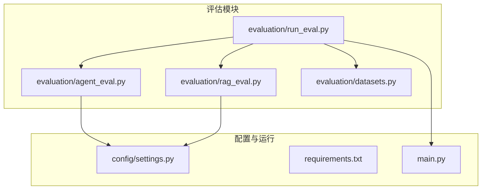
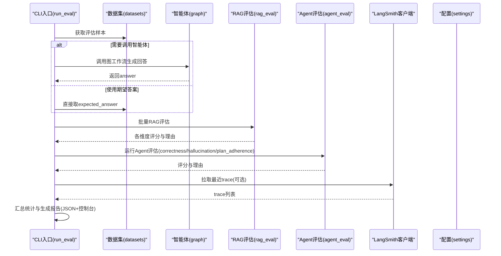
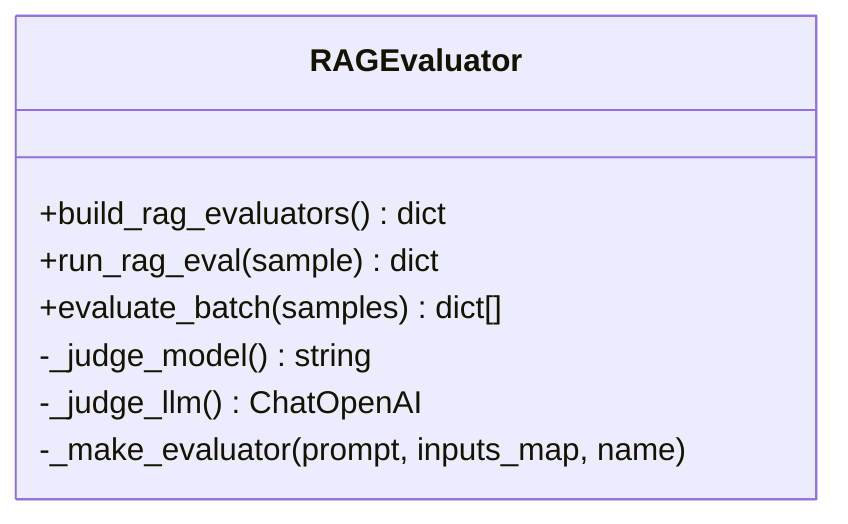
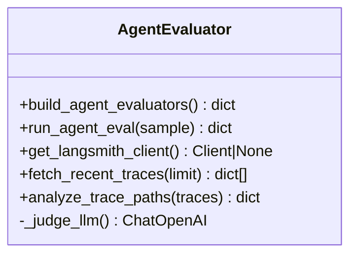
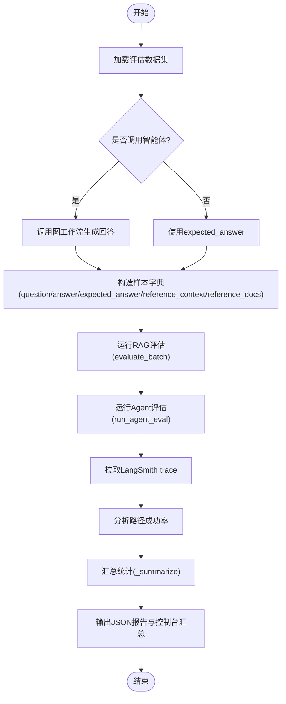
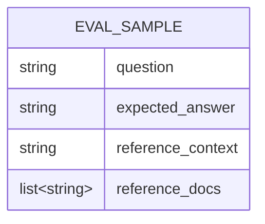
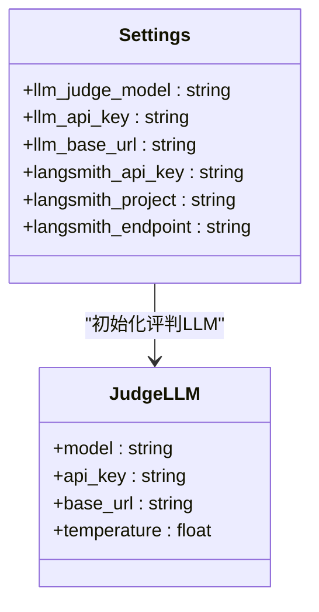
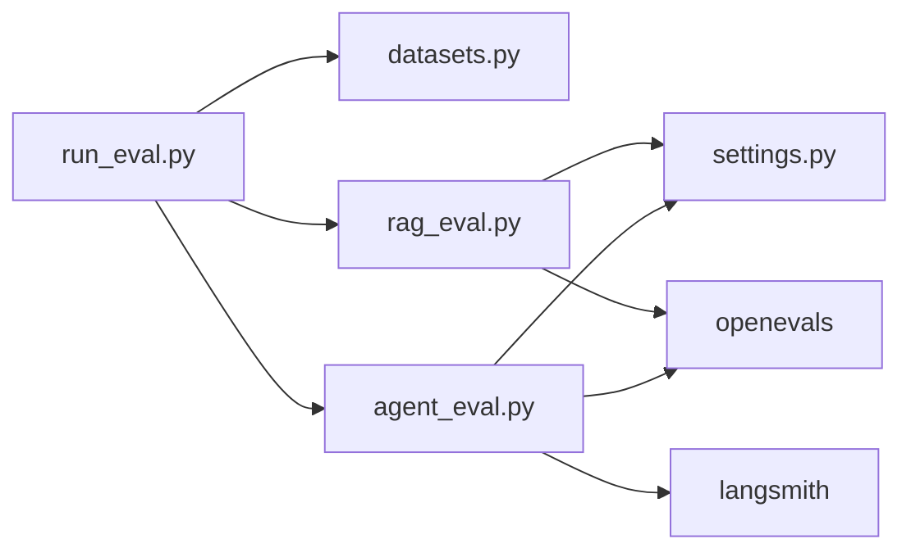

# Agent评估框架

<cite>
**本文引用的文件**   
- [evaluation/agent_eval.py](file://evaluation/agent_eval.py)
- [evaluation/rag_eval.py](file://evaluation/rag_eval.py)
- [evaluation/run_eval.py](file://evaluation/run_eval.py)
- [evaluation/datasets.py](file://evaluation/datasets.py)
- [config/settings.py](file://config/settings.py)
- [requirements.txt](file://requirements.txt)
- [main.py](file://main.py)
</cite>

## 目录
1. [简介](#简介)
2. [项目结构](#项目结构)
3. [核心组件](#核心组件)
4. [架构总览](#架构总览)
5. [详细组件分析](#详细组件分析)
6. [依赖关系分析](#依赖关系分析)
7. [性能考量](#性能考量)
8. [故障排查指南](#故障排查指南)
9. [结论](#结论)
10. [附录](#附录)

## 简介
本技术文档围绕Agent评估框架展开，重点解释OpenEvals评估器的设计与实现，涵盖三个核心评估维度：正确性（correctness）、幻觉检测（hallucination）与推理路径合理性（plan_adherence）。文档同时覆盖RAG质量评估（检索相关性、忠实度、帮助度、答案相关性），并详细说明LLM作为评判者的配置方法（模型选择、API密钥、温度参数等）、评估器构建过程、数据输入格式要求、结果分析方法与报告生成示例，以及常见问题排查与性能优化建议。

## 项目结构
评估相关代码集中在 evaluation 目录下，配合 config/settings.py 进行全局配置，run_eval.py 提供CLI入口，datasets.py 定义评估样本结构及样例数据。

图表来源
- [evaluation/agent_eval.py:1-139](file://evaluation/agent_eval.py#L1-L139)
- [evaluation/rag_eval.py:1-121](file://evaluation/rag_eval.py#L1-L121)
- [evaluation/run_eval.py:1-156](file://evaluation/run_eval.py#L1-L156)
- [evaluation/datasets.py:1-58](file://evaluation/datasets.py#L1-L58)
- [config/settings.py:1-93](file://config/settings.py#L1-L93)
- [requirements.txt:1-31](file://requirements.txt#L1-L31)
- [main.py:1-236](file://main.py#L1-L236)

章节来源
- [evaluation/agent_eval.py:1-139](file://evaluation/agent_eval.py#L1-L139)
- [evaluation/rag_eval.py:1-121](file://evaluation/rag_eval.py#L1-L121)
- [evaluation/run_eval.py:1-156](file://evaluation/run_eval.py#L1-L156)
- [evaluation/datasets.py:1-58](file://evaluation/datasets.py#L1-L58)
- [config/settings.py:1-93](file://config/settings.py#L1-L93)
- [requirements.txt:1-31](file://requirements.txt#L1-L31)
- [main.py:1-236](file://main.py#L1-L236)

## 核心组件
- OpenEvals LLM评判器：通过 create_llm_as_judge 将预置prompt模板与LLM实例绑定，形成可复用的评估器。
- RAG评估器集合：包含检索相关性、忠实度、帮助度、答案相关性四个维度。
- Agent评估器集合：包含正确性、幻觉检测、推理路径合理性三个维度。
- 评估运行入口：加载数据集、可选调用智能体获取回答、执行RAG与Agent评估、拉取LangSmith trace做路径合理性分析、输出JSON报告与控制台汇总。
- 配置管理：统一从环境变量或.env读取LLM、Embedding、向量库、记忆、钉钉、LangSmith等参数。

章节来源
- [evaluation/rag_eval.py:1-121](file://evaluation/rag_eval.py#L1-L121)
- [evaluation/agent_eval.py:1-139](file://evaluation/agent_eval.py#L1-L139)
- [evaluation/run_eval.py:1-156](file://evaluation/run_eval.py#L1-L156)
- [config/settings.py:1-93](file://config/settings.py#L1-L93)

## 架构总览
评估框架以 run_evaluation 为入口，串联数据集加载、智能体调用（可选）、RAG与Agent评估、LangSmith trace分析与报告生成。

图表来源
- [evaluation/run_eval.py:23-105](file://evaluation/run_eval.py#L23-L105)
- [evaluation/rag_eval.py:89-121](file://evaluation/rag_eval.py#L89-L121)
- [evaluation/agent_eval.py:57-70](file://evaluation/agent_eval.py#L57-L70)
- [evaluation/agent_eval.py:96-139](file://evaluation/agent_eval.py#L96-L139)
- [config/settings.py:16-62](file://config/settings.py#L16-L62)

## 详细组件分析

### RAG质量评估模块
- 评估维度：
  - 检索相关性（retrieval_relevance）：检索到的文档是否与问题相关
  - 忠实度（groundedness）：答案是否基于检索上下文（无幻觉）
  - 帮助度（helpfulness）：回答对用户是否有实际帮助
  - 答案相关性（answer_relevance）：回答是否切题
- 实现要点：
  - 使用 openevals.prompts 中的预置Prompt模板
  - 通过 create_llm_as_judge 绑定评判LLM与输入映射
  - 支持批量评估 evaluate_batch，逐条打印进度并聚合结果

图表来源
- [evaluation/rag_eval.py:24-86](file://evaluation/rag_eval.py#L24-L86)
- [evaluation/rag_eval.py:89-121](file://evaluation/rag_eval.py#L89-L121)

章节来源
- [evaluation/rag_eval.py:1-121](file://evaluation/rag_eval.py#L1-L121)

### Agent评估模块
- 评估维度：
  - 正确性（correctness）：回答是否与参考答案一致
  - 幻觉检测（hallucination）：回答是否包含编造内容
  - 推理路径合理性（plan_adherence）：智能体是否按预期步骤推进
- 实现要点：
  - 使用 openevals.prompts 中的 CORRECTNESS_PROMPT、HALLUCINATION_PROMPT、PLAN_ADHERENCE_PROMPT
  - 通过 create_llm_as_judge 创建评估器，输入映射分别对应 question/answer/reference_answer 等字段
  - 支持对单个样本运行全部评估器，异常时返回错误标记

图表来源
- [evaluation/agent_eval.py:18-54](file://evaluation/agent_eval.py#L18-L54)
- [evaluation/agent_eval.py:57-70](file://evaluation/agent_eval.py#L57-L70)
- [evaluation/agent_eval.py:73-139](file://evaluation/agent_eval.py#L73-L139)

章节来源
- [evaluation/agent_eval.py:1-139](file://evaluation/agent_eval.py#L1-L139)

### 评估运行入口（CLI）
- 功能流程：
  - 加载评估数据集
  - 可选调用智能体获取回答（否则使用 expected_answer）
  - 运行RAG质量评估与Agent评估
  - 拉取LangSmith trace进行路径合理性分析
  - 输出JSON报告与控制台汇总表格
- 关键函数：
  - run_evaluation：主流程编排
  - _summarize：计算各维度平均分
  - _print_summary：控制台打印汇总

图表来源
- [evaluation/run_eval.py:23-105](file://evaluation/run_eval.py#L23-L105)
- [evaluation/run_eval.py:108-143](file://evaluation/run_eval.py#L108-L143)

章节来源
- [evaluation/run_eval.py:1-156](file://evaluation/run_eval.py#L1-L156)

### 评估数据集与输入格式
- 数据结构 EvalSample：
  - question：用户问题
  - expected_answer：期望答案/参考
  - reference_context：参考资料文本
  - reference_docs：检索到的文档片段列表
- 数据加载：get_dataset 返回内置的RAG_EVAL_DATASET样例
- 输入要求：
  - RAG评估器需要 question、answer、reference_context、reference_docs
  - Agent评估器需要 question、answer、expected_answer、reference_context

图表来源
- [evaluation/datasets.py:11-17](file://evaluation/datasets.py#L11-L17)
- [evaluation/run_eval.py:56-72](file://evaluation/run_eval.py#L56-L72)

章节来源
- [evaluation/datasets.py:1-58](file://evaluation/datasets.py#L1-L58)
- [evaluation/run_eval.py:56-72](file://evaluation/run_eval.py#L56-L72)

### LLM作为评判者的配置方法
- 模型选择：
  - 评判模型标识 llm_judge_model（默认 qwen-plus）
- API密钥设置：
  - llm_api_key（千问OpenAI兼容接口密钥）
- Base URL：
  - llm_base_url（DashScope兼容模式）
- 温度参数：
  - 评估器固定 temperature=0.0，保证评分稳定性
- LangSmith集成：
  - langsmith_api_key、langsmith_project、langsmith_endpoint

图表来源
- [config/settings.py:16-62](file://config/settings.py#L16-L62)
- [evaluation/agent_eval.py:18-30](file://evaluation/agent_eval.py#L18-L30)
- [evaluation/rag_eval.py:32-44](file://evaluation/rag_eval.py#L32-L44)

章节来源
- [config/settings.py:16-62](file://config/settings.py#L16-L62)
- [evaluation/agent_eval.py:18-30](file://evaluation/agent_eval.py#L18-L30)
- [evaluation/rag_eval.py:32-44](file://evaluation/rag_eval.py#L32-L44)

## 依赖关系分析
- 外部依赖：
  - openevals>=0.1.3：提供create_llm_as_judge与预置Prompt模板
  - langsmith>=0.6.3：用于trace拉取与数据集管理
  - langchain-openai>=1.1.7：ChatOpenAI接入千问兼容接口
- 内部依赖：
  - evaluation.run_eval 依赖 datasets、rag_eval、agent_eval
  - agent_eval 依赖 settings 与 openevals
  - rag_eval 依赖 settings 与 openevals

图表来源
- [requirements.txt:28-31](file://requirements.txt#L28-L31)
- [evaluation/run_eval.py:23-31](file://evaluation/run_eval.py#L23-L31)
- [evaluation/rag_eval.py:15-21](file://evaluation/rag_eval.py#L15-L21)
- [evaluation/agent_eval.py:14-15](file://evaluation/agent_eval.py#L14-L15)

章节来源
- [requirements.txt:28-31](file://requirements.txt#L28-L31)
- [evaluation/run_eval.py:23-31](file://evaluation/run_eval.py#L23-L31)
- [evaluation/rag_eval.py:15-21](file://evaluation/rag_eval.py#L15-L21)
- [evaluation/agent_eval.py:14-15](file://evaluation/agent_eval.py#L14-L15)

## 性能考量
- 评估器温度固定为0.0，确保评分一致性，避免随机性影响统计。
- 批量评估 evaluate_batch 逐条处理，便于监控与调试；如需更高吞吐，可在上层增加并发控制（注意速率限制与配额）。
- LangSmith trace拉取采用 limit 限制，避免大量网络请求；可按需调整 limit 值。
- 异常处理：每个评估器在失败时返回 error=True 与 reasoning，便于快速定位问题。

[本节为通用指导，不直接分析具体文件]

## 故障排查指南
- LLM配置缺失或无效：
  - 检查 .env 或环境变量中 llm_api_key、llm_base_url、llm_judge_model 是否正确
  - 确认网络可达性与API配额
- LangSmith未启用：
  - 若未配置 langsmith_api_key，客户端初始化会跳过并提示
  - 拉取trace失败会记录错误日志并返回空列表
- 评估失败：
  - 查看评估结果中的 error 与 reasoning 字段，定位具体原因
  - 检查输入字段是否符合要求（question、answer、expected_answer、reference_context、reference_docs）
- 智能体调用失败：
  - 检查 graph.invoke 的参数与配置，确认线程ID与会话ID有效
  - 查看 main.py 中的Web服务与回调逻辑是否正常

章节来源
- [evaluation/agent_eval.py:73-93](file://evaluation/agent_eval.py#L73-L93)
- [evaluation/agent_eval.py:96-123](file://evaluation/agent_eval.py#L96-L123)
- [evaluation/rag_eval.py:108-110](file://evaluation/rag_eval.py#L108-L110)
- [evaluation/run_eval.py:53-56](file://evaluation/run_eval.py#L53-L56)
- [main.py:151-176](file://main.py#L151-L176)

## 结论
该Agent评估框架基于OpenEvals与LangSmith，提供了系统化的RAG与Agent质量评估能力。通过明确的评估维度、稳定的LLM评判配置、清晰的输入格式与完善的异常处理，能够高效产出可分析的评估报告。建议在大规模评估场景下结合并发策略与资源配额管理，进一步提升吞吐与稳定性。

[本节为总结性内容，不直接分析具体文件]

## 附录

### 评估指标定义与判断逻辑
- 正确性（correctness）：比较回答与参考答案的一致性，由CORRECTNESS_PROMPT驱动LLM评判
- 幻觉检测（hallucination）：基于reference_context判断回答是否存在编造内容，由HALLUCINATION_PROMPT驱动
- 推理路径合理性（plan_adherence）：依据question与answer判断智能体是否按预期步骤推进，由PLAN_ADHERENCE_PROMPT驱动
- RAG维度：
  - 检索相关性：retrieved_contexts与question的相关程度
  - 忠实度：answer是否严格基于context
  - 帮助度：answer对用户问题的实际帮助
  - 答案相关性：answer与question的切题程度

章节来源
- [evaluation/agent_eval.py:1-10](file://evaluation/agent_eval.py#L1-L10)
- [evaluation/rag_eval.py:1-11](file://evaluation/rag_eval.py#L1-L11)

### 报告生成示例
- JSON报告结构：
  - timestamp：评估时间戳
  - sample_count：样本数量
  - rag_evaluation：每个样本的RAG评估结果
  - path_analysis：LangSmith trace路径分析统计
  - summary：各维度平均分汇总
- 控制台输出：
  - 样本数、时间、路径分析统计、各维度平均分

章节来源
- [evaluation/run_eval.py:91-105](file://evaluation/run_eval.py#L91-L105)
- [evaluation/run_eval.py:123-143](file://evaluation/run_eval.py#L123-L143)

### 常见问题与解决方案
- 未配置LANGSMITH_API_KEY：
  - 客户端初始化失败，跳过LangSmith集成，不影响基础评估
- 评估器返回error=True：
  - 检查输入字段完整性与有效性
  - 查看reasoning字段定位具体错误原因
- 智能体调用失败：
  - 检查graph编译与invoke参数
  - 确认会话ID与线程ID唯一性

章节来源
- [evaluation/agent_eval.py:73-93](file://evaluation/agent_eval.py#L73-L93)
- [evaluation/rag_eval.py:108-110](file://evaluation/rag_eval.py#L108-L110)
- [evaluation/run_eval.py:53-56](file://evaluation/run_eval.py#L53-L56)