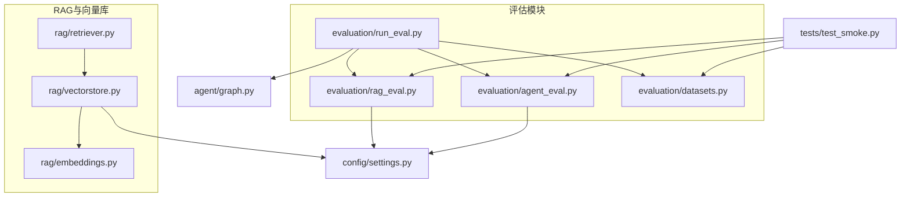
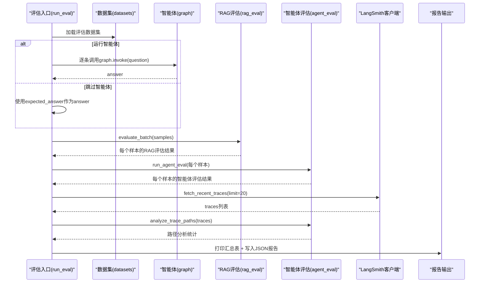
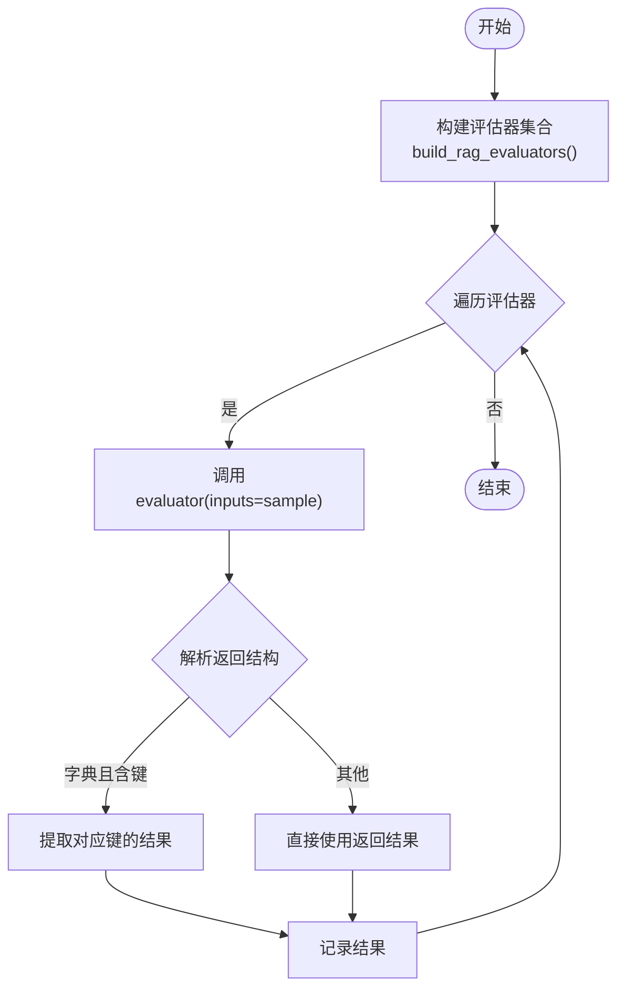
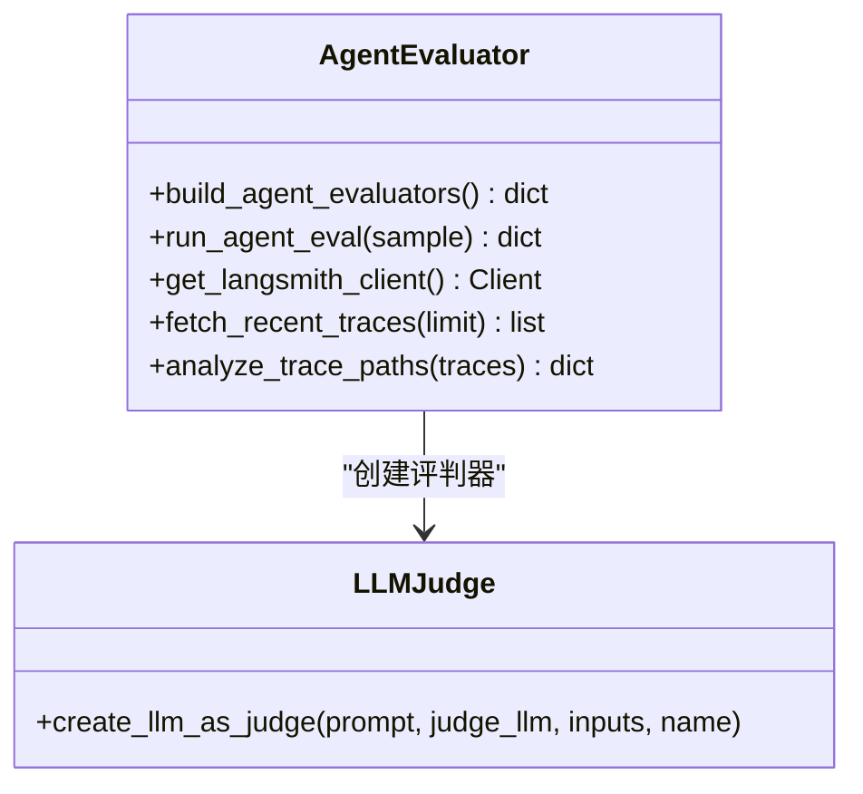
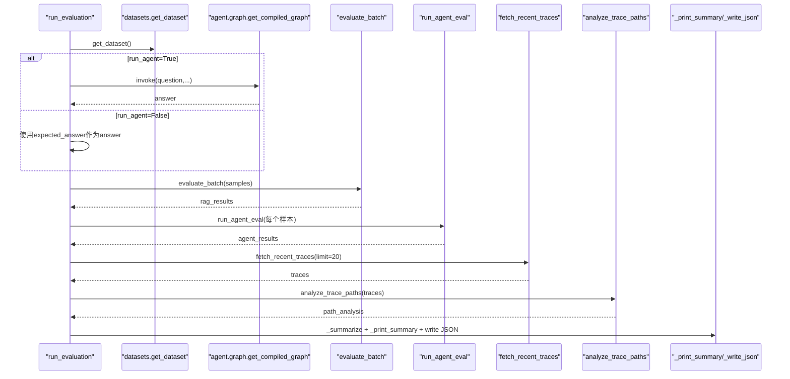
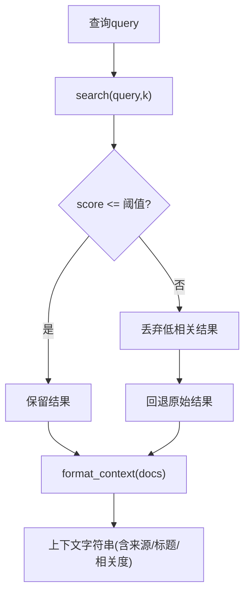
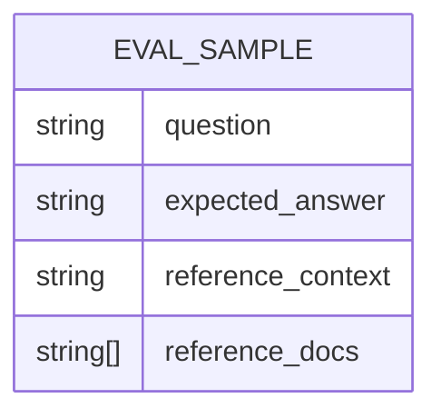
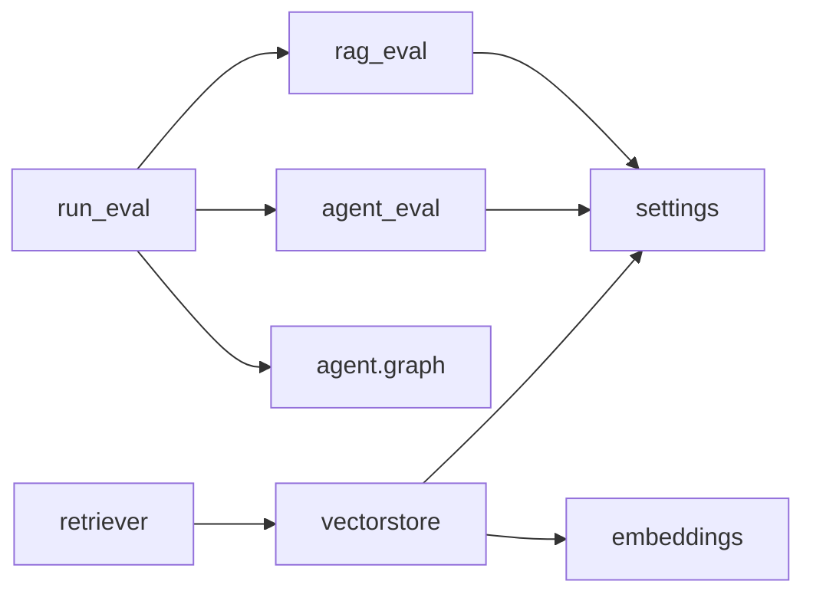

# RAG系统评估

<cite>
**本文引用的文件**   
- [evaluation/rag_eval.py](file://evaluation/rag_eval.py)
- [evaluation/agent_eval.py](file://evaluation/agent_eval.py)
- [evaluation/run_eval.py](file://evaluation/run_eval.py)
- [evaluation/datasets.py](file://evaluation/datasets.py)
- [rag/retriever.py](file://rag/retriever.py)
- [rag/vectorstore.py](file://rag/vectorstore.py)
- [rag/embeddings.py](file://rag/embeddings.py)
- [config/settings.py](file://config/settings.py)
- [agent/graph.py](file://agent/graph.py)
- [tests/test_smoke.py](file://tests/test_smoke.py)
</cite>

## 目录
1. [简介](#简介)
2. [项目结构](#项目结构)
3. [核心组件](#核心组件)
4. [架构总览](#架构总览)
5. [详细组件分析](#详细组件分析)
6. [依赖关系分析](#依赖关系分析)
7. [性能考量](#性能考量)
8. [故障排查指南](#故障排查指南)
9. [结论](#结论)
10. [附录](#附录)

## 简介
本技术文档围绕RAG系统评估模块，系统化阐述检索相关性、答案忠实度（groundedness）、帮助度与答案相关性的评估方法与实现原理；说明向量数据库检索效果的评估指标（语义相似度匹配、上下文相关性、信息完整性检查）；文档化测试数据集构建方法（问题-答案对准备与参考上下文标注）；解释评估流程执行步骤与结果分析方法；并提供不同检索策略的性能对比与调优建议，以及评估结果的可视化展示与报告生成工具使用方法。

## 项目结构
评估子系统位于 evaluation 目录，包含：
- rag_eval.py：RAG质量评估器构建与批量评测
- agent_eval.py：智能体评估器构建、LangSmith trace拉取与路径合理性分析
- run_eval.py：评估运行入口CLI，串联数据加载、智能体调用、RAG与智能体评估、trace分析与报告输出
- datasets.py：评估数据集定义与获取

RAG检索与向量库位于 rag 目录：
- retriever.py：语义检索与上下文格式化
- vectorstore.py：Chroma向量库封装（入库、检索、过滤）
- embeddings.py：本地HuggingFace Embedding管理

配置与Agent：
- config/settings.py：全局配置（LLM、Embedding、向量库、LangSmith等）
- agent/graph.py：LangGraph状态图与工作流编排

冒烟测试：
- tests/test_smoke.py：基础导入与功能验证

图表来源 
- [evaluation/run_eval.py:1-156](file://evaluation/run_eval.py#L1-L156)
- [evaluation/rag_eval.py:1-121](file://evaluation/rag_eval.py#L1-L121)
- [evaluation/agent_eval.py:1-139](file://evaluation/agent_eval.py#L1-L139)
- [evaluation/datasets.py:1-58](file://evaluation/datasets.py#L1-L58)
- [rag/retriever.py:1-38](file://rag/retriever.py#L1-L38)
- [rag/vectorstore.py:1-75](file://rag/vectorstore.py#L1-L75)
- [rag/embeddings.py:1-41](file://rag/embeddings.py#L1-L41)
- [config/settings.py:1-93](file://config/settings.py#L1-L93)
- [agent/graph.py:1-106](file://agent/graph.py#L1-L106)
- [tests/test_smoke.py:1-143](file://tests/test_smoke.py#L1-L143)

章节来源
- [evaluation/run_eval.py:1-156](file://evaluation/run_eval.py#L1-L156)
- [evaluation/rag_eval.py:1-121](file://evaluation/rag_eval.py#L1-L121)
- [evaluation/agent_eval.py:1-139](file://evaluation/agent_eval.py#L1-L139)
- [evaluation/datasets.py:1-58](file://evaluation/datasets.py#L1-L58)
- [rag/retriever.py:1-38](file://rag/retriever.py#L1-L38)
- [rag/vectorstore.py:1-75](file://rag/vectorstore.py#L1-L75)
- [rag/embeddings.py:1-41](file://rag/embeddings.py#L1-L41)
- [config/settings.py:1-93](file://config/settings.py#L1-L93)
- [agent/graph.py:1-106](file://agent/graph.py#L1-L106)
- [tests/test_smoke.py:1-143](file://tests/test_smoke.py#L1-L143)

## 核心组件
- RAG评估器（retrieval_relevance、groundedness、helpfulness、answer_relevance）：基于OpenEvals的LLM-as-judge与预置Prompt，对检索相关性与生成质量进行自动化评分。
- 智能体评估器（correctness、hallucination、plan_adherence）：评估回答正确性、幻觉检测与推理路径合理性。
- 评估运行器（run_evaluation）：串联数据集加载、智能体调用（可选）、RAG与智能体评估、LangSmith trace拉取与路径分析、汇总与报告输出。
- 检索器与向量库：语义检索返回(top-k, score)，支持分数阈值过滤与上下文格式化。
- 配置中心：集中管理LLM、Embedding、向量库、LangSmith等参数。

章节来源
- [evaluation/rag_eval.py:1-121](file://evaluation/rag_eval.py#L1-L121)
- [evaluation/agent_eval.py:1-139](file://evaluation/agent_eval.py#L1-L139)
- [evaluation/run_eval.py:1-156](file://evaluation/run_eval.py#L1-L156)
- [rag/retriever.py:1-38](file://rag/retriever.py#L1-L38)
- [rag/vectorstore.py:1-75](file://rag/vectorstore.py#L1-L75)
- [config/settings.py:1-93](file://config/settings.py#L1-L93)

## 架构总览
评估流水线整体流程如下：
- 从datasets加载样本（question、expected_answer、reference_context、reference_docs）
- 可选地通过agent/graph调用智能体生成answer
- 使用rag_eval对每个样本计算RAG维度评分
- 使用agent_eval对每个样本计算智能体维度评分
- 拉取LangSmith trace并分析路径成功率
- 汇总各维度平均分，输出控制台表格与JSON报告

图表来源 
- [evaluation/run_eval.py:23-105](file://evaluation/run_eval.py#L23-L105)
- [evaluation/rag_eval.py:89-121](file://evaluation/rag_eval.py#L89-L121)
- [evaluation/agent_eval.py:96-139](file://evaluation/agent_eval.py#L96-L139)
- [agent/graph.py:76-106](file://agent/graph.py#L76-L106)

章节来源
- [evaluation/run_eval.py:23-105](file://evaluation/run_eval.py#L23-L105)
- [evaluation/rag_eval.py:89-121](file://evaluation/rag_eval.py#L89-L121)
- [evaluation/agent_eval.py:96-139](file://evaluation/agent_eval.py#L96-L139)
- [agent/graph.py:76-106](file://agent/graph.py#L76-L106)

## 详细组件分析

### RAG评估器（retrieval_relevance、groundedness、helpfulness、answer_relevance）
- 构建方式：通过create_llm_as_judge与OpenEvals预置Prompt，将样本字段映射到评估器输入。
- 评估维度：
  - retrieval_relevance：检索到的文档是否与问题相关
  - groundedness：答案是否基于检索到的上下文（无幻觉）
  - helpfulness：回答是否对用户有帮助
  - answer_relevance：回答是否切题
- 异常处理：单个评估器失败时记录error标记与reasoning，避免中断批处理。

图表来源 
- [evaluation/rag_eval.py:47-86](file://evaluation/rag_eval.py#L47-L86)
- [evaluation/rag_eval.py:89-110](file://evaluation/rag_eval.py#L89-L110)

章节来源
- [evaluation/rag_eval.py:1-121](file://evaluation/rag_eval.py#L1-L121)

### 智能体评估器（correctness、hallucination、plan_adherence）
- correctness：比较answer与expected_answer的一致性
- hallucination：判断answer是否包含编造内容（结合reference_context）
- plan_adherence：评估智能体是否按预期步骤推进（可结合LangSmith trace）
- LangSmith集成：当未配置API Key时跳过；拉取最近trace并统计成功率

图表来源 
- [evaluation/agent_eval.py:18-54](file://evaluation/agent_eval.py#L18-L54)
- [evaluation/agent_eval.py:73-139](file://evaluation/agent_eval.py#L73-L139)

章节来源
- [evaluation/agent_eval.py:1-139](file://evaluation/agent_eval.py#L1-L139)

### 评估运行器（run_evaluation）
- 数据加载：从datasets.get_dataset获取样本
- 智能体调用：可选，若启用则通过agent.graph.get_compiled_graph().invoke生成answer
- 评估执行：先RAG评估，再智能体评估
- Trace分析：拉取LangSmith trace并计算成功率
- 汇总与输出：计算各维度平均分，打印控制台表格，保存JSON报告

图表来源 
- [evaluation/run_eval.py:23-105](file://evaluation/run_eval.py#L23-L105)
- [evaluation/run_eval.py:108-143](file://evaluation/run_eval.py#L108-L143)

章节来源
- [evaluation/run_eval.py:1-156](file://evaluation/run_eval.py#L1-L156)

### 检索器与向量库（语义相似度匹配、上下文相关性、信息完整性检查）
- retriever.retrieve：调用vectorstore.search返回(top-k, score)
- retriever.format_context：为每个片段添加来源、标题与相关度标记，便于人工或自动校验
- vectorstore.search：相似度搜索后按阈值过滤低相关结果，保证至少返回原始结果
- embeddings：本地BGE中文模型，支持离线缓存与镜像加速

图表来源 
- [rag/retriever.py:13-38](file://rag/retriever.py#L13-L38)
- [rag/vectorstore.py:48-68](file://rag/vectorstore.py#L48-L68)
- [rag/embeddings.py:21-41](file://rag/embeddings.py#L21-L41)

章节来源
- [rag/retriever.py:1-38](file://rag/retriever.py#L1-L38)
- [rag/vectorstore.py:1-75](file://rag/vectorstore.py#L1-L75)
- [rag/embeddings.py:1-41](file://rag/embeddings.py#L1-L41)

### 评估数据集构建（问题-答案对与参考上下文标注）
- EvalSample类型：question、expected_answer、reference_context、reference_docs
- 数据集示例：覆盖产品功能、记忆存储、RAG评估维度、工作流框架、评估工具等主题
- 用途：驱动RAG与智能体评估器，确保评估一致性与可复现性

图表来源 
- [evaluation/datasets.py:11-17](file://evaluation/datasets.py#L11-L17)
- [evaluation/datasets.py:21-52](file://evaluation/datasets.py#L21-L52)

章节来源
- [evaluation/datasets.py:1-58](file://evaluation/datasets.py#L1-L58)

## 依赖关系分析
- 评估模块依赖OpenEvals与LangChain OpenAI Chat接口进行LLM-as-judge
- 评估运行器依赖agent.graph进行智能体调用（可选）
- 检索器依赖vectorstore与embeddings，vectorstore依赖Chroma与settings
- 配置中心提供统一参数访问（LLM、Embedding、向量库、LangSmith）

图表来源 
- [evaluation/rag_eval.py:24-44](file://evaluation/rag_eval.py#L24-L44)
- [evaluation/agent_eval.py:18-30](file://evaluation/agent_eval.py#L18-L30)
- [evaluation/run_eval.py:23-73](file://evaluation/run_eval.py#L23-L73)
- [rag/retriever.py:10-15](file://rag/retriever.py#L10-L15)
- [rag/vectorstore.py:14-25](file://rag/vectorstore.py#L14-L25)
- [rag/embeddings.py:21-41](file://rag/embeddings.py#L21-L41)
- [config/settings.py:16-62](file://config/settings.py#L16-L62)

章节来源
- [evaluation/rag_eval.py:24-44](file://evaluation/rag_eval.py#L24-L44)
- [evaluation/agent_eval.py:18-30](file://evaluation/agent_eval.py#L18-L30)
- [evaluation/run_eval.py:23-73](file://evaluation/run_eval.py#L23-L73)
- [rag/retriever.py:10-15](file://rag/retriever.py#L10-L15)
- [rag/vectorstore.py:14-25](file://rag/vectorstore.py#L14-L25)
- [rag/embeddings.py:21-41](file://rag/embeddings.py#L21-L41)
- [config/settings.py:16-62](file://config/settings.py#L16-L62)

## 性能考量
- 向量检索阈值过滤：通过settings.rag_score_filter控制低相关结果丢弃，避免噪声影响评估与生成质量
- top-k选择：settings.rag_top_k影响召回范围，需权衡召回率与延迟
- Embedding本地缓存：首次下载权重后离线可用，减少网络开销
- 评估批处理：逐样本串行调用LLM-as-judge，可通过并行化或异步优化提升吞吐
- LangSmith trace拉取：limit限制数量，避免过多请求导致超时

[本节为通用指导，不直接分析具体文件]

## 故障排查指南
- LLM配置缺失：若llm_judge_model或api_key未配置，评估器可能失败；检查settings与.env
- LangSmith未配置：未设置LANGSMITH_API_KEY时跳过trace拉取；确认环境变量与endpoint
- 向量库持久化：Chroma需显式persist或依赖新版本自动持久化；检查data/chroma目录权限
- 评估异常捕获：单个评估器失败会记录error与reasoning，不影响批处理；查看results中的error字段定位问题
- 冒烟测试：运行tests/test_smoke.py验证导入与基本功能是否正常

章节来源
- [evaluation/rag_eval.py:108-110](file://evaluation/rag_eval.py#L108-L110)
- [evaluation/agent_eval.py:73-93](file://evaluation/agent_eval.py#L73-L93)
- [rag/vectorstore.py:37-45](file://rag/vectorstore.py#L37-L45)
- [tests/test_smoke.py:74-81](file://tests/test_smoke.py#L74-L81)

## 结论
本评估体系以OpenEvals为核心，结合LangSmith与本地向量库，形成从检索到生成的全链路质量评估。通过结构化数据集与多维度评分，能够量化检索相关性、答案忠实度、帮助度与答案相关性，并辅以智能体正确性、幻觉检测与路径合理性分析。配合阈值过滤与top-k调优，可在召回率与准确率之间取得平衡。建议持续扩展数据集规模与多样性，结合可视化报告进行迭代优化。

[本节为总结性内容，不直接分析具体文件]

## 附录

### 评估指标计算方法与实现原理
- 检索相关性（retrieval_relevance）：基于OpenEvals预置Prompt，由LLM-as-judge判断检索文档与问题的相关性
- 答案忠实度（groundedness）：评估答案是否严格基于reference_context，避免幻觉
- 帮助度（helpfulness）：评估答案对用户需求的满足程度
- 答案相关性（answer_relevance）：评估答案是否切题
- 正确性（correctness）：比较answer与expected_answer一致性
- 幻觉检测（hallucination）：结合reference_context判断是否存在编造内容
- 推理路径合理性（plan_adherence）：结合LangSmith trace分析节点执行情况与成功率

章节来源
- [evaluation/rag_eval.py:63-86](file://evaluation/rag_eval.py#L63-L86)
- [evaluation/agent_eval.py:33-54](file://evaluation/agent_eval.py#L33-L54)
- [evaluation/agent_eval.py:126-139](file://evaluation/agent_eval.py#L126-L139)

### 向量数据库检索效果评估指标
- 语义相似度匹配：使用Chroma similarity_search_with_score返回距离分数，越小越相关
- 上下文相关性：通过retriever.format_context为片段添加相关度标记，便于人工或自动校验
- 信息完整性检查：结合reference_docs与reference_context，评估答案是否覆盖关键信息

章节来源
- [rag/vectorstore.py:48-68](file://rag/vectorstore.py#L48-L68)
- [rag/retriever.py:18-31](file://rag/retriever.py#L18-L31)

### 测试数据集构建方法
- 数据结构：EvalSample包含question、expected_answer、reference_context、reference_docs
- 构建要点：
  - 问题应覆盖核心功能与常见场景
  - 期望答案需准确且简洁
  - reference_context应与知识文档对应，reference_docs为检索片段摘要
- 扩展建议：增加多轮对话、跨文档推理、反事实问题等复杂场景

章节来源
- [evaluation/datasets.py:11-17](file://evaluation/datasets.py#L11-L17)
- [evaluation/datasets.py:21-52](file://evaluation/datasets.py#L21-L52)

### 评估流程执行步骤与结果分析方法
- 执行步骤：
  1) 加载数据集
  2) 可选调用智能体生成answer
  3) 运行RAG评估器
  4) 运行智能体评估器
  5) 拉取LangSmith trace并分析路径
  6) 汇总平均分并输出报告
- 结果分析：
  - 关注各维度平均分与方差
  - 检查error标记与reasoning定位失败原因
  - 对比不同top-k与阈值下的表现差异

章节来源
- [evaluation/run_eval.py:23-105](file://evaluation/run_eval.py#L23-L105)
- [evaluation/run_eval.py:108-143](file://evaluation/run_eval.py#L108-L143)

### 不同检索策略的性能对比与调优建议
- top-k调优：增大k提高召回率但可能引入噪声；减小k提升精确率但可能遗漏相关信息
- 阈值过滤：调整rag_score_filter平衡召回与质量；过低可能导致空结果回退
- 嵌入模型：切换更强大的中文Embedding模型以提升语义匹配精度
- 混合检索：结合关键词检索与向量检索，提升鲁棒性

[本节为通用指导，不直接分析具体文件]

### 评估结果可视化与报告生成工具使用方法
- 控制台汇总：_print_summary输出样本数、时间、路径分析统计与各维度平均分
- JSON报告：通过--output参数保存完整评估结果，包含每个样本的评估详情与汇总统计
- 可视化建议：将JSON报告导入Excel或BI工具，绘制雷达图、柱状图与趋势图

章节来源
- [evaluation/run_eval.py:123-143](file://evaluation/run_eval.py#L123-L143)
- [evaluation/run_eval.py:146-156](file://evaluation/run_eval.py#L146-L156)