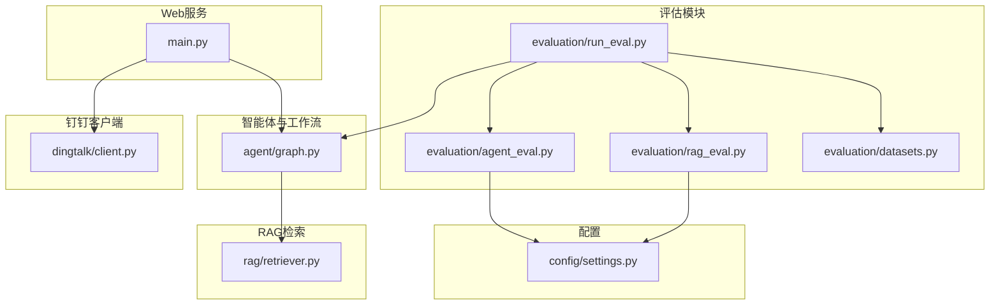
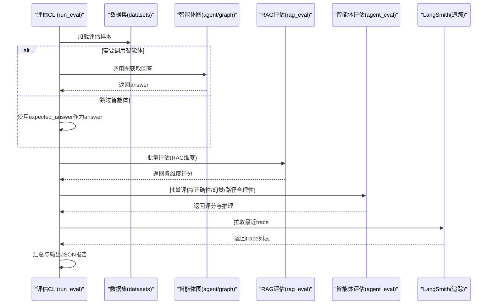
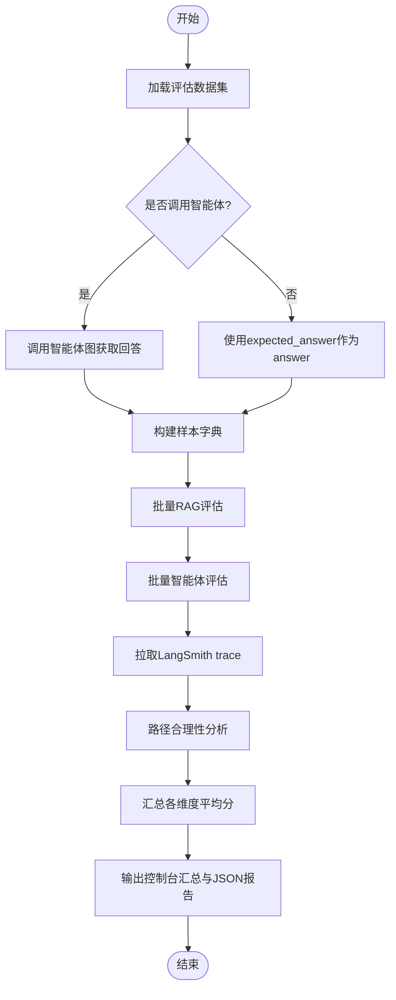
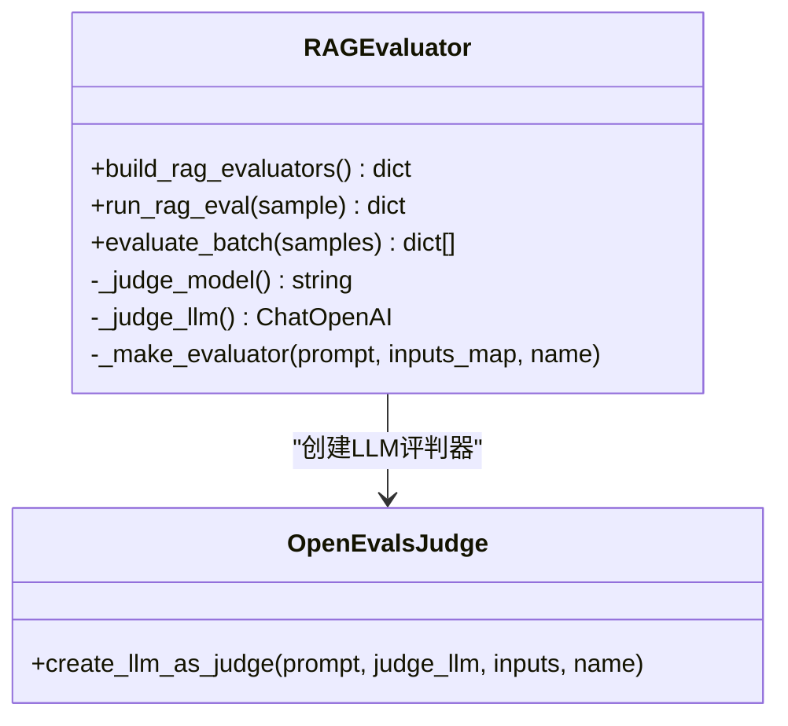
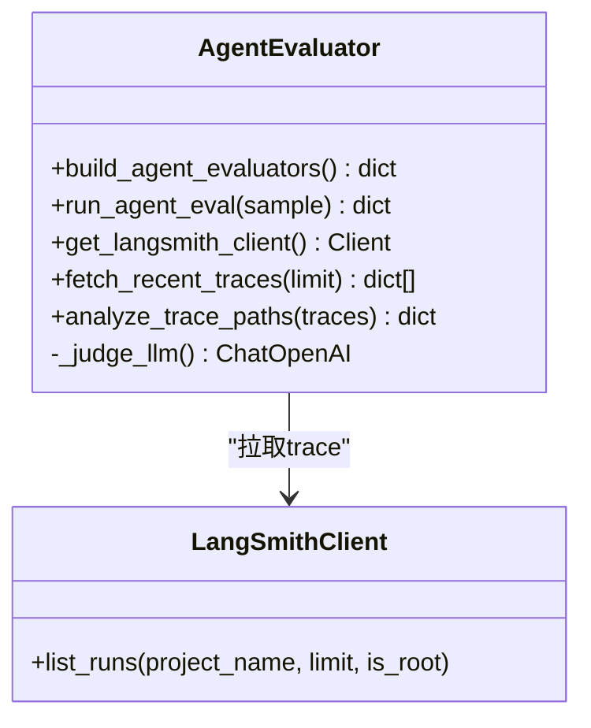
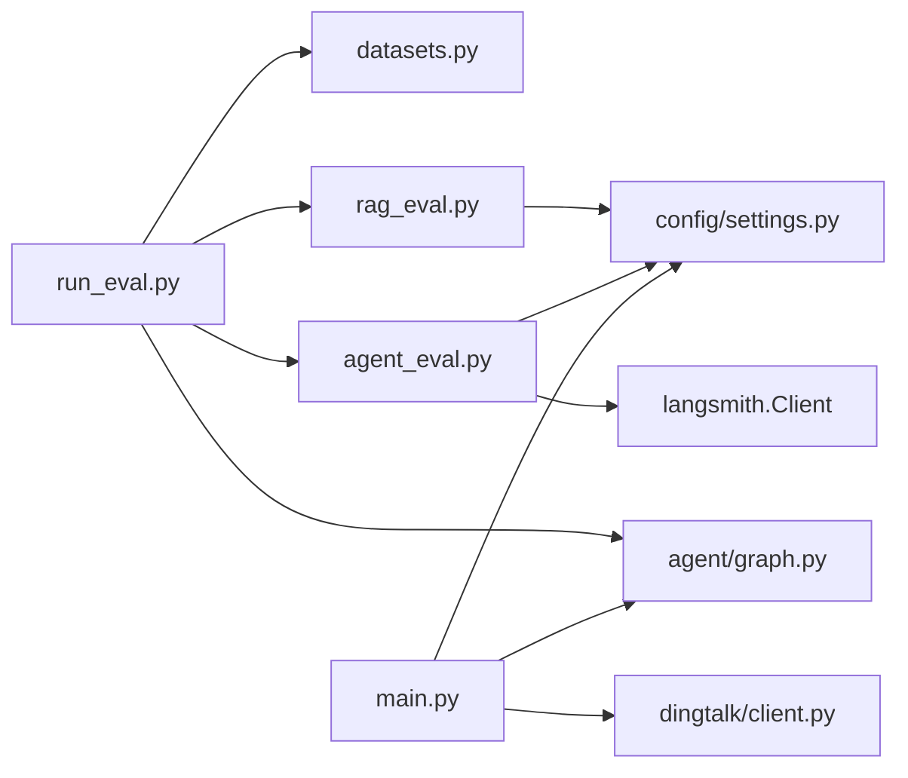

# 评估与监控

<cite>
**本文引用的文件**   
- [evaluation/agent_eval.py](file://evaluation/agent_eval.py)
- [evaluation/rag_eval.py](file://evaluation/rag_eval.py)
- [evaluation/run_eval.py](file://evaluation/run_eval.py)
- [evaluation/datasets.py](file://evaluation/datasets.py)
- [config/settings.py](file://config/settings.py)
- [main.py](file://main.py)
- [agent/graph.py](file://agent/graph.py)
- [rag/retriever.py](file://rag/retriever.py)
- [dingtalk/client.py](file://dingtalk/client.py)
- [requirements.txt](file://requirements.txt)
</cite>

## 目录
1. [简介](#简介)
2. [项目结构](#项目结构)
3. [核心组件](#核心组件)
4. [架构总览](#架构总览)
5. [详细组件分析](#详细组件分析)
6. [依赖关系分析](#依赖关系分析)
7. [性能考量](#性能考量)
8. [故障排查指南](#故障排查指南)
9. [结论](#结论)
10. [附录](#附录)

## 简介
本技术文档围绕“评估与监控”主题，系统化阐述智能体评估框架的设计与使用方法，覆盖评估指标定义、测试数据集准备、评估结果分析与报告生成；详细说明 RAG 系统评估的实现（检索相关性、答案忠实度、帮助度、答案相关性）；文档化 LangSmith 集成（链路追踪、性能监控、质量评估）；并给出关键性能指标的监控建议（响应时间、吞吐量、错误率、资源使用），以及基准测试与回归测试的实施方法。同时提供监控告警配置思路与故障诊断工具的使用说明，帮助读者在生产环境中稳定运行与持续优化智能体与RAG能力。

## 项目结构
本项目采用模块化组织，评估相关代码集中在 evaluation 目录，RAG 检索在 rag 目录，LangGraph 工作流在 agent 目录，配置统一在 config/settings.py，Web 服务入口在 main.py，钉钉客户端在 dingtalk/client.py。评估流程通过 CLI 驱动，串联数据集加载、智能体调用（可选）、RAG 评估、智能体评估、LangSmith trace 拉取与路径分析，最终输出 JSON 报告与控制台汇总。

图表来源
- [evaluation/run_eval.py:1-156](file://evaluation/run_eval.py#L1-L156)
- [evaluation/rag_eval.py:1-121](file://evaluation/rag_eval.py#L1-L121)
- [evaluation/agent_eval.py:1-139](file://evaluation/agent_eval.py#L1-L139)
- [evaluation/datasets.py:1-58](file://evaluation/datasets.py#L1-L58)
- [agent/graph.py:1-106](file://agent/graph.py#L1-L106)
- [rag/retriever.py:1-38](file://rag/retriever.py#L1-L38)
- [config/settings.py:1-93](file://config/settings.py#L1-L93)
- [main.py:1-236](file://main.py#L1-L236)
- [dingtalk/client.py:1-140](file://dingtalk/client.py#L1-L140)

章节来源
- [evaluation/run_eval.py:1-156](file://evaluation/run_eval.py#L1-L156)
- [evaluation/datasets.py:1-58](file://evaluation/datasets.py#L1-L58)
- [config/settings.py:1-93](file://config/settings.py#L1-L93)

## 核心组件
- 评估运行器：负责加载数据集、执行智能体（可选）、批量运行 RAG 评估与智能体评估、拉取 LangSmith trace 并进行路径合理性分析，最后输出 JSON 报告与控制台汇总。
- RAG 评估器：基于 OpenEvals 的 LLM-as-Judge，对检索相关性、答案忠实度、帮助度、答案相关性进行自动化评分。
- 智能体评估器：基于 OpenEvals 的 LLM-as-Judge，对正确性、幻觉检测、推理路径合理性进行评估。
- LangSmith 集成：用于拉取最近运行的 trace，统计成功率与失败数，辅助路径合理性分析。
- 配置管理：集中管理 LLM、Embedding、向量库、记忆、钉钉、LangSmith 等参数，支持环境变量与 .env 文件。
- Web 服务与健康检查：FastAPI 提供聊天接口、健康检查端点，便于外部监控系统探测服务状态。

章节来源
- [evaluation/run_eval.py:1-156](file://evaluation/run_eval.py#L1-L156)
- [evaluation/rag_eval.py:1-121](file://evaluation/rag_eval.py#L1-L121)
- [evaluation/agent_eval.py:1-139](file://evaluation/agent_eval.py#L1-L139)
- [config/settings.py:1-93](file://config/settings.py#L1-L93)
- [main.py:1-236](file://main.py#L1-L236)

## 架构总览
评估与监控的整体架构由“评估运行器”作为编排中心，串联数据集、智能体工作流、RAG 检索、评估器与 LangSmith 追踪。Web 服务暴露健康检查与聊天接口，供外部监控系统采集状态与性能数据。

图表来源
- [evaluation/run_eval.py:1-156](file://evaluation/run_eval.py#L1-L156)
- [evaluation/datasets.py:1-58](file://evaluation/datasets.py#L1-L58)
- [agent/graph.py:1-106](file://agent/graph.py#L1-L106)
- [evaluation/rag_eval.py:1-121](file://evaluation/rag_eval.py#L1-L121)
- [evaluation/agent_eval.py:1-139](file://evaluation/agent_eval.py#L1-L139)

## 详细组件分析

### 评估运行器（run_eval）
- 功能要点
  - 加载评估数据集，构造样本字典（question、answer、expected_answer、reference_context、reference_docs）。
  - 可选调用智能体工作流获取回答；若跳过，则直接使用 expected_answer。
  - 批量运行 RAG 评估与智能体评估，聚合结果。
  - 拉取 LangSmith 最近 trace，计算成功率与失败数，形成路径合理性分析。
  - 输出控制台汇总表格与 JSON 报告（可指定输出路径）。
- 关键流程
  - 步骤1：加载数据集与构建样本。
  - 步骤2：RAG 质量评估（retrieval_relevance、groundedness、helpfulness、answer_relevance）。
  - 步骤3：智能体评估（correctness、hallucination、plan_adherence）。
  - 步骤4：LangSmith trace 拉取与路径分析。
  - 步骤5：汇总与输出。

图表来源
- [evaluation/run_eval.py:1-156](file://evaluation/run_eval.py#L1-L156)

章节来源
- [evaluation/run_eval.py:1-156](file://evaluation/run_eval.py#L1-L156)

### RAG 评估（rag_eval）
- 评估维度
  - 检索相关性（retrieval_relevance）：检索到的文档是否与问题相关。
  - 忠实度（groundedness）：答案是否基于检索上下文，无幻觉。
  - 帮助度（helpfulness）：回答对用户是否有用。
  - 答案相关性（answer_relevance）：回答是否切题。
- 实现方式
  - 使用 OpenEvals 的 create_llm_as_judge 与预置 prompt 模板。
  - 每个评估器映射输入字段到 sample 中的对应键（如 question、answer、reference_context、reference_docs）。
  - 批量评估函数 evaluate_batch 遍历样本，打印进度并收集结果。

图表来源
- [evaluation/rag_eval.py:1-121](file://evaluation/rag_eval.py#L1-L121)

章节来源
- [evaluation/rag_eval.py:1-121](file://evaluation/rag_eval.py#L1-L121)

### 智能体评估（agent_eval）
- 评估维度
  - 正确性（correctness）：回答是否与参考答案一致。
  - 幻觉检测（hallucination）：回答是否包含编造内容。
  - 推理路径合理性（plan_adherence）：智能体是否按预期步骤推进。
- 实现方式
  - 使用 OpenEvals 的 create_llm_as_judge 与预置 prompt 模板。
  - 构建评估器集合，对每个样本运行全部评估器，异常时记录错误信息。
  - 集成 LangSmith 客户端，拉取最近 trace 并统计成功率与失败数。

图表来源
- [evaluation/agent_eval.py:1-139](file://evaluation/agent_eval.py#L1-L139)

章节来源
- [evaluation/agent_eval.py:1-139](file://evaluation/agent_eval.py#L1-L139)

### 数据集（datasets）
- 数据结构
  - EvalSample：包含 question、expected_answer、reference_context、reference_docs。
- 用途
  - 驱动 RAG 评估与智能体评估，确保评估的一致性与可重复性。
- 示例
  - 涵盖智能体功能、长期记忆存储、RAG 评估维度、工作流编排框架、评估工具等主题。

章节来源
- [evaluation/datasets.py:1-58](file://evaluation/datasets.py#L1-L58)

### 配置管理（settings）
- 关键配置项
  - LLM：模型名称、base_url、api_key、temperature、评判模型。
  - Embedding：本地 HuggingFace 模型。
  - 向量库：Chroma 持久化目录、集合名、top_k、分数过滤阈值。
  - 记忆：长期记忆 SQLite 路径、摘要触发轮次。
  - 钉钉：应用密钥、机器人 token/secret、API base。
  - LangSmith：API key、project、tracing开关、endpoint。
- 特性
  - 支持环境变量与 .env 文件，属性自动创建目录，缓存单例。

章节来源
- [config/settings.py:1-93](file://config/settings.py#L1-L93)

### 智能体工作流（graph）
- 工作流节点
  - emotion（情感分析）→ route（路由判断）→ load_memory（加载长期记忆）→ retrieve（RAG检索，条件分支）→ generate（生成回答）→ memory_update（更新记忆）→ END。
- 编译与调用
  - 支持传入 checkpointer（默认进程内 MemorySaver），可按 thread_id 维护短期上下文。
  - 提供便捷 chat 入口，封装 graph.invoke 调用。

章节来源
- [agent/graph.py:1-106](file://agent/graph.py#L1-L106)

### RAG 检索（retriever）
- 功能
  - 语义检索：对 query 进行向量检索，返回 (Document, score) 列表。
  - 上下文格式化：将检索结果格式化为带来源标记与相关度的字符串。
  - 一站式检索：retrieve_context 直接返回上下文字符串。

章节来源
- [rag/retriever.py:1-38](file://rag/retriever.py#L1-L38)

### Web 服务与健康检查（main）
- 接口
  - /：返回前端页面。
  - /api/chat：接收用户输入，调用智能体图生成回答。
  - /health：健康检查，返回服务状态与 checkpointer 类型。
  - /dingtalk/webhook：钉钉回调处理，签名校验后调用智能体并回复消息。
- 监控友好
  - 健康检查端点可用于外部监控系统探测服务可用性。
  - 日志记录异常与错误信息，便于故障定位。

章节来源
- [main.py:1-236](file://main.py#L1-L236)

### 钉钉客户端（client）
- 功能
  - 获取 access_token（本地缓存）。
  - 发送文本与 Markdown 消息（工作通知）。
  - 通过机器人 webhook 回复群消息。
- 监控与容错
  - 网络请求异常捕获与日志记录。
  - 未配置密钥时的降级处理。

章节来源
- [dingtalk/client.py:1-140](file://dingtalk/client.py#L1-L140)

## 依赖关系分析
- 评估模块依赖
  - run_eval 依赖 datasets、rag_eval、agent_eval、agent.graph。
  - rag_eval 与 agent_eval 依赖 config.settings 与 OpenEvals。
  - agent_eval 依赖 LangSmith 客户端（可选）。
- 服务与外部依赖
  - main 依赖 agent.graph、dingtalk.client、config.settings。
  - requirements.txt 明确列出 langchain、langgraph、chromadb、openai、fastapi、uvicorn、httpx、pydantic、langsmith、openevals 等版本。

图表来源
- [evaluation/run_eval.py:1-156](file://evaluation/run_eval.py#L1-L156)
- [evaluation/rag_eval.py:1-121](file://evaluation/rag_eval.py#L1-L121)
- [evaluation/agent_eval.py:1-139](file://evaluation/agent_eval.py#L1-L139)
- [evaluation/datasets.py:1-58](file://evaluation/datasets.py#L1-L58)
- [config/settings.py:1-93](file://config/settings.py#L1-L93)
- [main.py:1-236](file://main.py#L1-L236)
- [dingtalk/client.py:1-140](file://dingtalk/client.py#L1-L140)
- [requirements.txt:1-31](file://requirements.txt#L1-L31)

章节来源
- [requirements.txt:1-31](file://requirements.txt#L1-L31)

## 性能考量
- 评估批处理
  - RAG 评估与智能体评估均为批量处理，建议在大规模数据集上启用并发或异步策略（当前为顺序循环，可通过改造提升吞吐）。
- LLM 调用开销
  - 评估器使用 LLM-as-Judge，温度设为 0.0 以保证稳定性；在高并发场景下需考虑限流与重试。
- 向量检索
  - top_k 与分数过滤阈值影响检索质量与延迟；可根据业务需求调整 rag_top_k 与 rag_score_filter。
- 健康检查与监控
  - 通过 /health 端点定期探测服务可用性；结合日志与外部监控系统（如 Prometheus）采集响应时间与错误率。
- 资源使用
  - 长期记忆 SQLite 与 Chroma 向量库的磁盘 IO；合理设置持久化目录与索引大小。

[本节为通用指导，不直接分析具体文件]

## 故障排查指南
- 常见错误与定位
  - 评估失败：当评估器抛出异常时，结果中会包含 error 标志与原因；检查 LLM 配置与网络连接。
  - LangSmith 拉取失败：未配置 API key 或初始化失败时会跳过；确认 LANGSMITH_API_KEY 与 endpoint。
  - 智能体调用失败：Web 接口与钉钉回调均捕获异常并记录日志；检查 graph.invoke 的参数与权限。
  - 钉钉消息发送失败：access_token 获取失败或网络异常；检查 AppKey/AppSecret 与 API 基础地址。
- 诊断工具
  - 控制台输出：评估运行器打印进度与汇总表格，便于快速定位问题。
  - 日志记录：main.py 与 dingtalk/client.py 使用 logging 记录错误信息；建议开启 DEBUG 级别。
  - 健康检查：/health 返回服务状态与 checkpointer 类型，用于外部监控。

章节来源
- [evaluation/agent_eval.py:1-139](file://evaluation/agent_eval.py#L1-L139)
- [evaluation/run_eval.py:1-156](file://evaluation/run_eval.py#L1-L156)
- [main.py:1-236](file://main.py#L1-L236)
- [dingtalk/client.py:1-140](file://dingtalk/client.py#L1-L140)

## 结论
本项目构建了完整的评估与监控体系：以 run_eval 为核心编排评估流程，结合 OpenEvals 的 LLM-as-Judge 对 RAG 与智能体进行多维度评估；通过 LangSmith 拉取 trace 进行路径合理性分析；借助 FastAPI 健康检查与日志记录实现服务可用性与错误定位。生产环境建议完善监控告警（响应时间、吞吐量、错误率、资源使用），并结合基准测试与回归测试保障模型与检索质量的稳定性。

[本节为总结性内容，不直接分析具体文件]

## 附录
- 评估指标定义
  - RAG 评估：检索相关性、答案忠实度、帮助度、答案相关性。
  - 智能体评估：正确性、幻觉检测、推理路径合理性。
- 测试数据集准备
  - 使用 evaluation/datasets.py 中的 EvalSample 结构，确保 question、expected_answer、reference_context、reference_docs 字段完整。
- 评估结果分析
  - 查看控制台汇总表格与 JSON 报告，关注各维度平均分与路径分析成功率。
- LangSmith 集成配置
  - 设置 langsmith_api_key、langsmith_project、langsmith_endpoint；在 agent_eval 中拉取 trace 进行分析。
- 关键性能指标监控
  - 响应时间：通过 Web 接口与外部监控采集。
  - 吞吐量：评估批处理与并发策略优化。
  - 错误率：健康检查与日志记录。
  - 资源使用：SQLite 与 Chroma 的磁盘 IO。
- 基准测试与回归测试
  - 使用固定数据集与评估脚本，定期运行对比历史报告，发现质量退化。
- 监控告警配置
  - 基于健康检查端点与日志关键字（如“失败”、“异常”）设置告警规则。
- 故障诊断工具
  - 控制台输出、日志级别调整、健康检查端点、LangSmith trace 分析。

[本节为补充信息，不直接分析具体文件]