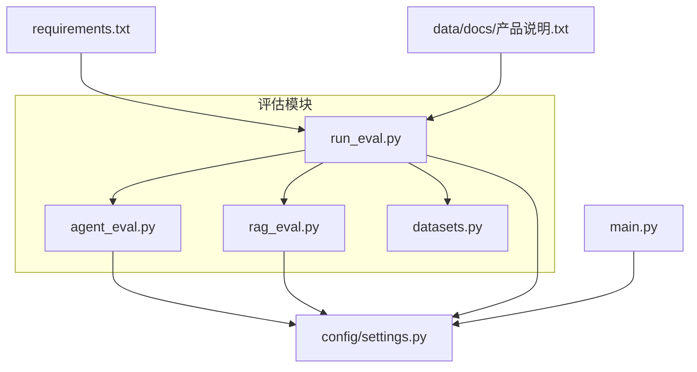
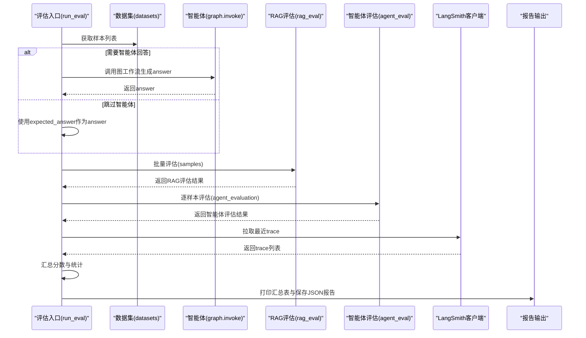
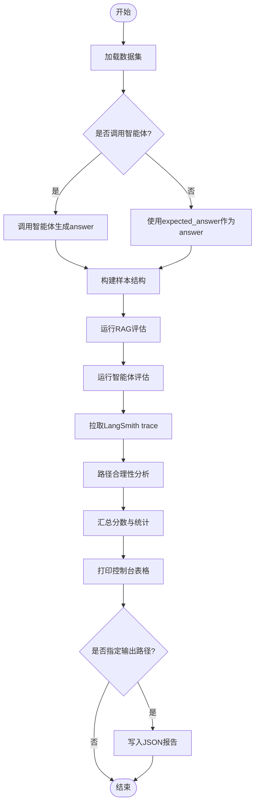
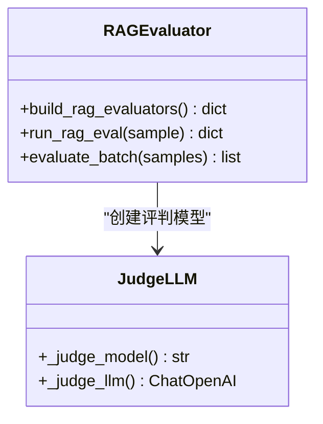
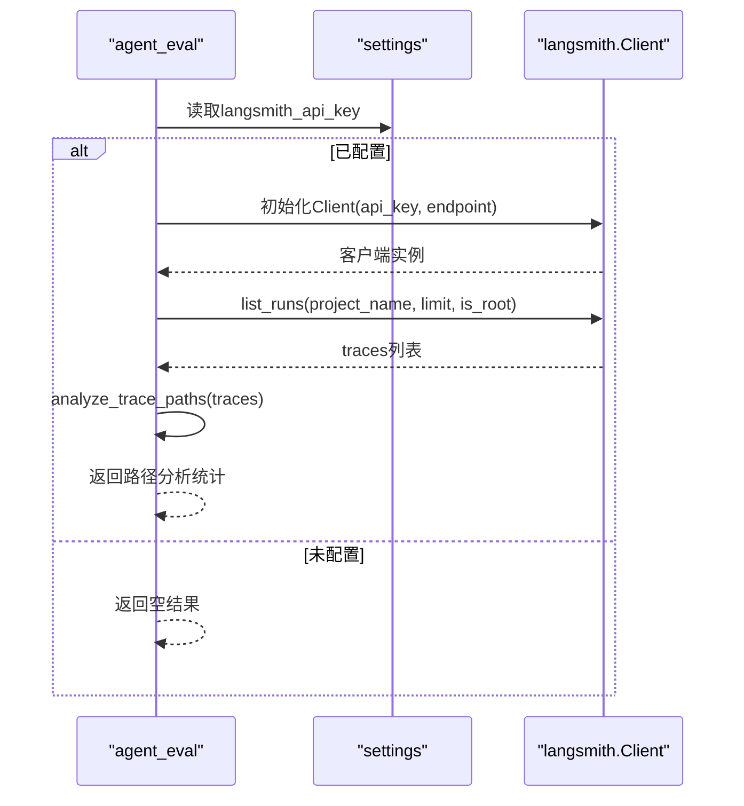
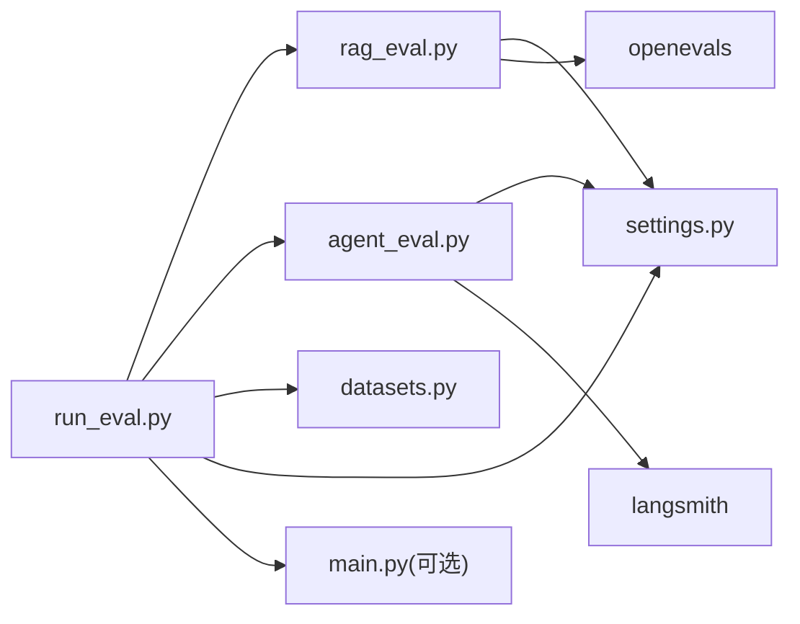

# 评估执行器

<cite>
**本文引用的文件**   
- [evaluation/run_eval.py](file://evaluation/run_eval.py)
- [evaluation/rag_eval.py](file://evaluation/rag_eval.py)
- [evaluation/agent_eval.py](file://evaluation/agent_eval.py)
- [evaluation/datasets.py](file://evaluation/datasets.py)
- [config/settings.py](file://config/settings.py)
- [main.py](file://main.py)
- [requirements.txt](file://requirements.txt)
- [data/docs/产品说明.txt](file://data/docs/产品说明.txt)
</cite>

## 目录
1. [简介](#简介)
2. [项目结构](#项目结构)
3. [核心组件](#核心组件)
4. [架构总览](#架构总览)
5. [详细组件分析](#详细组件分析)
6. [依赖关系分析](#依赖关系分析)
7. [性能与资源监控](#性能与资源监控)
8. [故障排查指南](#故障排查指南)
9. [结论](#结论)
10. [附录](#附录)

## 简介
本技术文档面向“评估执行器”，系统性阐述批量评估任务的调度机制、执行流程、配置方法、结果收集与汇总、LangSmith 集成使用方法、报告自动生成与导出，以及性能监控与资源跟踪策略。该评估执行器基于 OpenEvals 与 LangSmith，结合智能体工作流（LangGraph）实现 RAG 质量与智能体行为的多维度自动化评测，并提供结构化 JSON 报告与控制台汇总输出。

## 项目结构
评估相关代码集中在 evaluation 目录下，包含：
- run_eval.py：评估运行入口与编排流程
- rag_eval.py：RAG 质量评估器构建与批量评估
- agent_eval.py：智能体评估器构建、LangSmith trace 拉取与分析
- datasets.py：评估数据集定义与加载

此外，全局配置由 config/settings.py 管理；主服务入口 main.py 提供 Web 服务与 REPL 调试；依赖项在 requirements.txt 中声明；产品说明位于 data/docs/产品说明.txt。

图表来源
- [evaluation/run_eval.py:1-156](file://evaluation/run_eval.py#L1-L156)
- [evaluation/rag_eval.py:1-121](file://evaluation/rag_eval.py#L1-L121)
- [evaluation/agent_eval.py:1-139](file://evaluation/agent_eval.py#L1-L139)
- [evaluation/datasets.py:1-58](file://evaluation/datasets.py#L1-L58)
- [config/settings.py:1-93](file://config/settings.py#L1-L93)
- [main.py:1-236](file://main.py#L1-L236)
- [requirements.txt:1-31](file://requirements.txt#L1-L31)
- [data/docs/产品说明.txt:1-39](file://data/docs/产品说明.txt#L1-L39)

章节来源
- [evaluation/run_eval.py:1-156](file://evaluation/run_eval.py#L1-L156)
- [evaluation/rag_eval.py:1-121](file://evaluation/rag_eval.py#L1-L121)
- [evaluation/agent_eval.py:1-139](file://evaluation/agent_eval.py#L1-L139)
- [evaluation/datasets.py:1-58](file://evaluation/datasets.py#L1-L58)
- [config/settings.py:1-93](file://config/settings.py#L1-L93)
- [main.py:1-236](file://main.py#L1-L236)
- [requirements.txt:1-31](file://requirements.txt#L1-L31)
- [data/docs/产品说明.txt:1-39](file://data/docs/产品说明.txt#L1-L39)

## 核心组件
- 评估运行器（run_eval.py）
  - 负责加载数据集、可选调用智能体生成回答、执行 RAG 与智能体评估、拉取 LangSmith trace 并汇总输出报告。
- RAG 评估器（rag_eval.py）
  - 使用 OpenEvals 的 LLM-as-Judge 构建四个维度评估器：检索相关性、忠实度、帮助度、答案相关性；支持批量评估。
- 智能体评估器（agent_eval.py）
  - 使用 OpenEvals 构建三个维度评估器：正确性、幻觉检测、推理路径合理性；集成 LangSmith 客户端拉取 trace 并做路径合理性统计。
- 数据集（datasets.py）
  - 定义 EvalSample 结构与内置 RAG_EVAL_DATASET，提供 get_dataset() 接口供评估流程使用。
- 配置（settings.py）
  - 集中管理 LLM、Embedding、向量库、记忆、钉钉、LangSmith 等参数，支持环境变量与 .env 文件。

章节来源
- [evaluation/run_eval.py:23-105](file://evaluation/run_eval.py#L23-L105)
- [evaluation/rag_eval.py:63-121](file://evaluation/rag_eval.py#L63-L121)
- [evaluation/agent_eval.py:33-71](file://evaluation/agent_eval.py#L33-L71)
- [evaluation/datasets.py:11-57](file://evaluation/datasets.py#L11-L57)
- [config/settings.py:16-62](file://config/settings.py#L16-L62)

## 架构总览
评估执行器的整体流程如下：
- 启动评估任务（CLI 或函数调用）
- 加载评估数据集（question、expected_answer、reference_context、reference_docs）
- 可选：调用智能体（LangGraph StateGraph）生成 answer
- 并行/顺序执行 RAG 评估器集合与智能体评估器集合
- 拉取 LangSmith 最近 trace，进行路径合理性分析
- 汇总分数与统计，输出控制台表格与 JSON 报告

图表来源
- [evaluation/run_eval.py:23-105](file://evaluation/run_eval.py#L23-L105)
- [evaluation/rag_eval.py:113-121](file://evaluation/rag_eval.py#L113-L121)
- [evaluation/agent_eval.py:96-123](file://evaluation/agent_eval.py#L96-L123)
- [main.py:72-85](file://main.py#L72-L85)

## 详细组件分析

### 评估运行器（run_eval.py）
- 功能要点
  - 通过 argparse 提供 --no-agent 与 --output 选项，控制是否调用智能体与报告输出路径。
  - 加载数据集后，按样本顺序调用智能体（可选），构造统一样本结构。
  - 依次执行 RAG 评估与智能体评估，拉取 LangSmith trace 并计算路径成功率。
  - 汇总各维度平均分，打印控制台表格，并将完整报告以 JSON 写入指定路径。
- 数据流
  - 输入：数据集样本（question、expected_answer、reference_context、reference_docs）
  - 中间：智能体回答（可选）、RAG 评估结果、智能体评估结果、LangSmith trace
  - 输出：report 字典（含 timestamp、sample_count、rag_evaluation、path_analysis、summary）
- 错误处理
  - 智能体调用异常捕获并记录失败信息，保证评估流程继续。
  - 评估器异常捕获，返回带 error=True 的结果，避免中断批处理。
- 性能特征
  - 当前为顺序批处理（for 循环），适合中小规模数据集；可扩展为并发执行以提升吞吐。

图表来源
- [evaluation/run_eval.py:23-105](file://evaluation/run_eval.py#L23-L105)
- [evaluation/run_eval.py:108-143](file://evaluation/run_eval.py#L108-L143)

章节来源
- [evaluation/run_eval.py:23-105](file://evaluation/run_eval.py#L23-L105)
- [evaluation/run_eval.py:108-143](file://evaluation/run_eval.py#L108-L143)

### RAG 评估器（rag_eval.py）
- 评估维度
  - 检索相关性（retrieval_relevance）
  - 忠实度（groundedness）
  - 帮助度（helpfulness）
  - 答案相关性（answer_relevance）
- 实现方式
  - 使用 OpenEvals 的 create_llm_as_judge 与预置 prompt 模板构建评估器。
  - 每个评估器接收 sample 字段映射（如 question、answer、reference_context、reference_docs）。
  - evaluate_batch 对样本逐个评估并附加 evaluation 字段。
- 错误处理
  - 单个评估器异常时返回 {score: None, reasoning: "...", error: True}，不影响其他评估器。

图表来源
- [evaluation/rag_eval.py:24-44](file://evaluation/rag_eval.py#L24-L44)
- [evaluation/rag_eval.py:63-121](file://evaluation/rag_eval.py#L63-L121)

章节来源
- [evaluation/rag_eval.py:63-121](file://evaluation/rag_eval.py#L63-L121)

### 智能体评估器（agent_eval.py）
- 评估维度
  - 正确性（correctness）
  - 幻觉检测（hallucination）
  - 推理路径合理性（plan_adherence）
- 实现方式
  - 使用 OpenEvals 的 create_lll_as_judge 与对应 prompt 模板。
  - run_agent_eval 对每个评估器执行并聚合结果。
- LangSmith 集成
  - get_langsmith_client：根据配置初始化 Client，未配置则返回 None。
  - fetch_recent_traces：拉取最近 root runs，限制数量，返回标准化结构。
  - analyze_trace_paths：统计成功/失败数与成功率。
- 错误处理
  - 客户端初始化失败或拉取 trace 异常均捕获并返回空结果，确保评估不中断。

图表来源
- [evaluation/agent_eval.py:73-93](file://evaluation/agent_eval.py#L73-L93)
- [evaluation/agent_eval.py:96-123](file://evaluation/agent_eval.py#L96-L123)
- [evaluation/agent_eval.py:126-139](file://evaluation/agent_eval.py#L126-L139)

章节来源
- [evaluation/agent_eval.py:33-71](file://evaluation/agent_eval.py#L33-L71)
- [evaluation/agent_eval.py:73-139](file://evaluation/agent_eval.py#L73-L139)

### 数据集（datasets.py）
- 数据结构
  - EvalSample：包含 question、expected_answer、reference_context、reference_docs。
- 内置数据集
  - RAG_EVAL_DATASET：一组示例样本，覆盖产品功能、记忆存储、RAG 评估维度、框架使用与评估工具等主题。
- 接口
  - get_dataset()：返回数据集列表，供评估流程使用。

章节来源
- [evaluation/datasets.py:11-57](file://evaluation/datasets.py#L11-L57)

### 配置（settings.py）
- 关键配置项
  - LLM：llm_model、llm_base_url、llm_api_key、llm_temperature、llm_judge_model
  - Embedding：embedding_model
  - 向量库：chroma_persist_dir、chroma_collection、rag_top_k、rag_score_filter
  - 记忆：long_term_db_path、memory_summary_every
  - 钉钉：dingtalk_app_key、dingtalk_app_secret、dingtalk_robot_token、dingtalk_robot_secret、dingtalk_robot_code、dingtalk_api_base
  - LangSmith：langsmith_api_key、langsmith_project、langsmith_tracing、langsmith_endpoint
- 特性
  - 支持从环境变量与 .env 文件加载，优先级：环境变量 > .env。
  - 提供属性方法自动创建必要目录与绝对路径。

章节来源
- [config/settings.py:16-62](file://config/settings.py#L16-L62)
- [config/settings.py:63-86](file://config/settings.py#L63-L86)

## 依赖关系分析
- 外部依赖
  - langchain、langchain-openai、langgraph、fastapi、uvicorn、pydantic、pydantic-settings
  - openai、chromadb、sentence-transformers、huggingface-hub
  - langsmith、openevals
- 模块耦合
  - run_eval 依赖 rag_eval、agent_eval、datasets、settings
  - rag_eval 与 agent_eval 依赖 settings 与 openevals
  - agent_eval 依赖 langsmith 客户端
- 潜在风险
  - 顺序批处理可能成为瓶颈，需考虑并发扩展
  - 外部 API（LLM、LangSmith）可用性影响评估稳定性

图表来源
- [evaluation/run_eval.py:23-105](file://evaluation/run_eval.py#L23-L105)
- [evaluation/rag_eval.py:63-121](file://evaluation/rag_eval.py#L63-L121)
- [evaluation/agent_eval.py:73-123](file://evaluation/agent_eval.py#L73-L123)
- [requirements.txt:1-31](file://requirements.txt#L1-L31)

章节来源
- [requirements.txt:1-31](file://requirements.txt#L1-L31)

## 性能与资源监控
- 当前执行模式
  - 顺序批处理：对每个样本串行执行评估器，简单可靠但吞吐有限。
- 优化建议
  - 并发执行：引入线程池或异步任务（如 asyncio.gather）并行调用评估器与 LLM 评判，提升吞吐量。
  - 限流与重试：对 LLM 与 LangSmith 调用增加指数退避重试与速率限制，提高鲁棒性。
  - 缓存：对相同样本的评估结果进行缓存，减少重复调用。
- 资源跟踪
  - LangSmith tracing：通过 settings.langsmith_tracing 启用追踪，便于分析节点执行情况与耗时。
  - 日志记录：在评估关键步骤添加结构化日志（时间戳、样本ID、耗时、错误堆栈），便于定位问题。
  - 指标采集：记录各评估维度的平均耗时、失败率、评分分布，形成性能基线。

[本节为通用指导，不直接分析具体文件]

## 故障排查指南
- 常见问题
  - LLM 调用失败：检查 llm_api_key、llm_base_url、网络连通性与模型配额。
  - LangSmith 客户端初始化失败：确认 langsmith_api_key 与 langsmith_endpoint 配置正确。
  - Trace 拉取为空：确认 langsmith_project 名称一致且存在根级 runs。
  - 评估结果为空或全为 None：检查 sample 字段是否齐全（question、answer、reference_context、reference_docs）。
- 诊断步骤
  - 启用详细日志：在评估入口与各评估器中添加 print/logging 输出。
  - 最小化复现：使用 --no-agent 仅验证评估器逻辑。
  - 隔离外部依赖：关闭 LangSmith 拉取，仅关注评估器输出。
- 恢复策略
  - 异常捕获后继续批处理，记录错误样本 ID 以便后续重跑。
  - 对失败的 LLM 调用实施重试与降级策略（如规则兜底）。

章节来源
- [evaluation/run_eval.py:46-56](file://evaluation/run_eval.py#L46-L56)
- [evaluation/rag_eval.py:108-110](file://evaluation/rag_eval.py#L108-L110)
- [evaluation/agent_eval.py:91-93](file://evaluation/agent_eval.py#L91-L93)
- [evaluation/agent_eval.py:121-123](file://evaluation/agent_eval.py#L121-L123)

## 结论
评估执行器通过 OpenEvals 与 LangSmith 构建了完整的 RAG 与智能体评估体系，具备可配置的评估维度、健壮的错误处理与结构化报告输出能力。当前实现以顺序批处理为主，易于理解与维护；未来可通过并发优化、重试与缓存进一步提升性能与稳定性。配合 LangSmith 追踪与日志记录，可实现端到端的性能监控与问题定位。

[本节为总结，不直接分析具体文件]

## 附录

### 评估任务配置清单
- 数据集
  - 使用 datasets.get_dataset() 获取样本，或替换为自定义数据源。
- 评估器选择
  - RAG：retrieval_relevance、groundedness、helpfulness、answer_relevance
  - 智能体：correctness、hallucination、plan_adherence
- 并行执行策略
  - 当前为顺序执行；建议引入并发（线程池/异步）与限流重试。
- 结果收集与汇总
  - 每个样本附带 evaluation 与 agent_evaluation 字段；_summarize 计算各维度平均分。
- LangSmith 集成
  - 配置 langsmith_api_key、langsmith_project、langsmith_endpoint；fetch_recent_traces 拉取 trace 并分析成功率。
- 报告生成与导出
  - run_evaluation 输出控制台表格与 JSON 报告（--output 指定路径）。
- 性能监控与资源跟踪
  - 启用 langsmith_tracing；添加结构化日志与指标采集。

章节来源
- [evaluation/run_eval.py:23-105](file://evaluation/run_eval.py#L23-L105)
- [evaluation/rag_eval.py:63-121](file://evaluation/rag_eval.py#L63-L121)
- [evaluation/agent_eval.py:73-139](file://evaluation/agent_eval.py#L73-L139)
- [config/settings.py:57-61](file://config/settings.py#L57-L61)