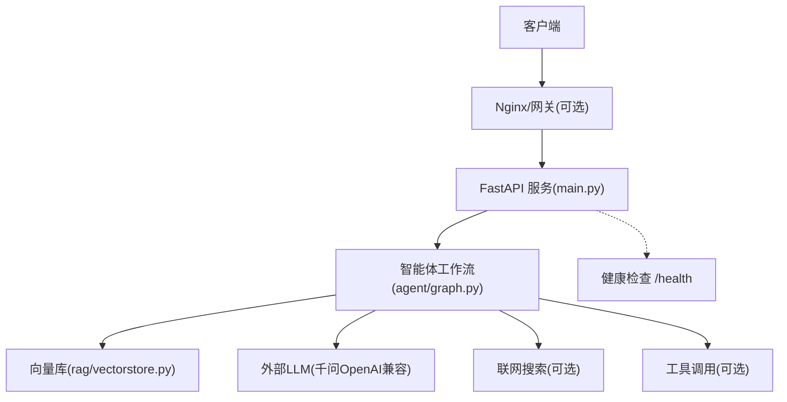
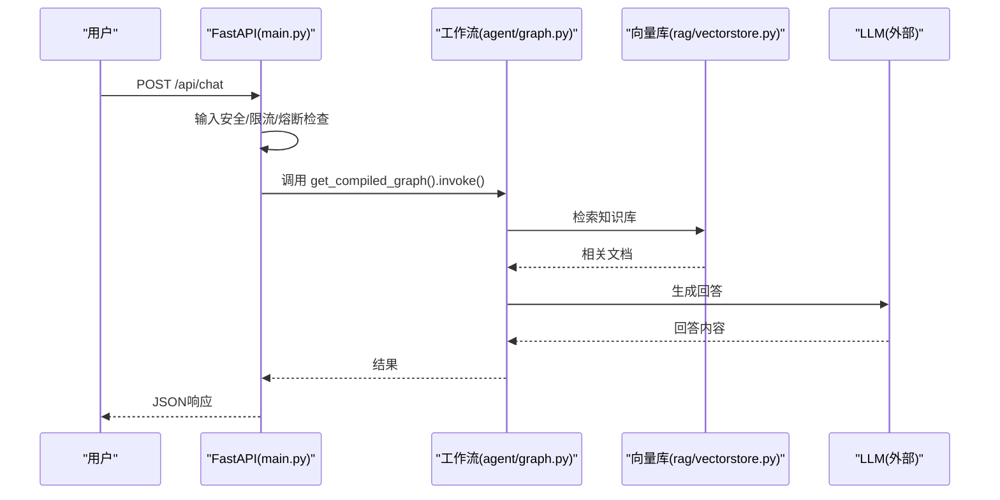
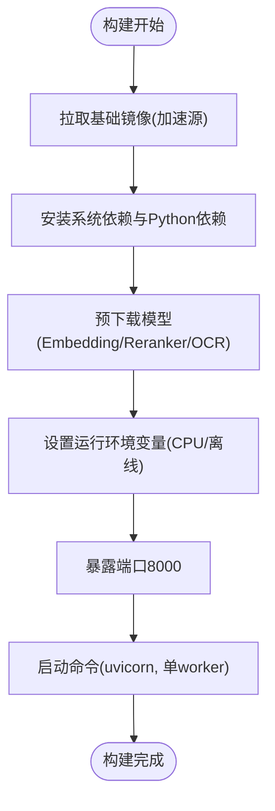
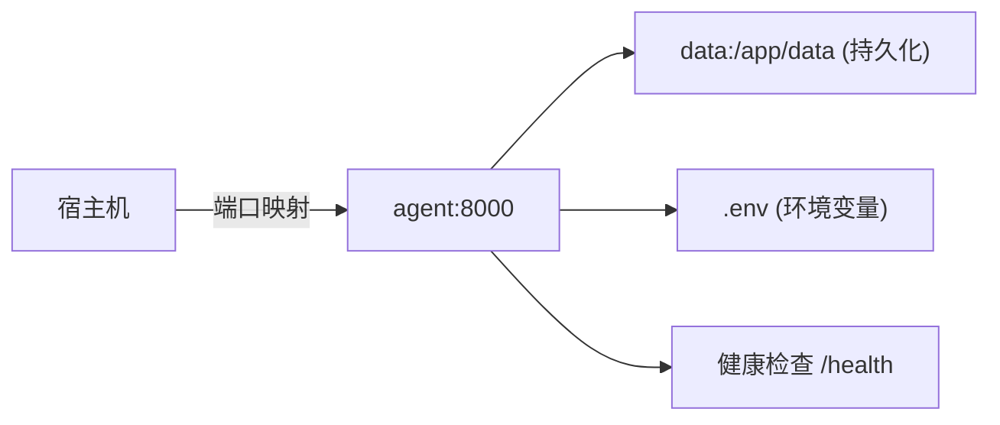
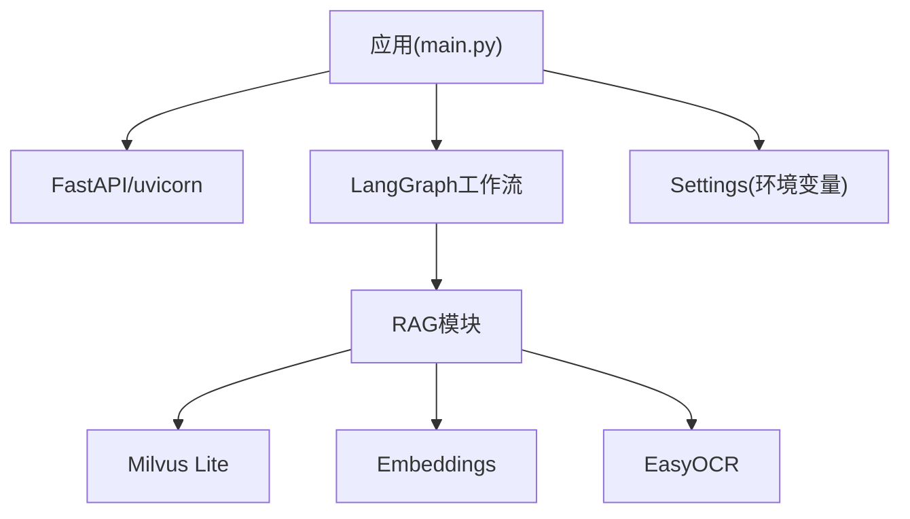

# 部署指南

<cite>
**本文引用的文件**
- [Dockerfile](file://Dockerfile)
- [docker-compose.yml](file://docker-compose.yml)
- [main.py](file://main.py)
- [config/settings.py](file://config/settings.py)
- [requirements.txt](file://requirements.txt)
- [Docker部署指南.md](file://Docker部署指南.md)
- [scripts/prefetch_models.py](file://scripts/prefetch_models.py)
- [agent/graph.py](file://agent/graph.py)
- [rag/vectorstore.py](file://rag/vectorstore.py)
- [.env.example](file:.env.example)
</cite>

## 目录
1. [简介](#简介)
2. [项目结构](#项目结构)
3. [核心组件](#核心组件)
4. [架构总览](#架构总览)
5. [详细组件分析](#详细组件分析)
6. [依赖关系分析](#依赖关系分析)
7. [性能与优化](#性能与优化)
8. [故障排查](#故障排查)
9. [结论](#结论)
10. [附录：生产部署模板与最佳实践](#附录生产部署模板与最佳实践)

## 简介
本指南面向生产环境，提供钉钉AI智能体助手的容器化部署、服务编排、环境变量配置、监控日志收集、性能优化、健康检查、自动重启、备份恢复等完整方案。覆盖单机部署、集群部署、云原生部署等场景，并给出可复用的配置模板与最佳实践。

## 项目结构
- 应用入口与Web服务：FastAPI 主入口提供聊天接口、流式SSE接口与健康检查端点。
- 智能体工作流：基于 LangGraph 的状态图，实现预检查、检索、联网搜索、工具调用、生成与后台记忆更新。
- 向量库与RAG：Milvus Lite 本地文件持久化，支持文本/图像混合入库与检索；内置BM25多路召回与重排序。
- 配置管理：集中化的 pydantic-settings 配置，从环境变量与 .env 加载。
- 模型预下载：构建期脚本预下载 Embedding/Reranker/OCR 模型，运行时无需联网。
- 运维能力：健康检查、自动重启、数据卷持久化、启动预热（LLM连接、向量库索引）。

图表来源
- [main.py:145-326](file://main.py#L145-L326)
- [agent/graph.py:44-102](file://agent/graph.py#L44-L102)
- [rag/vectorstore.py:29-76](file://rag/vectorstore.py#L29-L76)

章节来源
- [main.py:1-387](file://main.py#L1-L387)
- [agent/graph.py:1-255](file://agent/graph.py#L1-L255)
- [rag/vectorstore.py:1-282](file://rag/vectorstore.py#L1-L282)

## 核心组件
- Web服务与接口
  - 根路径返回前端页面，/api/chat 同步聊天，/api/chat/stream 流式SSE，/health 健康检查。
  - 启动时预热LLM连接与向量库索引，降低首请求延迟。
- 智能体工作流
  - 状态图包含预检查、四路分流（检索/联网搜索/长期记忆/工具调用）、生成与后台记忆更新。
  - 支持问答缓存命中直接返回，减少大模型调用。
- 向量库与RAG
  - Milvus Lite 本地文件持久化，支持文本与图像混合存储。
  - 支持BM25多路召回与重排序，提升精确匹配与相关性。
- 配置与环境变量
  - 通过 pydantic-settings 统一加载，支持 .env 与运行时环境变量注入。
  - 涵盖LLM、Embedding、向量库、记忆、安全过滤、限流熔断、工具调用、LangSmith追踪等。

章节来源
- [main.py:45-136](file://main.py#L45-L136)
- [agent/graph.py:44-102](file://agent/graph.py#L44-L102)
- [rag/vectorstore.py:29-76](file://rag/vectorstore.py#L29-L76)
- [config/settings.py:19-165](file://config/settings.py#L19-L165)

## 架构总览
系统采用“FastAPI + LangGraph + Milvus Lite”的架构：
- FastAPI 暴露REST/SSE接口，负责鉴权前置（输入安全、限流、熔断）与响应封装。
- LangGraph 编排智能体工作流，按意图路由到不同分支，最终生成回答或执行工具。
- Milvus Lite 作为本地向量库，持久化知识库，支持增量同步与多路召回。
- 构建期预下载模型，运行期离线模式，避免网络抖动影响稳定性。

图表来源
- [main.py:154-209](file://main.py#L154-L209)
- [agent/graph.py:109-138](file://agent/graph.py#L109-L138)
- [rag/vectorstore.py:164-184](file://rag/vectorstore.py#L164-L184)

## 详细组件分析

### 容器镜像与构建
- 基础镜像使用国内加速源，安装必要系统依赖。
- 依赖安装阶段优先缓存 requirements.txt，单独安装 torch CPU 版本以减小体积。
- 构建期执行模型预下载脚本，将模型缓存固定到镜像内路径，运行期强制CPU与离线模式。
- 暴露端口8000，单worker启动，避免短期记忆进程间共享问题。

图表来源
- [Dockerfile:1-51](file://Dockerfile#L1-L51)
- [scripts/prefetch_models.py:81-94](file://scripts/prefetch_models.py#L81-L94)

章节来源
- [Dockerfile:1-51](file://Dockerfile#L1-L51)
- [requirements.txt:1-53](file://requirements.txt#L1-L53)
- [scripts/prefetch_models.py:1-99](file://scripts/prefetch_models.py#L1-L99)

### 服务编排与运行
- docker-compose 定义 agent 服务，映射端口8000，挂载 data 目录用于持久化。
- 通过 env_file 注入敏感配置，避免打入镜像。
- 配置健康检查，定期探测 /health 端点，失败重试与启动宽限期。
- 设置 restart: unless-stopped，保证异常退出后自动恢复。

图表来源
- [docker-compose.yml:1-26](file://docker-compose.yml#L1-L26)
- [main.py:317-326](file://main.py#L317-L326)

章节来源
- [docker-compose.yml:1-26](file://docker-compose.yml#L1-L26)
- [main.py:317-326](file://main.py#L317-L326)

### 环境变量与配置
- 所有关键参数集中在 Settings 类，支持从环境变量与 .env 加载。
- 重要类别：
  - LLM：模型名、基地址、API Key、温度、重试次数、超时、降级模型。
  - RAG：向量库路径、集合名、索引类型、距离度量、Top-K、分数阈值、切片大小与重叠、文档目录。
  - 多路召回：BM25开关、候选数、RRF融合常数。
  - 重排序：开关、模型、设备、候选数与Top-K。
  - OCR：语言列表、GPU开关、最小文本长度、支持扩展名。
  - 记忆：长期数据库路径、摘要频率、上下文预算、历史窗口与预算、QA缓存开关与阈值。
  - 安全与限流：输入过滤、敏感词黑名单、注入检测、每分钟请求上限、熔断阈值与恢复冷却。
  - 工具调用：总开关、写操作确认。
  - LangSmith：API Key、项目、追踪开关与端点。

章节来源
- [config/settings.py:19-165](file://config/settings.py#L19-L165)
- [.env.example:1-103](file:.env.example#L1-L103)

### 健康检查与自动重启
- 健康检查端点返回服务状态、服务名称与检查器类型。
- compose 中配置健康检查探针，间隔、超时、重试与启动宽限期。
- 自动重启策略确保服务异常退出后尽快恢复。

章节来源
- [main.py:317-326](file://main.py#L317-L326)
- [docker-compose.yml:20-25](file://docker-compose.yml#L20-L25)

### 备份与恢复
- 数据卷映射 ./data:/app/data，包含长期记忆SQLite与Milvus Lite数据库文件。
- 建议定期备份 data 目录，防止数据丢失。
- 重建索引：当向量库为空但存在入库清单时，启动时自动全量重建；也可手动触发重建。

章节来源
- [docker-compose.yml:12-15](file://docker-compose.yml#L12-L15)
- [main.py:80-135](file://main.py#L80-L135)
- [rag/vectorstore.py:193-205](file://rag/vectorstore.py#L193-L205)

### 监控与日志
- 应用层日志：标准logging输出，便于容器日志采集。
- 评估与追踪：LangSmith追踪开关与端点，可用于链路追踪与评估报告。
- 健康检查：编排层健康探针，结合监控系统进行可用性告警。

章节来源
- [main.py:33-37](file://main.py#L33-L37)
- [config/settings.py:157-161](file://config/settings.py#L157-L161)

## 依赖关系分析
- 核心框架：FastAPI、uvicorn、pydantic、langchain系列、langgraph。
- 模型与向量库：openai、pymilvus、milvus-lite、sentence-transformers、huggingface-hub、transformers、torch、timm。
- 文档处理：pypdf、python-docx、openpyxl、easyocr。
- 其他：watchdog（文件监听）、rank-bm25（关键词检索）、httpx（HTTP客户端）。

图表来源
- [requirements.txt:1-53](file://requirements.txt#L1-L53)
- [rag/vectorstore.py:29-76](file://rag/vectorstore.py#L29-L76)
- [config/settings.py:19-165](file://config/settings.py#L19-L165)

章节来源
- [requirements.txt:1-53](file://requirements.txt#L1-L53)

## 性能与优化
- 构建期模型预下载：避免运行期网络下载，冷启动更快。
- 启动预热：后台线程预热LLM连接与向量库索引，降低首请求延迟。
- 单Worker模式：短期记忆为进程内MemorySaver，避免多进程共享问题。
- 流式接口整体超时保护：防止连接卡死，已生成token及时返回。
- 多路召回与重排序：提升检索质量，减少低质上下文导致的幻觉。
- 问答缓存：相似问题直接复用历史答案，跳过LLM调用。
- 文件监听增量入库：无需重启服务即可同步最新知识库。

章节来源
- [Dockerfile:35-45](file://Dockerfile#L35-L45)
- [main.py:45-135](file://main.py#L45-L135)
- [agent/graph.py:117-138](file://agent/graph.py#L117-L138)
- [rag/file_watcher.py:1-35](file://rag/file_watcher.py#L1-L35)

## 故障排查
- 构建失败：检查当前目录、网络镜像源、模型下载是否成功。
- 健康检查不通过：查看应用日志，调整健康检查启动宽限期。
- 无法访问宿主机服务：确认服务绑定地址与host.docker.internal映射。
- 数据卷权限不足：调整宿主机data目录权限或SELinux上下文。
- 工具调用不可用：检查TOOL_CALLING_ENABLED与钉钉应用权限。
- 模型下载超时：重试构建或预先下载模型并挂载进容器。

章节来源
- [Docker部署指南.md:324-443](file://Docker部署指南.md#L324-L443)

## 结论
本项目提供了完整的容器化部署方案与生产级运维能力，包括健康检查、自动重启、数据持久化、启动预热、多路召回与重排序、文件监听增量入库等。通过合理的配置与环境变量管理，可在单机、集群与云原生环境中稳定运行。

## 附录：生产部署模板与最佳实践

### 单机部署
- 前置条件：安装Docker Desktop或Docker Engine，准备.env文件。
- 步骤：
  - 在项目根目录执行构建与启动。
  - 验证健康检查与接口可用。
- 注意事项：
  - 避免中文路径。
  - 限制WSL2内存（Windows）。
  - 开放防火墙端口。

章节来源
- [Docker部署指南.md:60-136](file://Docker部署指南.md#L60-L136)
- [Docker部署指南.md:139-231](file://Docker部署指南.md#L139-L231)

### 集群部署
- 使用Kubernetes或Swarm编排多个agent实例，配合负载均衡。
- 数据卷建议使用分布式存储或外部数据库（如迁移至独立Milvus服务）。
- 配置日志收集（如Fluentd/Logstash）与指标采集（Prometheus）。
- 健康检查与就绪探针：结合编排系统实现滚动升级与自愈。

[本节为概念性说明，不直接分析具体文件]

### 云原生部署
- 镜像推送至私有仓库，使用CI/CD流水线自动化构建与发布。
- 使用ConfigMap/Secret管理环境变量，避免硬编码。
- 资源限制与弹性伸缩：根据负载动态扩缩容。
- 监控与告警：集成APM与日志平台，设置阈值告警。

[本节为概念性说明，不直接分析具体文件]

### 环境变量配置模板
- 参考.env.example，按需填写LLM、向量库、RAG、OCR、记忆、安全、工具调用、LangSmith等配置。
- 生产环境建议通过密钥管理服务注入敏感字段（如API Key）。

章节来源
- [.env.example:1-103](file:.env.example#L1-L103)

### 健康检查与自动重启
- 健康检查端点：/health
- 编排配置：interval、timeout、retries、start_period
- 重启策略：restart: unless-stopped

章节来源
- [main.py:317-326](file://main.py#L317-L326)
- [docker-compose.yml:20-25](file://docker-compose.yml#L20-L25)

### 备份恢复
- 定期备份data目录（SQLite与Milvus Lite数据库）。
- 重建索引：当向量库为空且存在入库清单时自动全量重建。

章节来源
- [docker-compose.yml:12-15](file://docker-compose.yml#L12-L15)
- [main.py:80-135](file://main.py#L80-L135)

### 性能调优建议
- 调整RAG Top-K与分数阈值，平衡召回率与准确率。
- 启用BM25多路召回与重排序，提升精确匹配效果。
- 合理设置流式接口超时，避免长连接占用资源。
- 监控LLM调用成功率与延迟，必要时启用降级模型。

章节来源
- [config/settings.py:64-100](file://config/settings.py#L64-L100)
- [main.py:228-314](file://main.py#L228-L314)