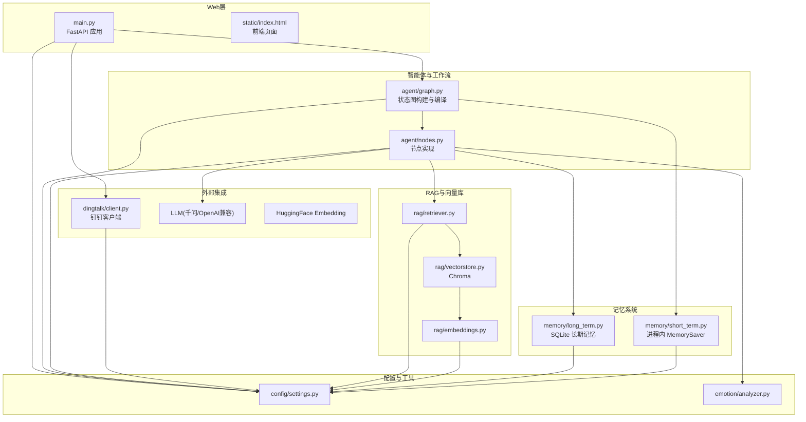
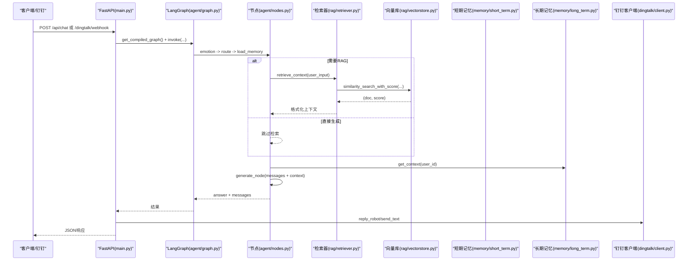
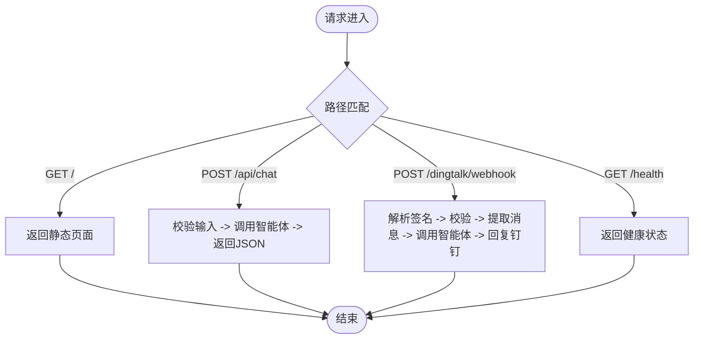
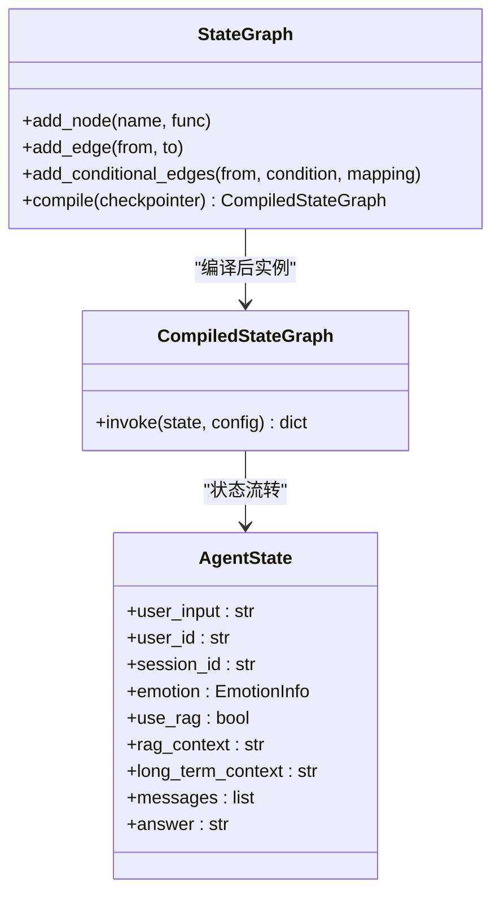
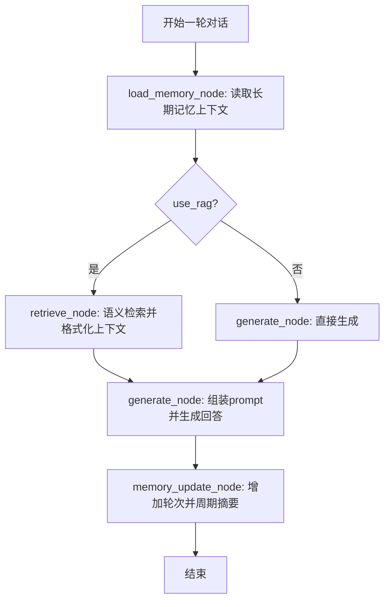
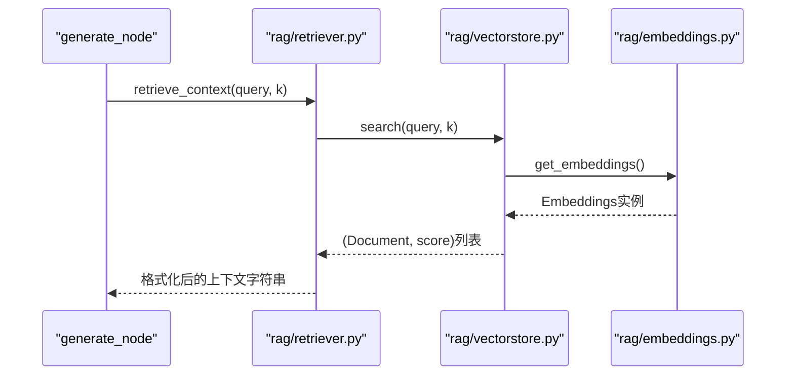
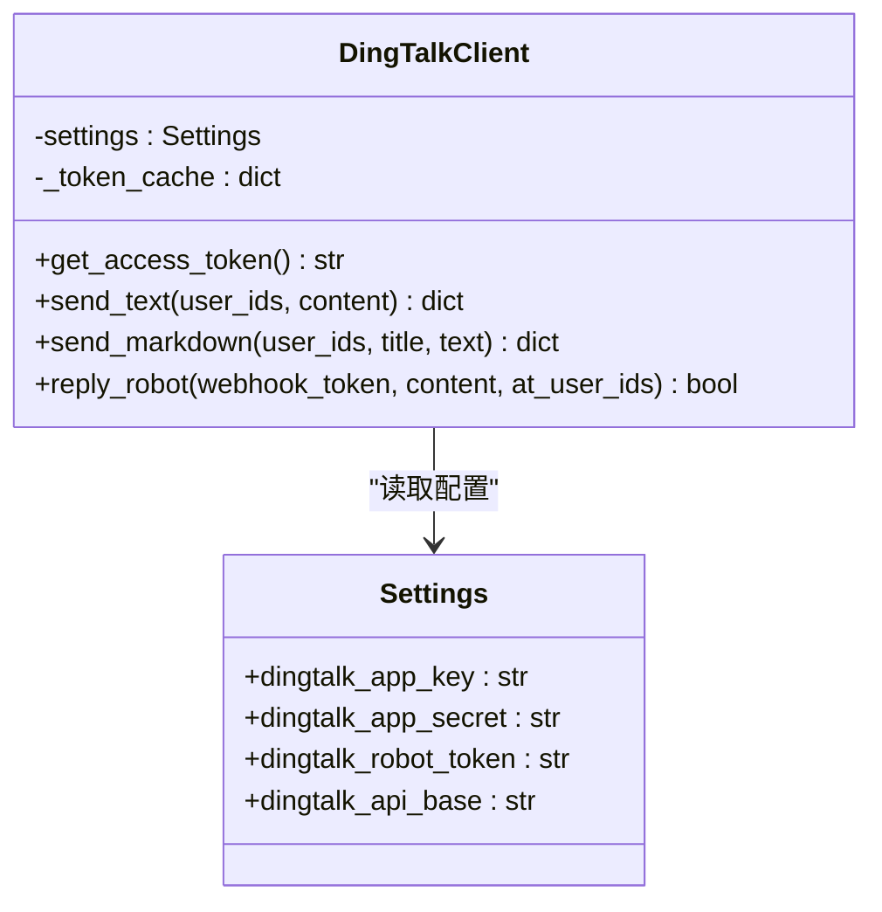
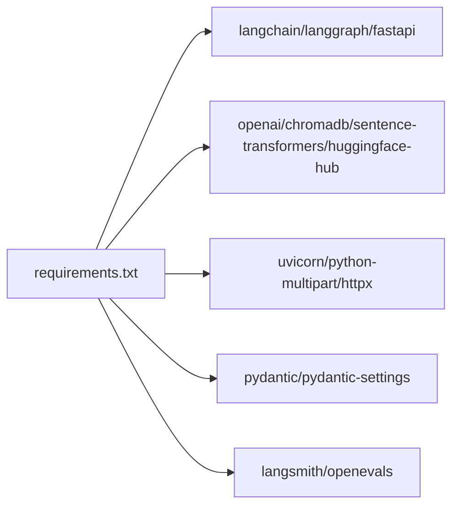

# 部署指南

<cite>
**本文引用的文件**   
- [main.py](file://main.py)
- [requirements.txt](file://requirements.txt)
- [config/settings.py](file://config/settings.py)
- [agent/graph.py](file://agent/graph.py)
- [agent/nodes.py](file://agent/nodes.py)
- [dingtalk/client.py](file://dingtalk/client.py)
- [rag/vectorstore.py](file://rag/vectorstore.py)
- [rag/embeddings.py](file://rag/embeddings.py)
- [rag/retriever.py](file://rag/retriever.py)
- [memory/short_term.py](file://memory/short_term.py)
- [memory/long_term.py](file://memory/long_term.py)
- [emotion/analyzer.py](file://emotion/analyzer.py)
- [.gitignore](file://.gitignore)
</cite>

## 目录
1. [简介](#简介)
2. [项目结构](#项目结构)
3. [核心组件](#核心组件)
4. [架构总览](#架构总览)
5. [详细组件分析](#详细组件分析)
6. [依赖关系分析](#依赖关系分析)
7. [性能考虑](#性能考虑)
8. [故障排查指南](#故障排查指南)
9. [结论](#结论)
10. [附录](#附录)

## 简介
本指南面向希望部署“钉钉AI智能体助手”的工程师与运维人员，提供从环境准备、依赖安装到多种部署方式（本地开发、Docker容器化、生产环境）的完整步骤。文档涵盖服务启动参数与运行模式（Web服务模式、REPL调试模式、后台服务模式）、反向代理配置（Nginx/Apache SSL终止与负载均衡）、日志收集、监控告警与性能调优，以及自动化部署脚本与CI/CD流水线示例。

## 项目结构
项目采用模块化分层组织：
- Web入口与服务编排：main.py
- 配置管理：config/settings.py
- 智能体工作流：agent/graph.py、agent/nodes.py
- 钉钉集成：dingtalk/client.py
- RAG检索与向量库：rag/vectorstore.py、rag/embeddings.py、rag/retriever.py
- 记忆系统：memory/short_term.py、memory/long_term.py
- 情感分析：emotion/analyzer.py
- 依赖清单：requirements.txt
- 静态页面：static/index.html（由主入口返回）



图表来源 
- [main.py:1-236](file://main.py#L1-L236)
- [config/settings.py:1-93](file://config/settings.py#L1-L93)
- [agent/graph.py:1-106](file://agent/graph.py#L1-L106)
- [agent/nodes.py:1-164](file://agent/nodes.py#L1-L164)
- [dingtalk/client.py:1-140](file://dingtalk/client.py#L1-L140)
- [rag/vectorstore.py:1-75](file://rag/vectorstore.py#L1-L75)
- [rag/embeddings.py:1-41](file://rag/embeddings.py#L1-L41)
- [rag/retriever.py:1-38](file://rag/retriever.py#L1-L38)
- [memory/short_term.py:1-28](file://memory/short_term.py#L1-L28)
- [memory/long_term.py:1-244](file://memory/long_term.py#L1-L244)
- [emotion/analyzer.py:1-118](file://emotion/analyzer.py#L1-L118)

章节来源
- [main.py:1-236](file://main.py#L1-L236)
- [requirements.txt:1-31](file://requirements.txt#L1-L31)

## 核心组件
- FastAPI 应用与接口
  - 根路径返回前端页面；健康检查端点；Web聊天接口；钉钉回调处理。
- 智能体工作流（LangGraph）
  - 状态图包含情感分析、路由判断、加载长期记忆、RAG检索、生成回答、更新记忆等节点。
- 记忆系统
  - 短期记忆：进程内 MemorySaver，按会话ID维护上下文。
  - 长期记忆：SQLite持久化，保存用户偏好与对话摘要。
- RAG检索
  - 使用本地HuggingFace Embedding与Chroma向量库，支持相似度检索与分数过滤。
- 钉钉客户端
  - 获取企业access_token、发送工作通知消息、通过机器人webhook回复群消息。
- 配置管理
  - 基于pydantic-settings，从环境变量或.env文件加载全局配置。

章节来源
- [main.py:1-236](file://main.py#L1-L236)
- [agent/graph.py:1-106](file://agent/graph.py#L1-L106)
- [agent/nodes.py:1-164](file://agent/nodes.py#L1-L164)
- [memory/short_term.py:1-28](file://memory/short_term.py#L1-L28)
- [memory/long_term.py:1-244](file://memory/long_term.py#L1-L244)
- [rag/vectorstore.py:1-75](file://rag/vectorstore.py#L1-L75)
- [rag/embeddings.py:1-41](file://rag/embeddings.py#L1-L41)
- [rag/retriever.py:1-38](file://rag/retriever.py#L1-L38)
- [dingtalk/client.py:1-140](file://dingtalk/client.py#L1-L140)
- [config/settings.py:1-93](file://config/settings.py#L1-L93)

## 架构总览
系统以FastAPI为Web入口，接收Web聊天请求与钉钉回调，调用LangGraph状态图执行智能体流程，结合RAG检索与记忆系统生成回答，并通过钉钉客户端回写消息。



图表来源 
- [main.py:58-176](file://main.py#L58-L176)
- [agent/graph.py:25-82](file://agent/graph.py#L25-L82)
- [agent/nodes.py:31-164](file://agent/nodes.py#L31-L164)
- [rag/retriever.py:13-38](file://rag/retriever.py#L13-L38)
- [rag/vectorstore.py:14-75](file://rag/vectorstore.py#L14-L75)
- [memory/short_term.py:13-28](file://memory/short_term.py#L13-L28)
- [memory/long_term.py:150-163](file://memory/long_term.py#L150-L163)
- [dingtalk/client.py:104-127](file://dingtalk/client.py#L104-L127)

## 详细组件分析

### Web服务与接口
- 根路径返回静态HTML页面；健康检查返回服务状态与checkpointer类型；Web聊天接口直接调用智能体；钉钉回调处理签名校验、消息解析、智能体调用与回复。
- 启动参数：
  - --repl：进入本地REPL调试模式
  - 默认：启动uvicorn服务，监听0.0.0.0:8000，开启热重载



图表来源 
- [main.py:49-176](file://main.py#L49-L176)

章节来源
- [main.py:1-236](file://main.py#L1-L236)

### 智能体工作流（LangGraph）
- 状态图节点顺序：START -> emotion -> route -> load_memory -> {retrieve | generate} -> memory_update -> END
- 条件边根据use_rag决定走检索或直接生成
- checkpointer默认使用进程内MemorySaver，按thread_id维护会话上下文



图表来源 
- [agent/graph.py:25-82](file://agent/graph.py#L25-L82)
- [agent/state.py]（未在仓库中列出，但被引用）

章节来源
- [agent/graph.py:1-106](file://agent/graph.py#L1-L106)
- [agent/nodes.py:1-164](file://agent/nodes.py#L1-L164)

### 记忆系统
- 短期记忆：进程内MemorySaver，无需外部服务，按会话ID维护上下文
- 长期记忆：SQLite持久化，保存用户偏好与对话摘要，支持轮次计数与周期性摘要



图表来源 
- [memory/short_term.py:13-28](file://memory/short_term.py#L13-L28)
- [memory/long_term.py:150-163](file://memory/long_term.py#L150-L163)
- [agent/nodes.py:89-164](file://agent/nodes.py#L89-L164)

章节来源
- [memory/short_term.py:1-28](file://memory/short_term.py#L1-L28)
- [memory/long_term.py:1-244](file://memory/long_term.py#L1-L244)

### RAG检索与向量库
- Embedding：本地HuggingFace模型，支持镜像加速与离线缓存
- VectorStore：Chroma，持久化到data/chroma目录，支持相似度检索与分数过滤
- Retriever：封装检索与上下文格式化



图表来源 
- [rag/retriever.py:13-38](file://rag/retriever.py#L13-L38)
- [rag/vectorstore.py:14-75](file://rag/vectorstore.py#L14-L75)
- [rag/embeddings.py:21-41](file://rag/embeddings.py#L21-L41)

章节来源
- [rag/vectorstore.py:1-75](file://rag/vectorstore.py#L1-L75)
- [rag/embeddings.py:1-41](file://rag/embeddings.py#L1-L41)
- [rag/retriever.py:1-38](file://rag/retriever.py#L1-L38)

### 钉钉客户端
- 获取企业access_token（带本地缓存）
- 发送工作通知文本/Markdown消息
- 通过机器人webhook回复群消息



图表来源 
- [dingtalk/client.py:16-140](file://dingtalk/client.py#L16-L140)
- [config/settings.py:49-55](file://config/settings.py#L49-L55)

章节来源
- [dingtalk/client.py:1-140](file://dingtalk/client.py#L1-L140)
- [config/settings.py:1-93](file://config/settings.py#L1-L93)

### 情感分析
- 优先使用LLM进行结构化情感分析，失败时回退到关键词规则分析
- 输出情感标签、置信度与建议语气指引

章节来源
- [emotion/analyzer.py:1-118](file://emotion/analyzer.py#L1-L118)
- [agent/nodes.py:31-43](file://agent/nodes.py#L31-L43)

## 依赖关系分析
- Python版本：建议使用Python 3.10+（基于FastAPI与Pydantic v2要求）
- 核心框架：langchain系列、langgraph、fastapi、uvicorn
- 模型与向量库：openai、chromadb、sentence-transformers、huggingface-hub
- 配置与数据：pydantic、pydantic-settings
- 评估：langsmith、openevals



图表来源 
- [requirements.txt:1-31](file://requirements.txt#L1-L31)

章节来源
- [requirements.txt:1-31](file://requirements.txt#L1-L31)

## 性能考虑
- 向量库与Embedding
  - Chroma持久化到本地磁盘，首次加载可能较慢；建议预热或预加载
  - HuggingFace Embedding默认CPU推理，可考虑GPU加速（需修改model_kwargs中的device）
- LLM调用
  - 合理设置temperature与top_k，避免过长上下文导致延迟
  - 启用连接池与超时控制（httpx已内置）
- 记忆系统
  - SQLite WAL模式提升并发读性能；写操作串行化避免冲突
- 服务部署
  - 使用多进程uvicorn或gunicorn配合多个worker提升吞吐
  - 反向代理启用Gzip压缩与缓存策略

[本节为通用性能指导，不直接分析具体文件]

## 故障排查指南
- 无法访问HuggingFace模型
  - 检查HF_ENDPOINT是否设置为国内镜像；如需离线模式，设置HF_HUB_OFFLINE=1并确保本地已有缓存
- 钉钉回调签名校验失败
  - 确认dingtalk_robot_secret配置正确；检查timestamp与sign参数传递
- 向量库检索为空或相关度低
  - 调整rag_top_k与rag_score_filter阈值；检查文档入库是否成功
- 长期记忆写入失败
  - 检查data/memory.db权限与磁盘空间；确认SQLite WAL模式正常
- 服务无响应或阻塞
  - 确保非异步函数在FastAPI线程池中执行；检查LLM与外部API超时设置

章节来源
- [main.py:106-176](file://main.py#L106-L176)
- [rag/vectorstore.py:48-68](file://rag/vectorstore.py#L48-L68)
- [memory/long_term.py:24-41](file://memory/long_term.py#L24-L41)
- [rag/embeddings.py:16-18](file://rag/embeddings.py#L16-L18)

## 结论
本指南提供了钉钉AI智能体助手的完整部署方案，涵盖环境准备、依赖安装、多种部署方式、反向代理配置、日志监控与性能调优。通过模块化设计与清晰的职责划分，系统具备良好的可扩展性与可维护性。建议在生产环境中结合容器化与CI/CD实现自动化部署与持续集成。

[本节为总结性内容，不直接分析具体文件]

## 附录

### 环境要求与依赖安装
- Python版本：3.10+
- 系统依赖：无特殊系统依赖，需网络访问HuggingFace与钉钉API
- 依赖安装：
  - 创建虚拟环境并激活
  - 安装依赖：pip install -r requirements.txt
  - 可选：设置HF_ENDPOINT与HF_HUB_OFFLINE环境变量

章节来源
- [requirements.txt:1-31](file://requirements.txt#L1-L31)
- [rag/embeddings.py:16-18](file://rag/embeddings.py#L16-L18)

### 服务启动参数与运行模式
- Web服务模式：python main.py（默认启动uvicorn，监听0.0.0.0:8000）
- REPL调试模式：python main.py --repl（交互式测试智能体）
- 后台服务模式：使用systemd或supervisor管理进程，或容器化部署

章节来源
- [main.py:212-236](file://main.py#L212-L236)

### Docker容器化部署
- 基础镜像：python:3.10-slim
- 复制代码与依赖
- 安装依赖：pip install -r requirements.txt
- 暴露端口：8000
- 启动命令：python main.py

```dockerfile
FROM python:3.10-slim
WORKDIR /app
COPY . .
RUN pip install --no-cache-dir -r requirements.txt
EXPOSE 8000
CMD ["python", "main.py"]
```

[本节为概念性说明，不直接映射到具体文件]

### 生产环境部署
- 使用gunicorn或多进程uvicorn提升并发能力
- 配置反向代理（Nginx/Apache）进行SSL终止与负载均衡
- 环境变量配置：.env文件或系统环境变量
- 日志收集：stdout/stderr重定向到日志文件或使用日志采集器

章节来源
- [config/settings.py:19-24](file://config/settings.py#L19-L24)
- [main.py:30-34](file://main.py#L30-L34)

### 反向代理配置（Nginx）
- SSL终止：配置证书与HTTPS监听
- 负载均衡：upstream指向多个后端实例
- 静态资源：缓存static目录
- WebSocket支持：如需实时通信，配置proxy_set_header Upgrade

```nginx
server {
    listen 443 ssl;
    server_name your-domain.com;
    
    ssl_certificate /path/to/cert.pem;
    ssl_certificate_key /path/to/key.pem;
    
    location / {
        proxy_pass http://backend;
        proxy_set_header Host $host;
        proxy_set_header X-Real-IP $remote_addr;
    }
    
    location /static/ {
        alias /app/static/;
        expires 30d;
    }
}

upstream backend {
    server 127.0.0.1:8000;
    server 127.0.0.1:8001;
}
```

[本节为概念性说明，不直接映射到具体文件]

### 日志收集与监控告警
- 应用日志：logging模块输出到stdout，便于容器化收集
- 健康检查：/health端点用于存活探针
- 指标收集：可集成Prometheus导出自定义指标
- 告警规则：基于错误率、延迟、资源使用率设置告警

章节来源
- [main.py:30-34](file://main.py#L30-L34)
- [main.py:94-103](file://main.py#L94-L103)

### 自动化部署脚本与CI/CD流水线
- 本地部署脚本：一键安装依赖、启动服务
- CI/CD流水线：代码提交触发测试、构建镜像、部署到目标环境
- 环境变量管理：使用密钥管理服务存储敏感信息

```bash
#!/bin/bash
# 部署脚本示例
set -e
echo "安装依赖..."
pip install -r requirements.txt
echo "启动服务..."
python main.py &
echo "服务已启动，健康检查: http://localhost:8000/health"
```

[本节为概念性说明，不直接映射到具体文件]

### 配置文件与环境变量
- .env文件示例：
  - LLM配置：llm_model、llm_base_url、llm_api_key
  - Embedding配置：embedding_model
  - 向量库配置：chroma_persist_dir、chroma_collection、rag_top_k、rag_score_filter
  - 记忆配置：long_term_db_path、memory_summary_every
  - 钉钉配置：dingtalk_app_key、dingtalk_app_secret、dingtalk_robot_token、dingtalk_robot_secret、dingtalk_robot_code、dingtalk_api_base
  - LangSmith配置：langsmith_api_key、langsmith_project、langsmith_tracing、langsmith_endpoint

章节来源
- [config/settings.py:26-61](file://config/settings.py#L26-L61)
- [.gitignore:1-15](file://.gitignore#L1-L15)