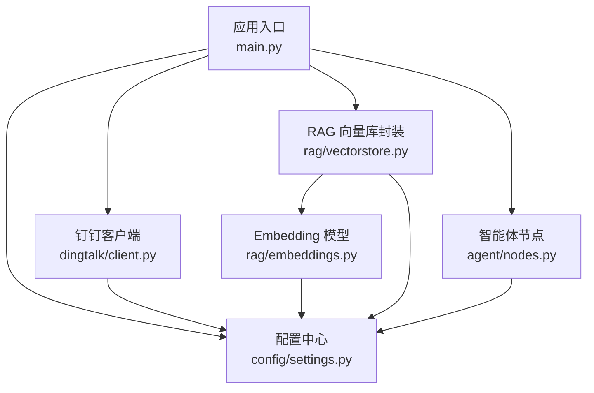
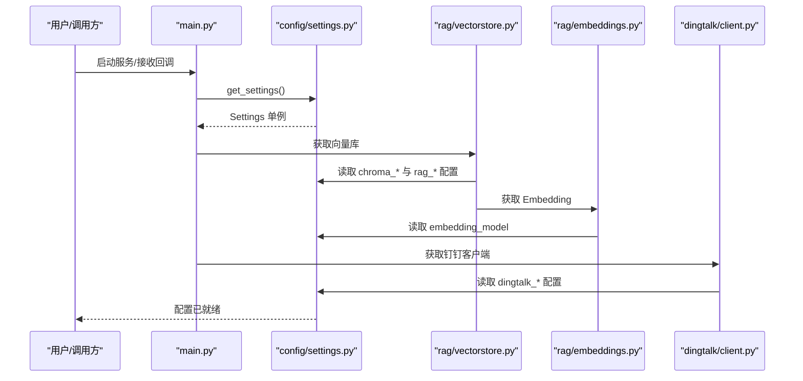
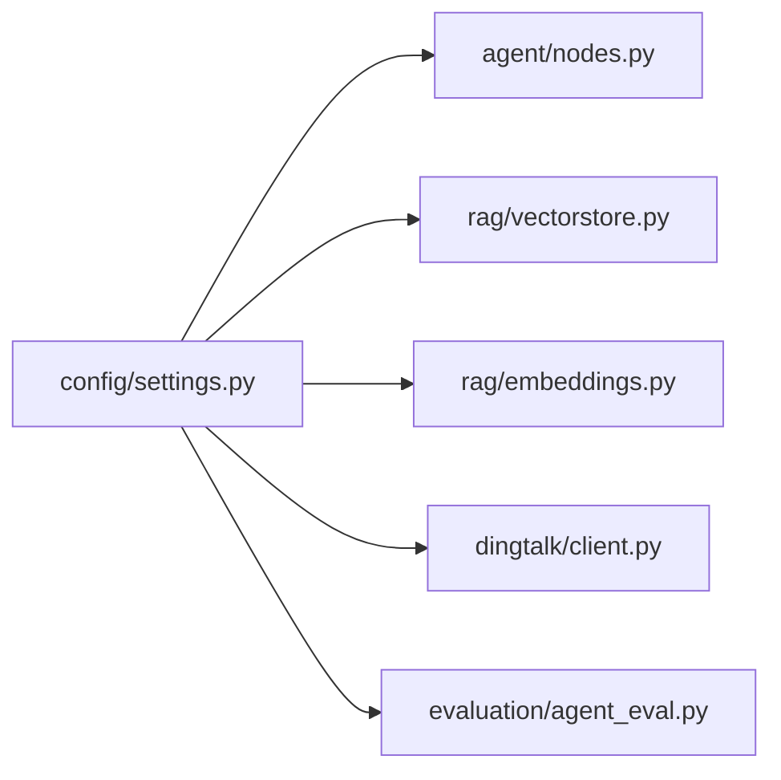

# 配置管理

<cite>
**本文引用的文件**   
- [config/settings.py](file://config/settings.py)
- [main.py](file://main.py)
- [rag/vectorstore.py](file://rag/vectorstore.py)
- [rag/embeddings.py](file://rag/embeddings.py)
- [dingtalk/client.py](file://dingtalk/client.py)
- [agent/nodes.py](file://agent/nodes.py)
- [evaluation/agent_eval.py](file://evaluation/agent_eval.py)
- [requirements.txt](file://requirements.txt)
- [.gitignore](file://.gitignore)
</cite>

## 目录
1. [简介](#简介)
2. [项目结构](#项目结构)
3. [核心组件](#核心组件)
4. [架构总览](#架构总览)
5. [详细组件分析](#详细组件分析)
6. [依赖关系分析](#依赖关系分析)
7. [性能考量](#性能考量)
8. [故障排查指南](#故障排查指南)
9. [结论](#结论)
10. [附录](#附录)

## 简介
本技术文档围绕项目的集中式配置管理系统展开，重点说明基于 pydantic-settings 的全局配置加载机制、环境变量与 .env 文件的优先级与格式、各子系统（LLM、Embedding、向量库、记忆、钉钉、LangSmith）的配置项含义与默认值、热重载与运行时更新策略、不同部署环境的模板差异、配置验证规则与错误处理策略，以及配置迁移与版本兼容性建议。

## 项目结构
配置系统集中在 config/settings.py，通过 get_settings() 提供全局单例；其他模块按需延迟导入并读取配置。主入口 main.py 负责 Web 服务启动与回调处理，并在启动时设置 HuggingFace 镜像环境变量。向量库与 Embedding 模块在初始化时读取配置以构建持久化路径、集合名、检索参数等。

图表来源
- [main.py:112-176](file://main.py#L112-L176)
- [config/settings.py:16-92](file://config/settings.py#L16-L92)
- [rag/vectorstore.py:14-25](file://rag/vectorstore.py#L14-L25)
- [rag/embeddings.py:21-41](file://rag/embeddings.py#L21-L41)
- [dingtalk/client.py:16-23](file://dingtalk/client.py#L16-L23)
- [agent/nodes.py:15-27](file://agent/nodes.py#L15-L27)

章节来源
- [config/settings.py:1-92](file://config/settings.py#L1-L92)
- [main.py:12-18](file://main.py#L12-L18)
- [rag/vectorstore.py:14-25](file://rag/vectorstore.py#L14-L25)
- [rag/embeddings.py:16-18](file://rag/embeddings.py#L16-L18)
- [dingtalk/client.py:16-23](file://dingtalk/client.py#L16-L23)
- [agent/nodes.py:15-27](file://agent/nodes.py#L15-L27)

## 核心组件
- Settings 类：集中定义所有配置字段与默认值，使用 pydantic-settings 从环境变量与 .env 文件加载，支持类型校验与路径解析。
- get_settings()：返回缓存的单例实例，避免重复创建与 IO 开销。
- 路径属性：chroma_persist_path、long_term_db_file、docs_dir 自动解析为绝对路径并确保目录存在。
- 外部集成点：LLM（OpenAI 兼容）、Embedding（HuggingFace）、ChromaDB、SQLite 长期记忆、钉钉 API、LangSmith 追踪。

章节来源
- [config/settings.py:16-92](file://config/settings.py#L16-L92)

## 架构总览
配置加载与使用流程如下：
- 应用启动或首次调用 get_settings() 时，pydantic-settings 按优先级读取环境变量与 .env 文件。
- 各模块通过延迟导入获取 Settings 单例，构造 LLM、Embedding、向量库、钉钉客户端等对象。
- 主入口 uvicorn 启用 --reload，配合 reload_includes/reload_excludes 实现代码级热重载；配置本身在进程内缓存，需重启进程生效。

图表来源
- [main.py:112-176](file://main.py#L112-L176)
- [config/settings.py:16-92](file://config/settings.py#L16-L92)
- [rag/vectorstore.py:14-25](file://rag/vectorstore.py#L14-L25)
- [rag/embeddings.py:21-41](file://rag/embeddings.py#L21-L41)
- [dingtalk/client.py:16-23](file://dingtalk/client.py#L16-L23)

## 详细组件分析

### 配置类与字段说明（Settings）
- 大语言模型（LLM）
  - llm_model: 字符串，默认 qwen-plus
  - llm_base_url: 字符串，默认千问 OpenAI 兼容接口地址
  - llm_api_key: 字符串，默认占位符，需替换为真实密钥
  - llm_temperature: 浮点数，默认 0.7
  - llm_judge_model: 字符串，默认 qwen-plus（评估用）
- Embedding
  - embedding_model: 字符串，默认 BAAI/bge-small-zh-v1.5
- 向量库（Chroma）
  - chroma_persist_dir: 字符串，默认 data/chroma
  - chroma_collection: 字符串，默认 dingtalk_kb
  - rag_top_k: 整数，默认 4
  - rag_score_filter: 浮点数，默认 1.2（距离阈值，越小越相关）
- 记忆（长期/短期）
  - long_term_db_path: 字符串，默认 data/memory.db
  - memory_summary_every: 整数，默认 6（触发摘要的轮次间隔）
- 钉钉企业应用/机器人
  - dingtalk_app_key: 字符串，默认空
  - dingtalk_app_secret: 字符串，默认空
  - dingtalk_robot_token: 字符串，默认空
  - dingtalk_robot_secret: 字符串，默认空
  - dingtalk_robot_code: 字符串，默认空
  - dingtalk_api_base: 字符串，默认 https://oapi.dingtalk.com
- LangSmith 评估与追踪
  - langsmith_api_key: 字符串，默认空
  - langsmith_project: 字符串，默认 dingtalk-ai-agent
  - langsmith_tracing: 布尔，默认 False
  - langsmith_endpoint: 字符串，默认 https://api.smith.langchain.com

注意：
- 路径属性会自动将相对路径转换为项目根下的绝对路径，并保证目录存在。
- 大小写不敏感，忽略多余环境变量。

章节来源
- [config/settings.py:16-92](file://config/settings.py#L16-L92)

### 环境变量与 .env 文件
- 加载优先级：环境变量 > .env 文件
- .env 位置：项目根目录（PROJECT_ROOT / ".env"），编码 utf-8
- 最佳实践：
  - 将敏感信息（API Key、Secret）放入 .env，并将 .env 加入 .gitignore
  - 生产环境优先通过平台环境变量注入，避免落盘
  - 保持键名与 Settings 字段一致（大小写不敏感）
  - 使用注释区分不同环境配置块，便于维护

章节来源
- [config/settings.py:19-24](file://config/settings.py#L19-L24)
- [.gitignore:1-15](file://.gitignore#L1-L15)

### 热重载与运行时配置更新
- 代码热重载：uvicorn 启动时启用 --reload，并配置了 include/exclude 列表，修改 .py 文件可自动重载
- 配置热重载：Settings 单例通过 lru_cache 缓存，进程内不会自动重新加载 .env 或环境变量；如需动态切换，应重启进程或通过进程外方式注入新环境变量后重启

章节来源
- [main.py:224-231](file://main.py#L224-L231)
- [config/settings.py:89-92](file://config/settings.py#L89-L92)

### 配置验证与错误处理
- 类型校验：pydantic 自动进行字段类型转换与校验
- 缺失必填项：如关键密钥未配置，下游模块会记录警告或返回空结果（例如钉钉 token 获取失败）
- 网络异常：httpx 请求异常被捕获并记录日志，返回错误码或空串
- 签名校验：钉钉回调签名失败返回 403，防止非法请求

章节来源
- [dingtalk/client.py:35-56](file://dingtalk/client.py#L35-L56)
- [main.py:129-136](file://main.py#L129-L136)

### 不同部署环境的配置模板
- 开发环境
  - 使用本地 .env 存放测试密钥
  - HF_ENDPOINT 指向国内镜像加速下载
  - Chroma 数据目录位于 data/chroma
  - 开启 uvicorn --reload
- 测试环境
  - 通过 CI/CD 注入环境变量
  - 关闭 LangSmith tracing 或指向测试项目
  - 限制 rag_top_k 与 rag_score_filter 以加快评估
- 生产环境
  - 严格通过平台环境变量注入密钥
  - 使用独立数据库路径与向量库目录
  - 关闭调试输出，开启必要监控与追踪（可选 LangSmith）

[本节为概念性说明，不直接分析具体文件]

### 配置迁移与版本兼容性
- pydantic-settings 升级：确保 pydantic 与 pydantic-settings 版本匹配（见 requirements.txt）
- 新增字段：向后兼容，旧环境忽略未知字段（extra="ignore"）
- 字段重命名：需在迁移脚本中统一替换，避免破坏现有 .env
- 路径变更：若调整 data 目录结构，需同步更新默认值与部署脚本

章节来源
- [requirements.txt:24-26](file://requirements.txt#L24-L26)
- [config/settings.py:19-24](file://config/settings.py#L19-L24)

## 依赖关系分析
- 配置中心被多个模块依赖：
  - agent/nodes.py：读取 LLM 配置
  - rag/vectorstore.py：读取向量库与检索参数
  - rag/embeddings.py：读取 Embedding 模型名称
  - dingtalk/client.py：读取钉钉 API 基础 URL 与凭据
  - evaluation/agent_eval.py：读取评判模型与 LangSmith 配置

图表来源
- [config/settings.py:16-92](file://config/settings.py#L16-L92)
- [agent/nodes.py:15-27](file://agent/nodes.py#L15-L27)
- [rag/vectorstore.py:14-25](file://rag/vectorstore.py#L14-L25)
- [rag/embeddings.py:21-41](file://rag/embeddings.py#L21-L41)
- [dingtalk/client.py:16-23](file://dingtalk/client.py#L16-L23)
- [evaluation/agent_eval.py:22-30](file://evaluation/agent_eval.py#L22-L30)

章节来源
- [config/settings.py:16-92](file://config/settings.py#L16-L92)
- [agent/nodes.py:15-27](file://agent/nodes.py#L15-L27)
- [rag/vectorstore.py:14-25](file://rag/vectorstore.py#L14-L25)
- [rag/embeddings.py:21-41](file://rag/embeddings.py#L21-L41)
- [dingtalk/client.py:16-23](file://dingtalk/client.py#L16-L23)
- [evaluation/agent_eval.py:22-30](file://evaluation/agent_eval.py#L22-L30)

## 性能考量
- 单例缓存：get_settings() 使用 lru_cache，减少重复初始化
- 向量库持久化：Chroma 写入磁盘，避免重复构建索引
- Embedding 模型：CPU 推理，首次下载权重到本地缓存，后续离线可用
- 网络请求：钉钉 access_token 本地缓存，减少频繁请求

[本节为通用指导，不直接分析具体文件]

## 故障排查指南
- 无法连接 LLM：检查 llm_api_key、llm_base_url 是否正确；确认网络可达
- 向量库为空或检索不到：确认 chroma_persist_dir 与 chroma_collection；检查 rag_top_k 与 rag_score_filter
- 钉钉消息发送失败：检查 app_key/app_secret 与 robot_token；查看日志中的 errcode 与 errmsg
- 签名校验失败：核对 dingtalk_robot_secret 与 timestamp/sign 参数
- LangSmith 不可用：确认 langsmith_api_key 与 endpoint；未配置时跳过集成

章节来源
- [dingtalk/client.py:35-56](file://dingtalk/client.py#L35-L56)
- [main.py:129-136](file://main.py#L129-L136)
- [rag/vectorstore.py:48-68](file://rag/vectorstore.py#L48-L68)
- [evaluation/agent_eval.py:77-93](file://evaluation/agent_eval.py#L77-L93)

## 结论
本项目采用集中式配置管理，借助 pydantic-settings 实现了强类型、易维护、可扩展的配置体系。通过环境变量与 .env 文件灵活适配多环境，结合单例缓存与路径解析提升运行效率与健壮性。在生产部署中，建议严格通过环境变量注入敏感信息，并结合监控与日志完善问题定位能力。

[本节为总结性内容，不直接分析具体文件]

## 附录
- 环境变量示例（.env）
  - LLM：llm_model、llm_base_url、llm_api_key、llm_temperature、llm_judge_model
  - Embedding：embedding_model
  - 向量库：chroma_persist_dir、chroma_collection、rag_top_k、rag_score_filter
  - 记忆：long_term_db_path、memory_summary_every
  - 钉钉：dingtalk_app_key、dingtalk_app_secret、dingtalk_robot_token、dingtalk_robot_secret、dingtalk_robot_code、dingtalk_api_base
  - LangSmith：langsmith_api_key、langsmith_project、langsmith_tracing、langsmith_endpoint
- 启动命令
  - 开发：uvicorn main:app --host 0.0.0.0 --port 8000 --reload
  - REPL：python main.py --repl

[本节为补充说明，不直接分析具体文件]