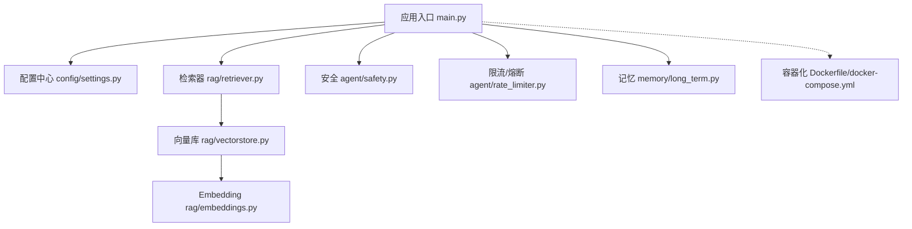
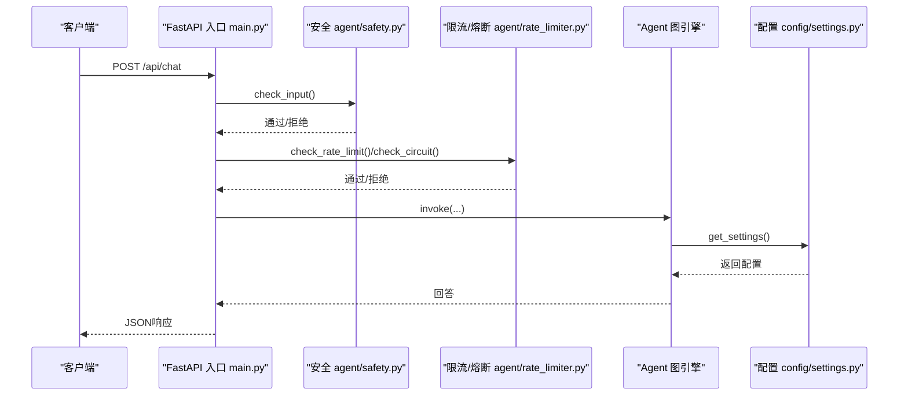
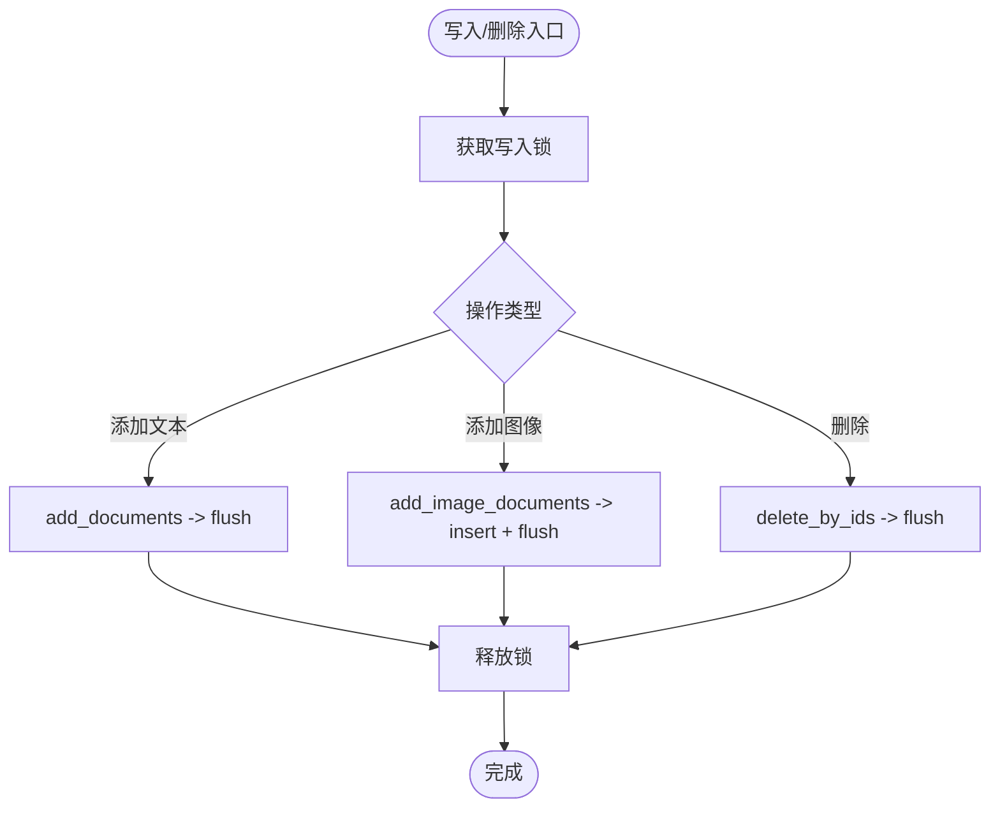
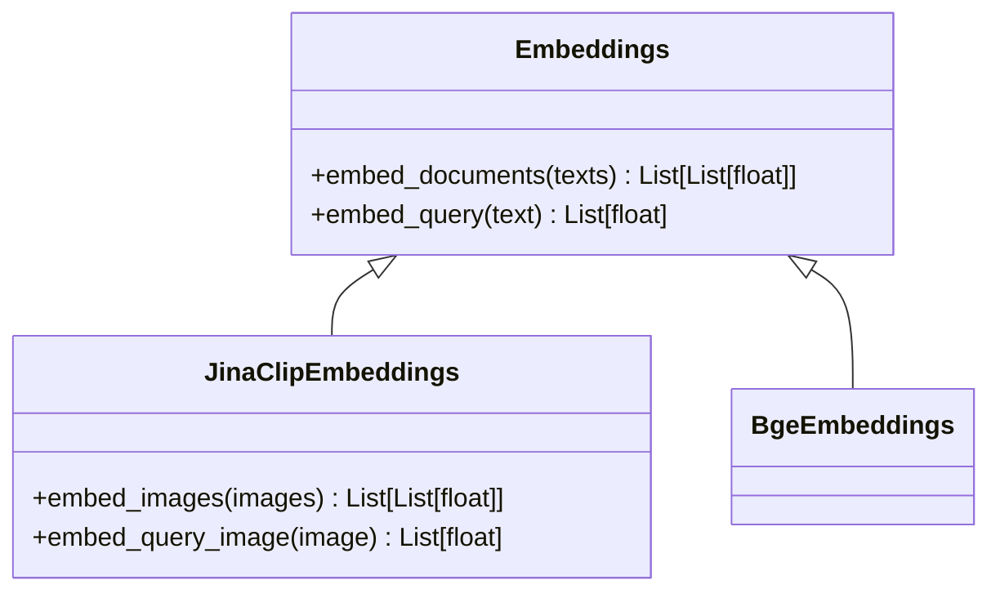
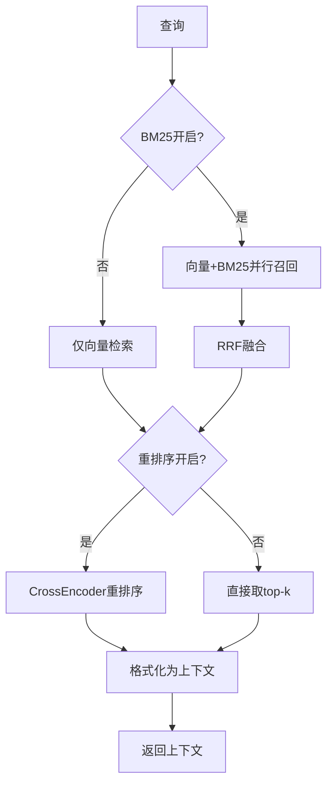
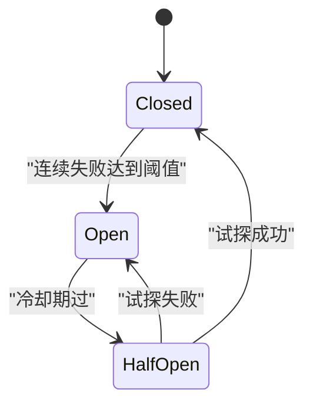
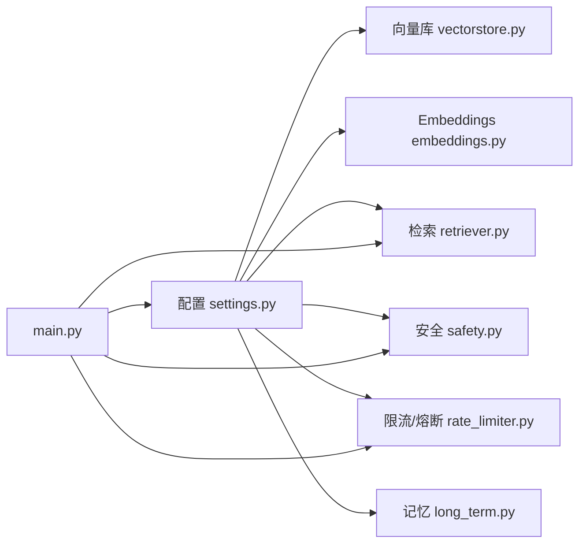

# 配置管理

<cite>
**本文引用的文件**
- [config/settings.py](file://config/settings.py)
- [main.py](file://main.py)
- [rag/vectorstore.py](file://rag/vectorstore.py)
- [rag/embeddings.py](file://rag/embeddings.py)
- [rag/retriever.py](file://rag/retriever.py)
- [agent/safety.py](file://agent/safety.py)
- [agent/rate_limiter.py](file://agent/rate_limiter.py)
- [memory/long_term.py](file://memory/long_term.py)
- [requirements.txt](file://requirements.txt)
- [Dockerfile](file://Dockerfile)
- [docker-compose.yml](file://docker-compose.yml)
</cite>

## 目录
1. [简介](#简介)
2. [项目结构](#项目结构)
3. [核心组件](#核心组件)
4. [架构总览](#架构总览)
5. [详细组件分析](#详细组件分析)
6. [依赖关系分析](#依赖关系分析)
7. [性能考虑](#性能考虑)
8. [故障排查指南](#故障排查指南)
9. [结论](#结论)
10. [附录：部署环境配置示例与最佳实践](#附录部署环境配置示例与最佳实践)

## 简介
本配置管理文档面向钉钉AI智能体助手项目的可配置项，系统性说明各配置项的含义、默认值、使用方式与调优建议。重点覆盖：
- LLM模型配置（主模型、路由小模型、评判模型、超时与重试）
- 向量数据库设置（Milvus Lite 本地持久化、索引与度量）
- RAG参数调优（检索top-k、分数过滤、切片大小、多路召回、重排序）
- 安全策略配置（输入过滤、注入检测）
- 限流与熔断、记忆系统、OCR与联网搜索等运行时开关
同时提供开发、测试、生产环境的配置示例、最佳实践与故障排查指导。

## 项目结构
本项目采用模块化组织，配置集中由配置模块统一加载，其他模块按需读取。关键路径：
- 配置中心：config/settings.py
- 启动入口与服务：main.py
- 向量库封装：rag/vectorstore.py
- Embedding实现：rag/embeddings.py
- 检索流程：rag/retriever.py
- 安全过滤：agent/safety.py
- 限流与熔断：agent/rate_limiter.py
- 长期记忆：memory/long_term.py
- 容器化：Dockerfile、docker-compose.yml
- 依赖清单：requirements.txt

图表来源
- [main.py:45-135](file://main.py#L45-L135)
- [config/settings.py:19-215](file://config/settings.py#L19-L215)
- [rag/retriever.py:18-52](file://rag/retriever.py#L18-L52)
- [rag/vectorstore.py:29-76](file://rag/vectorstore.py#L29-L76)
- [rag/embeddings.py:164-179](file://rag/embeddings.py#L164-L179)
- [agent/safety.py:35-67](file://agent/safety.py#L35-L67)
- [agent/rate_limiter.py:22-47](file://agent/rate_limiter.py#L22-L47)
- [memory/long_term.py:30-47](file://memory/long_term.py#L30-L47)
- [Dockerfile:41-50](file://Dockerfile#L41-L50)
- [docker-compose.yml:5-25](file://docker-compose.yml#L5-L25)

章节来源
- [config/settings.py:19-215](file://config/settings.py#L19-L215)
- [main.py:45-135](file://main.py#L45-L135)

## 核心组件
- 配置中心（Settings）：基于 pydantic-settings，从环境变量或 .env 加载全局配置；提供属性解析（如列表拆分、路径规范化）。
- 向量库（Milvus Lite）：本地文件持久化，支持文本与图像混合存储，延迟初始化与写入锁保护。
- Embedding：支持多模态（Jina CLIP v2）与纯文本（BGE），按配置自动选择。
- 检索器：支持向量检索、BM25多路召回、RRF融合、CrossEncoder重排序。
- 安全过滤：关键词黑名单与prompt注入检测。
- 限流与熔断：按用户滑动窗口限流；连续失败触发熔断并半开试探。
- 长期记忆：SQLite持久化，分层上下文构建与问答缓存。

章节来源
- [config/settings.py:19-215](file://config/settings.py#L19-L215)
- [rag/vectorstore.py:29-76](file://rag/vectorstore.py#L29-L76)
- [rag/embeddings.py:164-179](file://rag/embeddings.py#L164-L179)
- [rag/retriever.py:18-52](file://rag/retriever.py#L18-L52)
- [agent/safety.py:35-67](file://agent/safety.py#L35-L67)
- [agent/rate_limiter.py:22-47](file://agent/rate_limiter.py#L22-L47)
- [memory/long_term.py:30-47](file://memory/long_term.py#L30-L47)

## 架构总览
服务启动时进行LLM连接预热与向量库检查/入库，随后暴露Web接口。请求进入后依次执行安全过滤、限流、熔断检查，再调用图引擎生成回答。

图表来源
- [main.py:154-209](file://main.py#L154-L209)
- [agent/safety.py:35-67](file://agent/safety.py#L35-L67)
- [agent/rate_limiter.py:22-47](file://agent/rate_limiter.py#L22-L47)
- [config/settings.py:212-215](file://config/settings.py#L212-L215)

## 详细组件分析

### 配置中心（Settings）
- 加载优先级：环境变量 > .env 文件；忽略多余字段；不区分大小写。
- 关键属性与默认值（节选）：
  - LLM：模型名、基地址、API Key、温度、评判模型、路由小模型、最大重试次数、请求超时、降级模型、备用模型列表、流式整体超时。
  - Embedding：模型名、设备（cpu/gpu）。
  - 向量库：本地DB文件路径、集合名、索引类型、距离度量、检索top-k、分数过滤阈值、最低相关度、切片大小与重叠、知识文档目录。
  - 自动同步：开启开关、防抖时间。
  - 多路召回：BM25开关、候选数、RRF常数。
  - 查询改写：开关。
  - 重排序：开关、模型、设备、候选数、top-k。
  - OCR：语言列表、GPU开关、最小文本长度、支持扩展名。
  - 联网搜索：开关、最大结果数、超时。
  - 记忆：长期记忆DB路径、摘要频率、上下文字符预算、短期历史窗口与预算、RAG上下文预算、结构化抽取开关、问答缓存开关与阈值、最大记录数。
  - 安全：输入过滤开关、敏感词黑名单、注入检测开关。
  - 限流与熔断：每分钟请求上限、熔断阈值、恢复冷却时间。
  - 工具调用：总开关、写操作确认。
  - LangSmith：API Key、项目、追踪开关、端点。
- 便捷属性：
  - ocr_language_list、supported_extensions_list、input_blocked_keywords_list：逗号分隔字符串转列表。
  - milvus_db_path、long_term_db_file、docs_dir：相对路径转绝对路径并自动创建目录。

章节来源
- [config/settings.py:19-215](file://config/settings.py#L19-L215)

### 向量数据库（Milvus Lite）
- 延迟初始化：首次访问时才创建 Milvus 实例，避免启动阻塞。
- 本地持久化：通过 uri 指向 .db 文件启用 Milvus Lite，无需独立服务。
- 写入并发保护：add/add_image/delete_by_ids 使用线程锁，避免文件监听消费线程与检索路径并发写入冲突。
- gRPC keepalive：禁用空闲ping，防止长耗时模型加载期间频繁ping导致断连。
- 动态字段：enable_dynamic_field=True，支持文本/图像异构metadata共存。
- 检索过滤：search 内置分数过滤，低于阈值的文档丢弃。

图表来源
- [rag/vectorstore.py:79-106](file://rag/vectorstore.py#L79-L106)
- [rag/vectorstore.py:109-161](file://rag/vectorstore.py#L109-L161)
- [rag/vectorstore.py:225-246](file://rag/vectorstore.py#L225-L246)

章节来源
- [rag/vectorstore.py:29-76](file://rag/vectorstore.py#L29-L76)
- [rag/vectorstore.py:79-106](file://rag/vectorstore.py#L79-L106)
- [rag/vectorstore.py:109-161](file://rag/vectorstore.py#L109-L161)
- [rag/vectorstore.py:164-184](file://rag/vectorstore.py#L164-L184)
- [rag/vectorstore.py:225-246](file://rag/vectorstore.py#L225-L246)

### Embedding（多模态与纯文本）
- 多模态：Jina CLIP v2，文本与图像映射到同一向量空间，支持跨模态检索。
- 纯文本：BGE（sentence-transformers），CPU下速度更快。
- 自动选择：根据 embedding_model 是否包含“bge”决定使用 BgeEmbeddings 或 JinaClipEmbeddings。
- 设备与离线：可通过环境变量控制设备与离线模式（见Dockerfile）。

图表来源
- [rag/embeddings.py:29-128](file://rag/embeddings.py#L29-L128)
- [rag/embeddings.py:131-161](file://rag/embeddings.py#L131-L161)
- [rag/embeddings.py:164-179](file://rag/embeddings.py#L164-L179)

章节来源
- [rag/embeddings.py:164-179](file://rag/embeddings.py#L164-L179)

### 检索器（Retriever）
- 两阶段检索：向量检索召回候选 → CrossEncoder精排取top-k。
- 多路召回：可选开启 BM25，与向量检索并行，RRF融合后再重排序。
- 上下文格式化：将检索结果格式化为带来源与相关度的文本块。

图表来源
- [rag/retriever.py:18-52](file://rag/retriever.py#L18-L52)
- [rag/retriever.py:55-110](file://rag/retriever.py#L55-L110)
- [rag/retriever.py:113-140](file://rag/retriever.py#L113-L140)

章节来源
- [rag/retriever.py:18-52](file://rag/retriever.py#L18-L52)
- [rag/retriever.py:55-110](file://rag/retriever.py#L55-L110)
- [rag/retriever.py:113-140](file://rag/retriever.py#L113-L140)

### 安全策略（输入过滤）
- 关键词黑名单：命中则拒绝，原因提示不暴露敏感词。
- Prompt注入检测：匹配常见注入模式（中英文），拦截可疑输入。
- 开关：需显式开启 INPUT_FILTER_ENABLED=true 才生效。

章节来源
- [agent/safety.py:35-67](file://agent/safety.py#L35-L67)

### 限流与熔断
- 限流：按 user_id 的滑动窗口（分钟级），超过阈值返回429。
- 熔断：连续失败达阈值进入open状态，冷却后half_open试探一次，成功则closed，失败继续open。
- 健康检查：/health 返回服务状态与检查点类型。

图表来源
- [agent/rate_limiter.py:50-117](file://agent/rate_limiter.py#L50-L117)

章节来源
- [agent/rate_limiter.py:22-47](file://agent/rate_limiter.py#L22-L47)
- [agent/rate_limiter.py:50-117](file://agent/rate_limiter.py#L50-L117)
- [main.py:317-326](file://main.py#L317-L326)

### 长期记忆
- SQLite持久化，WAL模式提升并发读能力。
- 分层上下文构建：P0画像与关键事实硬保留，P1/P2按预算填充。
- 问答缓存：相似问题直接复用历史答案，减少大模型调用。

章节来源
- [memory/long_term.py:30-47](file://memory/long_term.py#L30-L47)
- [memory/long_term.py:424-497](file://memory/long_term.py#L424-L497)
- [memory/long_term.py:729-800](file://memory/long_term.py#L729-L800)

## 依赖关系分析
- 配置中心被多个模块在运行时读取，形成松耦合依赖。
- 向量库与Embedding解耦，通过接口适配不同模型。
- 检索器组合向量检索、BM25、重排序，灵活切换。
- 安全、限流、熔断作为前置守卫，保障服务稳定性。
- 容器化镜像预下载模型，运行时无网络依赖。

图表来源
- [config/settings.py:19-215](file://config/settings.py#L19-L215)
- [rag/vectorstore.py:29-76](file://rag/vectorstore.py#L29-L76)
- [rag/embeddings.py:164-179](file://rag/embeddings.py#L164-L179)
- [rag/retriever.py:18-52](file://rag/retriever.py#L18-L52)
- [agent/safety.py:35-67](file://agent/safety.py#L35-L67)
- [agent/rate_limiter.py:22-47](file://agent/rate_limiter.py#L22-L47)
- [memory/long_term.py:30-47](file://memory/long_term.py#L30-L47)
- [main.py:45-135](file://main.py#L45-L135)

章节来源
- [requirements.txt:1-53](file://requirements.txt#L1-L53)
- [Dockerfile:19-45](file://Dockerfile#L19-L45)
- [docker-compose.yml:5-25](file://docker-compose.yml#L5-L25)

## 性能考虑
- 首请求延迟优化：启动时预热LLM连接（TLS握手、DNS解析、连接池建立），显著降低首条请求延迟。
- 向量库预热：启动时检查并增量/全量入库，避免首请求阻塞；BM25索引预热（开启多路召回时）。
- 模型加载：Embedding与重排序模型首次加载耗时较长，gRPC keepalive已调整以避免误断连。
- 内存与预算：记忆上下文与RAG上下文均设字符预算，避免超长上下文影响生成质量与性能。
- 并发与锁：写入操作加锁，避免文件监听与检索并发冲突；SQLite WAL提升读并发。

章节来源
- [main.py:45-135](file://main.py#L45-L135)
- [rag/vectorstore.py:48-56](file://rag/vectorstore.py#L48-L56)
- [rag/embeddings.py:49-65](file://rag/embeddings.py#L49-L65)
- [memory/long_term.py:30-47](file://memory/long_term.py#L30-L47)

## 故障排查指南
- 向量库为空但存在清单：启动时会触发全量重建；若仍为空，检查数据目录权限与磁盘空间。
- 模型下载失败：确保HF_ENDPOINT与PIP_INDEX_URL正确；构建镜像时已预下载模型，运行时应离线。
- 流式超时：stream_timeout控制整体超时，超时后返回已生成token；检查LLM请求超时与网络状况。
- 限流/熔断：rate_limit_per_minute与circuit_breaker_threshold为0表示关闭；若频繁429/503，检查阈值与下游服务健康。
- 安全拦截：INPUT_FILTER_ENABLED=false关闭过滤；若误拦，检查敏感词与注入模式配置。
- 健康检查：/health返回服务状态与检查点类型，用于容器健康探针。

章节来源
- [main.py:80-135](file://main.py#L80-L135)
- [main.py:228-314](file://main.py#L228-L314)
- [agent/rate_limiter.py:22-47](file://agent/rate_limiter.py#L22-L47)
- [agent/rate_limiter.py:50-117](file://agent/rate_limiter.py#L50-L117)
- [agent/safety.py:35-67](file://agent/safety.py#L35-L67)
- [main.py:317-326](file://main.py#L317-L326)

## 结论
本配置体系以配置中心为核心，围绕LLM、向量库、检索、安全、限流熔断、记忆等子系统提供全面可调参数。通过合理的默认值与环境变量注入，可在不同部署环境中快速适配。结合启动预热、模型离线、写入锁与上下文预算等机制，系统在可用性与性能之间取得平衡。建议在生产环境启用安全过滤、限流与熔断，并根据业务需求调优RAG参数与重排序策略。

## 附录：部署环境配置示例与最佳实践

### 开发环境
- 目标：快速迭代、便于调试。
- 建议配置要点：
  - LLM：使用轻量路由模型与较低温度，缩短响应时间。
  - 向量库：使用本地Milvus Lite，集合名保持默认。
  - 检索：关闭BM25与重排序，减少资源占用。
  - 安全：关闭输入过滤，避免干扰调试。
  - 限流/熔断：关闭（阈值<=0）。
  - 记忆：关闭问答缓存，便于观察完整链路。
  - 日志：提高日志级别以便定位问题。
- 参考：[config/settings.py:29-161](file://config/settings.py#L29-L161)

### 测试环境
- 目标：验证功能与边界条件。
- 建议配置要点：
  - LLM：启用重试与降级模型，增强鲁棒性。
  - 向量库：启用自动同步与防抖，模拟真实变更场景。
  - 检索：开启BM25与重排序，评估召回与排序效果。
  - 安全：开启注入检测，验证拦截逻辑。
  - 限流/熔断：设置合理阈值，验证限流与熔断行为。
  - 记忆：启用问答缓存，验证命中率与淘汰策略。
- 参考：[config/settings.py:77-161](file://config/settings.py#L77-L161)

### 生产环境
- 目标：高可用、高性能、安全合规。
- 建议配置要点：
  - LLM：设置合理超时与重试，启用降级模型与备用模型列表。
  - 向量库：固定集合名与索引类型，监控磁盘与连接数。
  - 检索：开启重排序，适当调整候选数与top-k，平衡精度与延迟。
  - 安全：开启输入过滤与注入检测，配置敏感词黑名单。
  - 限流/熔断：设置每分钟请求上限与熔断阈值，冷却时间适中。
  - 记忆：设置合适的上下文预算与问答缓存阈值，控制成本。
  - 容器化：使用预构建镜像，挂载data目录持久化。
- 参考：[Dockerfile:41-50](file://Dockerfile#L41-L50)、[docker-compose.yml:5-25](file://docker-compose.yml#L5-L25)、[config/settings.py:29-161](file://config/settings.py#L29-L161)

### 配置最佳实践
- 使用环境变量注入敏感信息（如API Key），避免提交到代码库。
- 分环境维护.env或配置中心，避免硬编码。
- 逐步开启高级特性（BM25、重排序、问答缓存），观察指标后再推广。
- 定期评估RAG参数（top-k、分数过滤、切片大小）对召回与生成的影响。
- 监控LLM调用成功率与延迟，必要时调整重试与超时。
- 使用健康检查端点进行容器编排与健康探测。

### 配置验证与调优建议
- 启动验证：访问/health确认服务状态；检查日志中向量库初始化与模型加载信息。
- 检索验证：构造典型查询，观察检索结果数量与相关度，调整rag_top_k与rag_score_filter。
- 重排序验证：对比开启/关闭重排序的效果，调整rerank_candidate_count与rerank_top_k。
- 安全验证：构造注入样例，确认拦截逻辑有效；调整敏感词与注入模式。
- 限流/熔断验证：模拟高频请求，验证限流与熔断行为；调整阈值与冷却时间。
- 记忆验证：观察问答缓存命中率与淘汰策略，调整threshold与max_records。

章节来源
- [config/settings.py:29-161](file://config/settings.py#L29-L161)
- [main.py:317-326](file://main.py#L317-L326)
- [rag/retriever.py:18-52](file://rag/retriever.py#L18-L52)
- [agent/safety.py:35-67](file://agent/safety.py#L35-L67)
- [agent/rate_limiter.py:22-47](file://agent/rate_limiter.py#L22-L47)
- [memory/long_term.py:729-800](file://memory/long_term.py#L729-L800)