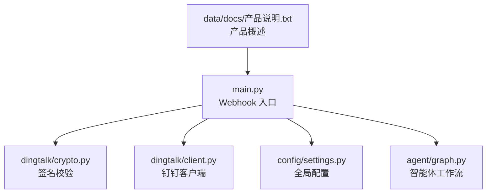
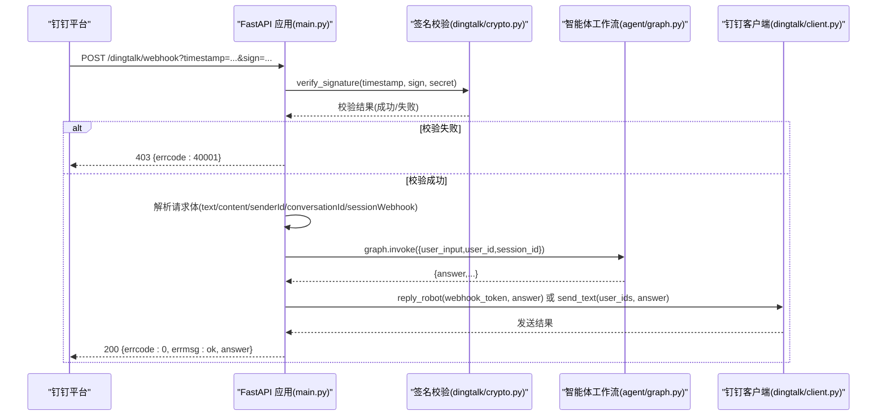
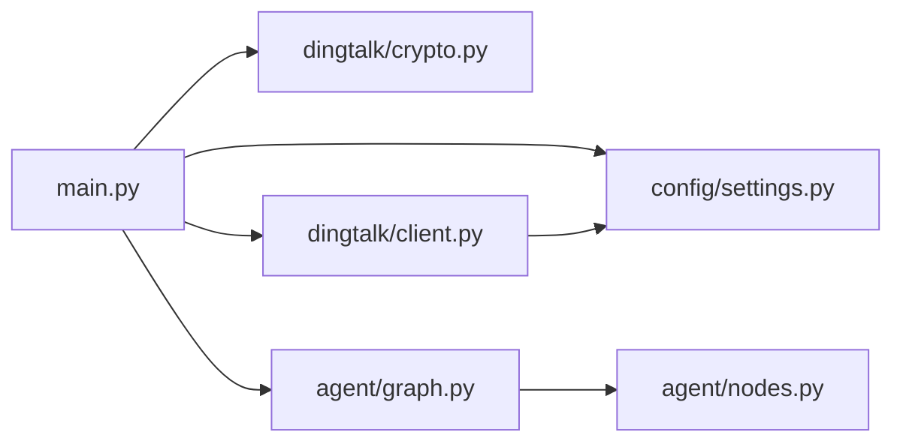
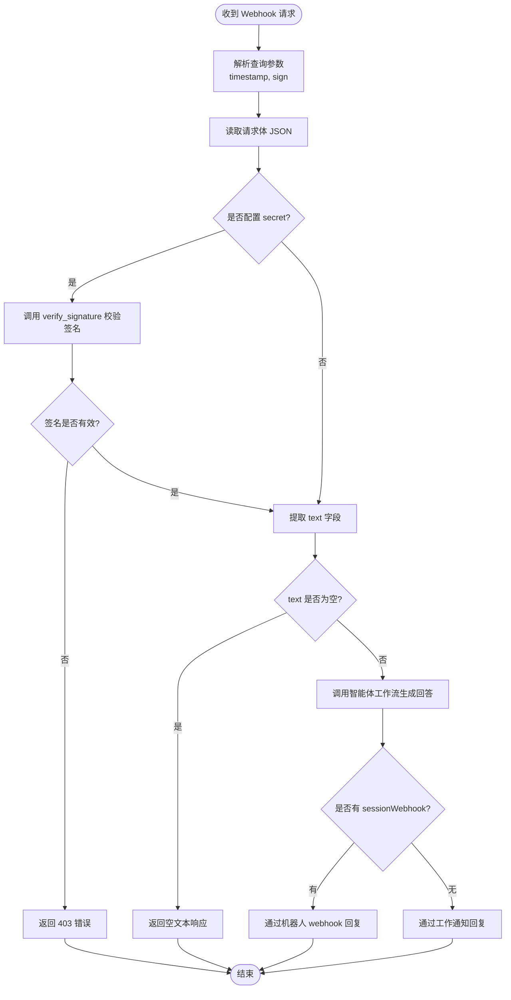

# Webhook消息处理

<cite>
**本文引用的文件**   
- [main.py](file://main.py)
- [dingtalk/client.py](file://dingtalk/client.py)
- [dingtalk/crypto.py](file://dingtalk/crypto.py)
- [config/settings.py](file://config/settings.py)
- [agent/graph.py](file://agent/graph.py)
- [data/docs/产品说明.txt](file://data/docs/产品说明.txt)
</cite>

## 目录
1. [简介](#简介)
2. [项目结构](#项目结构)
3. [核心组件](#核心组件)
4. [架构总览](#架构总览)
5. [详细组件分析](#详细组件分析)
6. [依赖关系分析](#依赖关系分析)
7. [性能考量](#性能考量)
8. [故障排查指南](#故障排查指南)
9. [结论](#结论)
10. [附录](#附录)

## 简介
本技术文档围绕钉钉机器人 Webhook 消息处理展开，系统性阐述从请求接收、签名校验、消息解析到智能体生成回答与回复的完整流程。重点覆盖：
- Webhook 回调机制与请求生命周期
- 钉钉自定义机器人消息格式规范（文本、富媒体、交互式）
- 安全验证机制（时间戳、随机数、HMAC-SHA256 签名）
- 错误处理策略与常见问题解决方案
- 配置指南与最佳实践

## 项目结构
本项目采用分层组织方式：
- 入口与路由：FastAPI 主应用定义 Webhook 回调端点与健康检查
- 安全与客户端：签名校验与钉钉 API 调用封装
- 配置管理：集中式环境变量与 .env 加载
- 智能体工作流：基于 LangGraph 的状态图编排
- 数据与文档：产品说明与知识库文档

图表来源 
- [main.py:106-176](file://main.py#L106-L176)
- [dingtalk/crypto.py:14-62](file://dingtalk/crypto.py#L14-L62)
- [dingtalk/client.py:16-139](file://dingtalk/client.py#L16-L139)
- [config/settings.py:16-56](file://config/settings.py#L16-L56)
- [agent/graph.py:25-81](file://agent/graph.py#L25-L81)

章节来源
- [main.py:1-236](file://main.py#L1-L236)
- [data/docs/产品说明.txt:1-39](file://data/docs/产品说明.txt#L1-L39)

## 核心组件
- Webhook 处理器：负责接收钉钉 Outgoing Webhook 回调，解析参数与请求体，执行签名校验，提取消息内容并调用智能体生成回答，最终通过机器人 webhook 或工作通知回复。
- 签名校验模块：实现 HMAC-SHA256 签名生成与校验，包含时间戳有效性检查与防重放保护。
- 钉钉客户端：封装 access_token 获取、文本与 Markdown 消息发送、机器人 webhook 回复等能力。
- 配置管理：统一读取环境变量与 .env 文件，提供钉钉相关配置项。
- 智能体工作流：基于 LangGraph 的状态图，完成情感分析、路由判断、RAG 检索、生成回答与记忆更新。

章节来源
- [main.py:106-176](file://main.py#L106-L176)
- [dingtalk/crypto.py:14-62](file://dingtalk/crypto.py#L14-L62)
- [dingtalk/client.py:16-139](file://dingtalk/client.py#L16-L139)
- [config/settings.py:16-56](file://config/settings.py#L16-L56)
- [agent/graph.py:25-81](file://agent/graph.py#L25-L81)

## 架构总览
下图展示 Webhook 请求从进入 FastAPI 到返回响应的整体流程，包括签名校验、消息解析、智能体调用与消息回复。

图表来源 
- [main.py:106-176](file://main.py#L106-L176)
- [dingtalk/crypto.py:33-62](file://dingtalk/crypto.py#L33-L62)
- [agent/graph.py:76-106](file://agent/graph.py#L76-L106)
- [dingtalk/client.py:104-127](file://dingtalk/client.py#L104-L127)

## 详细组件分析

### Webhook 回调处理器
- 职责：接收钉钉 Outgoing Webhook 回调，解析查询参数中的 timestamp 与 sign，读取请求体，执行签名校验，提取消息内容与上下文信息，调用智能体生成回答，并通过机器人 webhook 或工作通知回复。
- 关键步骤：
  - 解析查询参数 timestamp 与 sign
  - 读取 JSON 请求体
  - 若配置了 secret，则调用签名校验；失败返回 403
  - 提取 text 字段（兼容 text.content 与 content）
  - 提取 senderStaffId/senderId、conversationId、sessionWebhook
  - 调用智能体工作流生成 answer
  - 优先使用 sessionWebhook 回复群消息，否则回退到工作通知
- 错误处理：捕获异常并记录日志，返回友好错误信息

章节来源
- [main.py:106-176](file://main.py#L106-L176)

### 签名校验模块
- 算法：HMAC-SHA256，对字符串 “timestamp\nsecret” 进行签名，结果为 base64 编码
- 校验逻辑：
  - 校验 timestamp、sign、secret 非空
  - 将 timestamp 转为整数，计算当前时间与时间戳差值，超过阈值视为无效（默认 3600 秒）
  - 使用相同算法生成期望签名，与传入 sign 进行常量时间比较，防止时序攻击
- 输出：布尔值表示是否通过校验

章节来源
- [dingtalk/crypto.py:14-62](file://dingtalk/crypto.py#L14-L62)

### 钉钉客户端
- access_token 获取：
  - 本地缓存 token 与过期时间，避免频繁请求
  - 未配置 AppKey/AppSecret 时返回空
  - 调用企业应用接口获取 token
- 消息发送：
  - 工作通知文本消息：构造 msgtype=text 的请求体
  - 工作通知 Markdown 消息：构造 msgtype=markdown 的请求体
  - 机器人 webhook 回复：构造 msgtype=text 的请求体，支持 at 用户
- 错误处理：网络异常与业务错误均记录日志并返回错误结构

章节来源
- [dingtalk/client.py:25-127](file://dingtalk/client.py#L25-L127)

### 配置管理
- 使用 pydantic-settings 从环境变量与 .env 文件加载配置
- 钉钉相关配置项：
  - dingtalk_app_key、dingtalk_app_secret：企业应用凭证
  - dingtalk_robot_token、dingtalk_robot_secret：机器人令牌与密钥
  - dingtalk_robot_code：机器人 agent_id
  - dingtalk_api_base：API 基础地址
- 其他子系统配置：LLM、Embedding、向量库、记忆、LangSmith 等

章节来源
- [config/settings.py:16-56](file://config/settings.py#L16-L56)

### 智能体工作流
- 状态图节点：emotion、route、load_memory、retrieve、generate、memory_update
- 流程：START -> emotion -> route -> load_memory -> (条件分支 retrieve/generate) -> generate -> memory_update -> END
- 短期记忆：基于 checkpointer 按 thread_id 维护会话上下文
- 长期记忆：周期性摘要存储至 SQLite

章节来源
- [agent/graph.py:25-81](file://agent/graph.py#L25-L81)

## 依赖关系分析
- main.py 依赖：
  - dingtalk/crypto.verify_signature：签名校验
  - dingtalk.client.get_client：钉钉客户端单例
  - config.settings.get_settings：配置读取
  - agent.graph.get_compiled_graph：智能体工作流
- dingtalk/client.py 依赖：
  - config.settings.get_settings：读取 API 基础地址与凭证
- dingtalk/crypto.py 依赖：
  - Python 标准库 hmac、hashlib、base64、time
- agent/graph.py 依赖：
  - langgraph.graph.StateGraph：状态图构建
  - agent.nodes.*：各节点函数
  - memory.short_term.get_checkpointer：短期记忆持久化

图表来源 
- [main.py:114-117](file://main.py#L114-L117)
- [dingtalk/client.py:20-22](file://dingtalk/client.py#L20-L22)
- [agent/graph.py:13-22](file://agent/graph.py#L13-L22)

章节来源
- [main.py:114-117](file://main.py#L114-L117)
- [dingtalk/client.py:20-22](file://dingtalk/client.py#L20-L22)
- [agent/graph.py:13-22](file://agent/graph.py#L13-L22)

## 性能考量
- access_token 缓存：避免重复请求，减少网络开销与限流风险
- 异步处理：FastAPI 自动将同步阻塞调用放入线程池，避免事件循环阻塞
- 短路径优化：签名校验失败快速返回，减少后续处理
- 连接超时：所有 HTTP 请求设置合理超时，避免长时间挂起
- 日志级别：INFO/WARNING/ERROR 分级记录，便于监控与排障

[本节为通用指导，不直接分析具体文件]

## 故障排查指南
- 签名校验失败：
  - 检查 dingtalk_robot_secret 是否正确配置
  - 确认 timestamp 与 sign 参数是否存在且有效
  - 查看服务器时间是否与钉钉平台时间一致（防重放阈值）
- 无法获取 access_token：
  - 检查 dingtalk_app_key 与 dingtalk_app_secret 是否配置
  - 确认 dingtalk_api_base 是否为正确地址
- 消息未回复：
  - 检查 sessionWebhook 是否存在，若不存在将回退到工作通知
  - 确认 senderId/senderStaffId 是否正确提取
- 智能体调用异常：
  - 查看日志中“智能体调用失败”的错误信息
  - 检查 LLM 模型配置与网络连接

章节来源
- [main.py:129-136](file://main.py#L129-L136)
- [dingtalk/client.py:35-56](file://dingtalk/client.py#L35-L56)
- [main.py:163-165](file://main.py#L163-L165)

## 结论
本系统实现了完整的钉钉机器人 Webhook 消息处理链路，涵盖安全校验、消息解析、智能体推理与多渠道回复。通过模块化设计与清晰的分层架构，确保了系统的可维护性与扩展性。建议在生产环境中严格配置密钥与访问控制，并结合监控与日志系统进行持续优化。

[本节为总结性内容，不直接分析具体文件]

## 附录

### Webhook 消息格式规范
- 文本消息：
  - 字段：text.content（字符串）
  - 示例路径参考：[main.py:139-142](file://main.py#L139-L142)
- 富媒体消息：
  - 字段：msgtype 为 markdown，包含 title 与 text
  - 发送示例参考：[dingtalk/client.py:81-102](file://dingtalk/client.py#L81-L102)
- 交互式消息：
  - 字段：msgtype 为 actionCard 或 cardAction，需根据钉钉官方文档构造
  - 本系统当前主要支持文本与 Markdown，交互式消息可扩展 DingTalkClient

章节来源
- [main.py:139-142](file://main.py#L139-L142)
- [dingtalk/client.py:81-102](file://dingtalk/client.py#L81-L102)

### 安全验证机制详解
- 时间戳校验：限制请求有效期，防止重放攻击
- 随机数验证：钉钉官方文档建议使用 nonce，本实现未显式使用，可在 verify_signature 中扩展
- 签名算法：HMAC-SHA256，对 “timestamp\nsecret” 进行签名，结果为 base64 编码
- 常量时间比较：使用 hmac.compare_digest 防止时序攻击

章节来源
- [dingtalk/crypto.py:33-62](file://dingtalk/crypto.py#L33-L62)

### 消息处理流程图

图表来源 
- [main.py:121-176](file://main.py#L121-L176)
- [dingtalk/crypto.py:33-62](file://dingtalk/crypto.py#L33-L62)

### 配置指南
- 必需配置项：
  - dingtalk_robot_secret：机器人加签密钥（启用签名校验）
  - dingtalk_robot_token：机器人 webhook 令牌（用于回复群消息）
  - dingtalk_app_key、dingtalk_app_secret：企业应用凭证（用于工作通知）
  - dingtalk_api_base：API 基础地址（默认 https://oapi.dingtalk.com）
- 可选配置项：
  - dingtalk_robot_code：机器人 agent_id（工作通知发送时使用）
  - 其他 LLM、Embedding、向量库等配置

章节来源
- [config/settings.py:49-56](file://config/settings.py#L49-L56)

### 常见问题解决方案
- 问题：签名校验失败
  - 解决：检查密钥配置、时间同步、timestamp 与 sign 参数
- 问题：无法发送工作通知
  - 解决：确认 AppKey/AppSecret 配置，检查 access_token 获取日志
- 问题：消息未回复
  - 解决：检查 sessionWebhook 是否存在，确认 senderId 是否正确
- 问题：智能体调用异常
  - 解决：查看错误日志，检查 LLM 模型配置与网络连通性

章节来源
- [main.py:129-136](file://main.py#L129-L136)
- [dingtalk/client.py:35-56](file://dingtalk/client.py#L35-L56)
- [main.py:163-165](file://main.py#L163-L165)