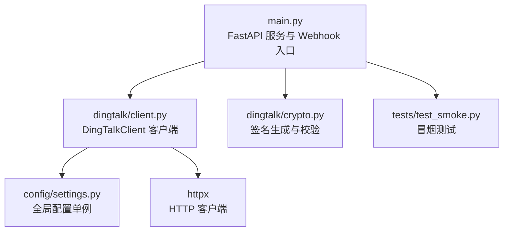
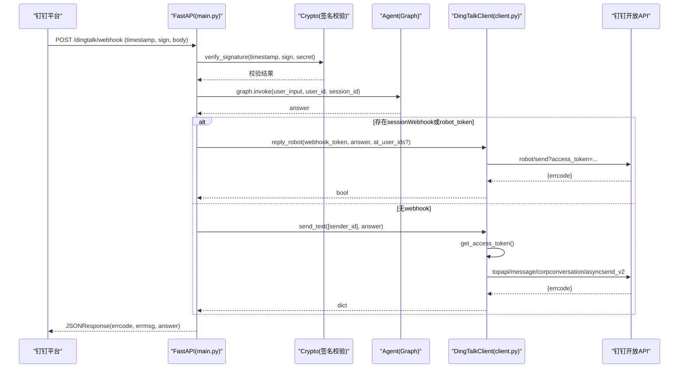
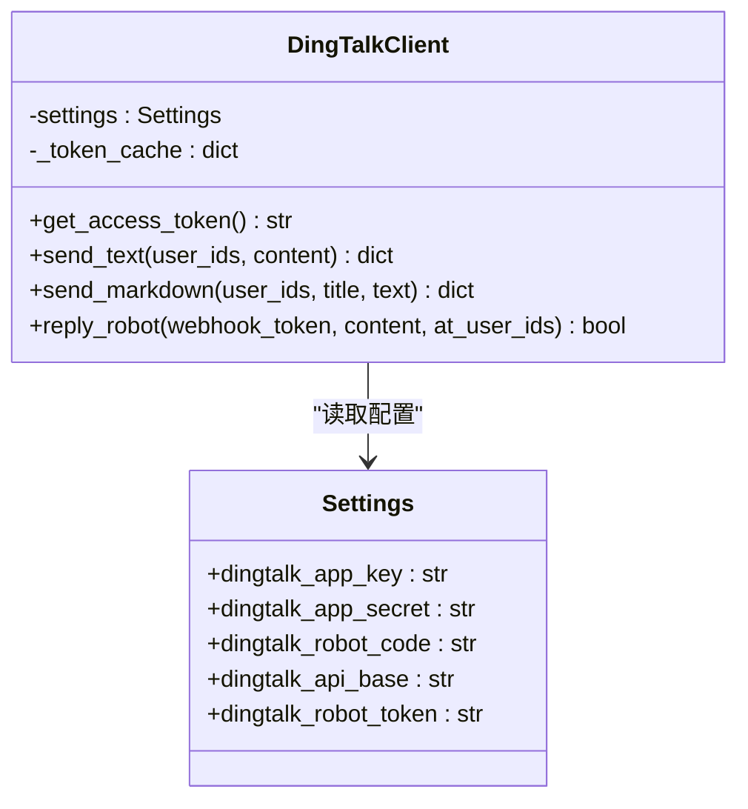
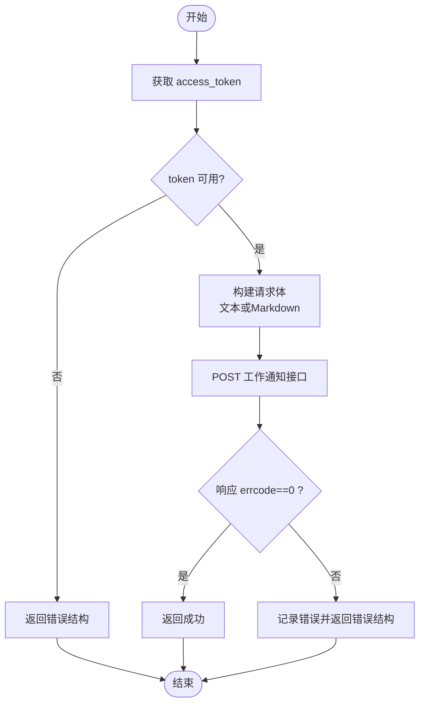
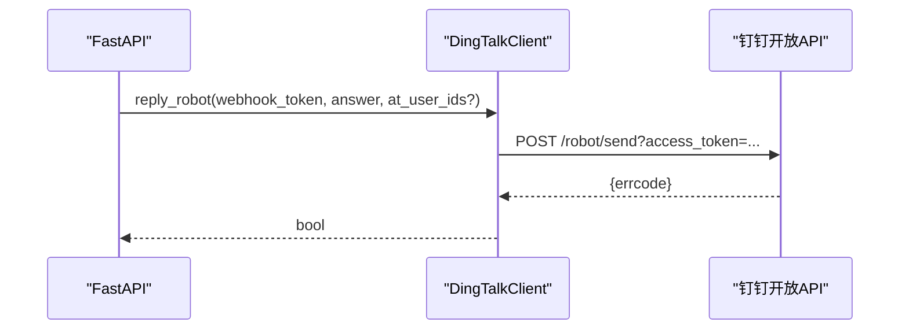
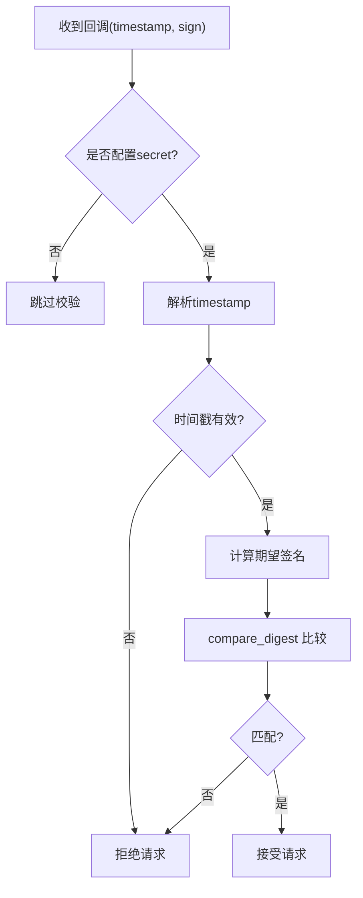
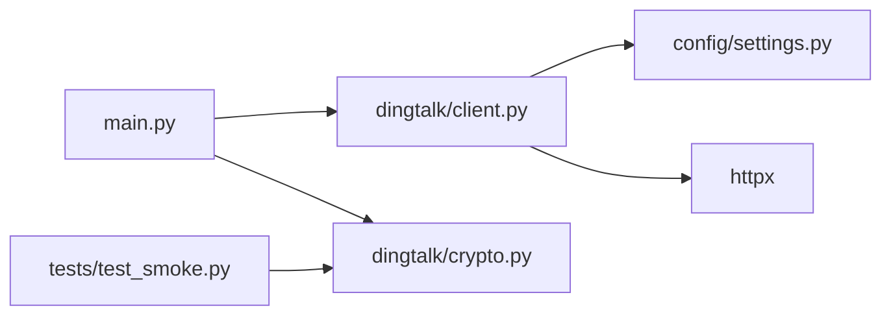

# 企业应用API客户端

<cite>
**本文引用的文件**   
- [dingtalk/client.py](file://dingtalk/client.py)
- [dingtalk/crypto.py](file://dingtalk/crypto.py)
- [config/settings.py](file://config/settings.py)
- [main.py](file://main.py)
- [tests/test_smoke.py](file://tests/test_smoke.py)
</cite>

## 目录
1. [简介](#简介)
2. [项目结构](#项目结构)
3. [核心组件](#核心组件)
4. [架构总览](#架构总览)
5. [详细组件分析](#详细组件分析)
6. [依赖关系分析](#依赖关系分析)
7. [性能与可靠性](#性能与可靠性)
8. [故障排查指南](#故障排查指南)
9. [结论](#结论)
10. [附录：配置参数与最佳实践](#附录配置参数与最佳实践)

## 简介
本技术文档聚焦于钉钉企业应用 API 客户端的设计与实现，围绕 DingTalkClient 类展开，系统说明 access_token 的获取与缓存机制、工作通知 API（文本/Markdown）的使用方法、机器人 webhook 回复功能（含群消息回复与用户@），以及 HTTP 请求处理（超时、错误处理、重试建议）。同时提供完整的调用示例与失败场景处理思路，并给出配置参数说明与最佳实践。

## 项目结构
本项目采用分层组织方式，与钉钉相关的核心代码位于 dingtalk 模块，配置集中在 config.settings，Webhook 回调入口在 main.py，签名校验逻辑在 dingtalk.crypto。测试用例覆盖基础能力验证。

**图表来源** 
- [main.py:106-176](file://main.py#L106-L176)
- [dingtalk/client.py:16-139](file://dingtalk/client.py#L16-L139)
- [dingtalk/crypto.py:14-62](file://dingtalk/crypto.py#L14-L62)
- [config/settings.py:16-55](file://config/settings.py#L16-L55)

**章节来源**
- [main.py:106-176](file://main.py#L106-L176)
- [dingtalk/client.py:16-139](file://dingtalk/client.py#L16-L139)
- [dingtalk/crypto.py:14-62](file://dingtalk/crypto.py#L14-L62)
- [config/settings.py:16-55](file://config/settings.py#L16-L55)

## 核心组件
- DingTalkClient：封装 access_token 获取与缓存、工作通知发送（文本/Markdown）、机器人 webhook 回复（支持 @ 用户）。
- Settings：基于 pydantic-settings 的全局配置管理，从环境变量或 .env 加载，包含钉钉相关字段。
- Crypto：提供 HMAC-SHA256 签名生成与校验，用于自定义机器人回调安全验证。
- FastAPI 入口：接收钉钉回调，执行签名校验、智能体问答、选择回复通道（webhook 优先，回退工作通知）。

**章节来源**
- [dingtalk/client.py:16-139](file://dingtalk/client.py#L16-L139)
- [config/settings.py:16-55](file://config/settings.py#L16-L55)
- [dingtalk/crypto.py:14-62](file://dingtalk/crypto.py#L14-L62)
- [main.py:106-176](file://main.py#L106-L176)

## 架构总览
下图展示了从钉钉回调到回复的完整流程：Webhook 进入 FastAPI 端点，进行签名校验后调用智能体生成回答，随后通过 DingTalkClient 选择 webhook 或工作通知进行回复；access_token 由客户端内部获取并缓存。

**图表来源** 
- [main.py:106-176](file://main.py#L106-L176)
- [dingtalk/crypto.py:33-62](file://dingtalk/crypto.py#L33-L62)
- [dingtalk/client.py:58-127](file://dingtalk/client.py#L58-L127)

## 详细组件分析

### DingTalkClient 设计与实现
- 初始化：加载全局配置，维护本地 token 缓存字典（token 与过期时间）。
- access_token 获取与缓存：
  - 先检查缓存是否有效（预留 60 秒缓冲提前刷新）。
  - 若未配置 AppKey/AppSecret，记录警告并返回空串。
  - 调用 GETTOKEN 接口，解析 errcode 与 access_token、expires_in，更新缓存。
  - 异常捕获并记录错误日志，返回空串。
- 工作通知发送（文本/Markdown）：
  - 使用 corpconversation/asyncsend_v2 接口。
  - 文本消息：msgtype=text，text.content。
  - Markdown 消息：msgtype=markdown，markdown.title + markdown.text。
  - 统一通过 params.access_token 传递令牌。
  - 异常捕获并返回错误结构。
- 机器人 webhook 回复：
  - 使用 robot/send?access_token=webhook_token。
  - 支持可选 atUserIds 列表实现 @ 用户。
  - 成功判定依据 errcode==0。

**图表来源** 
- [dingtalk/client.py:16-139](file://dingtalk/client.py#L16-L139)
- [config/settings.py:49-55](file://config/settings.py#L49-L55)

**章节来源**
- [dingtalk/client.py:25-56](file://dingtalk/client.py#L25-L56)
- [dingtalk/client.py:58-102](file://dingtalk/client.py#L58-L102)
- [dingtalk/client.py:104-127](file://dingtalk/client.py#L104-L127)

### 工作通知 API 使用方法
- 文本消息
  - 端点：POST /topapi/message/corpconversation/asyncsend_v2
  - 必要参数：agent_id（来自配置）、userid_list（逗号分隔的用户ID列表）、msg.msgtype=text、msg.text.content（文本内容）。
  - 访问令牌：params.access_token。
  - 返回值：JSON，errcode==0 表示成功。
- Markdown 消息
  - 端点：同上。
  - 必要参数：agent_id、userid_list、msg.msgtype=markdown、msg.markdown.title、msg.markdown.text。
  - 访问令牌：params.access_token。
  - 返回值：JSON，errcode==0 表示成功。

**图表来源** 
- [dingtalk/client.py:58-102](file://dingtalk/client.py#L58-L102)

**章节来源**
- [dingtalk/client.py:58-102](file://dingtalk/client.py#L58-L102)

### 机器人 webhook 回复与 @ 用户
- 端点：POST /robot/send?access_token=webhook_token
- 请求体：msgtype=text，text.content；可选 at.atUserIds 为需要 @ 的用户ID列表。
- 成功判断：errcode==0。
- 使用场景：优先使用 sessionWebhook（来自回调体）或配置的 dingtalk_robot_token；若无则回退到工作通知。

**图表来源** 
- [dingtalk/client.py:104-127](file://dingtalk/client.py#L104-L127)

**章节来源**
- [dingtalk/client.py:104-127](file://dingtalk/client.py#L104-L127)

### HTTP 请求处理：超时、错误与重试
- 超时设置：所有 httpx.post 调用均设置 timeout=10（秒）。
- 错误处理：
  - 网络异常或解析异常被捕获，记录错误日志并返回错误结构或布尔值。
  - 业务错误（如 errcode!=0）记录错误日志并返回相应结果。
- 重试机制：
  - 当前实现未内置重试；建议在调用层根据 errcode 与异常类型实现指数退避重试（例如针对 429、5xx 等可重试状态码）。
  - 对于 access_token 获取失败，可在上层增加限流与退避策略，避免频繁刷新导致封禁。

**章节来源**
- [dingtalk/client.py:44-56](file://dingtalk/client.py#L44-L56)
- [dingtalk/client.py:74-79](file://dingtalk/client.py#L74-L79)
- [dingtalk/client.py:97-102](file://dingtalk/client.py#L97-L102)
- [dingtalk/client.py:121-127](file://dingtalk/client.py#L121-L127)

### 签名校验与安全
- 签名算法：HMAC-SHA256，对字符串 timestamp+"\n"+secret 计算签名，再 base64 编码。
- 校验流程：
  - 解析 timestamp 与 sign。
  - 校验时间戳有效期（默认最大年龄 3600 秒，防重放）。
  - 使用 hmac.compare_digest 比较签名，避免时序攻击。
- 使用位置：main.py 的 /dingtalk/webhook 端点在启用 dingtalk_robot_secret 时强制校验。

**图表来源** 
- [dingtalk/crypto.py:14-30](file://dingtalk/crypto.py#L14-L30)
- [dingtalk/crypto.py:33-62](file://dingtalk/crypto.py#L33-L62)
- [main.py:129-136](file://main.py#L129-L136)

**章节来源**
- [dingtalk/crypto.py:14-62](file://dingtalk/crypto.py#L14-L62)
- [main.py:129-136](file://main.py#L129-L136)

## 依赖关系分析
- DingTalkClient 依赖：
  - config.settings：读取钉钉相关配置（app_key、app_secret、robot_code、api_base、robot_token）。
  - httpx：发起 HTTP 请求。
  - logging：记录错误与警告。
- main.py 依赖：
  - dingtalk.client.get_client：获取客户端单例。
  - dingtalk.crypto.verify_signature：签名校验。
  - agent.graph：智能体图执行（不在本文重点，但参与整体流程）。
- 测试依赖：
  - tests/test_smoke.py 验证 crypto 签名生成与校验。

**图表来源** 
- [main.py:106-176](file://main.py#L106-L176)
- [dingtalk/client.py:16-139](file://dingtalk/client.py#L16-L139)
- [dingtalk/crypto.py:14-62](file://dingtalk/crypto.py#L14-L62)
- [config/settings.py:16-55](file://config/settings.py#L16-L55)
- [tests/test_smoke.py:41-52](file://tests/test_smoke.py#L41-L52)

**章节来源**
- [main.py:106-176](file://main.py#L106-L176)
- [dingtalk/client.py:16-139](file://dingtalk/client.py#L16-L139)
- [dingtalk/crypto.py:14-62](file://dingtalk/crypto.py#L14-L62)
- [config/settings.py:16-55](file://config/settings.py#L16-L55)
- [tests/test_smoke.py:41-52](file://tests/test_smoke.py#L41-L52)

## 性能与可靠性
- access_token 缓存：
  - 本地内存缓存，带过期时间与提前刷新缓冲（60 秒），减少频繁请求。
  - 建议在高并发场景下考虑进程内共享缓存或分布式缓存（如 Redis）以避免多实例重复刷新。
- HTTP 超时：
  - 统一 10 秒超时，适合一般网络环境；可根据部署网络状况调整。
- 错误处理：
  - 当前未实现自动重试，建议在调用层按错误码分类处理（如 429 限流、5xx 服务端错误）实施指数退避。
- 并发与线程安全：
  - 单例客户端在多线程环境下对 _token_cache 的读写需保证原子性；当前简单 dict 操作在 Python GIL 下通常安全，但在高并发写入时可考虑加锁或改用线程安全容器。

[本节为通用指导，不直接分析具体文件]

## 故障排查指南
- access_token 获取失败
  - 检查 dingtalk_app_key 与 dingtalk_app_secret 是否正确配置。
  - 查看日志中“获取 access_token 失败”的具体 errcode 与 errmsg。
  - 确认网络可达与 API 域名正确（dingtalk_api_base）。
- 工作通知发送失败
  - 检查 userid_list 是否为有效用户ID且格式正确（逗号分隔）。
  - 检查 agent_id 是否与机器人/应用配置一致。
  - 查看返回 errcode，常见错误包括权限不足、消息体格式错误。
- 机器人 webhook 回复失败
  - 确认 webhook_token 有效（优先使用 sessionWebhook，其次 dingtalk_robot_token）。
  - 检查 atUserIds 是否存在且格式正确。
  - 查看返回 errcode，常见错误包括 token 无效、频率限制。
- 签名校验失败
  - 确认 dingtalk_robot_secret 已配置且与服务端一致。
  - 检查 timestamp 与 sign 是否随请求正确传递。
  - 查看时间戳是否在有效期内（默认 3600 秒）。

**章节来源**
- [dingtalk/client.py:35-56](file://dingtalk/client.py#L35-L56)
- [dingtalk/client.py:74-79](file://dingtalk/client.py#L74-L79)
- [dingtalk/client.py:97-102](file://dingtalk/client.py#L97-L102)
- [dingtalk/client.py:121-127](file://dingtalk/client.py#L121-L127)
- [main.py:129-136](file://main.py#L129-L136)

## 结论
DingTalkClient 提供了简洁可靠的钉钉企业应用 API 封装，涵盖 access_token 管理与缓存、工作通知（文本/Markdown）发送、机器人 webhook 回复（支持 @ 用户）。配合 FastAPI 的 Webhook 入口与签名校验，形成端到端的钉钉智能体交互链路。建议在调用层补充重试与熔断策略，并根据部署环境优化超时与缓存方案，以提升稳定性与性能。

[本节为总结，不直接分析具体文件]

## 附录：配置参数与最佳实践

### 关键配置参数（钉钉相关）
- dingtalk_app_key：企业内部应用 AppKey，用于获取 access_token。
- dingtalk_app_secret：企业内部应用 AppSecret，用于获取 access_token。
- dingtalk_robot_token：机器人 webhook 的 access_token（当无 sessionWebhook 时使用）。
- dingtalk_robot_secret：机器人回调签名密钥（启用签名校验）。
- dingtalk_robot_code：机器人/应用 agent_id，用于工作通知发送。
- dingtalk_api_base：钉钉开放 API 基础地址（默认 https://oapi.dingtalk.com）。

**章节来源**
- [config/settings.py:49-55](file://config/settings.py#L49-L55)

### 最佳实践建议
- 配置管理
  - 将敏感信息（AppKey/Secret、Robot Secret/Token）放入环境变量或安全的 .env 文件，避免硬编码。
  - 使用统一的配置加载入口 get_settings()，确保全局一致性。
- access_token 管理
  - 利用内置缓存机制，避免频繁刷新；在多实例部署时建议使用外部缓存（Redis）共享 token。
  - 监控获取失败的日志与错误码，及时定位配置或网络问题。
- 消息发送
  - 工作通知：确保 userid_list 有效，agent_id 正确；Markdown 消息注意文本长度与格式。
  - 机器人 webhook：优先使用 sessionWebhook，必要时回退到配置的 robot_token；@ 用户时确保 atUserIds 存在。
- 错误处理与重试
  - 在调用层实现按错误码分类的重试策略（如 429、5xx），结合指数退避与最大重试次数。
  - 对网络异常进行快速失败与降级（如切换至工作通知）。
- 安全与合规
  - 始终启用签名校验（配置 dingtalk_robot_secret），防止伪造回调。
  - 控制消息内容与频率，遵守钉钉平台规范。

**章节来源**
- [config/settings.py:16-55](file://config/settings.py#L16-L55)
- [dingtalk/client.py:25-56](file://dingtalk/client.py#L25-L56)
- [dingtalk/client.py:58-127](file://dingtalk/client.py#L58-L127)
- [main.py:129-136](file://main.py#L129-L136)