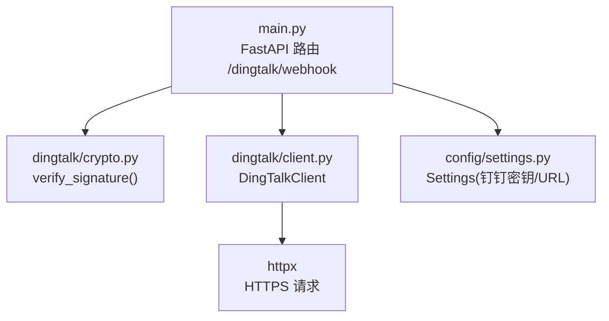
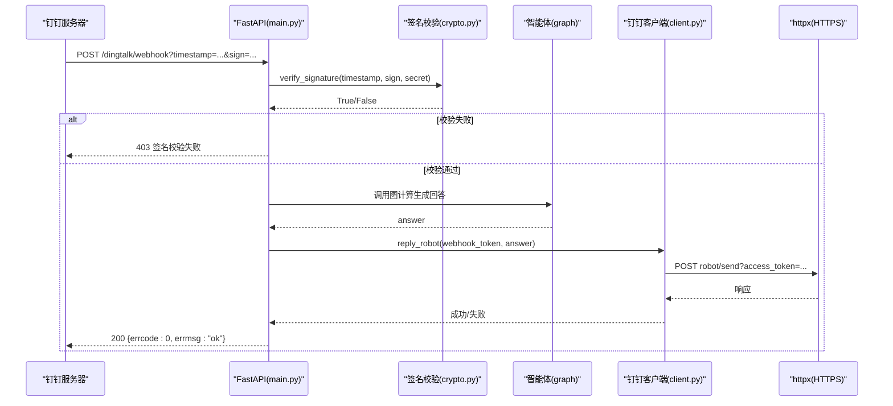
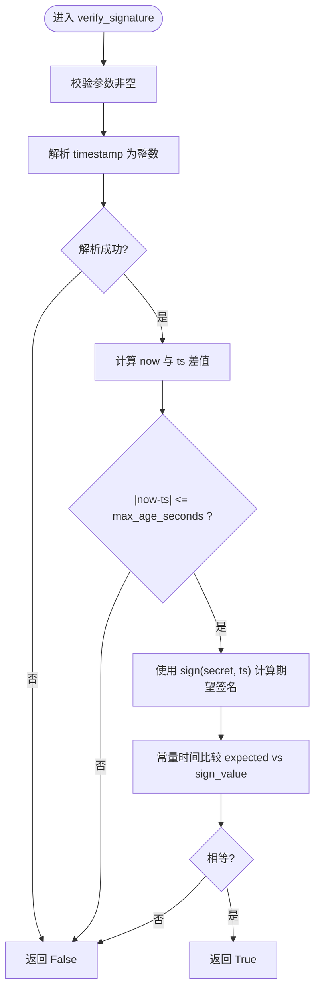
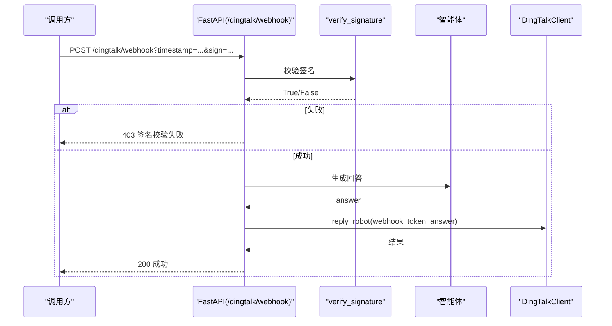
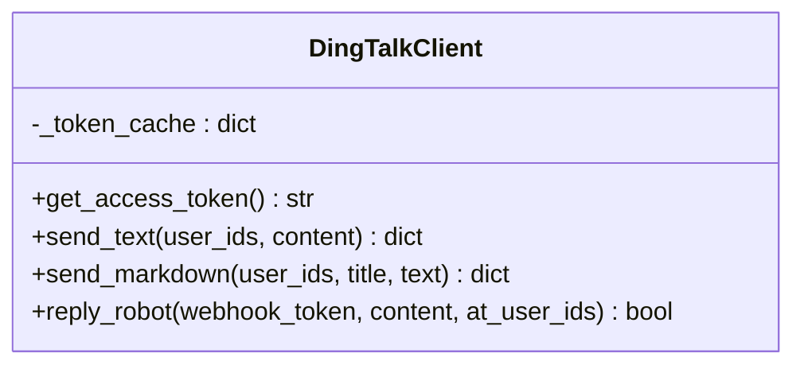
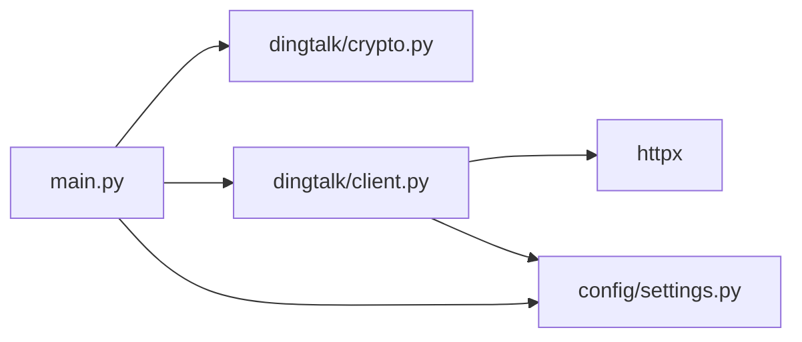

# 加密与安全机制

<cite>
**本文引用的文件**   
- [dingtalk/crypto.py](file://dingtalk/crypto.py)
- [dingtalk/client.py](file://dingtalk/client.py)
- [config/settings.py](file://config/settings.py)
- [main.py](file://main.py)
- [tests/test_smoke.py](file://tests/test_smoke.py)
</cite>

## 目录
1. [简介](#简介)
2. [项目结构](#项目结构)
3. [核心组件](#核心组件)
4. [架构总览](#架构总览)
5. [详细组件分析](#详细组件分析)
6. [依赖关系分析](#依赖关系分析)
7. [性能与安全性考量](#性能与安全性考量)
8. [故障排查指南](#故障排查指南)
9. [结论](#结论)
10. [附录：配置与示例](#附录配置与示例)

## 简介
本技术文档聚焦于钉钉消息回调的安全机制，围绕签名校验、时间戳防重放、以及安全传输等关键主题展开。当前仓库实现了钉钉自定义机器人 Webhook 的签名验证流程（HMAC-SHA256），并通过 httpx 进行 HTTPS 通信；企业应用 API 调用通过 access_token 鉴权。文档同时给出不同安全场景的处理方式、最佳实践与常见问题解决方案。

## 项目结构
本项目采用按功能模块划分的目录组织方式，与安全相关的核心代码集中在以下位置：
- dingtalk/crypto.py：签名生成与校验实现
- dingtalk/client.py：钉钉企业应用 API 客户端（access_token、消息发送）
- config/settings.py：全局配置（包含钉钉相关密钥与基础 URL）
- main.py：FastAPI 入口，处理钉钉 Webhook 回调并执行签名校验
- tests/test_smoke.py：冒烟测试，覆盖签名生成与校验用例

图表来源
- [main.py:106-176](file://main.py#L106-L176)
- [dingtalk/crypto.py:1-63](file://dingtalk/crypto.py#L1-L63)
- [dingtalk/client.py:1-140](file://dingtalk/client.py#L1-L140)
- [config/settings.py:1-93](file://config/settings.py#L1-L93)

章节来源
- [main.py:1-236](file://main.py#L1-L236)
- [dingtalk/crypto.py:1-63](file://dingtalk/crypto.py#L1-L63)
- [dingtalk/client.py:1-140](file://dingtalk/client.py#L1-L140)
- [config/settings.py:1-93](file://config/settings.py#L1-L93)

## 核心组件
- 签名与验签模块（HMAC-SHA256）
  - 提供 sign(secret, timestamp) 生成签名
  - 提供 verify_signature(timestamp, sign_value, secret, max_age_seconds) 完成参数校验、时间戳有效性检查与签名比对
- 钉钉客户端（企业应用 API）
  - 获取 access_token（带本地缓存）
  - 发送工作通知文本/Markdown 消息
  - 通过机器人 webhook 回复群消息
- 配置管理
  - 集中管理钉钉 AppKey/AppSecret、机器人 Token/Secret、API Base URL 等

章节来源
- [dingtalk/crypto.py:14-62](file://dingtalk/crypto.py#L14-L62)
- [dingtalk/client.py:25-127](file://dingtalk/client.py#L25-L127)
- [config/settings.py:49-56](file://config/settings.py#L49-L56)

## 架构总览
下图展示了钉钉 Webhook 回调从接收、签名校验到智能体处理与回复的整体流程。

图表来源
- [main.py:106-176](file://main.py#L106-L176)
- [dingtalk/crypto.py:33-62](file://dingtalk/crypto.py#L33-L62)
- [dingtalk/client.py:104-127](file://dingtalk/client.py#L104-L127)

## 详细组件分析

### 签名与验签（HMAC-SHA256）
- 签名生成
  - 输入：secret（机器人加签密钥）、timestamp（秒级时间戳）
  - 过程：将 timestamp 与 secret 拼接为待签名字符串，使用 HMAC-SHA256 计算摘要，再进行 base64 编码输出
- 签名校验
  - 输入：timestamp、sign_value、secret、max_age_seconds（默认 3600 秒）
  - 过程：
    - 参数非空校验
    - timestamp 类型转换与数值校验
    - 时间戳有效期校验（防重放）
    - 重新计算期望签名并与传入 sign 进行常量时间比较（防时序攻击）

图表来源
- [dingtalk/crypto.py:33-62](file://dingtalk/crypto.py#L33-L62)
- [dingtalk/crypto.py:14-30](file://dingtalk/crypto.py#L14-L30)

章节来源
- [dingtalk/crypto.py:1-63](file://dingtalk/crypto.py#L1-L63)
- [tests/test_smoke.py:41-52](file://tests/test_smoke.py#L41-L52)

### Webhook 回调处理与签名集成
- 路由：/dingtalk/webhook
- 处理步骤：
  - 读取查询参数中的 timestamp 与 sign
  - 若配置了 dingtalk_robot_secret，则调用 verify_signature 进行校验
  - 校验失败返回 403
  - 校验通过后提取消息内容、用户标识与会话信息
  - 调用智能体生成回答
  - 优先通过机器人 webhook 回复，否则回退到工作通知

图表来源
- [main.py:106-176](file://main.py#L106-L176)
- [dingtalk/crypto.py:33-62](file://dingtalk/crypto.py#L33-L62)
- [dingtalk/client.py:104-127](file://dingtalk/client.py#L104-L127)

章节来源
- [main.py:106-176](file://main.py#L106-L176)

### 企业应用 API 调用与访问令牌管理
- access_token 获取
  - 端点：POST /gettoken?appkey=...&appsecret=...
  - 本地缓存策略：记录 token 与过期时间，提前 60 秒刷新
- 消息发送
  - 工作通知：/topapi/message/corpconversation/asyncsend_v2
  - 支持文本与 Markdown 两种 msgtype
- 机器人 webhook 回复
  - 端点：/robot/send?access_token=...
  - 支持 at 指定用户

图表来源
- [dingtalk/client.py:16-127](file://dingtalk/client.py#L16-L127)

章节来源
- [dingtalk/client.py:1-140](file://dingtalk/client.py#L1-L140)

### 配置管理与密钥加载
- 配置项（部分）：
  - dingtalk_app_key、dingtalk_app_secret：企业应用凭据
  - dingtalk_robot_token、dingtalk_robot_secret：机器人回调与加签密钥
  - dingtalk_robot_code：机器人 agent_id
  - dingtalk_api_base：API 基础地址（默认 https://oapi.dingtalk.com）
- 加载优先级：环境变量 > .env 文件

章节来源
- [config/settings.py:16-56](file://config/settings.py#L16-L56)

## 依赖关系分析
- main.py 依赖：
  - FastAPI 路由与请求处理
  - dingtalk/crypto.verify_signature
  - dingtalk.client.DingTalkClient
  - config.settings.Settings
- dingtalk/client.py 依赖：
  - httpx 进行 HTTPS 请求
  - config.settings.Settings
- dingtalk/crypto.py 依赖：
  - Python 标准库 hmac、hashlib、base64、time

图表来源
- [main.py:106-176](file://main.py#L106-L176)
- [dingtalk/client.py:1-140](file://dingtalk/client.py#L1-L140)
- [dingtalk/crypto.py:1-63](file://dingtalk/crypto.py#L1-L63)
- [config/settings.py:1-93](file://config/settings.py#L1-L93)

章节来源
- [main.py:1-236](file://main.py#L1-L236)
- [dingtalk/client.py:1-140](file://dingtalk/client.py#L1-L140)
- [dingtalk/crypto.py:1-63](file://dingtalk/crypto.py#L1-L63)
- [config/settings.py:1-93](file://config/settings.py#L1-L93)

## 性能与安全性考量
- 性能
  - access_token 本地缓存减少频繁网络请求
  - 签名校验为 O(1) 哈希计算，开销极低
  - httpx 超时设置避免阻塞
- 安全性
  - 使用 HMAC-SHA256 与常量时间比较防止时序攻击
  - 时间戳有效期校验抵御重放攻击
  - 通过 httpx 发起 HTTPS 请求，保障传输层加密
  - 敏感配置通过环境变量或 .env 管理，避免硬编码

[本节为通用指导，不直接分析具体文件]

## 故障排查指南
- 签名校验失败
  - 检查是否配置 dingtalk_robot_secret
  - 确认 timestamp 与 sign 参数是否正确传递
  - 核对系统时间与钉钉服务器时间偏差是否在允许范围内
- access_token 获取失败
  - 检查 dingtalk_app_key 与 dingtalk_app_secret 配置
  - 查看网络连通性与 API Base URL 是否正确
- 消息发送异常
  - 检查 user_ids 列表是否为空
  - 确认 agent_id（dingtalk_robot_code）配置正确
  - 查看 httpx 返回的错误码与日志

章节来源
- [main.py:129-136](file://main.py#L129-L136)
- [dingtalk/client.py:35-56](file://dingtalk/client.py#L35-L56)
- [dingtalk/client.py:74-79](file://dingtalk/client.py#L74-L79)

## 结论
本项目在钉钉安全方面实现了基于 HMAC-SHA256 的签名校验与时间戳防重放机制，并通过 httpx 保证 HTTPS 安全传输。企业应用 API 调用通过 access_token 鉴权，具备本地缓存与错误处理。整体设计简洁可靠，满足常见企业场景的安全需求。建议在生产环境严格管理密钥、启用最小权限原则，并结合网关与 WAF 进一步加固。

[本节为总结性内容，不直接分析具体文件]

## 附录：配置与示例

### 安全配置清单
- 必填项
  - dingtalk_app_key、dingtalk_app_secret：用于获取 access_token
  - dingtalk_robot_token：用于机器人 webhook 回复
  - dingtalk_robot_secret：用于回调签名校验
  - dingtalk_robot_code：工作通知 agent_id
  - dingtalk_api_base：API 基础地址（默认 https://oapi.dingtalk.com）
- 可选项
  - langsmith_*：评估与追踪配置
  - llm_*、embedding_model、chroma_*：AI 与向量库配置

章节来源
- [config/settings.py:49-56](file://config/settings.py#L49-L56)

### 签名生成与校验示例（路径引用）
- 生成签名：参考 [sign 函数:14-30](file://dingtalk/crypto.py#L14-L30)
- 校验签名：参考 [verify_signature 函数:33-62](file://dingtalk/crypto.py#L33-L62)
- 单元测试用例：参考 [test_dingtalk_crypto:41-52](file://tests/test_smoke.py#L41-L52)

### 安全最佳实践
- 密钥管理
  - 使用环境变量或专用密钥管理服务存储 secret、appkey/appsecret
  - 定期轮换密钥，避免长期不变
- 传输安全
  - 始终使用 HTTPS 访问钉钉 API
  - 服务端部署于受信任网络，限制公网暴露面
- 防重放与抗攻击
  - 保持时间戳有效期合理（如 3600 秒）
  - 使用常量时间比较避免时序攻击
- 最小权限与审计
  - 仅授予必要的 API 权限
  - 开启日志审计，记录签名校验失败与异常

[本节为通用指导，不直接分析具体文件]