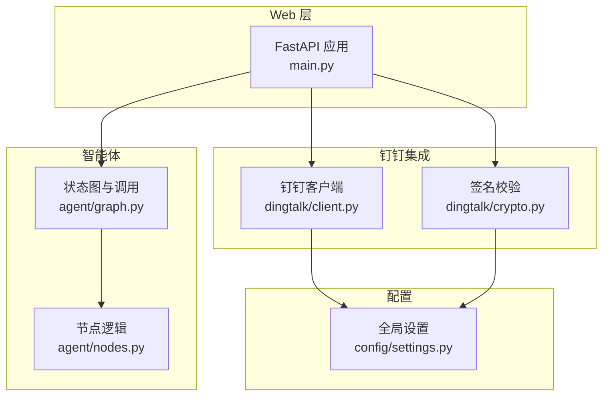
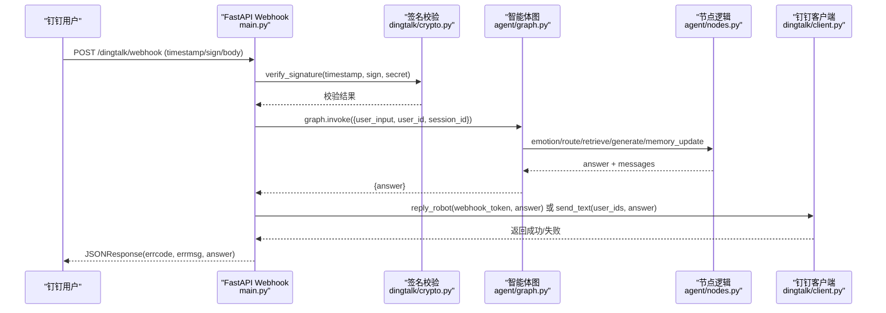
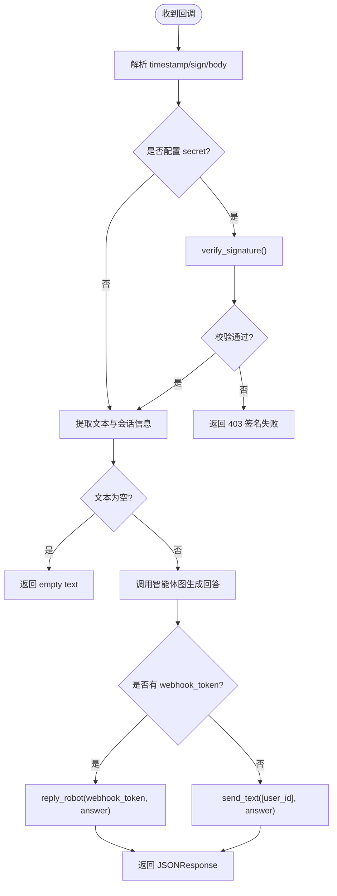
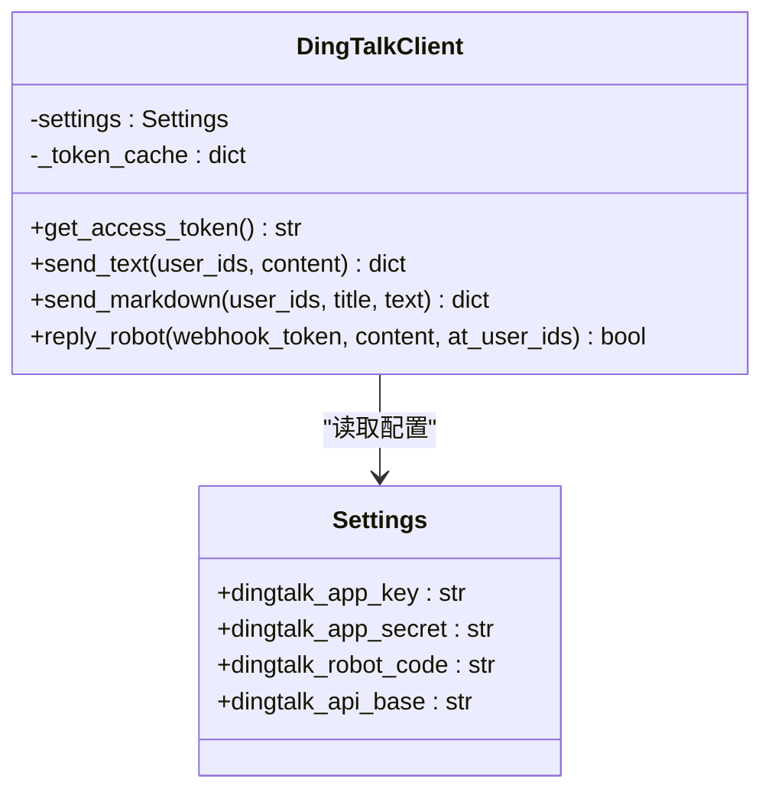
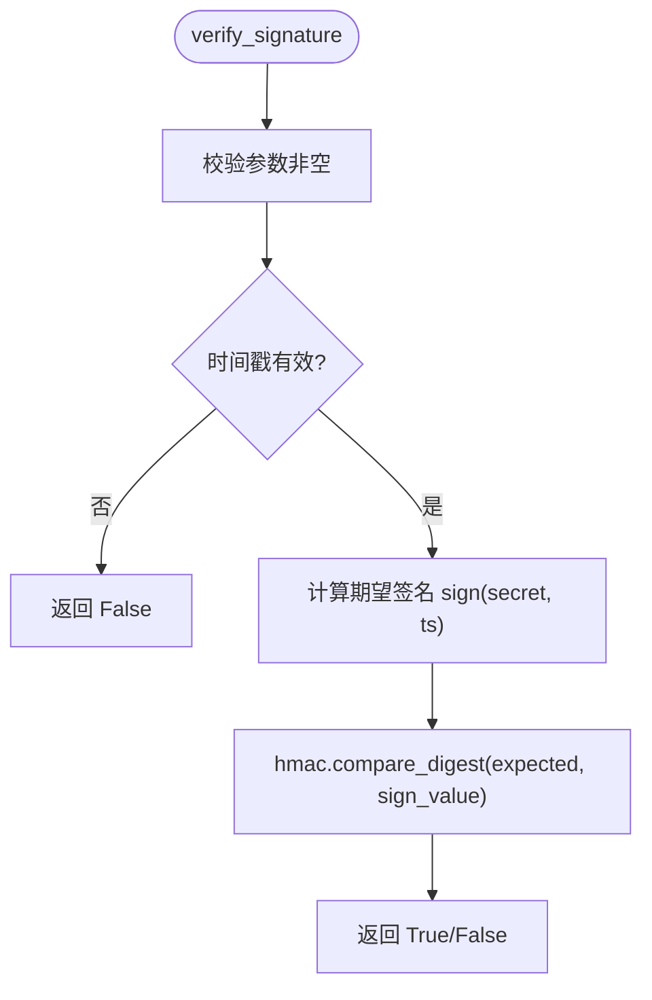
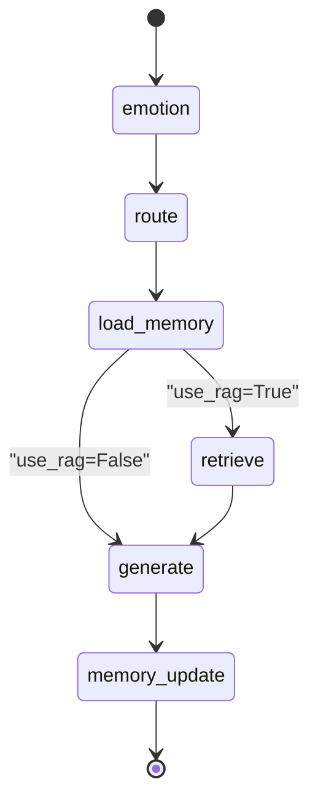
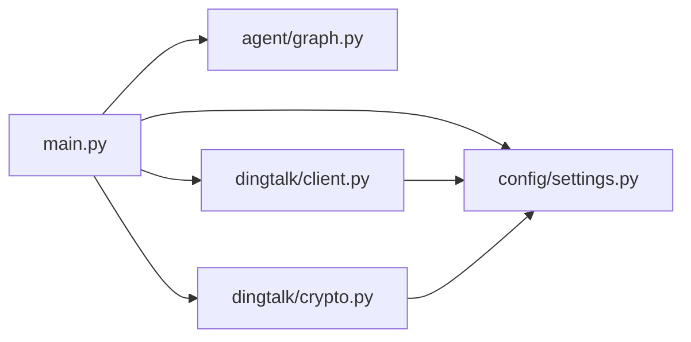

# 钉钉集成服务

<cite>
**本文引用的文件**   
- [main.py](file://main.py)
- [dingtalk/client.py](file://dingtalk/client.py)
- [dingtalk/crypto.py](file://dingtalk/crypto.py)
- [config/settings.py](file://config/settings.py)
- [agent/graph.py](file://agent/graph.py)
- [agent/nodes.py](file://agent/nodes.py)
- [requirements.txt](file://requirements.txt)
- [README.md](file://README.md)
- [data/docs/产品说明.txt](file://data/docs/产品说明.txt)
</cite>

## 目录
1. [简介](#简介)
2. [项目结构](#项目结构)
3. [核心组件](#核心组件)
4. [架构总览](#架构总览)
5. [详细组件分析](#详细组件分析)
6. [依赖关系分析](#依赖关系分析)
7. [性能与可靠性](#性能与可靠性)
8. [故障排查指南](#故障排查指南)
9. [结论](#结论)
10. [附录：配置与常见问题](#附录配置与常见问题)

## 简介
本技术文档面向“钉钉AI智能体助手”的钉钉集成部分，系统性阐述以下能力：
- 钉钉机器人 Webhook 回调接收与处理流程（签名校验、消息解析、安全策略）
- 企业应用 API 调用方法（工作通知发送、Markdown 消息、机器人 webhook 回复）
- 加密与签名机制（HMAC-SHA256 签名生成与验证、时间戳防重放）
- 不同消息类型的处理方式（文本、Markdown、群内 @ 用户等）
- 完整的 API 调用示例与错误处理策略
- 钉钉开放平台配置要点与常见问题解决方案

## 项目结构
本项目采用分层模块化设计，Web 入口、钉钉客户端与安全模块解耦，便于扩展与维护。关键目录与职责如下：
- main.py：FastAPI 主入口，提供健康检查、Web 聊天接口、钉钉 Webhook 回调路由
- dingtalk/client.py：钉钉企业应用 API 客户端（access_token 获取、工作通知、Markdown、机器人 webhook 回复）
- dingtalk/crypto.py：签名生成与校验（HMAC-SHA256）、时间戳有效期校验
- config/settings.py：全局配置（环境变量与 .env），包含钉钉 AppKey/AppSecret、机器人 Token/Secret、API Base URL 等
- agent/graph.py：LangGraph 状态图构建与编译，封装智能体调用入口
- agent/nodes.py：智能体节点实现（情感分析、路由、RAG 检索、记忆更新、回答生成）
- requirements.txt：依赖声明（FastAPI、httpx、langchain/langgraph 等）
- README.md：架构图与快速开始指引
- data/docs/产品说明.txt：产品概述与技术栈说明

图表来源
- [main.py:106-176](file://main.py#L106-L176)
- [dingtalk/client.py:16-139](file://dingtalk/client.py#L16-L139)
- [dingtalk/crypto.py:14-63](file://dingtalk/crypto.py#L14-L63)
- [config/settings.py:16-56](file://config/settings.py#L16-L56)
- [agent/graph.py:25-82](file://agent/graph.py#L25-L82)
- [agent/nodes.py:30-164](file://agent/nodes.py#L30-L164)

章节来源
- [main.py:1-236](file://main.py#L1-L236)
- [dingtalk/client.py:1-140](file://dingtalk/client.py#L1-L140)
- [dingtalk/crypto.py:1-63](file://dingtalk/crypto.py#L1-L63)
- [config/settings.py:1-93](file://config/settings.py#L1-L93)
- [agent/graph.py:1-106](file://agent/graph.py#L1-L106)
- [agent/nodes.py:1-164](file://agent/nodes.py#L1-L164)
- [requirements.txt:1-31](file://requirements.txt#L1-L31)
- [README.md:1-51](file://README.md#L1-L51)
- [data/docs/产品说明.txt:1-19](file://data/docs/产品说明.txt#L1-L19)

## 核心组件
- 钉钉 Webhook 回调处理器：负责接收请求、解析参数、签名校验、提取消息内容、调用智能体并回复
- 钉钉客户端：封装 access_token 获取与工作通知、Markdown、机器人 webhook 回复等 API 调用
- 签名校验模块：实现 HMAC-SHA256 签名生成与验证，含时间戳有效期控制
- 配置管理：集中管理钉钉凭证、API 基础地址、模型与向量库等配置项
- 智能体编排：基于 LangGraph 的状态图工作流，支持情感分析、路由判断、RAG 检索、记忆更新与回答生成

章节来源
- [main.py:106-176](file://main.py#L106-L176)
- [dingtalk/client.py:16-139](file://dingtalk/client.py#L16-L139)
- [dingtalk/crypto.py:14-63](file://dingtalk/crypto.py#L14-L63)
- [config/settings.py:16-56](file://config/settings.py#L16-L56)
- [agent/graph.py:25-82](file://agent/graph.py#L25-L82)
- [agent/nodes.py:30-164](file://agent/nodes.py#L30-L164)

## 架构总览
钉钉消息从用户侧进入 FastAPI 服务，经过签名校验后进入智能体工作流，最终通过钉钉客户端将回答回写到群聊或工作通知。

图表来源
- [main.py:106-176](file://main.py#L106-L176)
- [dingtalk/crypto.py:33-63](file://dingtalk/crypto.py#L33-L63)
- [agent/graph.py:76-106](file://agent/graph.py#L76-L106)
- [agent/nodes.py:30-164](file://agent/nodes.py#L30-L164)
- [dingtalk/client.py:104-127](file://dingtalk/client.py#L104-L127)

## 详细组件分析

### 钉钉 Webhook 回调处理
- 端点：POST /dingtalk/webhook
- 输入参数：
  - query：timestamp、sign（用于签名校验）
  - body：text.content 或 content（兼容两种格式）、senderStaffId/senderId、conversationId、sessionWebhook
- 处理流程：
  - 解析查询参数与请求体
  - 若配置了机器人密钥，则进行签名校验；失败返回 403
  - 提取文本内容与会话标识
  - 调用智能体图生成回答
  - 优先使用机器人 webhook 回复群消息，否则回退到工作通知发送文本消息
- 错误处理：
  - 签名失败：返回 403 与错误码
  - 空文本：返回 errcode=0 且 errmsg="empty text"
  - 智能体异常：记录日志并构造友好提示

图表来源
- [main.py:106-176](file://main.py#L106-L176)
- [dingtalk/crypto.py:33-63](file://dingtalk/crypto.py#L33-L63)

章节来源
- [main.py:106-176](file://main.py#L106-L176)

### 钉钉客户端（企业应用 API）
- access_token 获取：
  - 端点：GET/POST /gettoken?appkey=...&appsecret=...
  - 本地缓存 token 与过期时间，避免频繁请求
- 工作通知发送：
  - 端点：/topapi/message/corpconversation/asyncsend_v2
  - 支持 msgtype=text 与 msgtype=markdown
- 机器人 webhook 回复：
  - 端点：/robot/send?access_token={webhook_token}
  - 支持 atUserIds 列表以 @ 指定用户

图表来源
- [dingtalk/client.py:16-139](file://dingtalk/client.py#L16-L139)
- [config/settings.py:16-56](file://config/settings.py#L16-L56)

章节来源
- [dingtalk/client.py:16-139](file://dingtalk/client.py#L16-L139)

### 签名校验与加密解密
- 算法：HMAC-SHA256
- 签名字符串：timestamp+"\n"+secret
- 输出：base64 编码的签名字符串
- 校验流程：
  - 校验 timestamp、sign、secret 非空
  - 时间戳有效性校验（默认最大年龄 3600 秒，防重放）
  - 计算期望签名并与传入 sign 比较（使用常量时间比较避免时序攻击）

图表来源
- [dingtalk/crypto.py:14-31](file://dingtalk/crypto.py#L14-L31)
- [dingtalk/crypto.py:33-63](file://dingtalk/crypto.py#L33-L63)

章节来源
- [dingtalk/crypto.py:14-63](file://dingtalk/crypto.py#L14-L63)

### 智能体工作流（LangGraph）
- 状态图节点：emotion、route、load_memory、retrieve、generate、memory_update
- 条件边：根据 use_rag 分流至 retrieve 或 generate
- 短期记忆：checkpointer（MemorySaver）按 thread_id 维护上下文
- 长期记忆：SQLite 持久化摘要，周期性触发

图表来源
- [agent/graph.py:25-69](file://agent/graph.py#L25-L69)
- [agent/nodes.py:30-164](file://agent/nodes.py#L30-L164)

章节来源
- [agent/graph.py:25-82](file://agent/graph.py#L25-L82)
- [agent/nodes.py:30-164](file://agent/nodes.py#L30-L164)

## 依赖关系分析
- Web 层依赖：
  - FastAPI、Request、JSONResponse
  - 智能体图（agent/graph.py）
  - 配置（config/settings.py）
  - 签名校验（dingtalk/crypto.py）
  - 钉钉客户端（dingtalk/client.py）
- 客户端依赖：
  - httpx（HTTP 客户端）
  - 配置（config/settings.py）
- 签名模块依赖：
  - hmac、hashlib、base64、time

图表来源
- [main.py:106-176](file://main.py#L106-L176)
- [dingtalk/client.py:16-139](file://dingtalk/client.py#L16-L139)
- [dingtalk/crypto.py:14-63](file://dingtalk/crypto.py#L14-L63)
- [config/settings.py:16-56](file://config/settings.py#L16-L56)

章节来源
- [main.py:106-176](file://main.py#L106-L176)
- [dingtalk/client.py:16-139](file://dingtalk/client.py#L16-L139)
- [dingtalk/crypto.py:14-63](file://dingtalk/crypto.py#L14-L63)
- [config/settings.py:16-56](file://config/settings.py#L16-L56)

## 性能与可靠性
- access_token 缓存：减少重复网络请求，提升稳定性
- 超时与重试：httpx 请求设置超时，异常捕获与日志记录
- 并发与阻塞：Webhook 处理使用同步 def，由 FastAPI 线程池执行，避免阻塞事件循环
- 短期记忆：进程内 MemorySaver，降低延迟
- 长期记忆：SQLite 持久化，定期摘要，平衡存储与检索成本

[本节为通用指导，不直接分析具体文件]

## 故障排查指南
- 签名校验失败：
  - 检查机器人密钥是否正确配置
  - 确认 timestamp 与 sign 参数存在且格式正确
  - 检查服务器时间与钉钉服务端时间差是否在允许范围内
- 无法获取 access_token：
  - 检查 AppKey/AppSecret 是否配置
  - 查看网络连通性与 API Base URL 是否正确
- 工作通知发送失败：
  - 检查 userid_list 是否为逗号分隔的用户 ID 列表
  - 确认 agent_id 与 robot_code 配置正确
- 机器人 webhook 回复失败：
  - 检查 webhook_token 是否有效
  - 确认请求体结构与字段名称符合规范

章节来源
- [main.py:106-176](file://main.py#L106-L176)
- [dingtalk/client.py:25-79](file://dingtalk/client.py#L25-L79)
- [dingtalk/crypto.py:33-63](file://dingtalk/crypto.py#L33-L63)

## 结论
本集成方案通过 FastAPI 提供稳定的 Webhook 回调入口，结合 HMAC-SHA256 签名校验保障安全，利用 LangGraph 编排智能体工作流，并通过钉钉客户端完成消息回复。整体架构清晰、模块解耦良好，具备可扩展性与可维护性。建议在生产环境完善监控告警与错误上报机制，进一步提升系统可靠性。

[本节为总结性内容，不直接分析具体文件]

## 附录：配置与常见问题

### 钉钉开放平台配置要点
- 自定义机器人：
  - 在群设置中添加自定义机器人，启用 Outgoing Webhook
  - 配置加签密钥（secret）与回调地址（指向 /dingtalk/webhook）
- 企业应用：
  - 创建企业内部应用，获取 AppKey 与 AppSecret
  - 配置机器人 code（agent_id）以便工作通知发送
- 环境变量与 .env：
  - 参考配置项：dingtalk_app_key、dingtalk_app_secret、dingtalk_robot_token、dingtalk_robot_secret、dingtalk_robot_code、dingtalk_api_base

章节来源
- [config/settings.py:49-56](file://config/settings.py#L49-L56)
- [README.md:36-51](file://README.md#L36-L51)
- [data/docs/产品说明.txt:1-19](file://data/docs/产品说明.txt#L1-L19)

### 常见错误与处理策略
- 403 签名校验失败：
  - 返回 errcode=40001，errmsg="签名校验失败"
- 空文本消息：
  - 返回 errcode=0，errmsg="empty text"
- 智能体调用异常：
  - 记录异常日志，返回友好提示
- 钉钉 API 调用失败：
  - 记录响应体与异常信息，返回 errcode=-1 与 errmsg

章节来源
- [main.py:106-176](file://main.py#L106-L176)
- [dingtalk/client.py:25-79](file://dingtalk/client.py#L25-L79)

### API 调用示例（路径引用）
- 获取 access_token：
  - 参考路径：[dingtalk/client.py:25-56](file://dingtalk/client.py#L25-L56)
- 发送工作通知文本：
  - 参考路径：[dingtalk/client.py:58-79](file://dingtalk/client.py#L58-L79)
- 发送 Markdown 消息：
  - 参考路径：[dingtalk/client.py:81-102](file://dingtalk/client.py#L81-L102)
- 机器人 webhook 回复：
  - 参考路径：[dingtalk/client.py:104-127](file://dingtalk/client.py#L104-L127)
- 签名生成与校验：
  - 参考路径：[dingtalk/crypto.py:14-31](file://dingtalk/crypto.py#L14-L31)、[dingtalk/crypto.py:33-63](file://dingtalk/crypto.py#L33-L63)

[本节为路径引用，不直接展示代码内容]