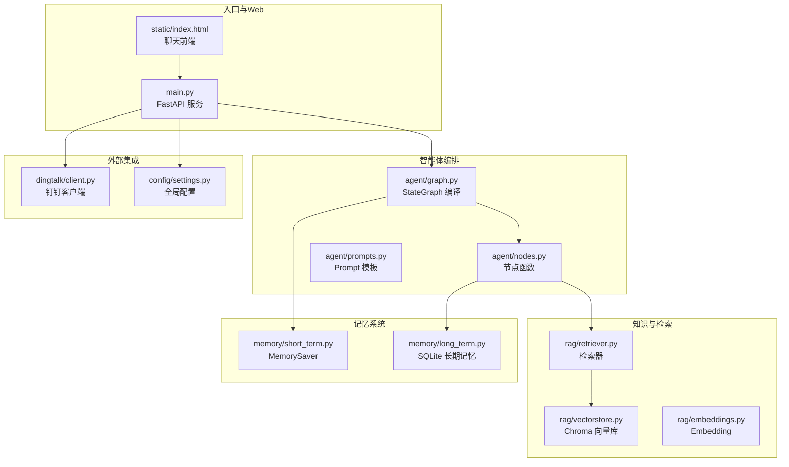
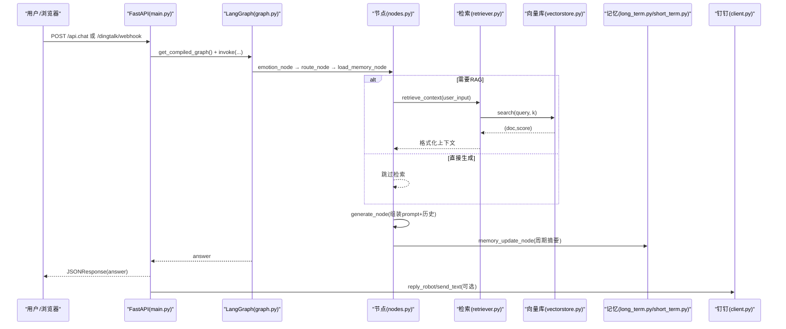
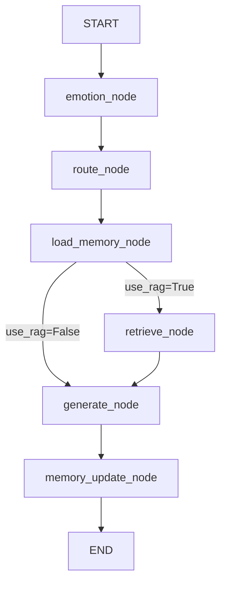
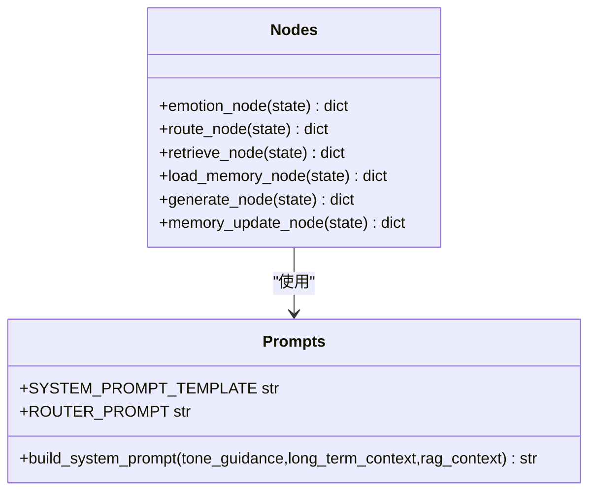
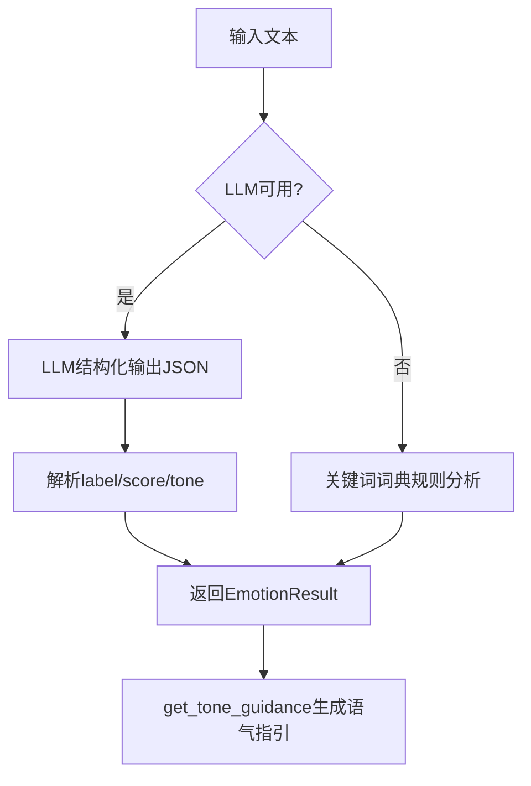
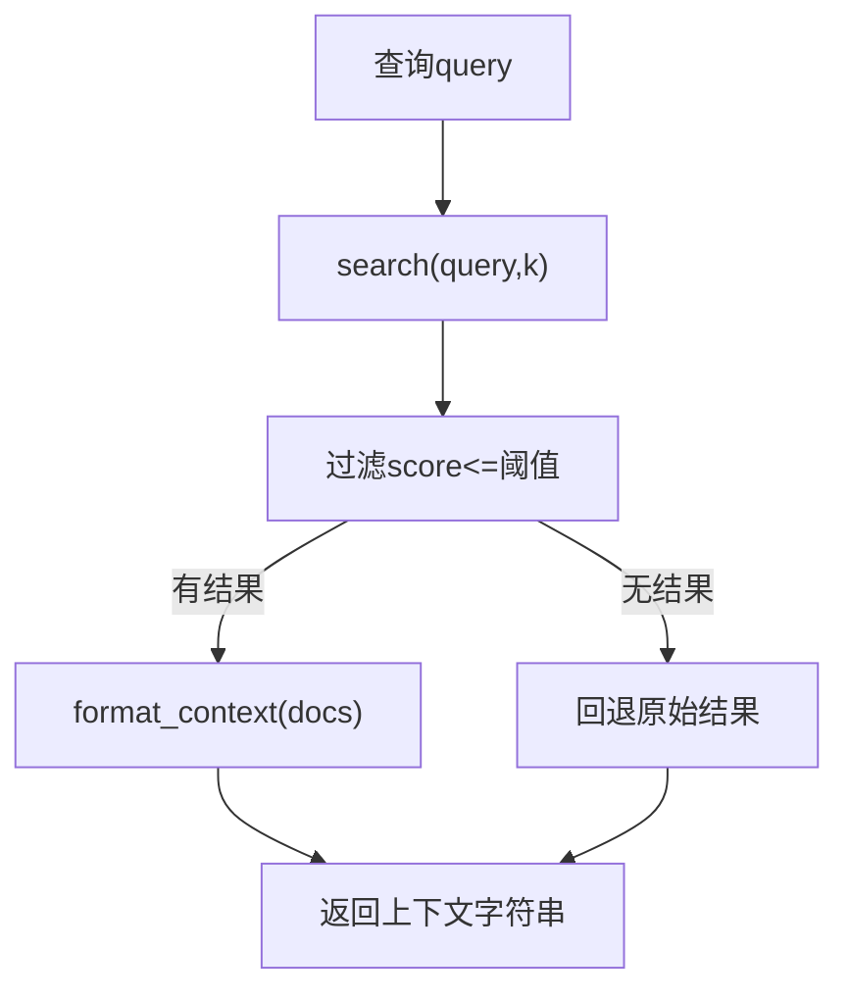
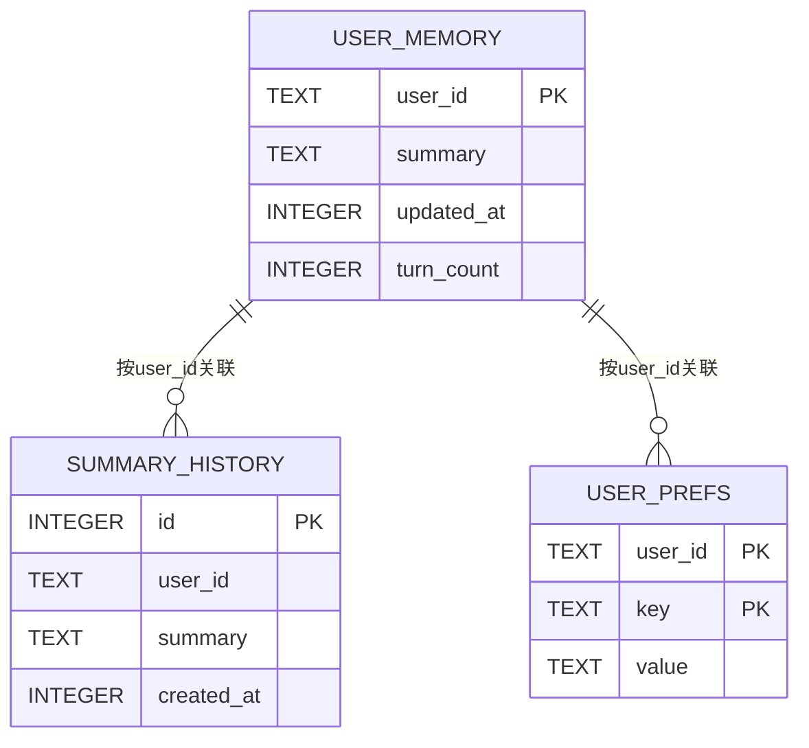
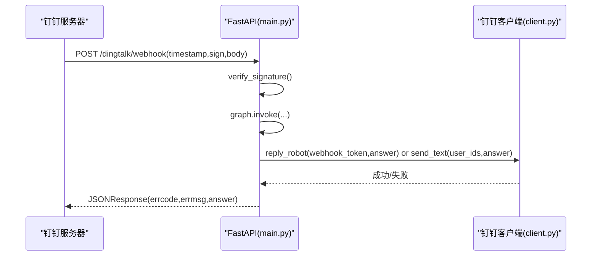
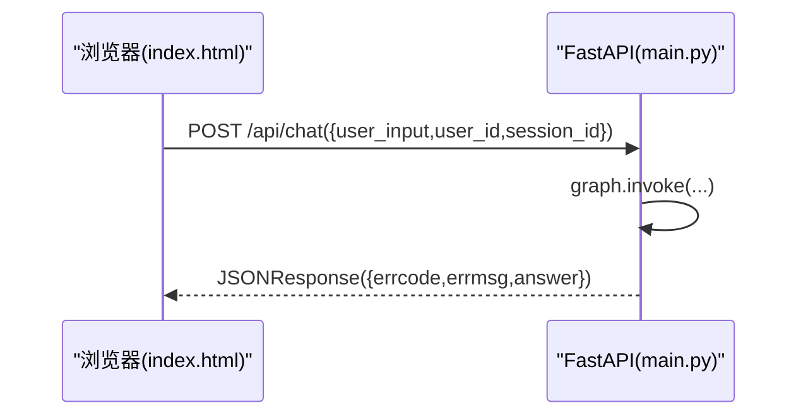
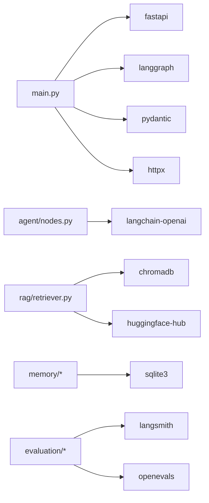

# 项目概述

<cite>
**本文引用的文件**   
- [main.py](file://main.py)
- [requirements.txt](file://requirements.txt)
- [agent/graph.py](file://agent/graph.py)
- [agent/nodes.py](file://agent/nodes.py)
- [agent/prompts.py](file://agent/prompts.py)
- [config/settings.py](file://config/settings.py)
- [dingtalk/client.py](file://dingtalk/client.py)
- [emotion/analyzer.py](file://emotion/analyzer.py)
- [rag/retriever.py](file://rag/retriever.py)
- [rag/vectorstore.py](file://rag/vectorstore.py)
- [memory/long_term.py](file://memory/long_term.py)
- [memory/short_term.py](file://memory/short_term.py)
- [static/index.html](file://static/index.html)
- [data/docs/产品说明.txt](file://data/docs/产品说明.txt)
</cite>

## 目录
1. [简介](#简介)
2. [项目结构](#项目结构)
3. [核心组件](#核心组件)
4. [架构总览](#架构总览)
5. [详细组件分析](#详细组件分析)
6. [依赖关系分析](#依赖关系分析)
7. [性能考量](#性能考量)
8. [故障排查指南](#故障排查指南)
9. [结论](#结论)
10. [附录：快速开始与使用示例](#附录快速开始与使用示例)

## 简介
本项目是一个面向钉钉平台的 AI 智能体助手，基于 LangChain 与 LangGraph 构建，提供智能对话、情感感知回复、RAG 检索增强、持久化记忆以及钉钉深度集成的能力。系统通过 FastAPI 对外暴露 Webhook 与聊天接口，前端提供本地调试页面，后端以状态图工作流编排多步推理流程，结合向量数据库进行知识检索，实现高质量、个性化、可评估的企业级问答体验。

## 项目结构
- agent：LangGraph 状态图与工作流节点（情感分析、路由、检索、生成、记忆更新）
- config：全局配置（LLM、Embedding、向量库、记忆、钉钉、评估等）
- dingtalk：钉钉 API 客户端（消息发送、Webhook 回调）
- emotion：情感分析与语气指引
- rag：检索增强（Embedding、文档入库、检索器、向量库封装）
- memory：短期与长期记忆（进程内 checkpointer + SQLite 持久化）
- evaluation：智能体与 RAG 的评估脚本
- static：本地 Web 聊天前端
- data/docs：知识库文档源

**图表来源** 
- [main.py:1-236](file://main.py#L1-L236)
- [agent/graph.py:1-106](file://agent/graph.py#L1-L106)
- [agent/nodes.py:1-164](file://agent/nodes.py#L1-L164)
- [rag/retriever.py:1-38](file://rag/retriever.py#L1-L38)
- [rag/vectorstore.py:1-75](file://rag/vectorstore.py#L1-L75)
- [memory/short_term.py:1-28](file://memory/short_term.py#L1-L28)
- [memory/long_term.py:1-244](file://memory/long_term.py#L1-L244)
- [dingtalk/client.py:1-140](file://dingtalk/client.py#L1-L140)
- [config/settings.py:1-93](file://config/settings.py#L1-L93)
- [static/index.html:1-414](file://static/index.html#L1-L414)

**章节来源**
- [main.py:1-236](file://main.py#L1-L236)
- [data/docs/产品说明.txt:1-39](file://data/docs/产品说明.txt#L1-L39)

## 核心组件
- 状态图工作流：基于 LangGraph StateGraph，定义从“情感分析→路由判断→加载长期记忆→条件分流（RAG 或直接生成）→生成回答→更新长期记忆”的完整链路，并通过 checkpointer 维护会话上下文。
- 智能对话系统：统一入口 /api/chat 与钉钉 Webhook /dingtalk/webhook，均调用同一智能体图执行。
- 情感感知回复：对输入进行情感分类并注入语气指引，影响生成策略。
- RAG 检索增强：语义检索 ChromaDB，按阈值过滤低相关度结果，格式化上下文供 LLM 参考。
- 持久化记忆：短期记忆使用 MemorySaver；长期记忆使用 SQLite 存储用户偏好与摘要，周期性触发摘要更新。
- 钉钉集成：支持 Outgoing Webhook 回调签名校验、机器人回复与工作通知发送。
- 配置管理：集中式 Settings，环境变量与 .env 双通道加载。

**章节来源**
- [agent/graph.py:1-106](file://agent/graph.py#L1-L106)
- [agent/nodes.py:1-164](file://agent/nodes.py#L1-L164)
- [rag/retriever.py:1-38](file://rag/retriever.py#L1-L38)
- [rag/vectorstore.py:1-75](file://rag/vectorstore.py#L1-L75)
- [memory/long_term.py:1-244](file://memory/long_term.py#L1-L244)
- [memory/short_term.py:1-28](file://memory/short_term.py#L1-L28)
- [dingtalk/client.py:1-140](file://dingtalk/client.py#L1-L140)
- [config/settings.py:1-93](file://config/settings.py#L1-L93)

## 架构总览
整体采用“Web 服务 + 状态图编排 + 检索增强 + 记忆系统 + 平台集成”的分层架构。FastAPI 作为网关，接收 Web 与钉钉请求，进入 LangGraph 状态图；节点内部按需调用 LLM、Embedding、向量库与记忆模块；最终通过钉钉客户端回写消息。

**图表来源** 
- [main.py:58-176](file://main.py#L58-L176)
- [agent/graph.py:25-82](file://agent/graph.py#L25-L82)
- [agent/nodes.py:30-164](file://agent/nodes.py#L30-L164)
- [rag/retriever.py:1-38](file://rag/retriever.py#L1-L38)
- [rag/vectorstore.py:48-68](file://rag/vectorstore.py#L48-L68)
- [memory/long_term.py:145-244](file://memory/long_term.py#L145-L244)
- [dingtalk/client.py:104-127](file://dingtalk/client.py#L104-L127)

## 详细组件分析

### 状态图与工作流（LangGraph）
- 构建与编译：build_graph 注册节点与边，load_memory 后根据 use_rag 条件分流至 retrieve 或 generate，最终经 memory_update 结束。
- 单例模式：get_compiled_graph 缓存编译后的图，避免重复构建开销。
- 便捷入口：chat 函数封装一次调用，返回 answer。

**图表来源** 
- [agent/graph.py:25-69](file://agent/graph.py#L25-L69)
- [agent/nodes.py:45-73](file://agent/nodes.py#L45-L73)

**章节来源**
- [agent/graph.py:1-106](file://agent/graph.py#L1-L106)

### 节点函数与 Prompt
- emotion_node：调用 emotion.analyzer 分析情感并写入 state.emotion。
- route_node：基于 LLM 与关键词兜底判断是否需要 RAG。
- retrieve_node：调用 rag.retriever 获取上下文。
- load_memory_node：加载 long_term 上下文。
- generate_node：组装 system prompt（含语气指引、长期记忆、RAG 上下文），调用 LLM 生成回答。
- memory_update_node：周期性统计轮次并触发摘要生成与存储。

**图表来源** 
- [agent/nodes.py:30-164](file://agent/nodes.py#L30-L164)
- [agent/prompts.py:1-63](file://agent/prompts.py#L1-L63)

**章节来源**
- [agent/nodes.py:1-164](file://agent/nodes.py#L1-L164)
- [agent/prompts.py:1-63](file://agent/prompts.py#L1-L63)

### 情感分析模块
- analyze：优先使用 LLM 结构化输出情感标签、置信度与建议语气；失败时回退到关键词词典规则分析。
- get_tone_guidance：将情感结果转换为语气指引文案，注入系统 prompt。

**图表来源** 
- [emotion/analyzer.py:82-118](file://emotion/analyzer.py#L82-L118)

**章节来源**
- [emotion/analyzer.py:1-118](file://emotion/analyzer.py#L1-L118)

### RAG 检索增强
- retriever.retrieve_context：检索 top-k 文档并格式化为上下文字符串，包含来源、标题与相关度。
- vectorstore.search：相似度搜索并过滤低于阈值的低相关度结果，保证质量。

**图表来源** 
- [rag/retriever.py:13-38](file://rag/retriever.py#L13-L38)
- [rag/vectorstore.py:48-68](file://rag/vectorstore.py#L48-L68)

**章节来源**
- [rag/retriever.py:1-38](file://rag/retriever.py#L1-L38)
- [rag/vectorstore.py:1-75](file://rag/vectorstore.py#L1-L75)

### 记忆系统（短期与长期）
- 短期记忆：MemorySaver 按 thread_id（session_id）维护会话上下文，无需外部服务。
- 长期记忆：SQLite 持久化用户偏好与摘要，支持增量计数与周期性摘要生成，限制历史摘要数量。

**图表来源** 
- [memory/long_term.py:44-72](file://memory/long_term.py#L44-L72)

**章节来源**
- [memory/short_term.py:1-28](file://memory/short_term.py#L1-L28)
- [memory/long_term.py:1-244](file://memory/long_term.py#L1-L244)

### 钉钉集成
- Webhook 回调：校验签名（可选）、提取消息内容、调用智能体生成回答，优先通过机器人 webhook 回复群消息，否则回退到工作通知。
- 客户端能力：获取 access_token（带缓存）、发送文本/Markdown、机器人回复。

**图表来源** 
- [main.py:106-176](file://main.py#L106-L176)
- [dingtalk/client.py:104-127](file://dingtalk/client.py#L104-L127)

**章节来源**
- [main.py:106-176](file://main.py#L106-L176)
- [dingtalk/client.py:1-140](file://dingtalk/client.py#L1-L140)

### Web 前端与聊天接口
- 根路径返回静态 index.html，提供聊天界面与状态提示。
- /api/chat 接收 user_input、user_id、session_id，直接调用智能体并返回 answer。

**图表来源** 
- [main.py:49-91](file://main.py#L49-L91)
- [static/index.html:359-402](file://static/index.html#L359-L402)

**章节来源**
- [main.py:49-91](file://main.py#L49-L91)
- [static/index.html:1-414](file://static/index.html#L1-L414)

## 依赖关系分析
- 框架与运行时：FastAPI、Uvicorn、Pydantic、httpx
- LLM 与 Embedding：OpenAI 兼容接口（千问）、HuggingFace bge-small-zh-v1.5
- 向量库：ChromaDB（本地持久化）
- 编排与记忆：LangChain、LangGraph、MemorySaver、SQLite
- 评估：LangSmith、OpenEvals

**图表来源** 
- [requirements.txt:1-31](file://requirements.txt#L1-L31)

**章节来源**
- [requirements.txt:1-31](file://requirements.txt#L1-L31)

## 性能考量
- 图编译单例：get_compiled_graph 缓存编译后的状态图，减少重复构建成本。
- 向量检索阈值：rag_score_filter 过滤低相关度结果，降低噪声与 LLM 负载。
- 短期记忆内存：MemorySaver 为进程内存储，避免额外 I/O 开销。
- 长期记忆并发：SQLite WAL 模式提升读并发，写操作串行化避免冲突。
- Token 缓存：钉钉 access_token 本地缓存，减少网络请求频率。

[本节为通用指导，不直接分析具体文件]

## 故障排查指南
- 健康检查：访问 /health 查看服务状态与 checkpointer 类型。
- 签名校验失败：确认钉钉 robot_secret 与 timestamp/sign 参数正确。
- 检索为空：检查向量库是否已入库数据，调整 rag_top_k 与 rag_score_filter。
- LLM 不可用：确认 llm_model、llm_base_url、llm_api_key 配置正确；情感与路由具备规则兜底。
- 钉钉消息未送达：检查 robot_token 或工作通知配置，查看客户端日志。

**章节来源**
- [main.py:94-103](file://main.py#L94-L103)
- [main.py:129-136](file://main.py#L129-L136)
- [rag/vectorstore.py:62-68](file://rag/vectorstore.py#L62-L68)
- [emotion/analyzer.py:110-112](file://emotion/analyzer.py#L110-L112)
- [dingtalk/client.py:35-56](file://dingtalk/client.py#L35-L56)

## 结论
本项目以 LangGraph 状态图为中枢，结合情感感知、RAG 检索与持久化记忆，构建了面向钉钉的企业级智能体助手。其模块化设计、清晰的职责划分与完善的评估体系，使其在复杂企业场景中具备高可用性与可扩展性。通过统一的配置管理与健壮的异常处理，开发者可以快速部署与迭代，满足不同业务需求。

[本节为总结性内容，不直接分析具体文件]

## 附录：快速开始与使用示例
- 环境要求
  - Python 3.x（建议 3.10+）
  - 安装依赖：pip install -r requirements.txt
  - 配置环境变量或 .env（LLM、Embedding、向量库、记忆、钉钉、评估等）

- 启动服务
  - 启动 Web 服务：uvicorn main:app --host 0.0.0.0 --port 8000 --reload
  - 本地 REPL 调试：python main.py --repl

- 基本使用
  - Web 聊天：访问 http://localhost:8000，在页面输入消息并发送
  - 健康检查：GET http://localhost:8000/health
  - 钉钉回调：POST http://localhost:8000/dingtalk/webhook（需配置签名与机器人 token）

- 知识库入库（示例）
  - 将文档放入 data/docs，运行入库脚本（如 ingest 相关逻辑），确保 ChromaDB 持久化目录存在

- 评估与追踪（可选）
  - 配置 LangSmith 与 OpenEvals，运行评估脚本以评测智能体与 RAG 质量

**章节来源**
- [main.py:212-231](file://main.py#L212-L231)
- [config/settings.py:16-62](file://config/settings.py#L16-L62)
- [data/docs/产品说明.txt:1-39](file://data/docs/产品说明.txt#L1-L39)