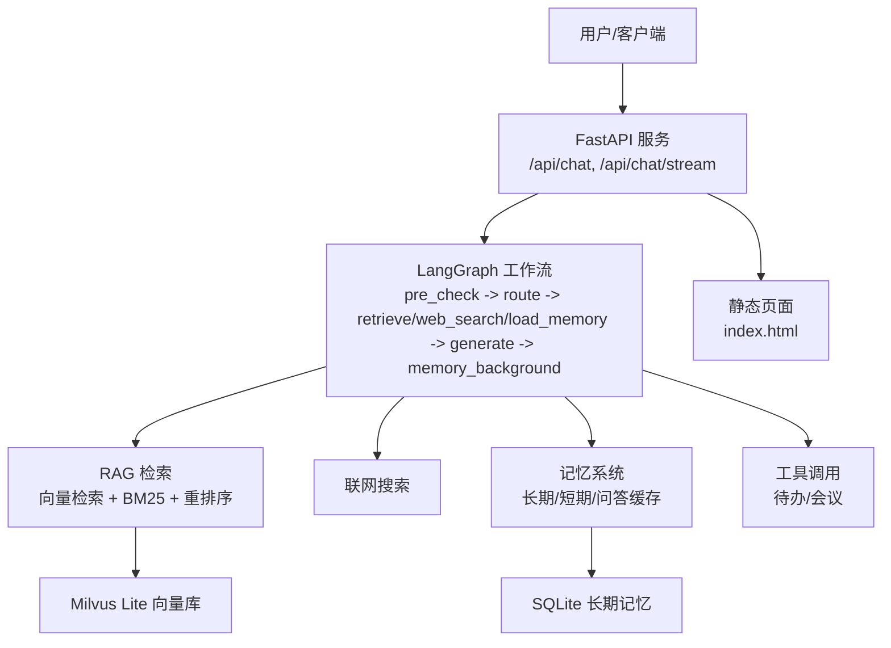
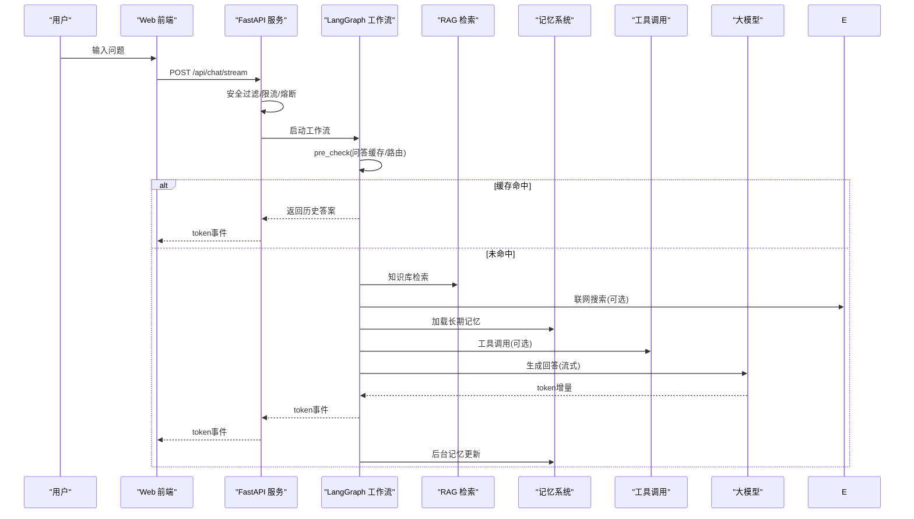
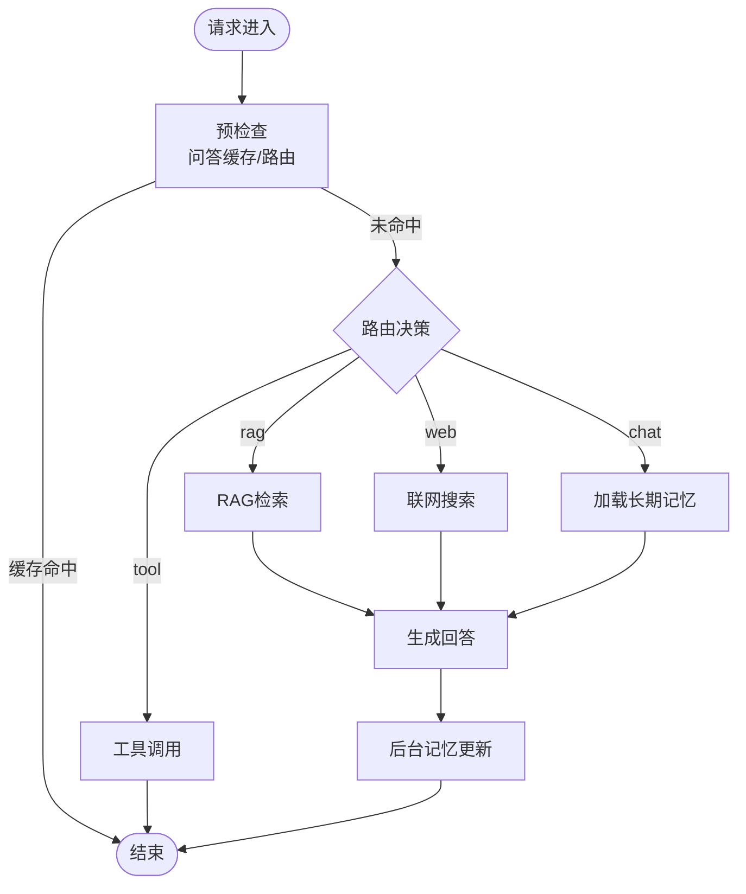
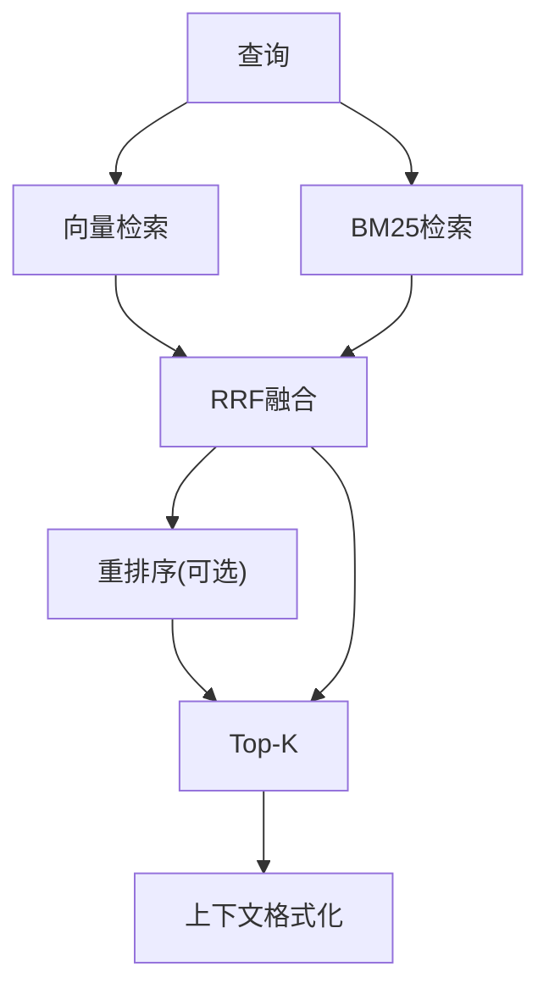
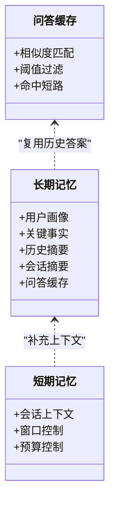
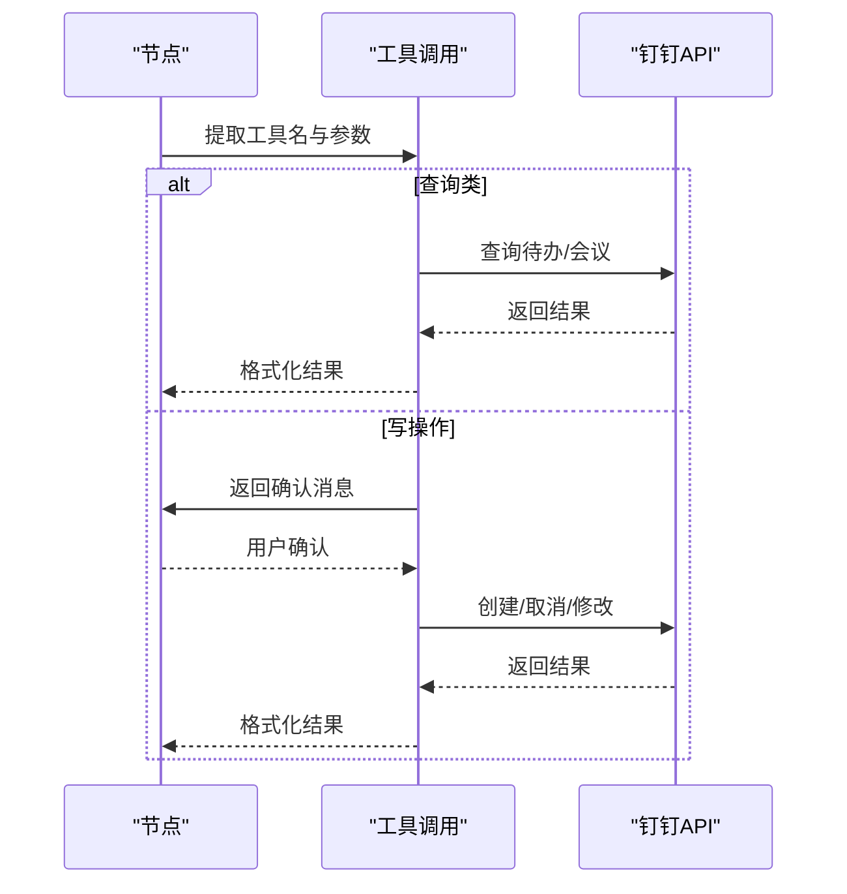
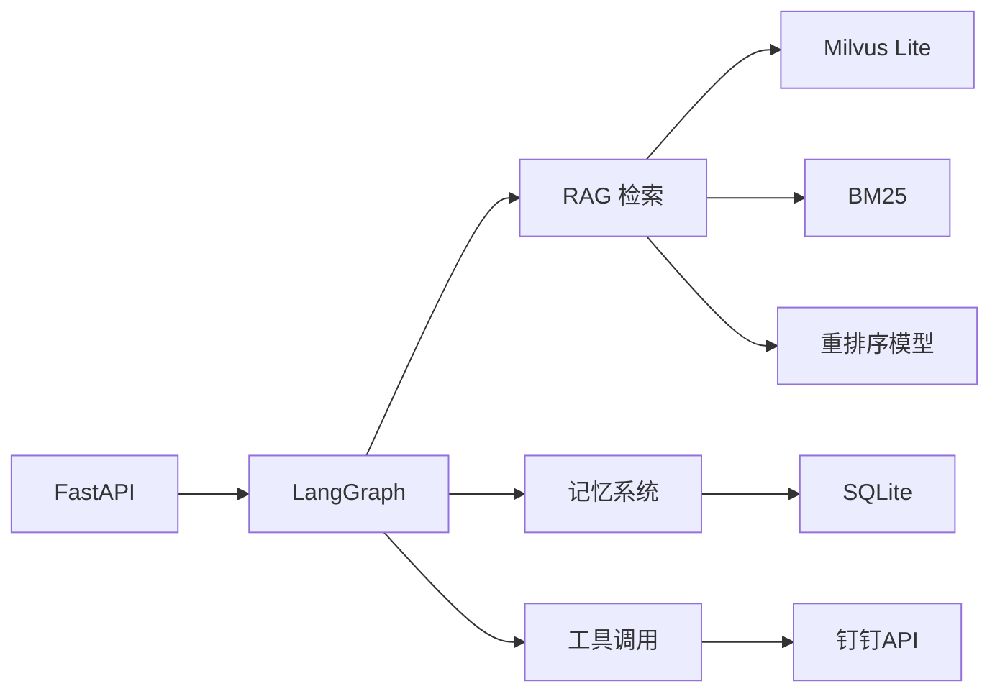

# 项目概述

<cite>
**本文引用的文件**
- [main.py](file://main.py)
- [config/settings.py](file://config/settings.py)
- [agent/graph.py](file://agent/graph.py)
- [agent/nodes.py](file://agent/nodes.py)
- [rag/retriever.py](file://rag/retriever.py)
- [memory/long_term.py](file://memory/long_term.py)
- [agent/tools/meeting_tools.py](file://agent/tools/meeting_tools.py)
- [static/index.html](file://static/index.html)
- [Docker部署指南.md](file://Docker部署指南.md)
- [requirements.txt](file://requirements.txt)
</cite>

## 目录
1. [简介](#简介)
2. [项目结构](#项目结构)
3. [核心组件](#核心组件)
4. [架构总览](#架构总览)
5. [详细组件分析](#详细组件分析)
6. [依赖关系分析](#依赖关系分析)
7. [性能与可用性](#性能与可用性)
8. [快速开始](#快速开始)
9. [功能演示与使用示例](#功能演示与使用示例)
10. [故障排查](#故障排查)
11. [结论](#结论)

## 简介
本项目是一个面向企业级场景的钉钉AI智能体助手，提供智能对话、多模态RAG检索、记忆管理、工具调用等能力，并通过Web接口与前端页面实现开箱即用的交互体验。系统基于LangGraph编排工作流，结合Milvus Lite向量库、BM25关键词检索、重排序模型以及联网搜索，形成“检索增强生成”的闭环；同时通过长期/短期记忆与问答缓存提升多轮对话的一致性与响应效率。

在企业级AI助手领域，本项目的定位是：以钉钉生态为集成点，将知识检索、流程执行（待办/会议）与对话式交互融合，为企业内部知识问答、日程协同与任务管理提供统一的智能入口。

## 项目结构
- 服务入口与Web接口：FastAPI应用，提供聊天、健康检查与本地REPL调试模式
- 智能体工作流：基于LangGraph的状态图，包含预检查、路由、检索、搜索、记忆加载、生成与后台记忆更新
- RAG模块：向量检索、BM25多路召回、重排序、上下文格式化
- 记忆模块：SQLite持久化的长期记忆（画像/事实/摘要/会话摘要/问答缓存），进程内短期记忆
- 工具调用：待办与会议管理的工具执行器，支持参数提取、确认与结果格式化
- 配置中心：集中化环境变量与默认值管理
- 前端页面：内置HTML聊天界面，支持SSE流式输出与节点状态提示
- 部署文档：Docker一键构建与运行指南

图表来源
- [main.py:145-314](file://main.py#L145-L314)
- [agent/graph.py:44-102](file://agent/graph.py#L44-L102)
- [rag/retriever.py:18-53](file://rag/retriever.py#L18-L53)
- [memory/long_term.py:50-125](file://memory/long_term.py#L50-L125)
- [static/index.html:242-325](file://static/index.html#L242-L325)

章节来源
- [main.py:1-387](file://main.py#L1-L387)
- [config/settings.py:19-216](file://config/settings.py#L19-L216)

## 核心组件
- 工作流编排（LangGraph）：定义节点与条件边，实现四路分流与后台记忆更新，保证高可用与低延迟
- 检索增强生成（RAG）：支持向量检索、BM25多路召回、RRF融合、CrossEncoder重排序，按阈值过滤低相关度片段
- 记忆系统：分层结构化长期记忆（画像/事实/摘要/会话摘要），问答缓存命中直接复用历史答案，短期窗口+预算控制避免上下文溢出
- 工具调用：LLM参数提取、写操作确认、执行与结果格式化，对接钉钉待办/会议API
- 安全与限流：输入安全过滤、滑动窗口限流、熔断保护，保障服务稳定性
- 配置管理：集中化环境变量与默认值，覆盖LLM、Embedding、向量库、记忆、工具调用等子系统

章节来源
- [agent/graph.py:44-102](file://agent/graph.py#L44-L102)
- [agent/nodes.py:92-151](file://agent/nodes.py#L92-L151)
- [rag/retriever.py:18-53](file://rag/retriever.py#L18-L53)
- [memory/long_term.py:424-498](file://memory/long_term.py#L424-L498)
- [agent/tools/meeting_tools.py:17-129](file://agent/tools/meeting_tools.py#L17-L129)
- [config/settings.py:29-161](file://config/settings.py#L29-L161)

## 架构总览
系统采用“请求进入→安全与限流→工作流编排→多路检索/搜索→生成回答→后台记忆更新”的分层架构。Web端通过SSE流式传输token与节点状态，前端实时渲染并展示进度提示。

图表来源
- [main.py:228-314](file://main.py#L228-L314)
- [agent/graph.py:44-102](file://agent/graph.py#L44-L102)
- [agent/nodes.py:92-151](file://agent/nodes.py#L92-L151)
- [rag/retriever.py:18-53](file://rag/retriever.py#L18-L53)
- [memory/long_term.py:424-498](file://memory/long_term.py#L424-L498)
- [agent/tools/meeting_tools.py:647-691](file://agent/tools/meeting_tools.py#L647-L691)

## 详细组件分析

### 工作流与节点（LangGraph）
- 预检查节点：合并问答缓存匹配与路由判断，命中则短路到结束，否则按search_route分流
- 路由判断：优先工具调用关键词，其次时效性问题走联网搜索，短输入倾向闲聊，其余由小模型路由
- 检索节点：查询改写→多路召回+重排序→相关度过滤→上下文格式化
- 联网搜索节点：将搜索结果写入统一上下文字段
- 长期记忆加载：分层构建用户画像/关键事实/历史摘要
- 生成节点：组装system prompt与历史消息，主模型失败自动降级备用模型
- 后台记忆节点：规则抽取+LLM抽取→长期记忆更新→问答缓存保存→会话摘要刷新

图表来源
- [agent/graph.py:44-102](file://agent/graph.py#L44-L102)
- [agent/nodes.py:92-151](file://agent/nodes.py#L92-L151)
- [agent/nodes.py:284-341](file://agent/nodes.py#L284-L341)
- [agent/nodes.py:499-533](file://agent/nodes.py#L499-L533)
- [agent/nodes.py:630-643](file://agent/nodes.py#L630-L643)

章节来源
- [agent/graph.py:44-102](file://agent/graph.py#L44-L102)
- [agent/nodes.py:92-151](file://agent/nodes.py#L92-L151)
- [agent/nodes.py:284-341](file://agent/nodes.py#L284-L341)
- [agent/nodes.py:499-533](file://agent/nodes.py#L499-L533)
- [agent/nodes.py:630-643](file://agent/nodes.py#L630-L643)

### RAG检索与多路召回
- 多路召回：向量检索与BM25并行召回，RRF融合后候选集排序
- 重排序：CrossEncoder对候选精排，取top-k
- 上下文格式化：统一归一化分数，标注来源与标题，便于生成阶段引用

图表来源
- [rag/retriever.py:18-53](file://rag/retriever.py#L18-L53)
- [rag/retriever.py:55-110](file://rag/retriever.py#L55-L110)
- [rag/retriever.py:113-133](file://rag/retriever.py#L113-L133)

章节来源
- [rag/retriever.py:18-53](file://rag/retriever.py#L18-L53)
- [rag/retriever.py:55-110](file://rag/retriever.py#L55-L110)
- [rag/retriever.py:113-133](file://rag/retriever.py#L113-L133)

### 记忆系统（长期/短期/问答缓存）
- 长期记忆：分层结构化存储（画像/事实/摘要/会话摘要），按预算填充，关键信息硬保留
- 短期记忆：进程内MemorySaver维护会话上下文，窗口与字符预算控制
- 问答缓存：相似问题直接复用历史答案，减少大模型调用与延迟

图表来源
- [memory/long_term.py:50-125](file://memory/long_term.py#L50-L125)
- [memory/long_term.py:424-498](file://memory/long_term.py#L424-L498)
- [agent/nodes.py:232-281](file://agent/nodes.py#L232-L281)

章节来源
- [memory/long_term.py:50-125](file://memory/long_term.py#L50-L125)
- [memory/long_term.py:424-498](file://memory/long_term.py#L424-L498)
- [agent/nodes.py:232-281](file://agent/nodes.py#L232-L281)

### 工具调用（待办/会议）
- 参数提取：小模型从自然语言中提取工具名与参数
- 确认机制：写操作需用户确认，防止误操作
- 执行与格式化：调用钉钉API，结果格式化为可读文本

图表来源
- [agent/nodes.py:647-691](file://agent/nodes.py#L647-L691)
- [agent/tools/meeting_tools.py:17-129](file://agent/tools/meeting_tools.py#L17-L129)

章节来源
- [agent/nodes.py:647-691](file://agent/nodes.py#L647-L691)
- [agent/tools/meeting_tools.py:17-129](file://agent/tools/meeting_tools.py#L17-L129)

### 前端与流式交互
- 内置HTML页面，支持SSE流式接收token与节点状态
- 打字动画与状态提示，提升用户体验
- 会话重置与自适应输入框

章节来源
- [static/index.html:242-325](file://static/index.html#L242-L325)

## 依赖关系分析
- 核心框架：FastAPI、Uvicorn、Pydantic
- AI栈：LangChain/LangGraph、OpenAI兼容接口、HuggingFace Embedding/Reranker
- 向量库：Milvus Lite（本地文件持久化）
- 多模态处理：PDF/Word/Excel解析、OCR
- 评估与追踪：LangSmith、OpenEvals

图表来源
- [requirements.txt:1-53](file://requirements.txt#L1-L53)
- [main.py:29-31](file://main.py#L29-L31)
- [agent/graph.py:28-41](file://agent/graph.py#L28-L41)
- [rag/retriever.py:13-16](file://rag/retriever.py#L13-L16)
- [memory/long_term.py:17-23](file://memory/long_term.py#L17-L23)

章节来源
- [requirements.txt:1-53](file://requirements.txt#L1-L53)

## 性能与可用性
- 首请求优化：启动时预热LLM连接与向量库索引，降低首次延迟
- 流式响应：SSE逐token输出，支持超时保护与部分生成返回
- 限流与熔断：按用户滑动窗口限流，连续失败触发熔断，恢复冷却
- 多路召回与重排序：提升检索精度，减少幻觉
- 记忆分层与预算：避免上下文溢出，保持对话连贯性

章节来源
- [main.py:45-135](file://main.py#L45-L135)
- [main.py:228-314](file://main.py#L228-L314)
- [config/settings.py:143-161](file://config/settings.py#L143-L161)
- [rag/retriever.py:18-53](file://rag/retriever.py#L18-L53)
- [memory/long_term.py:424-498](file://memory/long_term.py#L424-L498)

## 快速开始
- 环境准备：安装Python依赖，配置.env（LLM密钥、钉钉App Key/Secret等）
- 本地运行：启动FastAPI服务，访问根路径查看聊天页面
- Docker部署：参考部署指南构建镜像并启动容器
- 健康检查：调用/health端点验证服务状态

章节来源
- [Docker部署指南.md:15-47](file://Docker部署指南.md#L15-L47)
- [Docker部署指南.md:89-108](file://Docker部署指南.md#L89-L108)
- [main.py:364-382](file://main.py#L364-L382)
- [main.py:317-326](file://main.py#L317-L326)

## 功能演示与使用示例
- 智能对话：输入问题，系统根据意图路由至RAG/联网搜索/闲聊，流式输出回答
- 多模态RAG：上传文档至data/docs，启动时自动入库，支持PDF/Word/Excel/图片OCR
- 记忆管理：多轮对话中记住用户偏好与关键事实，会话摘要滚动更新
- 工具调用：创建/查询/取消/修改会议，待办任务管理，写操作需确认
- 前端交互：SSE流式显示token与节点状态，支持重置会话

章节来源
- [main.py:145-314](file://main.py#L145-L314)
- [agent/nodes.py:284-341](file://agent/nodes.py#L284-L341)
- [memory/long_term.py:424-498](file://memory/long_term.py#L424-L498)
- [agent/tools/meeting_tools.py:17-129](file://agent/tools/meeting_tools.py#L17-L129)
- [static/index.html:242-325](file://static/index.html#L242-L325)

## 故障排查
- 构建期模型下载失败：重试或挂载本地缓存
- 健康检查不通过：查看日志，调整start_period
- 工具调用不可用：检查TOOL_CALLING_ENABLED与钉钉权限
- 中文路径问题：迁移至纯英文路径

章节来源
- [Docker部署指南.md:324-442](file://Docker部署指南.md#L324-L442)

## 结论
本项目以LangGraph为核心编排引擎，结合多路RAG检索、记忆管理与工具调用，构建了企业级钉钉AI智能体助手。其优势在于：
- 高可用：限流、熔断、降级策略保障服务稳定
- 高性能：预热、流式输出、多路召回与重排序优化延迟与精度
- 可扩展：模块化设计便于接入新工具与新数据源
- 易部署：Docker一键构建与运行，适配Windows/Linux

建议在生产环境中：
- 使用反向代理与HTTPS
- 定期备份data目录
- 固定基础镜像版本
- 配置资源限制与日志收集