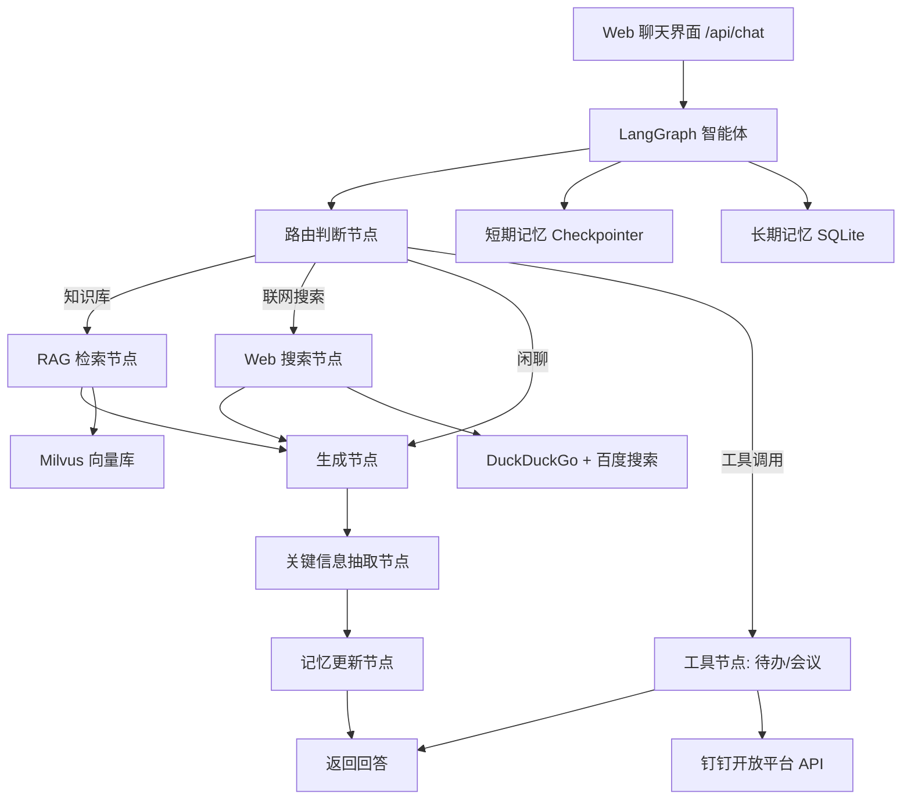

# 钉钉AI智能体助手

基于 **LangChain + LangGraph** 构建的企业级 AI 智能体助手，集成多模态 RAG 智能问答（含联网搜索）、质量评估、短/长期记忆（短期窗口预算+超窗压缩摘要；长期结构化记忆：用户画像/关键事实/分层摘要，优先级加载与上下文预算控制）、智能体评估（LangSmith + OpenEvals）、钉钉工具调用（待办管理/会议管理，自然语言驱动操作）。钉钉收发消息能力以独立 Agent Skill 形式提供（`.qoder/skills/dingtalk-messaging`，不侵入项目源码）。

## 架构图



## 核心特性

| 模块 | 说明 |
|------|------|
| 智能问答 | 多模态 RAG 检索增强生成，三路路由（知识库/联网搜索/闲聊），两阶段检索（向量召回 top-20 + CrossEncoder 重排序 top-k） |
| 联网搜索 | DuckDuckGo（主）+ 百度（备）双引擎，最新信息、实时资讯、天气新闻等 |
| RAG 质量评估 | OpenEvals 检索相关性、忠实度、帮助度、答案相关性 |
| 文档处理 | 支持 .txt/.md/.pdf/.docx/.xlsx 及图片(.png/.jpg)，扫描件 OCR（easyocr） |
| 短期记忆 | LangGraph checkpointer（进程内 MemorySaver）+ 窗口/字符双预算，超窗自动生成会话压缩摘要注入（不丢主线） |
| 长期记忆 | SQLite 结构化记忆（data/memory.db）：用户画像、关键事实（带优先级）、分层摘要；每轮规则快速抽取 + LLM 结构化抽取，P0 关键信息硬保留，按预算分层注入 |
| 问答记忆缓存 | 历史问答对带向量落库，新问题与历史问题余弦相似度达阈（默认 0.90）时直接复用历史答案，跳过大模型生成 |
| 智能体评估 | OpenEvals（correctness/hallucination/plan_adherence）+ LangSmith trace 分析 |
| 钉钉工具调用 | 自然语言驱动钉钉操作：创建/查询待办，创建/查询/取消/修改会议；写操作需用户确认，查询操作直接执行 |
| 钉钉集成 | Agent Skill（`.qoder/skills/dingtalk-messaging`）：自包含实现发送文本/Markdown、机器人 webhook 回复、HMAC-SHA256 签名校验与回调接收服务，不依赖项目源码 |

## 快速开始

### 1. 环境要求
- Python 3.12+

### 2. 安装依赖
```bash
pip install -r requirements.txt
```

### 3. 配置
```bash
cp .env.example .env
# 编辑 .env，填入千问 API Key、base_url 等；钉钉凭证仅供 dingtalk-messaging Skill 使用
```

关键配置项：
```env
LLM_MODEL=qwen-plus
LLM_BASE_URL=https://dashscope.aliyuncs.com/compatible-mode/v1
LLM_API_KEY=sk-your-key
EMBEDDING_MODEL=BAAI/bge-small-zh-v1.5
EMBEDDING_DEVICE=cpu
OCR_LANGUAGES=ch_sim,en
OCR_USE_GPU=false
RERANK_ENABLED=true
RERANK_MODEL=BAAI/bge-reranker-base
WEB_SEARCH_ENABLED=true
# 文档切片大小与重叠（字符数，调整后需 python -m rag.ingest --rebuild 重建索引）
RAG_CHUNK_SIZE=500
RAG_CHUNK_OVERLAP=80
# 知识文档存放目录（相对路径基于项目根目录，支持绝对路径）
RAG_DOCS_DIR=data/docs
LONG_TERM_DB_PATH=data/memory.db
# 记忆预算与抽取配置（可选，均有默认值）
MEMORY_CONTEXT_BUDGET=1600
MEMORY_SHORT_WINDOW=8
MEMORY_HISTORY_BUDGET=2000
RAG_CONTEXT_BUDGET=2500
MEMORY_EXTRACT_LLM_ENABLED=true
# 问答记忆缓存（相似问题直接复用历史答案，跳过大模型）
MEMORY_QA_CACHE_ENABLED=true
MEMORY_QA_THRESHOLD=0.90
MEMORY_QA_MAX_RECORDS=200
# 以下钉钉凭证仅由 .qoder/skills/dingtalk-messaging 使用，项目本体不读取
DINGTALK_APP_KEY=your-app-key
DINGTALK_APP_SECRET=your-app-secret
DINGTALK_ROBOT_SECRET=your-robot-secret
# 钉钉工具调用（待办/会议管理，默认关闭，开启需配置钉钉应用权限）
TOOL_CALLING_ENABLED=false
TOOL_CONFIRMATION_REQUIRED=true
LANGSMITH_API_KEY=your-langsmith-key
```

### 4. 构建多模态 RAG 知识库
将知识文档（.txt/.md/.pdf/.docx/.xlsx/图片）放入 `data/docs/`（可用 `RAG_DOCS_DIR` 改为其它目录），然后入库：
```bash
python -m rag.ingest            # 入库（自动按文件类型加载+OCR+向量化）
python -m rag.ingest --rebuild  # 重建索引
```

### 5. 运行

**Web 服务模式**（Web 聊天界面 + /api/chat 接口）：
```bash
uvicorn main:app --host 0.0.0.0 --port 8000 --reload
```

**钉钉回调接收**（可选，由 Skill 独立提供服务）：
```bash
python .qoder/skills/dingtalk-messaging/scripts/webhook_server.py --port 8001
```

**本地 REPL 调试模式**：
```bash
python main.py --repl
```

**运行评估**：
```bash
python -m evaluation.run_eval                    # 完整评估
python -m evaluation.run_eval --no-agent          # 仅评估器（用数据集答案）
python -m evaluation.run_eval -o report.json      # 输出报告
```

## Docker 部署

提供 CPU 精简镜像，构建期预下载全部模型（Embedding/Reranker/OCR），交付后冷启动无需联网。

```bash
# 1. 构建镜像（含模型预下载，约 10-20 分钟，镜像约 5-6GB）
docker compose build

# 2. 启动（凭证经 .env 注入，data/ 卷持久化记忆与知识库）
docker compose up -d

# 3. 验证
curl http://localhost:8000/health          # 健康检查
# 浏览器打开 http://<host>:8000/ 发送一条消息，确认流式回答

# 4. 知识库入库（容器内执行，文档放宿主机 data/docs/）
docker compose run --rm agent python -m rag.ingest

# 5. 常用运维
docker compose logs -f                     # 查看日志
docker compose restart                     # 重启服务
```

**注意事项**：
- 必须单 worker 运行：短期记忆为进程内 MemorySaver，多 worker/多实例会导致会话状态不一致（compose 已固定 `--workers 1`）
- 修改模型相关配置（如 EMBEDDING_MODEL）后需重新 `docker compose build`，模型缓存烘焙在镜像层内
- `.env` 与 `data/` 已通过 `.dockerignore` 排除，不会打进镜像

## API 端点

| 方法 | 路径 | 说明 |
|------|------|------|
| GET | `/` | Web 聊天前端页面 |
| POST | `/api/chat` | Web 聊天接口，返回智能体回答 |
| GET | `/health` | 健康检查，返回服务与 checkpointer 状态 |

> 钉钉回调端点 `POST /dingtalk/webhook` 由 Skill 独立服务提供（见上方「钉钉回调接收」）。

## 项目结构
```
钉钉AI智能体助手/
├── main.py                 # FastAPI 入口
├── Dockerfile              # Docker 镜像（CPU，构建期预下载模型）
├── docker-compose.yml      # Docker 部署编排
├── scripts/prefetch_models.py  # 模型预下载脚本
├── config/settings.py      # 配置管理
├── agent/                  # LangGraph 智能体
│   ├── state.py            # AgentState 定义
│   ├── graph.py            # StateGraph 构建
│   ├── nodes.py            # 节点函数
│   ├── prompts.py          # Prompt 模板
│   ├── tools/              # 钉钉工具调用模块
│   │   ├── tool_schemas.py # 工具 Schema 定义（Function Calling）
│   │   ├── todo_tools.py   # 待办工具执行器
│   │   ├── meeting_tools.py# 会议工具执行器
│   │   └── time_parser.py  # 自然语言时间解析
│   ├── query_rewrite.py    # 查询改写（P2，默认关闭）
│   ├── safety.py           # 输入安全过滤（P3，默认关闭）
│   ├── rate_limiter.py     # 限流与熔断（P3，默认关闭）
├── rag/                    # 多模态 RAG 模块
│   ├── embeddings.py       # 多模态 Embedding（Jina CLIP v2）
│   ├── vectorstore.py      # Milvus 封装（文本+图像）
│   ├── retriever.py        # 检索器（向量检索+重排序）
│   ├── reranker.py         # CrossEncoder 重排序
│   ├── web_search.py      # 联网搜索（DuckDuckGo+百度）
│   ├── ocr.py              # OCR 处理（easyocr）
│   └── ingest.py           # 多格式文档入库 CLI
├── memory/                 # 记忆模块
│   ├── short_term.py       # 短期记忆（MemorySaver）
│   └── long_term.py        # 长期记忆（SQLite：画像/事实/摘要/会话压缩）
├── evaluation/             # 评估模块
│   ├── rag_eval.py         # RAG 质量评估
│   ├── agent_eval.py       # 智能体评估
│   ├── datasets.py         # 评估数据集
│   └── run_eval.py         # 评估运行 CLI
├── data/docs/              # 知识文档
├── tests/test_smoke.py     # 冒烟测试
└── .qoder/skills/          # Agent Skill
    └── dingtalk-messaging/ # 钉钉收发消息 Skill（自包含：SKILL.md + dingtalk_lib + webhook_server 等脚本）
```

## 评估维度

### RAG 质量评估（OpenEvals）
- **检索相关性** (retrieval_relevance)：检索文档与问题的相关程度
- **忠实度** (groundedness)：答案是否基于检索上下文（无幻觉）
- **帮助度** (helpfulness)：回答对用户的实际帮助
- **答案相关性** (answer_relevance)：回答是否切题

### 智能体评估（OpenEvals + LangSmith）
- **正确性** (correctness)：回答与参考答案的一致性
- **幻觉检测** (hallucination)：是否存在编造内容
- **推理路径** (plan_adherence)：智能体是否按预期步骤推进
- **LangSmith trace**：运行成功率与路径合理性统计

## 技术栈
- LangChain 1.x / LangGraph 1.x
- langchain-openai（千问 OpenAI 兼容接口）
- Milvus Lite + BAAI/bge-small-zh-v1.5（纯文本 Embedding，512 维，中文优化，本地文件持久化）
- BAAI/bge-reranker-base（CrossEncoder 两阶段检索重排序）
- rank-bm25（BM25 关键词检索，多路召回，默认关闭）
- DuckDuckGo + 百度搜索（联网搜索双引擎，国内可用）
- pypdf / pypdfium2 / python-docx / openpyxl（多格式文档加载）
- easyocr（OCR 文字识别，支持中文+英文）
- SQLite（长期记忆持久化，Python 内置）
- langgraph-checkpoint（短期记忆 checkpointer）
- OpenEvals + LangSmith
- 钉钉开放平台 API（待办/日历/通讯录，工具调用）
- FastAPI + uvicorn
